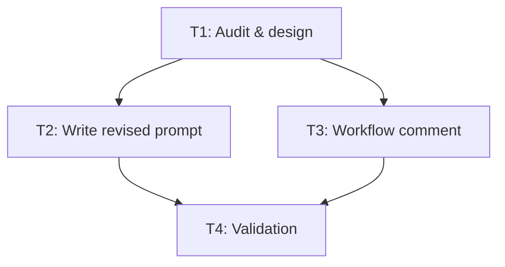

# Task DAG — Improve agentic code reviewers prompt

**Plan**: `.agents/plans/improve-agentic-reviewers-prompt/step-01-improve-agentic-reviewers-prompt.plan.md`
**Refined plan**: `.agents/plans/improve-agentic-reviewers-prompt/step-02-improve-agentic-reviewers-prompt.plan.refined.md`
**Date**: 2026-09-27
**execMode**: DAG (max 3 parallel)

---

## Tasks

### T1 — Audit current prompt/workflow and finalize design

- **id**: T1
- **title**: Audit & design revised prompt structure
- **description**: Read `.github/agentic-code-reviewers-prompt.md` and `.github/workflows/agentic-code-review.yml`. Confirm the section keep/merge/drop table from refined spec R2, verify all path references use current managed layout tokens, and produce the final prompt outline (4 sections, ~50 lines target, ≤80 hard cap). Record the upstream-vs-local decision (keep-local per R3).
- **dependsOn**: []
- **filesTouch**: `.github/agentic-code-reviewers-prompt.md` (read), `.github/workflows/agentic-code-review.yml` (read)
- **acceptanceCriteria**:
  - [ ] Section keep/merge/drop table matches refined spec R2 exactly
  - [ ] All path references verified against current managed layout (`.ws/AGENTS.md`, `{skillsRoot}/ws-shared/runtime/autoload.md`, `bin/skill-dependencies.json`, `docs/index.html`)
  - [ ] Upstream-vs-local decision recorded: keep-local (all content references repo-specific `ws-*` / `skill-dependencies.json`)
  - [ ] Final prompt outline has 4 sections, target ≤80 lines

### T2 — Write revised prompt

- **id**: T2
- **title**: Write simplified `.github/agentic-code-reviewers-prompt.md`
- **description**: Rewrite the prompt per the T1 outline. Merge §4 high-signal list into §1 as compact preamble, drop low-value bullets (Shared vs promoted, ESM/Node), keep all high-signal gates (routing/phantom/duplicate, NN-* ban, inventory drift, dependency closure, harness 0-critical, installer preservation, secrets, FSM). Keep §5 score threshold verbatim. File stays en-us.
- **dependsOn**: ["T1"]
- **filesTouch**: `.github/agentic-code-reviewers-prompt.md` (write)
- **acceptanceCriteria**:
  - [ ] File ≤80 lines (hard cap 120)
  - [ ] All 8 high-signal items present in §1
  - [ ] §5 score threshold (`>=5`) preserved verbatim
  - [ ] No `NN-*` folders suggested; `NN-*` ban stated
  - [ ] Path references use current managed layout tokens only
  - [ ] Content is en-us

### T3 — Add Custom-prompt coupling comment to workflow

- **id**: T3
- **title**: Add coupling comment to `.github/workflows/agentic-code-review.yml`
- **description**: Add a YAML comment after the `--custom-prompt` line making the Custom-stack coupling explicit: Custom stack REQUIRES --custom-prompt; do not remove. Comment-only change; no functional workflow edits.
- **dependsOn**: ["T1"]
- **filesTouch**: `.github/workflows/agentic-code-review.yml` (edit — comment only)
- **acceptanceCriteria**:
  - [ ] Comment added adjacent to `--custom-prompt` line
  - [ ] No functional changes: engine/model/variant resolution, secrets, timeout, include/exclude patterns, Node version, merge gate all unchanged
  - [ ] `git diff` shows only the added comment line

### T4 — Validate: tests, harness links, dry-run, diff scope

- **id**: T4
- **title**: Run validation suite and document results
- **description**: Run `npm run test` (must pass), `node .agents/skills/ws-check-harness/scripts/check_harness_links.cjs` (0 critical), `npm run review:dry` (if credentials available — document result or limitation), verify `git diff main...HEAD` scope is prompt+workflow only, verify line count ≤80, verify path references via grep.
- **dependsOn**: ["T2", "T3"]
- **filesTouch**: none (read-only validation)
- **acceptanceCriteria**:
  - [ ] `npm run test` exits 0
  - [ ] `check_harness_links.cjs` reports 0 critical
  - [ ] `npm run review:dry` result documented (or limitation stated: "live reviewer unverified — contract test only")
  - [ ] `git diff main...HEAD -- .github/agentic-code-reviewers-prompt.md .github/workflows/agentic-code-review.yml` shows only intended changes
  - [ ] Line count ≤80 confirmed
  - [ ] Path reference grep confirms current managed layout tokens

---

## DAG Execution Groups (max 3 parallel)

| Group | Tasks | Parallelism |
|-------|-------|-------------|
| 1 | T1 | 1 |
| 2 | T2, T3 | 2 |
| 3 | T4 | 1 |

**Execution order**: T1 → (T2 ∥ T3) → T4

