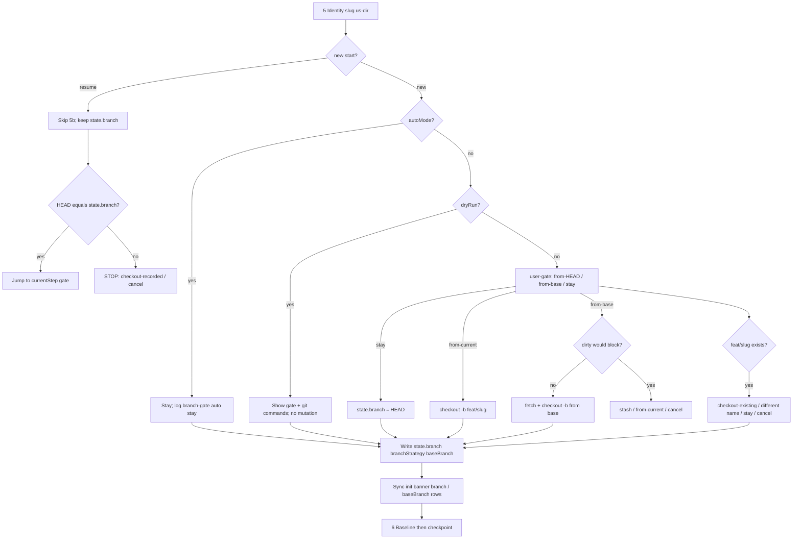

## 0. Summary & Business Rules

**Objective:** On a **new** `ws-spec-to-pr` / `ws-spec-to-pr-lite` start, ask (via `user-gate`) whether this run should create a feature branch from current HEAD, create one from the project base, or stay on the current branch. Record the result in workflow state **before** baseline / LOC / `before-step-0` checkpoint. Workflow-mode `ws-ship-pr` then uses `state.branch` as PR head.

**Business rules:**

- Shared bootstrap only: `{sharedDir}/setup.md`. Both orchs. No orch-specific fork of the gate.
- Default new branch: `feat/{slug}`. `{baseBranch}` from `config.project.baseBranch`; when unset, auto-detect via existing `bash {skillsRoot}/ws-ship-pr/scripts/detect-base-branch.sh`. Never hardcode only `master`.
- Protected / long-lived names: `main`, `master`, `develop`, plus configured `baseBranch` / `workingBranch`. Stay is allowed with an explicit warning (AC11). Recommend option **2** when HEAD is protected; option **1** otherwise. Recommended flag is UX only; never silent-pick.
- `autoMode`: stay on current, no git mutation, log `branch-gate | auto | stay | {branch} | ISO`.
- `dryRun`: show the gate (or auto default) and the git commands that would run; no ref mutation.
- Resume: skip the feature-branch gate. If HEAD ≠ `state.branch`, STOP with checkout-recorded / cancel (no silent switch).
- Existing `feat/{slug}`: checkout-existing / different name / stay / cancel; never reset.
- Dirty tree on create-from-base: STOP stash / create-from-current / cancel; never `reset --hard`.
- Detached HEAD: stay is invalid.
- Workflow-mode ship-pr: head = `state.branch`. Do not rewrite `config.project.workingBranch`. Standalone `/ship-pr` unchanged.
- Record `branchStrategy: from-current | from-base | stay` (plus documented equivalent `checkout-existing` when that path is taken) and `baseBranch` in state frontmatter.

**Security / safety:**

- Never `git reset --hard`; never discard uncommitted work.
- Never `git add -A` (MEMORY: High). Stage nothing at bootstrap.
- No auto-push at bootstrap (push remains ship-time).
- No worktree creation (`plans.useWorktrees` unchanged).
- Do not refactor `cleanup_workflow_git.py` (HEAD skip already protects the checked-out branch).

## 1. Definition of Ready & Scope

### Resolved assumptions

- Stack: `node-skills-package` (Node 22). Layers: skills-sot, installer-cli, tests. No DB / frontend / i18n / tenancy.
- Complexity: **standard** (Steps 1–2–3). Not simple. Not complex (no schema/tenancy). Interview may skip if §8 stays empty.
- Gate insertion point in `setup.md` Bootstrap & Entry: **after step 5 Identity** (`slug` / `{us-dir}` known), **before step 6 Baseline**. Use **5b** so steps 6–10 keep their numbers.
- Git recipes live in `setup.md` (agent-run `git` / `bash`). Reuse `detect-base-branch.sh`. **No new helper script** unless implementation proves the existence/protected/dirty checks are too error-prone; if added, it must be tiny, under `ws-spec-to-pr/scripts/` or `ws-shared/scripts/`, UTF-8, LF, explicit `bash` launcher, with Node tests.
- Stash-then-continue: `git stash push` (message `ws-spec-to-pr feature-branch-gate`), create-from-base, then `git stash pop` onto the new branch so work is not stranded. Never `reset --hard`.
- Checkout-existing records `branchStrategy: checkout-existing` (spec allows an equivalent documented key). Create paths use `from-current` / `from-base`. Stay uses `stay`.
- Resume HEAD mismatch: always STOP and offer checkout-recorded / cancel. `autoMode` index 0 = checkout-recorded, logged (`branch-resume | auto | checkout | {branch} | ISO`); not an unlogged silent switch.
- After stash/create, init banner `branch` / `baseBranch` rows are re-printed (or a short “Feature branch gate result” table) so they match state.
- `ws-multi-spec` workers inherit the same new-start bootstrap; no batch-level override in v1.
- `branchStrategy` / `baseBranch` are **not** added to `validate_state.py` `REQUIRED_KEYS` (old in-flight states must still validate). New runs write them.
- Fable domain auto-detect: N/A (harness/git protocol, not IaC/K8s/DB).
- Package version bump: **not** this plan (ship step owns bump).

### Acceptance Criteria (measurable)

| ID | Criterion |
|----|-----------|
| AC1 | New standard/lite start (after identity, before baseline/checkpoint): `user-gate` with exactly three choices (create from HEAD, create from `{baseBranch}`, stay); recommended marked; cancel = HS-1 |
| AC2 | `{baseBranch}` from `config.project.baseBranch`; auto-detect `main`/`master` when unset via `detect-base-branch.sh`; gate copy never hardcodes only `master` |
| AC3 | Create-from-current: `git checkout -b feat/{slug}` (or alternate) from HEAD; write `state.branch` before baseline/checkpoint |
| AC4 | Create-from-base: from `{gitRemote}/{baseBranch}` or local `{baseBranch}`; dirty STOP with stash / create-from-current / cancel; no `reset --hard` |
| AC5 | Stay: no create/switch; `state.branch` = pre-gate HEAD name; detached HEAD cannot stay |
| AC6 | Existing `feat/{slug}`: no reset; offer checkout-existing / different name / stay / cancel |
| AC7 | Resume skips the gate; keeps `state.branch`; HEAD mismatch STOP with checkout-recorded / cancel |
| AC8 | `autoMode`: no prompt, stay, logged; `dryRun`: no git ref mutation |
| AC9 | Workflow-mode `ws-ship-pr`: PR head + preflight = `state.branch`; standalone still `workingBranch`; config `workingBranch` not rewritten |
| AC10 | `setup.md` + init banner `branch` / `baseBranch` describe the gate; both orchs share it (no fork) |
| AC11 | Protected names remain valid stay targets with warning that ship will use that branch as PR head |

### Out of scope (v1)

- Refactoring `cleanup_workflow_git.py` (HEAD skip already exists)
- Auto-push of the new branch at bootstrap
- Worktree creation / `plans.useWorktrees`
- Renaming `config.project.workingBranch` globally; forcing GitHub Flow vs git-flow
- Re-asking at standard Step 8 / lite Step 4
- Configurable feature-branch prefix (v1 is `feat/{slug}`)
- Package version bump / `build-site:bump` (ship owns)

## 2. Technical Design & Architecture

### Layers (from `config.json`)

| Layer | Path | Edits |
|-------|------|-------|
| **skills-sot** | `.agents/skills` | `ws-shared/setup.md` (gate protocol); `ws-shared/gates.md` (auto-gate row); `ws-spec-to-pr/PROTOCOLS.md` (state YAML); `ws-ship-pr/SKILL.md` (workflow-mode head); optional one-line pointers in orch SKILL.md / FAQ only if they currently imply “HEAD is the branch” |
| **installer-cli** | `bin` | Integrity regenerate only (`bin/skill-integrity.json`). No CLI flag / dependency-graph change |
| **tests** | `test/` | Focused Node markdown-contract tests (and script tests only if a helper is added) |

Frontend / DB / i18n / RBAC: **n/a**.

### Bootstrap sequence (insert 5b)

Current `setup.md` after flags/resume:

5. Identity (`workflow-id`, `slug`, `{us-dir}`, `workflowType`)
6. Baseline (`preExistingDirty`, `baselineCommit`)
7. LOC baseline
8. Checkpoint `uswf/{workflow-id}/before-step-0`
9. Progress Board
10. Step Entry Gate

**Insert 5b Feature branch gate** between 5 and 6 on **new** starts only. Resume already exits at step 4 (“skip bootstrap, jump to `currentStep` gate”) plus the new HEAD-mismatch STOP.



### Feature branch `user-gate` copy (en-us)

```text
Git branch for this workflow (HEAD: {currentBranch}; base: {baseBranch}):

1. Create feature branch from current HEAD (Recommended when HEAD is already the intended starting point)
2. Create feature branch from {baseBranch} (Recommended when HEAD is a protected/long-lived branch)
3. Stay on {currentBranch} (already on the branch I want)
```

Mark **exactly one** Recommended: option 2 when `{currentBranch}` is in the protected set; option 1 otherwise. If HEAD is protected, option 3 must include the AC11 warning: ship will use `{currentBranch}` as PR head.

Cancel / dismiss → HS-1 (STOP, re-present, never infer yes). Portable alias: `user-gate` (native structured choice when available; markdown fallback; log `user-gate-fallback | feature-branch | ISO`).

Protected set (exact names): `main`, `master`, `develop`, `config.project.baseBranch`, `config.project.workingBranch`.

Detached HEAD (`git rev-parse --abbrev-ref HEAD` → `HEAD`): omit stay or mark it invalid; require create-from-current (names a branch at HEAD) or create-from-base.

### Git actions (agent commands in setup.md)

| Choice | Action |
|--------|--------|
| Create from current | `git checkout -b {name}` from HEAD. Uncommitted files come along. |
| Create from base | If `{gitRemote}` exists: `git fetch {gitRemote} {baseBranch}` then `git checkout -b {name} {gitRemote}/{baseBranch}`. Else: `git checkout -b {name} {baseBranch}`. If fetch fails: STOP, offer local-base / cancel. |
| Stay | No checkout/create. `state.branch` = pre-gate HEAD name. |
| Checkout existing | `git checkout {name}` only. Never `reset`, never `-D`. |

Default `{name}` = `feat/{slug}`. If that ref exists locally (`refs/heads/`) or on `{gitRemote}` (`refs/remotes/{gitRemote}/`): STOP and offer checkout-existing / different name / stay / cancel.

Dirty create-from-base: if `git status --porcelain` is non-empty and checkout from base would not be a no-op, STOP: **Stash then continue** / **Switch to create-from-current** / **Cancel**. Never `reset --hard`.

`dryRun`: print the commands; do not run mutating git (`checkout -b`, `fetch` may be considered mutating if it updates refs; skip fetch too in dry-run).

### State frontmatter (`PROTOCOLS.md`)

Existing `branch` stays. Add:

```yaml
branch: feat/{slug}           # or current HEAD name
branchStrategy: from-current | from-base | stay | checkout-existing
baseBranch: {resolvedBase}    # config or detect-base-branch.sh
```

Write these **before** step 6 baseline so `baselineCommit` and `uswf/{id}/before-step-0` land on the chosen branch.

### Workflow-mode ship-pr

In `ws-ship-pr/SKILL.md` Steps 1, 4, 5, 7:

| Mode | PR head / preflight / push |
|------|----------------------------|
| `workflowMode: true` with readable `{us-dir}` state | `head` = `state.branch`; confirm active branch is `state.branch`; `git pull` / `git push -u` / `create-pr --head` use that name |
| Standalone (no workflow state) | Unchanged: `config.project.workingBranch` |

Do **not** write `config.project.workingBranch`. Merge “never delete `{workingBranch}`” becomes never delete the resolved **head** (workflow: `state.branch`; standalone: `workingBranch`).

### Portability / authoring

- `user-gate` alias only; en-us; no host product names in skill bodies (existing gates.md “IDE/agent host” model banner stays as-is; do not add new product names).
- Path tokens: `{sharedDir}`, `{skillsRoot}`, `{plansDir}`. Config: `{sharedDir}/config.json` only (MEMORY: never retired `shared/config.json`).
- Python/Node file I/O: `encoding="utf-8"`. Markdown table tests: `\r?\n`-aware (MEMORY: High CRLF).
- Skill bodies: surgical edits; do not drive-by-refactor adjacent bootstrap steps.

## 3. Step-by-Step Plan

### Step A — Shared Feature branch gate in `setup.md` (AC1, AC2, AC3, AC4, AC5, AC6, AC8, AC10, AC11)

1. After Bootstrap step 5 Identity, add **5b. Feature branch gate (new workflow only)** with: when it runs, `user-gate` copy, recommended-option rule, protected-name warning (AC11), detached-HEAD rule, existence gate (AC6), dirty-tree gate (AC4), git command table, `autoMode` / `dryRun` behavior, state keys to write, banner sync.
2. Resolve `{baseBranch}`: `config.project.baseBranch` if set; else `bash {skillsRoot}/ws-ship-pr/scripts/detect-base-branch.sh`. Gate prose uses `{baseBranch}`, never a hardcoded-only `master` string as the sole example of base.
3. Keep init banner rows `branch` / `baseBranch` (step 3). After 5b, re-print those two rows (or a “Feature branch gate result” table) from state.
4. `autoMode`: no `user-gate`; stay; log `branch-gate | auto | stay | {branch} | ISO` in `## Gate history`.
5. `dryRun`: prefix `[DRY-RUN]`; show choices + commands; no ref mutation.
6. HS-1 on cancel. Do not infer yes.

**Files:** `.agents/skills/ws-shared/setup.md`

**Checks:** Gate sits after Identity and before Baseline; both orchs already load this file; no duplicate protocol in `ws-spec-to-pr/SKILL.md` or `ws-spec-to-pr-lite/SKILL.md`.

### Step B — Resume HEAD mismatch (AC7)

1. In `setup.md` § Resume / Reset, after “Resume: load state… skip bootstrap”: if `git rev-parse --abbrev-ref HEAD` ≠ `state.branch`, STOP. `user-gate`: **Check out `{state.branch}` (Recommended)** / **Cancel**. No silent checkout in normal mode.
2. `autoMode`: index 0 = checkout-recorded; log `branch-resume | auto | checkout | {branch} | ISO`.
3. Do not re-run 5b on resume.

**Files:** `.agents/skills/ws-shared/setup.md`

### Step C — `gates.md` auto-gate row (AC1, AC8)

1. Add to Auto-gate defaults: **Feature branch (new start)** → Stay on current (index 0).
2. Add **Feature branch resume mismatch** → Check out `state.branch`.
3. Do not change HS-1 wording.

**Files:** `.agents/skills/ws-shared/gates.md`

### Step D — State YAML in `PROTOCOLS.md` (AC3, AC4, AC5, AC7, AC9)

1. Extend `state.md` YAML list: `branchStrategy`, `baseBranch` beside existing `branch`.
2. One sentence: written at bootstrap 5b; resume trusts them; ship reads `branch`.
3. Do **not** add these to `validate_state.py` `REQUIRED_KEYS`.

**Files:** `.agents/skills/ws-spec-to-pr/PROTOCOLS.md`

### Step E — Workflow-mode `ws-ship-pr` head (AC9)

1. Preflight: when `workflowMode: true`, resolve head from `state.branch` (orch passes it or ship-pr reads `{us-dir}/{workflow-id}.state.md`). Confirm active branch is that name, not `workingBranch`.
2. Push / `create-pr --head` / pull use resolved head. Standalone default remains `config.project.workingBranch`.
3. Explicit: do not rewrite `config.project.workingBranch`.
4. Merge: never delete the resolved head branch.

**Files:** `.agents/skills/ws-ship-pr/SKILL.md` (and PREPARE-CHECKLIST.md only if it currently says “confirm workingBranch” as a required row)

### Step F — Shared-orch pointers, no fork (AC10)

1. Confirm `ws-spec-to-pr/SKILL.md` and `ws-spec-to-pr-lite/SKILL.md` still on-demand-load `setup.md` only. Add at most one sentence if needed (“Feature branch gate: `{sharedDir}/setup.md` 5b”).
2. Do **not** copy the gate into lite or standard SKILL bodies.
3. `ws-multi-spec`: no v1 override; workers use the same bootstrap.
4. Optional FAQ one-liner only if a FAQ currently says bootstrap records HEAD without asking (today it does not; skip unless found).
5. Root `AGENTS.md` / `ws-shared/AGENTS.md` / `README.md` / catalog: **no** router or install-narrative change required. Harness change protocol still applies to hashed skill content (integrity + `ws-check-harness`).

**Files:** orch SKILL.md only if a pointer is missing; otherwise skip.

### Step G — Tests (AC1–AC11)

Prefer markdown-contract Node tests (existing pattern: `test/test-quality-gates.js`, `test/test-delivery-commit-artifacts.js`). New focused file `test/test-feature-branch-gate.js`; wire into `package.json` `tests` / `tests:remote`.

If a helper script is added: fixture tests in the same file (temp git repo, UTF-8, no `git add -A`).

Optional small `check_workflows.py` assertion: `setup.md` contains Feature branch gate after Identity and before Baseline; both orch SKILL.md still reference `setup.md`. Do not invent a new simulation framework.

**Files:** `test/test-feature-branch-gate.js`, `package.json` (tests script list), optionally `ws-check-workflows/scripts/check_workflows.py`

### Step H — Integrity and harness (pre-ship, not version bump)

After skill-content edits: `npm run generate-integrity && npm run verify-integrity` (exit 0). `ws-check-harness` Phases 0–5c → 0 critical. `npm run test`. Do **not** bump `package.json` in this work; ship step owns bump + `build-site:bump`.

**Files:** `bin/skill-integrity.json` (regenerated with content)

## 4. Permissions, Tenancy & i18n

- **RBAC / tenancy:** N/A (local git + agent protocol; no data plane).
- **i18n:** N/A; skill / gate / banner language en-us only.
- **Isolation:** Do not rewrite consumer `config.json` (`workingBranch` stays). Do not mutate git in `dryRun` / `autoMode` new-start. Do not delete protected branches.

## 5. Test Coverage

| AC | Test / verification method |
|----|----------------------------|
| AC1 | `testGateThreeChoicesAndHs1`: `setup.md` has the three choices, recommended-option rule, HS-1/cancel; `gates.md` auto-gate row for new-start stay; gate described after Identity and before Baseline |
| AC2 | `testBaseBranchResolution`: `setup.md` cites `config.project.baseBranch` and `detect-base-branch.sh`; assert gate copy does not treat `master` as the only hardcoded base (allow listing `main`/`master` as detect candidates) |
| AC3 | `testCreateFromCurrentRecipe`: `setup.md` documents `git checkout -b` from HEAD / `feat/{slug}` and writing `state.branch` before baseline/checkpoint |
| AC4 | `testCreateFromBaseAndDirtyStop`: `setup.md` documents fetch-or-local base, dirty STOP with stash / create-from-current / cancel, and forbids `reset --hard` |
| AC5 | `testStayAndDetached`: stay = no create/switch; `state.branch` = pre-gate HEAD; detached HEAD cannot stay |
| AC6 | `testExistingFeatSlug`: existing local/remote `feat/{slug}` → checkout-existing / different name / stay / cancel; no reset / `-D` |
| AC7 | `testResumeSkipAndMismatch`: resume skips 5b; mismatch STOP with checkout-recorded / cancel; `gates.md` resume-mismatch auto-gate row |
| AC8 | `testAutoModeStayAndDryRun`: `autoMode` stay + log line `branch-gate \| auto \| stay`; `dryRun` no git mutation |
| AC9 | `testShipPrWorkflowHead`: `ws-ship-pr/SKILL.md` workflow-mode head/preflight = `state.branch`; standalone still `workingBranch`; explicit do-not-rewrite `workingBranch` |
| AC10 | `testSharedSetupNoOrchFork`: both orch SKILL.md reference `setup.md`; neither contains a forked three-choice gate; init banner still has `branch` / `baseBranch` rows; optional `check_workflows.py` bootstrap-order assertion |
| AC11 | `testProtectedStayWarning`: protected set (`main`, `master`, `develop`, configured base/working) valid stay with warning that ship uses that branch as PR head; recommend option 2 when HEAD is protected |

Primary automated gate: `node test/test-feature-branch-gate.js` inside `npm run test`. Skill-prose ACs are contract tests (grep), matching quality-gates / delivery-commit-artifacts. Git-mutation behavior is protocol in `setup.md`, not a live orch E2E in v1.

If a helper script is added: extra Node tests for protected-name classification, `feat/{slug}` existence, detached HEAD, dirty porcelain (temp repo). Encoding: `utf8` reads; table regex `\r?\n`.

## 6. Invariants (Do Not Violate)

From `config.json.invariants` + harness contract + MEMORY:

1. **`commitPlanFilesOnlyAtStep8: true`** — do not commit `{plansDir}/` artifacts before delivery Step 8.
2. **Shared bootstrap** — gate lives in `setup.md` only; no lite/standard fork.
3. **Config path** — `{sharedDir}/config.json` only; never retired `shared/config.json`.
4. **Do not rewrite `project.workingBranch`** for a run.
5. **Never `git reset --hard`**; never discard uncommitted work; never `git add -A`.
6. **Never auto-push** at bootstrap; no worktree add for this gate.
7. **Do not refactor `cleanup_workflow_git.py`**.
8. **Portability** — `user-gate`; en-us; no new host product names.
9. **UTF-8 / CRLF** — explicit `encoding="utf-8"`; table tests `\r?\n`-aware.
10. **Integrity** — hashed skill edits regenerate `bin/skill-integrity.json` in the same change set; no package version bump in this plan.
11. **EF/tenancy sample invariants** — remain N/A (`false`); do not invent domain/DB layers.
12. **`skipQualityGates`** — does not skip this safety/SCM gate (branch choice is not a quality-visibility gate).

## 7. Pre-PR Checklist

- [ ] Layer boundaries respected (skills-sot protocol + tests; installer-cli = integrity only).
- [ ] Domain entities / schema migrations — N/A.
- [ ] Authorization / tenancy — N/A.
- [ ] i18n keys — N/A (en-us skill prose).
- [ ] Test cases cover all ACs (AC1–AC11 mapped in §5).
- [ ] `setup.md` 5b sits after Identity and before Baseline; resume mismatch documented.
- [ ] `gates.md` auto-gate rows for new-start stay and resume checkout.
- [ ] `PROTOCOLS.md` lists `branchStrategy` + `baseBranch`; `REQUIRED_KEYS` unchanged.
- [ ] Workflow-mode `ws-ship-pr` uses `state.branch`; standalone unchanged; `workingBranch` not rewritten.
- [ ] No orch-specific fork of the gate.
- [ ] `npm run generate-integrity && npm run verify-integrity` exit 0.
- [ ] `ws-check-harness` Phases 0–5c → 0 critical.
- [ ] `npm run test` includes the new contract tests.
- [ ] Do **not** bump package version in this change set (ship owns bump).

## 8. Open Questions

None blocking. Interview may skip.

Assumed defaults (already in §1): no new helper script unless recipes prove insufficient; stash pop after stash-then-continue; `checkout-existing` as documented `branchStrategy` equivalent; resume mismatch auto-gate index 0 = checkout-recorded (logged); `REQUIRED_KEYS` unchanged; no README/catalog/version bump in this work.
