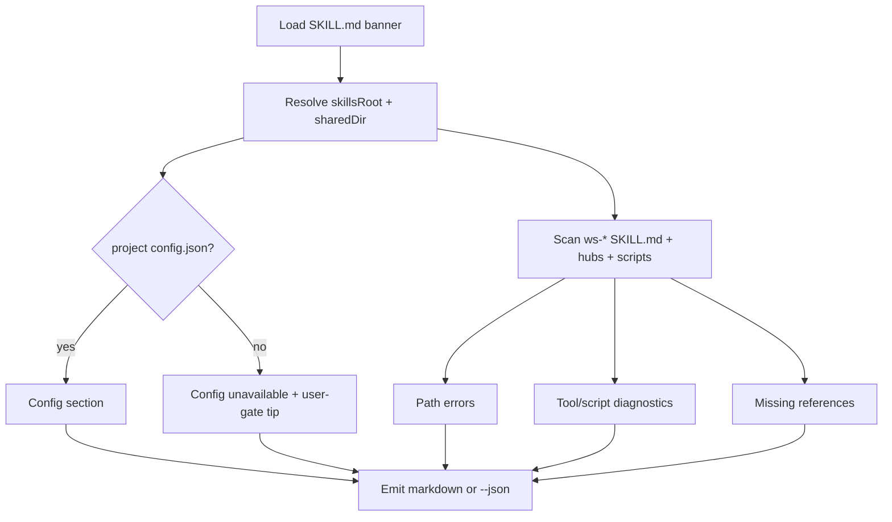

## 0. Summary & Business Rules

**Objective:** Ship a new Workflows-package harness skill `ws-doctor` that performs a **read-only** diagnose pass over the installed `ws-*` skill tree (project-local and/or hybrid global `{skillsRoot}` + project `{sharedDir}` config) and emits one structured report covering:

1. Path errors after token expansion
2. Invalid tool calling / script parsing (missing launchers, missing scripts, lightweight parse checks)
3. Configuration values and switches summary
4. Missing reference / companion files

**Business rules:**

- Default mode is diagnose-only: **no file edits**, no auto-fix, no apply-corrections path in v1.
- Do **not** replace `ws-check-harness` (Phases 0–5c integrity/routing/portability/digests) or `ws-show-harness` (session snapshot). Cross-link with clear “use when” wording only.
- Hybrid installs: resolve `{skillsRoot}` independently from `{sharedDir}`; never read project `config.json` from the global hub when a project hub exists.
- Portability: en-us; no host product names; portable aliases from `tools.md` only (`user-gate`, path tokens, explicit `python` / `node` / `bash` launchers).
- Upstream SoT: author under `.agents/skills/ws-doctor/` only; register in `bin/skill-dependencies.json` (Workflows), hub routers, then regenerate integrity.

**Security / safety mitigations:**

- Read-only by design — scripts must not write outside stdout/stderr (no “fix” flag in v1).
- Do not invent missing config values; when config is absent, report unavailable + recommend `ws-configure-project`.
- Parse checks are syntax-only (`py_compile`, Node `--check`, `bash -n`); do not execute skill script side effects.
- Apply MEMORY traps: UTF-8 explicit I/O on Windows; do not treat `https://` as drive paths; CRLF-aware markdown scanning; never reintroduce `src/skills` / sync-skills.

## 1. Definition of Ready & Scope

### Resolved assumptions

- Stack: `node-skills-package` (Node 22 / JS harness). Diagnostic engine: small **Node** script under `ws-doctor/scripts/` (matches package runtime; invoke with `node`). Agent protocol lives in `SKILL.md`.
- Scan root: resolved `{skillsRoot}` (upstream SoT `.agents/skills` in this repo; hybrid may include `{globalSkillsRoot}` for missing local skill ids). Config always from project `{sharedDir}/config.json` when present.
- Flags: `--skill <id>` (limit scan), `--json` (machine-readable). Dry-run/diagnose is default; no `--fix` / apply mode in v1.
- Package membership: **Workflows** (harness & review layer), same tier as `ws-check-harness` / `ws-check-workflows` / `ws-secrets-leak-review`.
- Frontmatter `version:` aligns with current `packageVersion` / `package.json` at land time.

### Acceptance Criteria (measurable)

| ID | Criterion |
|----|-----------|
| AC1 | Package `.agents/skills/ws-doctor/` with `SKILL.md` frontmatter (`name`, `description`, `version`, `invocation_names` including `doctor` / `ws-doctor`) and banner `ws-doctor loaded.` |
| AC2 | `/ws-doctor` (and `@ws-doctor` / “diagnose skills” / “doctor the harness”) runs read-only diagnose → single structured report; no file edits by default |
| AC3 | Report **Path errors**: skill/hub id, cited path, expand result; or `none` |
| AC4 | Report **Tool / script diagnostics**: (a) missing explicit launcher, (b) cited script missing, (c) parse failures with path + error |
| AC5 | Report **Configuration**: path tokens, providers, verification, defaults switches, invariants, fable, rules paths; mark missing/schema-invalid/empty identity |
| AC6 | Report **Missing references**: SKILL.md/hub companion links absent after expand; or `none` |
| AC7 | Missing project `config.json`: still run path/script/reference checks; config = unavailable + `user-gate` recommend `ws-configure-project`; invent nothing |
| AC8 | Harness-neutral body; documents boundary vs `ws-check-harness` and `ws-show-harness` |
| AC9 | Registered in `bin/skill-dependencies.json` (Workflows), root `AGENTS.md` catalog + task router, `ws-shared/AGENTS.md` harness list + consumer task router |
| AC10 | Document `--skill`, `--json`; dry-run/diagnose default; no fix-apply in v1 |
| AC11 | `npm run generate-integrity` && `npm run verify-integrity` exit 0; `ws-check-harness` → 0 critical for new skill id + dependency graph |

### Out of scope (v1)

- Auto-fixing links / rewriting skill bodies
- Running full `ws-check-harness` Phases 0–5c
- Session autoload snapshotting (`ws-show-harness`)
- Secrets scanning / adversarial audit
- Fix-apply mode

## 2. Technical Design & Architecture

### Layers (from `config.json`)

| Layer | Path | Edits |
|-------|------|-------|
| **skills-sot** | `.agents/skills` | New `ws-doctor/` package (`SKILL.md`, `scripts/`); optional one-line cross-links in `ws-check-harness` / `ws-show-harness` “use when” only |
| **installer-cli** | `bin` | Add `ws-doctor` to Workflows skills list in `bin/skill-dependencies.json` (+ packaged `ws-shared/skill-dependencies.json` if that graph ships); integrity regenerate → `bin/skill-integrity.json` |
| **tests** | `test/` | Prefer reuse of existing install/integrity/harness coverage; add focused unit tests for doctor script only if needed for AC4/AC7 fixtures (keep minimal) |
| **Hubs / docs** | root + `ws-shared` | Catalog + task-router rows; human README only if install narrative needs a doctor mention (optional, not AC-blocking) |

Frontend / DB / i18n: **n/a**.

### Package shape

```
.agents/skills/ws-doctor/
  SKILL.md                 # protocol, report contract, flags, boundaries, banner
  scripts/
    doctor.js              # (or doctor.cjs) diagnostic engine; node launcher
```

Keep progressive disclosure lean: report schema in `SKILL.md` (or thin `REPORT-FORMAT.md` only if SKILL.md would bloat — prefer single file for v1).

### Runtime flow



### Diagnostic surfaces (implementation notes)

1. **Path tokens** — Expand `{skillsRoot}`, `{sharedDir}`, `{plansDir}`, `{specsDir}`, `{reviewsDir}`, `{globalSkillsRoot}` per `tools.md` + `config.json`. Collect brace/relative paths from scanned skill bodies, hubs, and script recipes; report missing/unresolvable after expand. Skip unknown braces as templates (same spirit as check-harness). Avoid false positives: do not treat URL schemes as Windows drives (MEMORY).

2. **Tool / script** — Heuristic scan for managed-script call sites lacking `python` / `node` / `bash`; resolve cited `scripts/` paths; for files under `ws-*/scripts/` run:
   - `*.py` → `python -m py_compile`
   - `*.js` / `*.cjs` / `*.mjs` → `node --check`
   - `*.sh` → `bash -n` when bash available (else note skipped)
   Soft-skip when launcher binary missing on PATH (report as skip, not hard fail of doctor itself).

3. **Configuration** — Load `{sharedDir}/config.json`; if `config.schema.json` present, schema-aware validation (Node JSON Schema or lightweight required-field checks). Summarize: path tokens, `providers`, `verification.*`, `defaults.*` booleans + `deliveryCommitArtifacts.*`, `invariants.*`, `fable.*`, `rules.*`. Mark missing file / schema-invalid / empty required identity (`project.name` / org / repoUrl when empty).

4. **Missing references** — From each `ws-*/SKILL.md` (+ hubs): Markdown links and brace-token paths to companions (`PHASES.md`, `FORMAT.md`, `STEP-DISPATCH.md`, scripts, etc.); report absent after expand.

### Agent protocol (`SKILL.md`)

- Banner: `ws-doctor loaded.`
- `disable-model-invocation: true` (user/diagnose invoke; mirrors check-harness / secrets-leak style).
- Steps: resolve roots → run `node {skillsRoot}/ws-doctor/scripts/doctor.js` with flags → print report → stop.
- Document CLI: `--skill <id>`, `--json`.
- Boundary section vs check-harness / show-harness.
- Missing config → `user-gate` (native structured choice when available; markdown fallback) recommending `ws-configure-project`.

### Invariant checks (`config.json.invariants`)

- `commitPlanFilesOnlyAtStep8: true` — plan artifacts stay under `{plansDir}`; do not commit until Step 8.
- EF/tenancy keys N/A (remain false).
- Portability / SoT: edit only `.agents/skills/ws-doctor` + hubs + dependency graph + integrity; no consumer-owned hub data overwrite.

## 3. Step-by-Step Plan

### Step 1 — Scaffold skill package (AC1, AC8, AC10)

- Create `.agents/skills/ws-doctor/SKILL.md` with required frontmatter (`name: ws-doctor`, description with diagnose triggers, `version` = package version, `invocation_names: [doctor, ws-doctor]`, `disable-model-invocation: true`).
- Immediately under `# ws-doctor`: `> When this skill is loaded, output "ws-doctor loaded."`
- Body: goals, boundary vs `ws-check-harness` / `ws-show-harness`, execution steps with Done when, report section contract (Path errors / Tool-script / Configuration / Missing references), flags `--skill` / `--json`, read-only default, hybrid path rules, launcher recipe for the doctor script.
- **Engineering checks:** en-us; no host product names; portable aliases only; no per-skill `upstream:` frontmatter.

### Step 2 — Implement diagnostic script (AC2, AC3, AC4, AC5, AC6, AC7)

- Add `scripts/doctor.js` (or `.cjs`) implementing resolve → scan → report.
- CLI: default human markdown report; `--json` object with same four sections; `--skill <id>` limits to one `ws-*` folder (+ still summarize config).
- Config missing path: emit Configuration = unavailable + recommendation string; continue other sections against skills root.
- Explicit I/O encoding UTF-8; ASCII-safe stdout where practical (MEMORY / ws-shared cross-platform rules).
- **Affected files:** `.agents/skills/ws-doctor/scripts/doctor.js`
- **Engineering checks:** script itself must pass `node --check`; document invoke as `node {skillsRoot}/ws-doctor/scripts/doctor.js …` in SKILL.md; never shebang-only.

### Step 3 — Optional peer cross-links (AC8)

- Add one-line “For runtime path/tool/config diagnose, use `ws-doctor`” to `ws-check-harness` and/or `ws-show-harness` only if it does not bloat role clarity; otherwise hub routers alone satisfy discovery (AC9). Prefer hub rows first; peer links only if zero duplication risk.

### Step 4 — Register package membership & hubs (AC9)

- Insert `ws-doctor` into `bin/skill-dependencies.json` → `packages.workflows.skills` (and dependency edges if required by graph conventions; typically leaf harness skill with empty/minimal deps).
- Mirror packaged graph under `.agents/skills/ws-shared/skill-dependencies.json` when that file is the shipped copy of the graph.
- Root `AGENTS.md`: Layer 0/4 harness catalog row + Task router row (diagnose / doctor / skills health).
- `ws-shared/AGENTS.md`: Harness & review promoted list + consumer task router row.
- **Do not** add to Always-applied / autoload (on-demand only).

### Step 5 — Integrity, harness audit, install tests (AC11)

- `npm run generate-integrity` && `npm run verify-integrity` (exit 0).
- Run `ws-check-harness` Phases 0–5c → 0 critical (new skill id present in graph + hubs; portability clean).
- `npm run test` (installer/tree verification picks up new Workflows skill).
- Catalog: `node bin/build-site.js` or include in later `build-site:bump` at ship time (Step 8) — regenerate catalog so site lists `ws-doctor`.

### Step 6 — Manual / fixture verification of report contract (AC2–AC7, AC10)

- Run doctor on healthy upstream tree → sections present; Path errors / Missing refs may be `none`.
- Run with `--skill ws-doctor` → scoped scan.
- Run with `--json` → parseable JSON.
- Simulate missing config (temp cwd or env override if supported) → config unavailable path without inventing values; other sections still emit.
- Confirm working tree unchanged by doctor (read-only).

## 4. Permissions, Tenancy & i18n

- **RBAC / tenancy:** N/A (local harness diagnostic; no multi-tenant data plane).
- **i18n:** N/A; skill language en-us only.
- **Isolation:** Read-only filesystem inspect; no network required for core diagnose (schema is local). Do not print secrets from config beyond non-secret switches/paths (avoid dumping env-backed PAT values — report key names / empty markers only).

## 5. Test Coverage

| AC | Test / verification method |
|----|----------------------------|
| AC1 | `test_skill_package_exists`: assert `.agents/skills/ws-doctor/SKILL.md` frontmatter keys + `invocation_names` contain `doctor`/`ws-doctor`; assert banner string `ws-doctor loaded.` present |
| AC2 | `test_readonly_diagnose_pass`: run `node …/doctor.js`; assert exit 0, report sections emitted; `git status` / temp dirty marker unchanged under skills tree |
| AC3 | `test_path_errors_section`: fixture with broken brace/relative path → report lists skill id, cited path, expand result; healthy tree allows `none` |
| AC4 | `test_tool_script_diagnostics`: (a) fixture prose missing launcher flagged; (b) cited missing script flagged; (c) intentionally broken `.py`/`.js` fails parse check with path + error summary |
| AC5 | `test_configuration_summary`: with project config present, report includes path tokens, providers, verification, defaults switches (incl. `deliveryCommitArtifacts`), invariants, fable, rules; empty/invalid fields marked |
| AC6 | `test_missing_references_section`: fixture SKILL.md link to absent `PHASES.md` → listed; healthy → `none` |
| AC7 | `test_missing_config_graceful`: absent `{sharedDir}/config.json` → Configuration unavailable + configure-project recommendation; path/script/ref sections still run; no invented identity values |
| AC8 | `test_portability_and_boundary`: grep skill body for forbidden host product names; assert explicit boundary wording for `ws-check-harness` and `ws-show-harness` |
| AC9 | `test_registration`: `ws-doctor` in `bin/skill-dependencies.json` Workflows list; present in root + `ws-shared` AGENTS catalog/router tables |
| AC10 | `test_flags_documented`: SKILL.md documents `--skill`, `--json`, default diagnose/read-only; CLI accepts both flags |
| AC11 | `test_integrity_and_harness`: `npm run generate-integrity && npm run verify-integrity`; `ws-check-harness` 0 critical including new skill id / graph membership |

Primary automated gate for ship: AC9/AC11 via integrity + harness + `npm run test`. AC2–AC7 covered by doctor script unit/fixture tests where cheap; otherwise manual checklist in Step 6 with evidence captured in verify-plan / testing steps.

## 6. Invariants (Do Not Violate)

From `config.json.invariants` + harness contract:

1. **`commitPlanFilesOnlyAtStep8: true`** — do not commit `{plansDir}/ws-doctor/` artifacts before delivery Step 8.
2. **Upstream SoT only** — author under `.agents/skills/ws-doctor/`; never treat skills as generated from `src/skills` (MEMORY).
3. **Config path** — project `{sharedDir}/config.json` only; never retired `shared/config.json` (MEMORY).
4. **Hybrid override** — project config always wins; `{skillsRoot}` ≠ `{sharedDir}` physically in hybrid mode.
5. **Read-only v1** — doctor must not write skill/hub/config files.
6. **Portability** — no host product names; path tokens / relative links; en-us.
7. **Explicit launchers** — all managed script recipes use `python` / `node` / `bash`.
8. **Integrity coupling** — any hashed content change regenerates `bin/skill-integrity.json` in the same change set before claim complete.
9. **Scope boundary** — do not reimplement check-harness phases or show-harness session snapshot inside doctor.
10. **EF/tenancy sample invariants** — remain N/A (false); do not invent domain/DB layers.

## 7. Pre-PR Checklist

- [ ] Layer boundaries respected (skills-sot + bin hubs/integrity + optional minimal tests only).
- [ ] Domain entities / schema migrations — N/A.
- [ ] Authorization / tenancy — N/A (read-only local diagnose).
- [ ] i18n keys — N/A (en-us skill prose).
- [ ] Test cases cover all ACs (AC1–AC11 mapped in §5).
- [ ] `ws-doctor` registered in Workflows dependency graph + both AGENTS hubs.
- [ ] Integrity regenerated and verified; `ws-check-harness` 0 critical.
- [ ] SKILL.md banner + flags + boundary docs present; default read-only.
- [ ] No product/skill implementation left incomplete relative to AC1–AC11 (implementation happens in later steps — this plan is the blueprint).

## 8. Open Questions

None blocking. Resolved for autoMode:

- **Engine language:** Node script (`node …/doctor.js`) — fits `node-skills-package` stack; Python acceptable alternative only if implementer hits a strong reuse win (prefer Node for v1).
- **Peer cross-links in check-harness/show-harness:** optional; hub registration (AC9) is sufficient if peer edits risk duplication.
- **Fix-apply mode:** explicitly deferred (out of scope v1).
