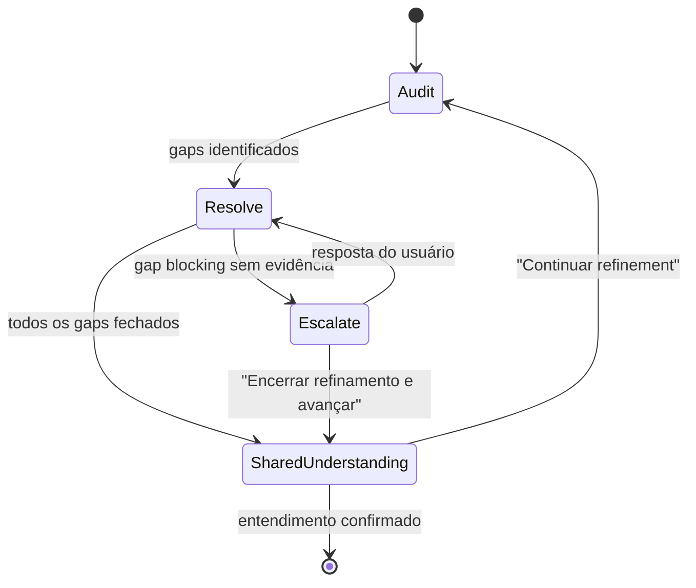

> **Naming:** skill id `refine` (pasta `02-refine`) — abreviação de **refinement** (auditoria/refino do plano antes da execução). Rótulos e protocolos usam *Refinement*; ids técnicos (`name:`, `@[refine]`, `refineRound`, bloco `refine:` no step-output) permanecem `refine`.
>
> **FSM canônica:** a máquina de estados (Audit → Resolve → Escalate → Exit → Shared Understanding) desta skill é a **fonte única** do Refinement (Step 2). O `us-workflow` **delega** aqui — não duplique a FSM no orquestrador nem em `check-harness.md`; apenas referencie esta skill.
>
> **v1.3:** protocolo **Grilling Conduct** obrigatório (entrevista ramo a ramo, uma pergunta por vez, codebase antes de escalar, gate de entendimento compartilhado antes de sair).
>
> **v1.2:** skill renomeada de `grilling` para `refine` (pasta `02-grilling/` → `02-refine/`); nenhuma mudança de comportamento/FSM.

# refine (refinement)

Audita e **interroga** lacunas de **refinement** de um plano de implementação **antes** de ele virar tarefas de execução — filosofia "grill-me": entrevistar o plano ramo a ramo até **entendimento compartilhado** e critérios de sucesso exatos e testáveis.

Esta skill é **standalone** (pode ser chamada diretamente pelo usuário sobre qualquer `*.plan.md`) e também é invocada pelo `us-workflow` (Step 2) via subagent. Os dois modos de invocação estão marcados abaixo.

## Grilling Conduct Protocol (obrigatório)

Conduta canônica do refinement — adaptada de [grilling (Matt Pocock)](https://github.com/mattpocock/skills/blob/main/skills/productivity/grilling/SKILL.md):

1. **Entrevistar sem parar** até entendimento compartilhado — cada ambiguidade, contradição e caso de borda do plano deve ser resolvida ou explicitamente assumida (`assumed-default`).
2. **Percorrer a árvore de design** — ordene gaps por dependência (decisões fundacionais primeiro: escopo → entidades → permissões → fluxos → edge cases). Resolva um ramo antes de abrir o próximo.
3. **Uma pergunta por rodada** — nunca empilhe múltiplas perguntas na mesma escalação; aguarde a resposta antes da próxima.
4. **Recomendação em toda pergunta** — a opção recomendada vem **primeira** no `AskQuestion` / `needs_user`.
5. **Codebase antes de escalar** — se a resposta existir em código, `docs/`, `MEMORY.md` ou `*.spec.md`, **explore e feche o gap** em 2b Resolve; não pergunte ao usuário.
6. **Não executar o plano** — esta skill **não implementa código** nem autoriza Step 3+; só edita `*.plan.md`. A saída exige confirmação explícita de entendimento compartilhado (estado **2e**, abaixo).

**Proibido:** avançar para DAG/implementação com gaps `blocking`+`open` sem escalação ou `assumed-default`; fazer batch de perguntas; inventar critérios fora do plano/AC/código.

## Modos de invocação

| Modo | Como é chamada | Comportamento na Escalação (2c) |
|---|---|---|
| **Standalone** | `@[refine] caminho/do/plano.md` | Pergunta diretamente ao usuário via `AskQuestion` |
| **Dentro do workflow** | Subagent dispatch pelo `us-workflow` Step 2, prompt contendo instrução explícita de retornar `needs_user` | Retorna `needs_user` no `step-output`; quem pergunta ao usuário é o orquestrador |

Detecte o modo pelo prompt recebido: se contiver instrução do tipo "não use AskQuestion, devolva needs_user", está em modo workflow.

## Entrada

- **Obrigatório:** caminho de um `*.plan.md` (formato de saída do `write-plan`).
- **Recomendado:** caminho de um `*.spec.md` correspondente (mesmo `{slug}` ou pasta `{us-dir}`) — fonte canônica de ACs e descrição. Se não for informado, derive de `state.md` → `## Artifacts.specSnapshot` (modo workflow) ou procure `{slug}.spec.md` na mesma pasta do plano.
- Se o plano não for informado, pergunte.

## Máquina de estados (FSM)



### 2a. Audit (varredura exaustiva + árvore de design)

Percorra **todas** as seções do plano (0–8) e **todos** os caminhos de cada AC — happy path, validação, negação de autorização/tenant, vazio/nulo, duplicados, soft-delete, concorrência, rollback. Monte um `gap_registry` (`id | class | section | gap | recomendação | status | dependsOn`):

**Ordem da árvore de design** (use `dependsOn` para priorizar escalação):

| Ramo | Exemplos de gaps |
|------|------------------|
| Escopo / AC | fora de escopo, AC contraditório, issue fechada/removida |
| Domínio / entidades | agregados, estados, invariantes |
| Autorização / tenant | permissões inexistentes, isolamento |
| Comportamento / API / UI | HTTP, erros, i18n, estados de tela |
| Edge cases | limites, nulo, duplicado, concorrência |

| Categoria | Fechar |
|---|---|
| Definições em aberto | §8, `TBD`, contradições, vazamento de escopo |
| Casos de borda | limites, campos opcionais, isolamento de tenant/permissão |
| Comportamento | códigos HTTP, erros, estados de UI, chaves i18n |
| Matriz de AC | cada AC → critério de sucesso + casos de borda + dica de teste |

Classifique cada gap:

| Classe | Critério | Ação |
|---|---|---|
| **blocking** | Impede testes objetivos OU muda escopo/AC | Exige escalação (2c) OU default explícito via encerramento antecipado |
| **non-blocking** | Estilo, nomenclatura, otimização | `assumed-default` + log, sem escalação |

### 2b. Resolve

Feche gaps **primeiro** com evidência de código, `docs/`, `MEMORY.md` (repo root) ou o **`*.spec.md`** da feature (fonte canônica de ACs — ex. `{slug}.spec.md` em `{us-dir}`).

**Regra grilling:** se a pergunta puder ser respondida explorando o repositório, **explore** (grep, read, semantic search) e registre a evidência em `resolution` — **não** escale ao usuário. Só escale o que realmente não tem evidência local após exploração diligente.

Atualize o `*.plan.md` **in-place** (seções §2–§5 conforme impactado).

### 2c. Escalate (só quando standalone, ou devolvido ao orquestrador)

- **Exatamente uma** pergunta por rodada — a de maior prioridade na árvore de design (`dependsOn` resolvido, ramo fundacional primeiro).
- Via `AskQuestion` (standalone) ou `needs_user` (workflow): **opção recomendada primeiro**, sempre incluindo **"Encerrar refinamento e avançar"**.
- **Máximo 3 rodadas** de escalação — na 4ª, só restam "responder" ou "encerrar".
- Ao encerrar antecipadamente: aplique o default recomendado a todos os gaps `blocking` restantes, registre cada um como `assumed-default` em `## Refinement registry` (embutido no plano ou anexado), limpe §8 — depois prossiga para **2e**.

**Nunca** retorne múltiplas perguntas no mesmo `needs_user`; o orquestrador apresenta uma de cada vez.

### 2d. Exit (critério técnico — pré-gate)

- Nenhum gap `blocking`+`open` no `gap_registry`.
- §8 do plano vazio; nenhum `TBD` em §0–7.
- Matriz de AC completa.
- Se o encerramento antecipado foi usado, todo gap `open` restante está logado como `assumed-default`.

**Não retorne `status: success` enquanto houver gap `blocking` `open`** sem ao menos uma rodada de escalação (ou um `assumed-default` explícito).

Quando 2d estiver satisfeito, retorne `status: success` com `shared_understanding: pending` — o gate **2e** é responsabilidade do orquestrador (workflow) ou desta skill (standalone).

### 2e. Shared Understanding Gate (obrigatório antes de sair)

> *"Do not enact the plan until I confirm we have reached a shared understanding."*

Após 2d satisfeito:

| Modo | Comportamento |
|------|---------------|
| **Standalone** | `AskQuestion` com: **(1) Confirmo entendimento compartilhado — concluir refinement** (recomendado) · **(2) Continuar refinement — ainda há dúvidas** |
| **Workflow** | Retorne `status: success` + `shared_understanding: pending`; o orquestrador apresenta o gate e só avança para Step 3 após confirmação |

- **Confirmar:** marque `shared_understanding: confirmed` no step-output; refinement encerrado.
- **Continuar:** volte a **2a Audit** com a dúvida do usuário registrada em `## Accumulated decisions` (workflow) ou reabra o loop (standalone).

**Proibido** marcar Step 2 completo ou iniciar DAG (Step 3) sem `shared_understanding: confirmed` (exceto `autoMode` — ver `us-workflow` § Automatic Mode Protocol).

## Saída

- Plano atualizado in-place (`*.plan.md`).
- Seção `## Refinement registry` (tabela `id | class | section | gap | status | resolution`) anexada ao final do plano.
- Quando standalone: resumo no chat do que foi fechado + o que ficou `assumed-default`.

## Formato do `step-output` (só quando dispatchada como subagent do workflow)

```yaml
status: success | needs_user
refine:
  registry: [{id, class, section, gap, status, resolution, dependsOn?}]
  round: number
  blocking_open: number
  shared_understanding: pending | confirmed   # confirmed só após gate 2e
needs_user:
  question: string              # UMA pergunta — nunca array
  options: [{id, label}]        # recomendada primeiro; incluir "Encerrar refinamento e avançar"
  context: string
  design_branch: string         # ramo da árvore (ex.: "Autorização / tenant")
```

## Regras de conduta

- Siga o **Grilling Conduct Protocol** acima — é obrigatório, não opcional.
- **Não implemente código.** Esta skill só lê, questiona e edita o `*.plan.md`.
- **Não invente critérios novos** fora do que o plano/AC/código/`MEMORY.md` já sustentam — na dúvida, é gap a escalar, não suposição.
- **Referências obrigatórias de contexto:** `AGENTS.md` (raiz), `config.json.rules` + `config.json.domain.architectureSpec`, skill `spec-format`, `MEMORY.md` (raiz).

## Exemplos de gaps bloqueantes (retrospectiva)

- Issue do GitHub em estado `closed` enquanto a branch segue ativa.
- Regra descrita de um jeito no issue mas divergente no plano (ex.: sigilo de valor como campo vs. coluna).
- Permissão RBAC citada no plano que não existe no repositório (ex.: role/nível legado não surfaced em `auth/me`).

## Gatilhos

- `@[refine] caminho/do/plano.md`
- Dispatch por subagent do `us-workflow` (Step 2) — ver [`../us-workflow/SKILL.md`](../us-workflow/SKILL.md), seção **Step Instructions → Step 2**.
