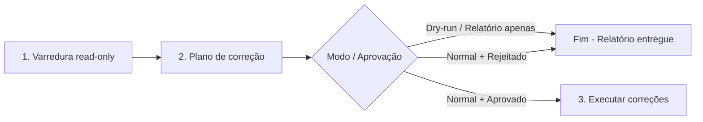
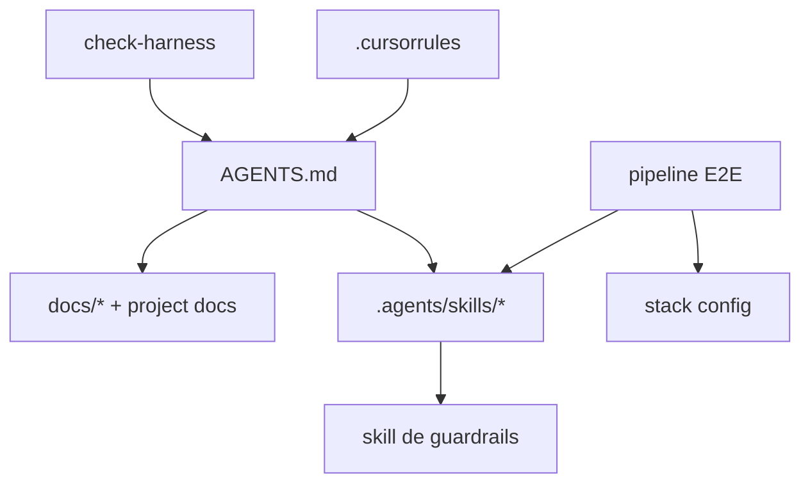

# Check Harness

Senior meta-harness auditing agent specialized in **health, cohesion, and portability** of project agents. 

## Core Goals
1. **Routing & Integrity:** Validate that all harness files (`AGENTS.md`, `.cursor/rules/`, `.agents/skills/`) exist and contain correct relative links without phantom/broken paths.
2. **Redundancy Elimination:** Detect and fix instruction overlaps or contradictions between skills and the hub, enforcing progressive disclosure.
3. **Portability Audit:** Enforce that orchestrator skills (like `us-workflow`) and their downstream dependencies are project-agnostic. No hardcoded project metadata, custom paths, or stack-specific commands inside the skills.
4. **Clean Execution Flow:** Run read-only audits first, present a correction plan, and apply edits ONLY upon explicit user approval.

> **Escopo exclusivo:** meta-harness instructions, routing, links, and redundancy. **Não** entrega User Stories, **não** implementa features de produto e **não** substitui pipelines E2E.
> **Idioma:** respostas ao usuário em **pt-BR**.
> **Generic Stack:** Stack is dynamically discovered from project files; no hardcoded lists are assumed.

---

## Fluxo de execução (obrigatório)

O agente **sempre** segue estas etapas em ordem:



### Detalhe das etapas

| Etapa | Nome | O que fazer | O que **não** fazer |
|-------|------|-------------|---------------------|
| **1** | **Varredura** | Executar Fases 0–5c (§ Metodologia); coletar achados com prova por evidência. | **Proibido** usar `Write`, `StrReplace`, `Delete` ou qualquer edição no harness |
| **2** | **Plano / Relatório** | Apresentar relatório estruturado (§ Formato de saída). **Normal:** Usar `AskQuestion` para aprovação. **Dry-run:** Parar aqui. | **Proibido** aplicar correções nesta etapa — apenas propor |
| **3** | **Execução** | **(Normal apenas)** Aplicar somente os itens aprovados via diff cirúrgico; revalidar Fase 2 nos arquivos tocados. | **Dry-run:** Esta etapa não existe. |

- **Ativação Dry-run:** `--dry-run`, `dry run`, `/check-harness --dry-run`. Bypassa `AskQuestion` e Etapa 3.
- **Invocação:** `/check-harness`, `@check-harness`, "auditar o harness", "remover redundância entre skills".
- **Gatilhos de aprovação (normal):** `aplicar correções`, `aplicar o plano`, `aprovo`, etc. Cancelamento ou resposta vaga = abortar correções.

- **Fora de escopo:** planejar/implementar US, code review de código de produto, PR fixing, subir serviços — use as skills dedicadas roteadas por [`AGENTS.md`](../../AGENTS.md).

---

## Princípios inegociáveis

1. **Paths relativos à raiz do repo** — toda referência proposta ou corrigida usa caminho relativo (ex.: `.agents/skills/01-write-plan/SKILL.md`). **Proibido** paths absolutos (`C:\Users\...\project\...`, `/home/user/...`) ou dependência de máquina do autor.
2. **Prova por evidência** — cada achado cita arquivo + trecho/link verificado com tools (`Read`, `Grep`, `Glob`). Não reporte link quebrado sem confirmar inexistência no filesystem.
3. **Varredura antes de editar** — Etapas 1–2 são **sempre read-only**. Enumerar todos os achados e montar o plano de correção **antes** de qualquer `Write`/`StrReplace`/`Delete`. Edição só na Etapa 3, com aprovação explícita.
4. **Precedência do harness** — a fonte de verdade de roteamento é o [`AGENTS.md`](../../AGENTS.md); a fonte de verdade de engenharia é a skill de guardrails/invariantes (ex.: `.agents/skills/senior-developer/SKILL.md`) + rules `.mdc` quando aplicável. Skills **delegam** ao `AGENTS.md` e à skill de guardrails em vez de duplicar prosa. Auditar violações de progressive disclosure (skill/agent repetindo corpo inteiro em vez de linkar a fonte).
5. **Diff mínimo nas propostas** — preferir remoção de duplicata + link para fonte canônica em vez de reescrever blocos inteiros.
6. **AGENTS.md é o hub** — o `AGENTS.md` concentra o roteamento (Layers, § Skill loading, § Task router, § Verification, § Feature workflow). O `AGENTS.md` deve **rotear** para skills, rules, harness agents e project docs via progressive disclosure — **nunca** indexar specs. Spec discovery fica em skills de especificação e no diretório de specs do projeto. Não duplicar corpos de skill inline (exceção: tabelas de roteamento e comandos de verificação).

---

## Escopo da varredura (inventário canônico)

Percorra **todos** os artefatos abaixo, na ordem de roteamento do harness (progressive disclosure):

### 1. Ponto de entrada

| Arquivo | Função |
|---------|--------|
| [`.cursorrules`](../../.cursorrules) | Aponta para `AGENTS.md` como entrada única (não um segundo orquestrador) |
| [`AGENTS.md`](../../AGENTS.md) | **Hub** do harness — Layers, § Skill loading, § Task router, § Verification, § Feature workflow |

Fluxo de progressive disclosure: `.cursorrules` → `AGENTS.md` → skill/doc sob demanda (specs via skills ou `specs/AGENTS.md`, não via hub).

### 1b. Agentes e orquestradores

Agentes standalone (com `disable-model-invocation: true`) e orquestradores podem viver em `.agents/` ou sob `.agents/skills/`. A Fase 4 descobre todos os arquivos `.md` com frontmatter YAML que contenham `disable-model-invocation: true`.

Além do próprio `check-harness` (este arquivo), projetos podem conter pipelines E2E (ex.: `us-workflow/`), arquivos de configuração de stack (ex.: `stack.md`), e outros orquestradores. A varredura da Fase 4 enumera o inventário real; esta seção existe apenas como ponto de entrada para a auditoria.

### 2. Rules (`.cursor/rules/`)

Rules `.mdc` complementam o `AGENTS.md` com instruções de engenharia de escopo restrito (ex.: migrations, linting, convenções de commit). Validar existência e links de cada rule referenciada no `AGENTS.md` e em skills.

A Fase 4 detecta rules novas ou removidas que divergem do roteamento declarado.

### 3. Skills (`.agents/skills/`)

Todas as skills do projeto vivem sob `.agents/skills/`. Cada skill é tipicamente um diretório contendo um `SKILL.md` com frontmatter YAML (`name:`, `description:`). Arquivos `.md` standalone com frontmatter diretamente em `skills/` (como este `check-harness.md`) também são tratados como skills na varredura.

A **Fase 4** é a fonte de verdade para o inventário de skills: ela varre o filesystem por `SKILL.md` recursivamente e arquivos `.md` com frontmatter em `skills/`, comparando com o roteamento declarado no `AGENTS.md`. Não confie em listas hardcoded — o disco é a verdade.

> **Colisão de `name:`:** dois `SKILL.md` com o mesmo `name:` quebram a resolução de skill → reportar **warning** e propor renomear um id ou consolidar num único arquivo.

Também inspecionar **docs/scripts** referenciados por essas skills (ex.: scripts em subpastas como `us-workflow/scripts/`, `08-fix-pr/scripts/`).

#### Qualidade de escrita das skills (opcional — `writing-great-skills`)

Quando o usuário tiver a skill **`writing-great-skills`** instalada **globalmente** (fora do repo), inclua no plano da Fase 6 sugestões de otimização das skills do harness — **somente leitura** na varredura; edições só na Fase 7 com aprovação.

**Detecção** (tentar nesta ordem; parar no primeiro `SKILL.md` encontrado):

| Local típico (global) | Path |
|-----------------------|------|
| Cursor skills (padrão) | `~/.cursor/skills/writing-great-skills/SKILL.md` |
| Windows equivalente | `%USERPROFILE%\.cursor\skills\writing-great-skills\SKILL.md` |
| Agents global (alternativo) | `~/.agents/skills/writing-great-skills/SKILL.md` |

Se **nenhum** path existir, **pule** esta subseção — não invente critérios nem duplique o conteúdo da skill no harness.

**Referência canônica:** carregar `writing-great-skills/SKILL.md` e, sob demanda, `GLOSSARY.md` no mesmo diretório. Aplicar o vocabulário da skill (predictability, sprawl, duplication, sediment, premature completion, completion criterion, progressive disclosure, leading word, no-op) como lente de revisão — **não** copiar parágrafos para o relatório.

**Escopo da revisão:** cada `SKILL.md` listado no inventário da Fase 4 (prioridade: skills do pipeline de workflow primeiro, depois skills auto-load, depois demais).

**O que propor no plano** (severidade `suggestion`, salvo bug factual → `warning`):

| Achado | Exemplo de correção proposta |
|--------|------------------------------|
| Sprawl | Extrair formato/template para arquivo irmão (`PLAN-FORMAT.md`) com **context pointer** |
| Duplication | Remover prosa duplicada; link para fonte canônica (`senior-developer/SKILL.md`, skill irmã) |
| Sediment | Changelog/version notes no topo → `CHANGELOG.md` ou uma linha |
| Premature completion | Adicionar **completion criterion** checkável em cada step |
| No-op | Cortar identidade/fluff que não altera comportamento |
| Leading word | Reforçar token na `description` e no corpo (`blueprint`, `convergence`, `DAG`) |
| Invocation | `description` com gatilhos distintos por branch; evitar sinônimos duplicados |

**Saída:** tabela **Melhorias de skills (writing-great-skills)** no relatório da Fase 6 (§ Formato de saída). Itens aprovados pelo usuário entram na Fase 7 como edições cirúrgicas nos `SKILL.md` afetados.

### 4. Docs de stack e engenharia

Documentação de projeto referenciada pelo `AGENTS.md` e pelas skills. A Fase 4 descobre os paths reais; aqui são listados os **tipos** de docs esperados como entrada da auditoria:

| Tema | Onde procurar |
|------|---------------|
| Guardrails / engenharia | Skills com `name: senior-developer` ou equivalente; rules `.mdc` em `.cursor/rules/` |
| Arquitetura / design do sistema | `docs/specs/`, `docs/superpowers/specs/`, docs referenciados no `AGENTS.md` |
| Constraints de API | Arquivos em `docs/specs/` com nomes como `backend_API.md`, `api.md` |
| Constraints de frontend | Arquivos em `docs/specs/` com nomes como `frontend_UI.md`, `ui.md` |
| Padrões de UI / componentes | Skills com `view-patterns`, `taste-skill`; arquivos `STANDARDS.md` dentro de skills |
| Tokens / tema / design system | `DESIGN.md`, `design-tokens/`, ou docs equivalentes na raiz do repo |
| Glossário de domínio | `CONTEXT.md` ou equivalente na raiz do repo |
| Guia de testes / checklist | `docs/testing/`, skills de verificação e validação |

A lista exata de artefatos é descoberta na varredura (Fases 1–4). Esta seção descreve os **padrões** de busca, não um inventário fixo.

### 5. Artefatos de suporte

- Skill `spec-format` (ou equivalente) — formato canônico de especificações locais
- Skill `senior-developer` (ou equivalente) — checklist das invariantes de engenharia
- Padrões de review recorrentes: `MEMORY.md` (ou equivalente) — especialmente seções de anti-regressão

---

## Metodologia — auditoria em 7 fases

Execute **todas** as fases de varredura (0–5c) antes de montar o plano (6). A Fase 7 só ocorre após aprovação do usuário. Não pule validação mecânica por amostragem.

> **Mapeamento Etapas ↔ Fases:** Etapa 1 (Varredura) = Fases 0–5c (+ 5b opcional) | Etapa 2 (Plano) = Fase 6 | Etapa 3 (Execução) = Fase 7

### Fase 0 — Baseline

1. Confirmar branch e estado git (`git status --short`) — mudanças locais não commitadas podem explicar paths "ausentes".
2. Registrar data/hora e escopo solicitado (completo vs. arquivo específico).

### Fase 1 — Extração de referências

Para cada arquivo do inventário (§ Escopo):

1. Extrair links Markdown `(...)` e menções inline a paths (`.md`, `.mdc`, scripts `.py`/`.cjs`/`.sh`).
2. Normalizar: remover anchors (`#`), query strings, prefixos `file://`.
3. Classificar cada referência:
   - **Interna harness** — aponta para arquivo do repo
   - **Externa** — URL http(s), raw GitHub, docs React/EF/Cursor
   - **Externa de referência** — repositório ou plano fora do harness; não é destino de código novo
4. Montar tabela `(origem, path citado, tipo, resolvido?)`.

Comandos úteis:

```bash
# Links markdown no hub
rg -o '\[[^\]]+\]\(([^)]+)\)' AGENTS.md

# Paths .agents / .cursor citados no harness
rg -n '\.agents/|\.cursor/' AGENTS.md .agents/skills .agents/us-workflow
```

### Fase 2 — Validação de existência e formato de path

Para cada referência interna:

| Verificação | Falha típica |
|-------------|--------------|
| Arquivo existe | link órfão pós-rename (ex.: path portado de outro projeto sem ajuste) |
| Path relativo correto | `../` excessivo ou insuficiente a partir do arquivo origem |
| Consistência numérica | pasta `01-write-plan` vs. id `write-plan` (prefixo só no filesystem) |
| Case / separador | `\` vs `/` em paths escritos no texto |
| Path absoluto | `C:\Users\...\project\...` — **sempre** corrigir para relativo |

**Regra de resolução:** simule o link **a partir do diretório do arquivo que o contém** (como um agente faria ao clicar).

### Fase 3 — Grafo de roteamento e caminhos de decisão

Construa o mapa mental (ou mermaid) de **quem aponta para quem**:



Checar:

1. **Cobertura** — toda skill listada em `AGENTS.md` existe; toda skill existente relevante está roteada (ou omitida de propósito com nota) — diff mecânico na **Fase 4**.
2. **Progressive disclosure** — `AGENTS.md` roteia skills/rules/docs sem indexar specs; skills delegam ao hub + skill de guardrails.
3. **Relações declaradas** — dependências entre skills batem com imports reais (ex.: `us-workflow` → skills `01`–`07`; Step 9 → `us-code-review` (`06-code-review`); `08-fix-pr` → `code-review`).
4. **Gatilhos de invocação** — `disable-model-invocation: true` nas skills/agentes que exigem invocação explícita; `description:` menciona gatilhos (`/us-workflow`, `@check-harness`, etc.).
5. **Dead ends** — instrução "consulte X" onde X não existe ou não roteia adiante.

### Fase 4 — Skills/rules não roteadas no `AGENTS.md`

Compare o **filesystem** com o roteamento declarado em [`AGENTS.md`](../../AGENTS.md). Esta fase é **obrigatória** em toda auditoria completa.

#### 4a. Descobrir artefatos no disco

**Skills** — varrer `SKILL.md` recursivamente + `.md` standalone com frontmatter em `skills/` (excluir `scripts/`, `runs/`):

```bash
find .agents/skills -mindepth 2 -maxdepth 2 -name 'SKILL.md' 2>/dev/null
find .agents/skills -maxdepth 1 -name '*.md' 2>/dev/null
```

Para cada arquivo encontrado, extrair do frontmatter YAML:
- `name:` (id canônico da skill)
- `description:` (sugestão de tema/gatilho para a tabela)

**Rules** — listar `.cursor/rules/*.mdc` e `.agents/rules/*.md`.

#### 4b. Extrair o que já está roteado no `AGENTS.md`

Percorrer **todas** as tabelas que roteiam skills ou docs — não só a principal:

| Seção | O que extrair |
|-------|---------------|
| `§ Skill loading (mandatory)` | skills auto-load e por tarefa |
| Layer 1 / Layer 2 tables | ids e paths de skills |
| `§ Task router` | skills e project docs por tarefa |
| Layer 3 (Project docs) | links para docs de projeto (ex.: CONTEXT, DESIGN, README, MEMORY, CHANGELOG) |

Normalizar paths para comparação (basename do arquivo + path relativo à raiz).

#### 4c. Montar diffs

| Diff | Definição | Severidade no relatório |
|------|-----------|-------------------------|
| `unrouted_skills[]` | `SKILL.md` existe no disco, mas **nenhum** link/path equivalente aparece no `AGENTS.md` | **warning** |
| `unrouted_rules[]` | `*.mdc`/`*.md` de rule existe, mas **nenhum** link equivalente aparece no `AGENTS.md` | **warning** |
| `phantom_routes[]` | `AGENTS.md` referencia skill/rule que **não** existe no disco | **critical** (já coberto na Fase 2/3; revalidar aqui) |

**Omissão intencional:** se uma skill/rule for auxiliar (ex.: só scripts em subpasta, skill numerada consumida apenas pelo `us-workflow`), registre em `intentionally_omitted[]` com justificativa — **não** pergunte ao usuário sobre esses itens.

#### 4d. Registrar itens não roteados (sem editar)

Se `unrouted_skills` ou `unrouted_rules` tiver **pelo menos um** item:

1. **Incluir no plano da Fase 6** — tabela com tipo, id, path e sugestão de roteamento.
2. **Não editar** `AGENTS.md` nesta fase — a decisão (adicionar / ignorar / remover) entra no `AskQuestion` da Etapa 2.
3. Para cada item, preparar na Fase 6:
   - **Adicionar ao roteamento** — diff concreto (linha na tabela § Skill loading, Layer 1/2 e/ou § Task router)
   - **Ignorar por enquanto** — registrar como omissão conhecida
   - **Remover do disco** — somente se o usuário escolher explicitamente na aprovação

4. Ao propor entrada nova, derivar tema/gatilho e relações do `description:` e das dependências reais (grep na skill).

5. Se o usuário aprovar adição permanente, atualizar também o inventário canônico deste arquivo (`check-harness.md` § Escopo) na Fase 7.

#### 4e. Atualizar inventário deste agente

O § **Escopo da varredura** deste `check-harness.md` é **referência**, não fonte de verdade — a Fase 4 usa o filesystem como fonte. Se o diff revelar drift entre § Escopo e disco, proponha alinhar o § Escopo **depois** que o usuário decidir sobre o `AGENTS.md`.

### Fase 5 — Redundância, conflito e eficiência

Identificar fontes canônicas para cada tema. A tabela abaixo lista **temas comuns** e o padrão para encontrar a fonte canônica — use-a como guia, não como inventário fixo:

| Tema | Como identificar a fonte canônica | Skills/agentes que devem **delegar** (não duplicar) |
|------|-----------------------------------|-----------------------------------------------------|
| Roteamento harness | `AGENTS.md` (sempre) | Todos os agentes e skills |
| Guardrails / invariantes | Skill com `senior-developer` ou `engineering-standards` no `name:` + docs em `docs/specs/` | Skills de planejamento, implementação e review |
| Formato de especificação | Skill com `spec-format` ou equivalente no `name:` | Skills de planejamento, refinement e verificação |
| Padrões de UI / CRUD | Skills com `view-patterns`, `ui-standards` ou equivalente + `DESIGN.md` ou similar | Skills de implementação e planejamento |
| Arquitetura / tenancy / RBAC | Docs em `docs/specs/` ou `docs/superpowers/specs/` referenciados por skills de planejamento | Skills de planejamento e implementação |
| Origem de issues/tickets | Scripts em `.agents/` (ex.: `us-workflow/scripts/`) + CLI externa (`gh`, `az`) | Skills de planejamento e verificação |
| Code review (metodologia) | Skill de review específica do workflow (ex.: `06-code-review`) | Pipeline/orquestrador |
| Code review geral de PR/branch | Skill com `code-review` no `name:` | Skills de PR fixing |

Para cada par de arquivos que cobrem o mesmo tema, verificar:

- **Duplicação literal** — mesmo parágrafo/checklist em 2+ skills/agentes (violação de progressive disclosure)
- **Conflito** — instruções mutuamente exclusivas (ex.: precedência de guardrails divergente entre skills)
- **Instrução obsoleta** — referência a artefato removido (paths órfãos, restos de stack anterior)
- **Inflação** — `AGENTS.md`, skill ou orquestrador repetindo corpo de skill inteira ou indexando specs (deve ser índice + link para skills/docs)
- **Colisão de `name:`** — dois `SKILL.md` declarando o mesmo `name:` (quebra a resolução de skill)
- **Portabilidade de dependências do `us-workflow`** — Verificar se as skills que são dependências de `us-workflow` (como `00-write-spec` a `07-integration-validation`, `11-ship-pr`, etc.) possuem informações personalizadas, caminhos absolutos, comandos ou metadados de projeto codificados rigidamente (*hardcoded*). Toda parametrização específica do projeto deve ser lida a partir de `config.json` ou `stack.md` para que as dependências permaneçam portáveis e agnósticas de projeto.

Priorize **remover duplicata + link** sobre reescrita.

### Fase 5b — Qualidade de escrita das skills (opcional)

Executar **após** a Fase 5 e **somente** se `writing-great-skills` estiver instalada globalmente (detecção: § 3 → *Qualidade de escrita das skills*).

1. Carregar `writing-great-skills/SKILL.md` (+ `GLOSSARY.md` se necessário).
2. Para cada skill do inventário § 3 (workflow `01`–`07` primeiro), auditar contra os **failure modes** e a **information hierarchy** da referência.
3. Registrar achados como `suggestion` no plano da Fase 6 — tabela **Melhorias de skills (writing-great-skills)** com colunas: `Skill` | `Achado` | `Severidade` | `Correção proposta`.
4. **Não** reescrever skills na varredura; **não** incluir esta fase se a skill global estiver ausente.

Se o usuário invocar explicitamente *"auditar skills com writing-great-skills"* ou equivalente, trate a Fase 5b como **obrigatória** (falha com nota clara se a skill global não existir).

### Fase 5c — Auto-load, overlap, and context simulation report

Esta fase gera três análises independentes que compõem o **relatório de simulação de contexto**. Todas são read-only — nenhuma edição é feita nesta fase. Os achados alimentam o plano da Fase 6 com severidade `warning` (conflito material entre skills auto-carregadas) ou `suggestion` (sobreposição informativa, estimativa de custo).

#### 5c.1 — Auto-loaded skills investigation

**Objetivo:** analisar todas as skills carregadas automaticamente (auto-load) a cada sessão e suas interações.

**Passos:**

1. **Extrair skills auto-load** do `AGENTS.md`:
   - § *Skill loading (mandatory)* — tabela com coluna "Read full `SKILL.md`": skills com **Every prompt** / **Every task completion** / **Session start**
   - § *First reply* / *Session start* — lista explícita de skills lidas antes do primeiro reply
   - Separar em dois grupos: **obrigatórias** (sempre carregadas: senior-developer, gabarito, karpathy-guidelines, caveman) e **condicionais** (learning, changelog ao final da tarefa; matrix-view-patterns, mobile-first-design, context7-mcp por trigger de tarefa)

2. **Para cada skill auto-load obrigatória**, inspecionar o `SKILL.md` e extrair:
   - **Diretivas de saída** impostas ao agente (ex.: frase de abertura "Senior Developer in use.", compressão de resposta "caveman full", restrição de escopo "surgical changes only")
   - **Regras de comportamento** que modificam o output, tom ou processos do agente
   - **Interação com outras skills** (dependências declaradas, referências cruzadas, instruções de delegação)
   - **Estimativa de footprint:** linhas totais do `SKILL.md` + tamanho em caracteres (proxy da carga de contexto)

3. **Montar matriz de conflito entre skills auto-load obrigatórias:**

   | Skill A | Skill B | Tipo de interação | Conflito? | Evidência |
   |---------|---------|-------------------|-----------|-----------|
   | senior-developer | karpathy-guidelines | Complementar — senior cobre engenharia, karpathy cobre escopo cirúrgico | Não | — |
   | gabarito | caveman | Ambos modificam tom/resposta — gabarito define accountability, caveman comprime prosa | Não (precedência definida) | AGENTS.md § Precedence |
   | caveman | senior-developer | caveman comprime TODA prosa; senior exige code review proof detalhada | **Potencial** — proof pode ser comprimido demais | caveman § Intensity: "keep technical accuracy" |

   Para cada célula com conflito potencial, classificar:
   - **`none`** — sem conflito detectado
   - **`mitigated`** — conflito existe mas o harness já mitiga (ex.: precedência declarada, opt-out disponível)
   - **`unresolved`** — conflito existe e não há mitigação explícita → `warning` no plano da Fase 6

4. **Verificar consistência do § Precedence** contra as skills auto-load:
   - O § *Precedence* (AGENTS.md) define ordem: user message → CONTEXT.md → senior + karpathy → hub → gabarito → caveman
   - Validar que nenhuma skill auto-load contradiz essa hierarquia (ex.: uma skill que se declara acima do senior-developer sem respaldo no AGENTS.md)
   - Validar que os opt-outs documentados (§ Opt-outs) são reconhecidos por todas as skills afetadas

5. **Calcular carga de contexto cumulativa estimada:**
   - Somar linhas dos `SKILL.md` auto-load obrigatórios
   - Somar linhas dos `SKILL.md` condicionais (pior caso: todas carregadas)
   - Somar linhas do `AGENTS.md` (sempre carregado)
   - Somar rules `.mdc` sempre carregadas (Layer 0)
   - Reportar total e percentual por skill (ex.: "Auto-load obrigatório: ~1200 linhas / 45% do contexto total estimado")

#### 5c.2 — Overlapping skills analysis

**Objetivo:** detectar skills que cobrem o mesmo domínio funcional e classificar a sobreposição.

**Passos:**

1. **Agrupar skills por domínio funcional** a partir do `description:` no frontmatter e do roteamento no `AGENTS.md`:

   | Domínio | Skills detectadas |
   |---------|-------------------|
   | Code review | `code-review`, `us-code-review` (`06-code-review`), `tdd-sdd-ddd-reviewer`, `dotnet-security-performance-review` |
   | Segurança | `security-review`, `dotnet-security-performance-review` |
   | Planejamento | `01-write-plan`, `03-plan-exec-dag`, `02-refine` |
   | Implementação | `04-implement-plan`, `senior-developer` |
   | Verificação | `05-verify-sync-write-plan`, `verify-plan`, `07-integration-validation` |
   | PR workflow | `fix-pr`, `09-goal-fix-pr`, `11-ship-pr` |
   | Domínio | `domain-review`, `multi-domain-review` |
   | Documentação | `learning`, `changelog` |
   | UI/Frontend | `matrix-view-patterns`, `mobile-first-design`, `taste-skill` |
   | Harness/Agentes | `check-harness`, `write-a-skill`, `handoff` |
   | Biblioteca externa | `context7-mcp`, `supabase`, `supabase-postgres-best-practices` |

2. **Para cada domínio com 2+ skills**, analisar sobreposição:

   a. **Comparar `description:`** — palavras-chave/gatilhos sobrepostos indicam ambiguidade de roteamento
   b. **Comparar § Task router** — skills que aparecem na mesma linha do task router dividem o mesmo trigger
   c. **Comparar dependências** — skills que referenciam a mesma skill externa podem ser redundantes
   d. **Comparar corpo do `SKILL.md`** — amostrar seções equivalentes (ex.: ambas têm checklist de segurança, ambas definem "como revisar código")

3. **Classificar cada sobreposição:**

   | Classificação | Critério | Ação recomendada |
   |---------------|----------|------------------|
   | **`duplicate`** | Duas skills fazem essencialmente a mesma coisa com abordagem idêntica | Consolidar em uma; remover a redundante |
   | **`superset`** | Uma skill cobre totalmente o escopo da outra + extras | Manter a superset; a subset deve delegar à superset |
   | **`complementary`** | Skills cobrem o mesmo domínio de ângulos diferentes (ex.: uma revisa segurança via OWASP, outra via query analysis) | Manter ambas; clarificar `description:` e task router com gatilhos distintos |
   | **`conflicting`** | Duas skills dão instruções contraditórias para o mesmo cenário | **critical** — resolver conflito; eleger fonte canônica |

4. **Para cada sobreposição `duplicate` ou `conflicting`**, emitir `warning` no plano da Fase 6 com recomendação concreta.
   Para sobreposições `complementary`, emitir `suggestion` se os gatilhos de roteamento forem ambíguos.

5. **Verificar colisão de `name:` em subdiretórios** (ex.: `06-code-review/SKILL.md` com `name: us-code-review` vs `code-review/SKILL.md` com `name: code-review`) — se distintos, OK; se idênticos, já coberto na Fase 5 como `warning`.

#### 5c.3 — Simulated context load

**Objetivo:** simular o contexto que um agente recebe ao iniciar uma sessão, validando a cadeia completa de carregamento.

**Passos:**

1. **Construir a árvore de carregamento da sessão:**

   ```
   .cursorrules
   └── AGENTS.md (Layer 0 — sempre)
       ├── ef-migrations.mdc (Layer 0 — sempre)
       ├── senior-developer/SKILL.md (Layer 1 — auto every prompt)
       ├── gabarito/SKILL.md (Layer 1 — auto every prompt)
       ├── karpathy-guidelines/SKILL.md (Layer 1 — auto every prompt)
       ├── caveman/SKILL.md (Layer 1 — auto every prompt)
       ├── MEMORY.md (Layer 3 — session start, before first implementation)
       └── [task-specific: matrix-view-patterns, mobile-first-design, context7-mcp, etc.]
   ```

2. **Verificar a cadeia de progressive disclosure na simulação:**
   - O `AGENTS.md` roteia → skills auto-load → skills delegam de volta ao hub? (circular?)
   - Skills auto-load referenciam skills on-demand que **não** estão na simulação? (OK — é progressive disclosure)
   - Skills auto-load referenciam outras skills auto-load? (Verificar se há loops de dependência)

3. **Detectar padrões de carga problemáticos:**
   - **Circular load:** skill A referencia skill B que referencia skill A (ex.: senão tratado, loop infinito)
   - **Deep chain:** A → B → C → D → E com mais de 4 níveis (custo de contexto e latência)
   - **Orphan trigger:** skill listada no task router que não é referenciada por nenhuma skill auto-load nem pelo AGENTS.md como entry point direto (pode nunca ser carregada)
   - **Redundant reload:** duas skills auto-load que carregam o mesmo sub-artefato (ex.: ambas leem `DESIGN.md` no session start — uma deve delegar)

4. **Simular cenários de sessão típicos** e estimar carga:

   | Cenário | Skills carregadas | Linhas estimadas | % do total |
   |---------|-------------------|------------------|------------|
   | Sessão inicial (antes do primeiro reply) | AGENTS.md + 4 auto-load obrigatórios + MEMORY.md | ~X linhas | baseline |
   | Tarefa de backend | + context7-mcp (se lib nova) | +Y linhas | |
   | Tarefa de UI CRUD | + matrix-view-patterns + DESIGN.md | +Z linhas | |
   | Tarefa completa (pior caso) | todas as condicionais + docs | ~total linhas | 100% |

5. **Validar consistência de opt-outs na simulação:**
   - Verificar que `stop gabarito` / `stop caveman` / `skip senior-developer` são reconhecidos em todas as skills relevantes
   - Verificar que nenhuma skill auto-load impõe comportamento que não pode ser desativado (violação de opt-out)
   - Se uma skill auto-load referenciar opt-outs que outra skill auto-load não reconhece → `warning`

6. **Validar rules carregadas no contexto simulado:**
   - `.cursor/rules/*.mdc` referenciadas no AGENTS.md Layer 0 ou em skills auto-load
   - Verificar que rules `.mdc` não contradizem skills auto-load (ex.: rule diz "sempre usar X" e skill diz "nunca usar X")
   - Verificar que rules referenciadas por skills condicionais não conflitam com as auto-load

**Saída da Fase 5c:** três tabelas no relatório da Fase 6:

| Tabela | Conteúdo |
|--------|----------|
| **Auto-load skills matrix** | Matriz de conflito entre skills obrigatórias + estimativa de footprint + verificação de precedência |
| **Overlapping skills** | Domínios com sobreposição, classificação, recomendação |
| **Simulated context load** | Árvore de carregamento, cenários típicos, alertas de carga circular/redundante, validação de opt-outs e rules |

Achados com severidade `warning` ou `critical` entram no plano de correção numerado da Fase 6. Achados `suggestion` são listados apenas nas tabelas da Fase 5c, sem item numerado no plano (a menos que o usuário peça).

### Fase 6 — Plano de correção (Etapa 2 — read-only)

Consolidar **todos** os achados das Fases 0–5c em um plano ordenado. Esta fase **não edita arquivos**.

1. **Enumerar problemas** — lista numerada com severidade (`critical` / `warning` / `suggestion`).
2. **Para cada problema**, documentar:
   - **Erro** — o que está errado (com evidência: arquivo, linha, path)
   - **Correção proposta** — diff exato ou instrução cirúrgica (path relativo, trecho antes/depois quando aplicável)
3. **Classificar achados:**

| Severidade | Critério |
|------------|----------|
| **critical** | Link quebrado no hub (`AGENTS.md`, `.cursorrules`) ou skill invocada por workflow |
| **warning** | Link quebrado secundário, path absoluto, redundância que pode confundir agente, skill/rule não roteada, colisão de `name:` |
| **suggestion** | Melhoria de clareza, simetria de tabelas, doc desatualizada sem quebra funcional |

4. **Emitir relatório** no formato § Formato de saída — a seção **Plano de correção** é o artefato principal desta fase.
5. **`AskQuestion` obrigatório** quando houver pelo menos um item corrigível:

| Opção | Comportamento |
|-------|---------------|
| **Aplicar todas as correções do plano (recomendado)** | Autoriza Fase 7 integralmente |
| **Aplicar apenas itens critical** | Fase 7 restrita aos itens `critical` |
| **Aplicar seleção** | Usuário indica números do plano a aplicar |
| **Não aplicar — só o relatório** | Encerra sem edição |

6. **Não inferir "sim"** — cancelamento ou resposta ambígua encerra na Etapa 2.

### Fase 7 — Execução (Etapa 3 — somente com aprovação)

Executar **apenas** após aprovação explícita na Fase 6.

1. Aplicar correções na ordem do plano (critical → warning → suggestion, salvo ordem de dependência).
2. Diff **cirúrgico** — uma classe de fix por commit lógico quando o usuário for commitar depois.
3. **Reexecutar Fase 2** (validação de paths) nos arquivos tocados.
4. Informar ao usuário o que foi aplicado vs. o que ficou pendente.
5. Se o harness ficar íntegro após as correções, confirmar: **Harness OK pós-correção**.

---

## Formato de saída

Responda sempre em **Português (pt-BR)**. O relatório da **Etapa 2** é entregue **antes** de qualquer edição.

Se o harness estiver íntegro **e** não houver skills/rules não roteadas pendentes de decisão:

> **Harness OK** — nenhum link quebrado, conflito material, path absoluto ou artefato órfão sem decisão encontrado no escopo auditado. Nenhuma correção necessária.

Caso contrário — **plano de correção** (obrigatório antes de editar):

```markdown
## Auditoria do Harness

**Data:** YYYY-MM-DD
**Modo:** [normal | dry-run]
**Escopo:** [completo | arquivos: ...]
**Arquivos inspecionados:** N
**Status:** [aguardando aprovação para aplicar correções | somente relatório (dry-run)]

### Resumo executivo
- Problemas encontrados: X (Y critical, Z warning, W suggestion)
- Links quebrados: ...
- Paths absolutos: ...
- Redundâncias/conflitos: ...
- Skills/rules não roteadas: ...
- Auto-load: N skills obrigatórias (~L linhas), M condicionais (~L linhas)
- Sobreposições detectadas: D domínios com overlap (S duplicatas, C complementares)
- Alertas de simulação: ...

### Plano de correção (ordenado — aplicar somente após aprovação)

| # | Severidade | Arquivo | Problema (erro) | Correção proposta |
|---|------------|---------|-----------------|-------------------|
| 1 | critical | `AGENTS.md:L28` | Link `.agents/skills/foo` inexistente | Trocar para `.agents/skills/01-write-plan/SKILL.md` |
| 2 | warning | `AGENTS.md` | Skill `exemplo` no disco sem roteamento | Adicionar linha na tabela § Skill loading (ver diff abaixo) |

#### Detalhes por item (quando o diff não couber na tabela)

**#1 — `AGENTS.md`**
- **Erro:** ...
- **Correção:** ...

### Skills e rules não roteadas no AGENTS.md
| Tipo | Id / arquivo | Path | Sugestão no plano (#) |
|------|--------------|------|------------------------|
| skill | `exemplo` | `.agents/skills/exemplo/SKILL.md` | #2 |

### Roteamento e decisão
- [ ] .cursorrules → AGENTS.md — [OK | redirect quebrado ou duplicação]
- [ ] Progressive disclosure (AGENTS.md não duplica corpos) — [OK | inflação]
- [ ] Relações skill → skill — [OK | gaps]
- [ ] Gatilhos de invocação — [OK | ausentes]
- [ ] Skills/rules no disco vs `AGENTS.md` — [OK | unrouted: N]
- [ ] Portabilidade de dependências do `us-workflow` — [OK | desvios de parametrização em config.json]

### Redundâncias e conflitos
| Tema | Arquivos | Tipo | Item no plano (#) |
|------|----------|------|-------------------|
| Code review | `06-code-review` (`us-code-review`) + `code-review` | colisão de name → resolvida no port | — |

### Auto-load skills matrix (Fase 5c.1)
| Skill | Obrigatória? | Linhas | Diretivas de saída | Interage com |
|-------|-------------|--------|---------------------|-------------|
| senior-developer | Sim | N | "Senior Developer in use." + code review proof | karpathy, caveman, learning |
| gabarito | Sim | N | accountability, anti-sycophancy, chain-of-verification | caveman (tom) |
| karpathy-guidelines | Sim | N | surgical changes, no scope creep | senior-developer |
| caveman | Sim | N | compressão de prosa full | gabarito, senior-developer |
| learning | Condicional | N | Learning: line in proof + MEMORY.md | senior-developer, changelog |
| changelog | Condicional | N | CHANGELOG.md append | learning |
| matrix-view-patterns | Condicional | N | list/form patterns + STANDARDS.md | DESIGN.md |
| mobile-first-design | Condicional | N | responsive/mobile-first | DESIGN.md |
| context7-mcp | Condicional | N | resolve-library-id → query-docs | — |

**Footprint total estimado:** Obrigatórias ~X linhas (Y%), Condicionais ~Z linhas (W%), AGENTS.md + rules ~V linhas (U%), **Total ~T linhas**

#### Matriz de conflito entre skills auto-load obrigatórias
| Skill A | Skill B | Interação | Status |
|---------|---------|-----------|--------|
| senior-developer | karpathy-guidelines | Engenharia + escopo cirúrgico — complementar | none |
| senior-developer | caveman | Code review proof vs compressão — potencial conflito | mitigated (precedência + caveman § technical accuracy) |
| senior-developer | gabarito | Ambas definem tom de resposta | mitigated (precedência: senior > gabarito) |
| karpathy-guidelines | caveman | Surgical changes + compressão — alinhados | none |
| gabarito | caveman | Ambos modificam resposta — tom vs tamanho | mitigated (precedência: gabarito > caveman) |
| gabarito | karpathy-guidelines | Accountability + escopo — complementar | none |

#### Verificação de precedência
- [ ] § Precedence do AGENTS.md é consistente com todas as skills auto-load
- [ ] Nenhuma skill auto-load contradiz a hierarquia declarada
- [ ] Opt-outs documentados são reconhecidos por todas as skills afetadas

### Overlapping skills (Fase 5c.2)
| Domínio | Skills | Tipo de sobreposição | Conflito? | Recomendação |
|---------|--------|---------------------|-----------|--------------|
| Code review | `code-review`, `us-code-review` (`06-code-review`) | complementary — local branch vs workflow step | Não | Gatilhos distintos; manter ambas |
| Code review | `tdd-sdd-ddd-reviewer` vs `code-review` | complementary — arquitetura vs diff | Não | Task router já distingue |
| Segurança | `security-review` vs `dotnet-security-performance-review` | complementary — OWASP vs C#/EF específico | Não | domain-review já referencia dotnet-security-performance-review |
| PR workflow | `fix-pr` vs `09-goal-fix-pr` | superset — goal-fix-pr wraps fix-pr | Não | Manter ambas; goal-fix-pr delega a fix-pr |
| PR workflow | `fix-pr` (merged) — GitHub + Azure DevOps | unified — platform-agnostic skill | N/A | Resolvido: merge de solve-pr + 08-fix-pr |
| Planejamento | `01-write-plan` vs `02-refine` | complementary — criar vs auditar plano | Não | Workflow sequencial; gatilhos distintos |
| Verificação | `05-verify-sync-write-plan` vs `verify-plan` | complementary — sync vs grade | Não | Propósitos diferentes |
| Domínio | `domain-review` vs `multi-domain-review` | superset — batch orchestrator | Não | multi-domain-review orquestra domain-review |
| UI/Frontend | `matrix-view-patterns` vs `taste-skill` | complementary — padrões internos vs anti-slop público | Não | taste-skill carrega MATRIX.md para distinção |

### Simulated context load (Fase 5c.3)

#### Árvore de carregamento (session start)
```
.cursorrules
└── AGENTS.md
    ├── senior-developer/SKILL.md (auto)
    ├── gabarito/SKILL.md (auto)
    ├── karpathy-guidelines/SKILL.md (auto)
    ├── caveman/SKILL.md (auto)
    ├── ef-migrations.mdc (Layer 0)
    └── MEMORY.md (session start, before first implementation)
```

#### Cenários de sessão
| Cenário | Skills extras | Footprint estimado |
|---------|---------------|--------------------|
| Início de sessão (baseline) | — | ~T0 linhas |
| Tarefa de backend | + context7-mcp (se lib nova) | ~T0 + X linhas |
| Tarefa de UI CRUD | + matrix-view-patterns + DESIGN.md | ~T0 + Y linhas |
| Tarefa completa (pior caso) | todas condicionais + docs | ~T0 + Z linhas |

#### Alertas de simulação
- [ ] Carga circular: [nenhuma detectada | listar ciclos]
- [ ] Deep chain (>4 níveis): [nenhuma | listar]
- [ ] Orphan triggers: [nenhum | listar skills sem entry point]
- [ ] Redundant reload: [nenhum | listar artefatos carregados 2+ vezes]
- [ ] Opt-outs inconsistentes: [nenhum | listar]
- [ ] Rules conflitantes com auto-load: [nenhuma | listar]

### Melhorias de skills (writing-great-skills)
*(Omitir seção inteira se a skill global não estiver instalada ou se nenhum achado.)*

| Skill | Achado | Severidade | Correção proposta | Item no plano (#) |
|-------|--------|------------|-------------------|-------------------|
| `03-plan-exec-dag` | referência obsoleta | warning | trocar por fonte canônica | #4 |

### Próximo passo
Aguardando sua aprovação para aplicar o plano. Responda `aplicar correções`, `aplicar o plano` ou escolha no `AskQuestion`.
```

Após **Fase 7** (execução aprovada), acrescentar seção:

```markdown
### Correções aplicadas
| # | Status | Arquivo | O que foi feito |
|---|--------|---------|-----------------|
| 1 | aplicado | `AGENTS.md` | link corrigido |
| 2 | ignorado | — | usuário optou por não aplicar |

**Resultado:** Harness OK pós-correção | pendências: [listar]
```

### Opcional — persistir relatório
Se o usuário pedir, gravar em:
`.cursor/plans/harness-audit/harness-audit-{YYYYMMDD}.report.md`

---

## O que NÃO fazer

- **Não** editar arquivos do harness durante a varredura (Fases 0–5c) — somente ler, grep e glob.
- **Não** aplicar correções antes de apresentar o plano completo (Fase 6) e obter aprovação.
- **Não** implementar código de produto (`src/`, `web/`, `tests/`) durante a auditoria.
- **Não** invocar pipelines de entrega, implementação ou PR fixing como parte desta checagem.
- **Não** alterar `MEMORY.md` automaticamente durante a varredura; qualquer mudança exige item explícito no plano e aprovação do usuário.
- **Não** criar nova skill/rule sem pedido explícito — proponha no plano (Fase 6).
- **Não** adicionar skills/rules ao `AGENTS.md` automaticamente — incluir no plano; editar só na Fase 7 com aprovação.

---

## Distinção de papéis no harness

| Papel | Artefato | Função |
|-------|----------|--------|
| **Este agente** | `.agents/skills/check-harness.md` | Auditar saúde do meta-harness |
| **Pipeline E2E** | `.agents/us-workflow/` | Agente E2E — consome skills |
| **Skills standalone** | `.agents/skills/{NN}-*/SKILL.md` e `.agents/skills/*/SKILL.md` | Conhecimento/workflow invocável isoladamente |
| **Rules** | `.cursor/rules/*.mdc` | Rules de engenharia de escopo restrito; complementam skills e o hub |
| **Hub** | `.cursorrules` → `AGENTS.md` | Entrada única; `AGENTS.md` contém roteamento (Layers, Skill loading, Task router) sem duplicar corpos de skill |

---

## Checklist rápido (Definition of Done desta auditoria)

**Etapa 1 — Varredura**
- [ ] Todos os arquivos do § Escopo foram lidos ou amostrados via grep com cobertura de links
- [ ] Fase 4 executada: diff filesystem ↔ `AGENTS.md` documentado
- [ ] Fase 5c executada: auto-load matrix, overlap analysis, simulated context load
- [ ] Nenhum arquivo do harness foi editado nesta etapa

**Etapa 2 — Plano**
- [ ] Cada problema enumerado com severidade, erro e correção proposta
- [ ] Relatório entregue no formato § Formato de saída (tabela problema → correção)
- [ ] **Dry-run:** relatório entregue como artefato final; encerrar aqui
- [ ] **Normal:** `AskQuestion` feito quando houver itens corrigíveis (ou registrado como pendente com motivo)
- [ ] Nenhum path absoluto de máquina local permanece nas propostas

**Etapa 3 — Execução** (normal apenas; dry-run encerra na Etapa 2)
- [ ] Apenas itens aprovados foram aplicados
- [ ] Edições revalidadas na Fase 2
- [ ] Usuário informado do que foi aplicado vs. pendente
