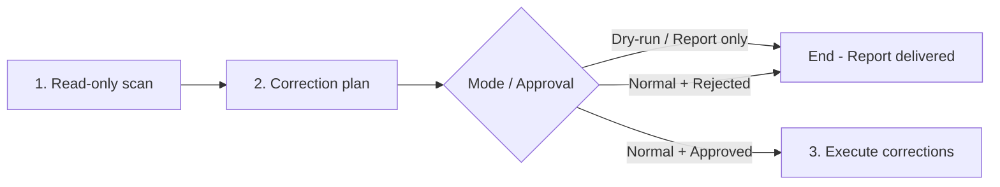
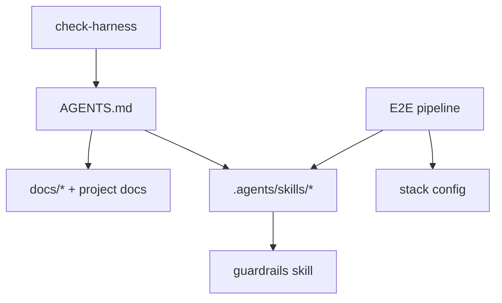

# Check Harness

> **Note:** The harness audit is performed by loading this file and following the scan phases below. This skill is project-agnostic — it discovers project structure dynamically.

Senior meta-harness auditing agent specialized in **health, cohesion, and portability** of project agents. 

## Core Goals
1. **Routing & Integrity:** Validate that all harness files (`AGENTS.md`, `.agents/skills/`) and optional project docs (`README.md`, `docs/` when present) exist and contain correct relative links without phantom/broken paths. Optional host entry pointers (e.g. a thin rules file pointing at `AGENTS.md`) are informational only — **not** required harness. When `spec-to-pr` is present, also validate pipeline folder/`ws-*`/`FSM` alignment per § 3b (including retired path detection).
2. **Redundancy Elimination:** Detect and fix instruction overlaps or contradictions between skills and the hub, enforcing progressive disclosure.
3. **Portability Audit:** Enforce that orchestrator skills (like `spec-to-pr`) and their downstream dependencies are project-agnostic. No hardcoded project metadata, custom paths, or stack-specific commands inside the skills.
4. **Clean Execution Flow:** Run read-only audits first, present a correction plan, and apply edits ONLY upon explicit user approval.

> **Exclusive scope:** meta-harness instructions, routing, links, and redundancy. **Does not** deliver User Stories, **does not** implement product features, and **does not** replace E2E pipelines.
> **Language:** responses to user in **en-us**.
> **Generic Stack:** Stack is dynamically discovered from project files; no hardcoded lists are assumed.

---

## Execution flow (mandatory)

The agent **always** follows these steps in order:



### Step details

| Step | Name | What to do | What **not** to do |
|-------|------|-------------|---------------------|
| **1** | **Scan** | Run Phases 0–5c (§ Methodology); collect findings with evidence-based proof. | **Forbidden** to use `Write`, `StrReplace`, `Delete`, or any edit in the harness |
| **2** | **Plan / Report** | Present structured report (§ Output format). **Normal:** Use `user-gate` for approval. **Dry-run:** Stop here. | **Forbidden** to apply corrections in this step — only propose |
| **3** | **Execution** | **(Normal only)** Apply only approved items via surgical diff; revalidate Phase 2 on touched files. | **Dry-run:** This step does not exist. |

- **Dry-run activation:** `--dry-run`, `dry run`, `/check-harness --dry-run`. Bypasses `user-gate` and Step 3.
- **Invocation:** `/check-harness`, `@check-harness`, "audit the harness", "remove redundancy between skills".
- **Approval triggers (normal):** `apply corrections`, `apply the plan`, `approved`, etc. Cancellation or vague response = abort corrections.

- **Out of scope:** planning/implementing US, product code review, PR fixing, starting services — use dedicated skills routed by the resolved hub (per § Hub resolution; [`shared/AGENTS.md`](../shared/AGENTS.md) in consumer mode).

---

## Non-negotiable principles

1. **Repo-root-relative paths** — every proposed or corrected **filesystem** reference uses a relative path (e.g., `.agents/skills/01-write-plan/SKILL.md`) or a declared **path token** that expands to one (e.g., `{sharedDir}/MEMORY.md`). **Forbidden** absolute paths (`C:\Users\...\project\...`, `/home/user/...`) or author-machine dependencies. Load and expand tokens per § Path token map **before** judging broken links or rewriting relatives.
2. **Evidence-based proof** — each finding cites file + snippet/link verified with tools (`Read`, `Grep`, `Glob`). Do not report a broken link without confirming nonexistence on the filesystem **after** token expansion (when applicable).
3. **Scan before edit** — Steps 1–2 are **always read-only**. Enumerate all findings and assemble the correction plan **before** any `Write`/`StrReplace`/`Delete`. Editing only in Step 3, with explicit approval.
4. **Harness precedence** — routing source of truth is the **resolved agent hub** (§ Hub resolution below). Engineering guardrails resolve per hub § External Dependencies (`config.json.rules.seniorDeveloper`, then local/global `senior-developer`). Optional project rules are audited only when `config.json.rules.*` points at them. Skills **delegate** to the hub and the guardrails skill instead of duplicating prose. Audit progressive disclosure violations (skill/agent repeating the entire body instead of linking to the source).
5. **Minimal diff in proposals** — prefer removing duplicates + link to canonical source rather than rewriting entire blocks. **Do not** “fix” healthy `{skillsRoot}` / `{sharedDir}` / `{plansDir}` / `{reviewsDir}` prose into `../` relatives or full literals unless the citation is a Markdown link target (links cannot carry braces).
6. **Resolved hub is the agent hub** — the resolved hub concentrates routing (skill loading, task router, verification). `README.md` is for humans (install/contribute) and must **not** replace the router. The hub must **route** to skills, rules, and project docs via progressive disclosure — **never** index specs. Spec discovery lives in specification skills and the project's specs directory. Do not duplicate skill bodies inline (exception: routing tables and verification commands).

### Path token map (mandatory — before Phase 1/2 path checks)

Canonical contract: [`tools.md`](../shared/tools.md) § Path tokens · [`config-resolution.md`](../shared/config-resolution.md).

**Load once in Phase 0**, then reuse for every existence / relative-path / correction decision:

| Token | Resolve from (first match) | Default |
|-------|----------------------------|---------|
| `{skillsRoot}` | `config.json` → `pathTokens.skillsRoot` | `.agents/skills` |
| `{sharedDir}` | `config.json` → `pathTokens.sharedDir` | `.agents/skills/shared` |
| `{plansDir}` | `config.json` → `plans.dir` | `.agents/plans` |
| `{reviewsDir}` | `config.json` → `reviews.dir` | `.agents/codereviews` |
| `{us-dir}` | `{plansDir}/{slug}/` | (slug from context; skip existence if slug unknown) |

**Expand algorithm (before any broken-link claim or relative rewrite):**

1. If the cited string contains `{skillsRoot}` / `{sharedDir}` / `{plansDir}` / `{reviewsDir}` / `{us-dir}`, substitute from the map (nested: expand `{sharedDir}` after `{skillsRoot}` if needed).
2. Result is **repo-root-relative** (e.g. `.agents/skills/shared/MEMORY.md`). Check existence from **repo root**, not from the citing file’s directory.
3. If braces remain after known-token substitution (`{slug}`, `{Name}`, unknown `{foo}`), treat as **template** — do **not** flag broken; do **not** invent a relative path.
4. Undeclared shorthand `shared/MEMORY.md` (no braces, not repo-root `.agents/...`) → **warning** (prefer `{sharedDir}/MEMORY.md`); do not “fix” by guessing `../shared/` from a random skill folder unless it is a real Markdown link that already uses `../`.

**Markdown link targets** `(...)`: must be real relative or repo-root paths (no brace tokens). Token-only prose outside links is healthy when expansion exists.

### Hub resolution (mandatory — Phase 0)

Detect **install mode** before routing audits:

| Mode | Detection (first match) | Primary hub |
|------|-------------------------|-------------|
| **Upstream** | `bin/skill-dependencies.json` exists at repo root **and** `.agents/AGENTS.md` exists | Root `AGENTS.md` (+ dual-hub drift vs `.agents/AGENTS.md`) |
| **Consumer** | `.agents/skills/shared/AGENTS.md` exists and upstream markers above are absent (typical `npx` install) | `.agents/skills/shared/AGENTS.md` |

**Consumer rules:**

- Primary hub is always `.agents/skills/shared/AGENTS.md` when present. Missing root `AGENTS.md` is **OK** (not a warning). A thin root pointer the consumer added is **OK**.
- Do **not** warn that root lacks skill loading when the shared hub has it.
- Route Phase 4 skill/rule inventory against **shared/AGENTS.md** (and root only if it also lists skills).
- If root `AGENTS.md` is absent or product-owned (does not claim to be the workflow router): do **not** emit a correction-plan item. At most print a one-line informational note suggesting a thin pointer.
- Links to `shared/config.json` are healthy when the file exists (fresh install seeds it from `config.json.example`). Unconfigured seed placeholders or template `STACK.md` rows → **informational bootstrap note** recommending `configure-project`, **not** a correction-plan item.
- Empty or unset optional rule keys (e.g. `rules.seniorDeveloper: ""`) are documented as optional and must **not** appear as numbered correction-plan items.
- Missing `config.json` when `config.json.example` exists → **warning** (installer should have seeded; propose copy + configure-project).
- Pipeline / orch / provider skills may be intentionally omitted from the promoted table when the hub marks them orch-only.
- Sections titled **Extra package (optional)**: missing Extra skill paths are **intentional omission**, not phantom/critical broken links. When Extra skills **are** on disk, they must appear in that section (else unrouted warning).
- Phase 5b sprawl on managed upstream skills (`spec-to-pr`, providers, `check-harness`, …) → record under **Upstream debt (informational)**; do **not** count toward consumer “Problems found” unless the user asked to optimize those skills.

---

## Scan scope (canonical inventory)

Go through **all** artifacts below, in harness routing order (progressive disclosure):

### 1. Entry point

| File | Role |
|---------|--------|
| Resolved hub (§ Hub resolution) | Agent **hub** — skill loading, task router, verification (not human install docs) |
| Root `AGENTS.md` | Upstream: full hub. Consumer: optional thin pointer to `shared/AGENTS.md` (absent is OK; never required by shipped skills) |
| `.agents/skills/shared/AGENTS.md` | Consumer primary hub (always installed with workflows/full) |
| `README.md` | Human **README** — install, overview, contribute (not the skill router) |
| Optional host entry pointer | Thin file pointing at `AGENTS.md` when the consumer/host uses one — verify if present; **not required** |

Progressive disclosure flow: optional host entry → resolved hub → skill/doc on demand (specs via skills or `specs/AGENTS.md`, not via hub). Do not treat `README.md` as routing authority.

### 1b. Agents and orchestrators

Standalone agents (with `disable-model-invocation: true`) and orchestrators may live in `.agents/` or under `.agents/skills/`. Phase 4 discovers all `.md` files with YAML frontmatter containing `disable-model-invocation: true`.

Besides `check-harness` itself (this file), projects may contain E2E pipelines (e.g., `spec-to-pr/`), stack config files (e.g., `STACK.md`), and other orchestrators. Phase 4 scan enumerates the actual inventory; this section exists only as an entry point for the audit.

### 2. Optional project rules (`config.json.rules.*`)

Optional consumer rule paths are declared in `config.json` under `rules.*` (e.g. `efMigrations`, `viewPatterns`, `seniorDeveloper`). Audit only paths that are set and non-empty. Do **not** require a host-specific rules directory. Validate existence and links of each referenced path in `AGENTS.md` and in skills.

Phase 4 detects new or removed skills that diverge from declared routing; treat missing optional rule files as **warning** when the config key is set.

### 3. Skills (`.agents/skills/`)

All project skills live under `.agents/skills/`. Each skill is typically a directory containing a `SKILL.md` with YAML frontmatter (`name:`, `description:`). Standalone `.md` files with frontmatter directly in `skills/` (like this skill (`check-harness/SKILL.md`)) are also treated as skills in the scan.

**Phase 4** is the source of truth for the skill inventory: it scans the filesystem for `SKILL.md` recursively and `.md` files with frontmatter in `skills/`, comparing against declared routing in the resolved hub (§ Hub resolution; `shared/AGENTS.md` in consumer mode). Do not rely on hardcoded lists — the disk is the truth.

> **`name:` collision:** two `SKILL.md` files with the same `name:` break skill resolution → report as **warning** and propose renaming one id or consolidating into a single file.

Also inspect **docs/scripts** referenced by those skills (e.g., scripts in subfolders like `spec-to-pr/scripts/`, `09-fix-pr/scripts/`).

### 3b. Pipeline skill structure (canonical — when `spec-to-pr` is present)

Phase 4 still **discovers** inventory from disk. When this hub ships `spec-to-pr` / `spec-to-pr-lite`, use the table below as the **alignment contract** for Phases 2 / 5 (phantom paths, retired ids, Step↔folder drift). Consumers without the workflow package: skip § 3b checks.

| Folder (disk) | Frontmatter `name:` | FSM step (standard) | Role |
|---------------|---------------------|---------------------|------|
| `00-write-spec` | `ws-write-spec` | 0 | Spec |
| `01-write-plan` | `ws-write-plan` | 1 | Plan |
| `02-interview` | `ws-interview` | 2 | Interview (plan grill) |
| `03-plan-to-tasks` | `ws-plan-to-tasks` | 3 | DAG / exec |
| `04-implement-tasks` | `ws-implement-tasks` | 4 build; 6 fix substep | Implement |
| `05-verify-plan` | `ws-verify-plan` | 5 | Check-implementation |
| `06-code-review` | `ws-code-review` | 6 | Local review |
| `07-testing` | `ws-testing` | 7 | Testing (standard only; lite skips) |
| `08-ship-pr` | `ws-ship-pr` | 8 | Delivery + push/PR |
| `09-fix-pr` | `ws-fix-pr` | 9 | One-shot PR threads |
| `goal-fix-pr` | `ws-goal-fix-pr` | 9 | Thread convergence loop |
| `update-plan-implementation` | `ws-update-plan-implementation` | Post | Plan deltas after workflow |

**Rules:**

1. **Folder number = Layer 2 “Step” column** in root `AGENTS.md` for FSM `00`–`09` only. Exception: `goal-fix-pr` shares FSM step **9** with `09-fix-pr` and is **unprefixed**; `update-plan-implementation` is **Post** and **unprefixed**.
2. **`name:` = `ws-` + folder suffix** (strip `NN-` prefix when present). Example: `07-testing` → `ws-testing`; `goal-fix-pr` → `ws-goal-fix-pr`.
3. **`invocation_names`** should include bare id and `ws-*` only — no retired folder aliases.
4. **Orchestrator dispatch** (`spec-to-pr/STEP-DISPATCH.md`, orch `SKILL.md`): use `ws-*` and/or current folder ids (`07-testing`, `08-ship-pr`, `goal-fix-pr`, …). STEP-DISPATCH is **standard-only** (0–9); lite keeps its own 0–5 table.
5. **Upstream `bin/skill-dependencies.json`:** workflow package skill ids must match folder names on disk.

**Forbidden folder / path ids** (**critical** in orch dispatch / Layer 2 / `skill-dependencies.json` / live skill bodies; **warning** in human FAQ with an explicit LEGACY banner). Exempt: `CHANGELOG.md` history only:

| Forbidden (do not use as path or invoke alias) | Canonical |
|------------------------------------------------|-----------|
| `07-integration-validation` | `07-testing` (`ws-testing`) |
| `08-fix-pr` | `09-fix-pr` (`ws-fix-pr`) |
| `09-goal-fix-pr` / `10-goal-fix-pr` | `goal-fix-pr` (`ws-goal-fix-pr`) |
| `10-update-plan-implementation` / `11-update-plan-implementation` | `update-plan-implementation` |
| `11-ship-pr` | `08-ship-pr` (`ws-ship-pr`) |
| `ws-integration-validation` (as skill id / path) | `ws-testing` |
| Nested `shared/<utility-skill>/` as skill folders | Top-level `.agents/skills/<skill>/` |
| `us-workflow` | `spec-to-pr` |
| `writing-great-skills` | `write-a-skill` |

#### Skill writing quality (optional — `write-a-skill`)

When **`write-a-skill`** is installed (shipped Extra or global), include in the Phase 6 plan optimization suggestions for harness skills — **read-only** during scan; edits only in Phase 7 with approval.

**Detection** (try in this order; stop at the first `SKILL.md` found):

| Typical location | Path |
|------------------|------|
| Packaged Extra (this repo / consumer) | `.agents/skills/write-a-skill/SKILL.md` |
| User-level skills directory for the host | host-specific user skills path containing `write-a-skill/SKILL.md` |
| Agents global (alternative) | `~/.agents/skills/write-a-skill/SKILL.md` |

If **no** path exists, **skip** this subsection — do not invent criteria nor duplicate the skill's content in the harness.

**Canonical reference:** load `write-a-skill/SKILL.md` and, on demand, `GLOSSARY.md` in the same directory. Apply the skill's vocabulary (predictability, sprawl, duplication, sediment, premature completion, completion criterion, progressive disclosure, leading word, no-op) as a review lens — **do not** copy paragraphs into the report.

**Review scope:** each `SKILL.md` listed in the Phase 4 inventory (priority: workflow pipeline skills first, then auto-load skills, then others).

**What to propose in the plan** (severity `suggestion`, unless factual bug → `warning`):

| Finding | Example of proposed correction |
|--------|------------------------------|
| Sprawl | Extract format/template to sibling file (`PLAN-FORMAT.md`) with **context pointer** |
| Duplication | Remove duplicated prose; link to canonical source (`AGENTS.md` § External Dependencies / `rules.seniorDeveloper`, sibling skill) |
| Sediment | Changelog/version notes at top → `CHANGELOG.md` or a single line |
| Premature completion | Add checkable **completion criterion** at each step |
| No-op | Cut identity/fluff that does not alter behavior |
| Leading word | Reinforce token in `description` and body (`blueprint`, `convergence`, `DAG`) |
| Invocation | `description` with distinct triggers per branch; avoid duplicate synonyms |

**Output:** **Skill improvements (write-a-skill)** table in the Phase 6 report (§ Output format). User-approved items enter Phase 7 as surgical edits on affected `SKILL.md` files.

### 4. Stack and engineering docs

Project documentation referenced by `AGENTS.md` and skills. Phase 4 discovers actual paths; listed here are the **types** of docs expected as audit input:

| Theme | Where to look |
|------|---------------|
| Guardrails / engineering | Skills with `name: senior-developer` or equivalent; paths from `config.json.rules.*` when set |
| Architecture / system design | `docs/specs/` (when present), docs referenced in `AGENTS.md` |
| API constraints | Files in `docs/specs/` with names like `backend_API.md`, `api.md` |
| Frontend constraints | Files in `docs/specs/` with names like `frontend_UI.md`, `ui.md` |
| UI patterns / components | Skills with `view-patterns`, `taste-skill`; `STANDARDS.md` files within skills |
| Tokens / theme / design system | `DESIGN.md`, `design-tokens/`, or equivalent docs at repo root |
| Domain glossary | `CONTEXT.md` or equivalent at repo root |
| Testing guide / checklist | `docs/testing/`, verification and validation skills |

The exact artifact list is discovered during the scan (Phases 1–4). This section describes **search patterns**, not a fixed inventory.

### 5. Support artifacts

- `spec-format` skill (or equivalent) — canonical format of local specifications
- `senior-developer` skill (or equivalent) — engineering invariants checklist
- Recurring review patterns: `MEMORY.md` (or equivalent) — especially anti-regression sections

---

## Methodology — 7-phase audit

Run **all** scan phases (0–5c) before assembling the plan (6). Phase 7 only occurs after user approval. Do not skip mechanical validation via sampling.

> **Step ↔ Phase mapping:** Step 1 (Scan) = Phases 0–5c (+ optional 5b) | Step 2 (Plan) = Phase 6 | Step 3 (Execution) = Phase 7

### Phase 0 — Baseline

1. Confirm branch and git state (`git status --short`) — uncommitted local changes may explain "missing" paths.
2. Record date/time and requested scope (full vs. specific file).
3. **Resolve install mode + primary hub** per § Hub resolution (Upstream vs Consumer). Record which file(s) will be used for Phase 4 routing.
4. **Windows stdio (mandatory when using Python print scans):** skill/hub markdown contains `→` (U+2192) and other non-cp1252 glyphs. Before any Python one-liner that **prints** file contents, force UTF-8 or set `PYTHONIOENCODING=utf-8`. Otherwise Windows consoles raise `UnicodeEncodeError: 'charmap' codec can't encode character '\u2192'`.

```bash
# Prefer env for the whole scan shell:
export PYTHONIOENCODING=utf-8
# Or at the top of each python - <<'PY' block:
# import sys
# sys.stdout.reconfigure(encoding="utf-8", errors="replace")
# sys.stderr.reconfigure(encoding="utf-8", errors="replace")
```

5. **Python heredoc string escapes (Windows / bash):** never write `replace('\', '/')` inside `python - <<'PY'` — the `\'` ends the string early → `SyntaxError: unterminated string literal`. Prefer `Path.as_posix()`, or write a temp `.py` file, or use `replace(chr(92), "/")` / `replace("\\", "/")` with a double-quoted Python string. Prefer compiling skill scripts with `python -m py_compile` over ad-hoc one-liners when validating syntax.
6. **Load path token map** (§ Path token map) from `{sharedDir}/config.json` when present (else `config.json.example` defaults) + [`tools.md`](../shared/tools.md) § Path tokens. Record the resolved map in the Phase 0 notes / report. **Do not** run Phase 1/2 path existence or relative rewrites until this map is loaded.

### Phase 1 — Reference extraction

For each inventory file (§ Scope):

1. Extract Markdown links `(...)` and inline mentions of paths (`.md`, `.mdc`, `.py`/`.cjs`/`.sh` scripts), including brace tokens (`{skillsRoot}`, `{sharedDir}`, `{plansDir}`, `{reviewsDir}`, `{us-dir}`).
2. Normalize: strip anchors (`#`), query strings, `file://` prefixes.
3. Classify each reference:
   - **Path token** — contains a declared brace token → expand via § Path token map (repo-root existence later)
   - **Harness internal** — points to a repo file (relative or `.agents/...` from root)
   - **External** — http(s) URL, raw GitHub, framework docs
   - **Reference external** — repository or plan outside the harness; not a new-code target
   - **Template** — braces left after known-token expand (`{slug}`, etc.) → skip existence
4. Build table `(source, cited path, class, expanded path?, type, resolved?)`.

Useful commands:

```bash
# Markdown links in the hub
rg -o '\[[^\]]+\]\(([^)]+)\)' AGENTS.md

# Path tokens in skills/hubs (must expand before broken-link claims)
rg -n '\{skillsRoot\}|\{sharedDir\}|\{plansDir\}|\{reviewsDir\}' AGENTS.md .agents/skills/ --glob '*.md'

# .agents paths cited in the harness (also flag leftover host-specific dirs if present)
rg -n '\.agents/|\.cursor/' AGENTS.md .agents/
```

### Phase 2 — Existence and path format validation

**Before each check:** if the citation is a path token or mixed token path, **expand** per § Path token map. Never treat `{sharedDir}/MEMORY.md` as a filesystem-relative path from the citing file (that produces false `../` “fixes”).

For each internal reference (post-expansion when applicable):

| Check | Typical failure |
|-------------|--------------|
| File exists | orphan link after rename (e.g., path ported from another project without adjustment) |
| Relative path correct | excessive or insufficient `../` from the source file (**Markdown links only**; token prose uses repo-root expand) |
| Token in Markdown link target | `(...{sharedDir}...)` — GitHub cannot expand braces → **warning**: rewrite link target to a real relative/repo-root path; keep token form in surrounding prose if desired |
| Numeric consistency | folder `01-write-plan` vs. `name: ws-write-plan` (numeric prefix on filesystem only; `ws-` on `name:`) |
| Case / separator | `\` vs `/` in text paths |
| Absolute path | `C:\Users\...\project\...` — **always** fix to relative or declared token |
| Undeclared shorthand | bare `shared/MEMORY.md` without braces → **warning**; propose `{sharedDir}/MEMORY.md` (not a guessed `../shared/` from an arbitrary skill) |
| Renamed / retired skill id | Mentions of obsolete pipeline **folder** or path ids from § 3b (e.g. `07-integration-validation`, `11-ship-pr`, `08-fix-pr`, `09-goal-fix-pr`, `10-update-plan-implementation`, `05-verify-sync-plan-us`, `us-workflow`, nested `shared/caveman/` skill folders) while the canonical skill lives at the § 3b path — **critical** if in `spec-to-pr` / lite dispatch, Layer 2 hubs, or `bin/skill-dependencies.json`; else **warning**. Exempt: `CHANGELOG.md` history; FAQ/docs with an explicit LEGACY banner only |
| Step ↔ folder drift | Root / packaged `AGENTS.md` Layer 2 row has Step `08` but path still points at `11-ship-pr`, or skill column `ws-fix-pr` paired with `08-ship-pr` — **critical** |
| Dual-hub path parity | Root `AGENTS.md` and packaged `.agents/AGENTS.md` disagree on pipeline folder paths for the same skill id — **critical** |
| Extra-package optional | Hub links Extra skills that are not on disk → **intentional omission** (not broken/critical) when the section is labeled Extra/optional |
| Consumer `config.json` | Missing while `config.json.example` exists → **warning** (seed/copy); placeholders after seed → **suggestion** (`configure-project`), not a broken-link warning |

**Resolution rule:**

| Citation form | Resolve from |
|---------------|--------------|
| Markdown link `(relative/path)` | Directory of the **containing file** (click simulation) |
| Declared path token / expanded token | **Repo root** after § Path token map expand |
| Hub routing table literal `.agents/skills/...` | **Repo root** |

**Do not propose** rewriting healthy token prose to `../…` “to make it relative.” That is a false fix.

**Pipeline structure spot-check (when `spec-to-pr` is present):**

```bash
# Expected folders present
ls -d .agents/skills/0{0,1,2,3,4,5,6,7,8,9}-* .agents/skills/goal-fix-pr .agents/skills/update-plan-implementation 2>/dev/null

# Retired folder strings must not appear as live paths (exempt CHANGELOG / LEGACY FAQ)
rg -n '07-integration-validation|11-ship-pr|08-fix-pr|09-goal-fix-pr|10-update-plan-implementation|ws-integration-validation' \
  AGENTS.md .agents/AGENTS.md .agents/skills/ bin/skill-dependencies.json \
  --glob '!**/CHANGELOG.md' --glob '!**/docs/faq.md'
```

### Phase 3 — Routing graph and decision paths

Build the mental map (or mermaid) of **who points to whom**:



Check:

1. **Coverage** — every skill listed in `AGENTS.md` exists; every relevant existing skill is routed (or intentionally omitted with a note) — mechanical diff in **Phase 4**.
2. **Progressive disclosure** — `AGENTS.md` routes skills/rules/docs without indexing specs; skills delegate to hub + guardrails skill.
3. **Declared relationships** — inter-skill dependencies match actual imports (e.g., workflow orchestrator → workflow skills; review step → review skill; fix-pr → code-review skill).
4. **Invocation triggers** — `disable-model-invocation: true` on skills/agents requiring explicit invocation; `description:` mentions triggers (e.g., `/pipeline`, `@check-harness`).
5. **Dead ends** — "see X" instruction where X does not exist or does not route forward.
6. **Orchestrator dependency closure** (when upstream `bin/skill-dependencies.json` present) — for each orchestrator (e.g. `spec-to-pr`, `spec-to-pr-lite`), extract every dispatched skill id (step-table `ws-*` ids, providers from the shared entry matrix, fix-pr loop skills) and assert each appears in `dependencies["<orch>"]`, directly or transitively via another listed dep. Missing id → **critical** (selective install of that orchestrator yields a broken workflow).
7. **Skill integrity manifest** (upstream only) — when `bin/skill-integrity.json` is expected in this repo, confirm it is present and `node bin/generate-skill-integrity.js --check` (or `npm run verify-integrity`) exits 0 (committed digests match the current tree and `package.json` version). Stale/missing → **critical** for release hygiene. **Correction (do not invent digests):** `npm run generate-integrity`, then re-run `--check`, and commit `bin/skill-integrity.json` with the skill/package change (root `AGENTS.md` § Upstream skill integrity regenerate). Never tell consumers to use `--force-integrity` as the fix for upstream drift.

### Phase 4 — Skills/rules not routed in the resolved hub

Compare the **filesystem** against declared routing in the **resolved hub** (§ Hub resolution; [`shared/AGENTS.md`](../shared/AGENTS.md) in consumer mode, or root `AGENTS.md` in upstream mode). This phase is **mandatory** in every full audit.

#### 4a. Discover artifacts on disk

**Skills** — scan `SKILL.md` recursively + standalone `.md` with frontmatter in `skills/` (exclude `scripts/`, `runs/`):

```bash
find .agents/skills -mindepth 2 -maxdepth 2 -name 'SKILL.md' 2>/dev/null
find .agents/skills -maxdepth 1 -name '*.md' 2>/dev/null
```

For each file found, extract from YAML frontmatter:
- `name:` (canonical skill id)
- `description:` (theme/trigger hint for the table)

**Optional project rules** — for each non-empty `config.json.rules.*` path, verify the file exists. Also list `.agents/rules/*.md` when present.

#### 4b. Extract what is already routed in the resolved hub

Go through **all** tables that route skills or docs in the **primary hub** (§ Hub resolution) — not just the main one:

| Section | What to extract |
|-------|---------------|
| `§ Skill loading (mandatory)` | auto-load and per-task skills |
| Layer / Skill index / Promoted tables | skill ids and paths |
| Packaged `.agents/AGENTS.md` Skill index (upstream only) | same — compare to root hub when both exist (dual-hub drift) |
| Consumer `.agents/skills/shared/AGENTS.md` | always extract when present (consumer primary hub) |
| `§ Task router` | skills and project docs per task |
| Layer 3 / External deps / project docs | links to project docs (e.g., CONTEXT, DESIGN, README, MEMORY, CHANGELOG) |
| Upstream `bin/skill-dependencies.json` (when present) | workflow package skill **folder** ids must exist under `.agents/skills/` |

Normalize paths for comparison (file basename + repo-root-relative path).

#### 4c. Build diffs

| Diff | Definition | Severity in report |
|------|-----------|-------------------------|
| `unrouted_skills[]` | `SKILL.md` exists on disk, but **no** equivalent link/path appears in the **resolved hub** | **warning** |
| `unrouted_rules[]` | Rule `*.mdc`/`*.md` exists, but **no** equivalent link appears in the resolved hub | **warning** |
| `phantom_routes[]` | Hub references skill/rule that does **not** exist on disk | **critical** (already covered in Phase 2/3; revalidate here) — **except** Extra-package optional paths when missing (intentional omission) |

**Intentional omission:** if a skill/rule is auxiliary (e.g., only scripts in a subfolder, numbered skill consumed only by `spec-to-pr`, Extra package when not installed, hub marks “orch-only”), record in `intentionally_omitted[]` with justification — **do not** ask the user about these items.

#### 4d. Record unrouted items (without editing)

If `unrouted_skills` or `unrouted_rules` has **at least one** item:

1. **Include in the Phase 6 plan** — table with type, id, path, and routing suggestion.
2. **Do not edit** `AGENTS.md` in this phase — the decision (add / ignore / remove) goes into `user-gate` at Step 2.
3. For each item, prepare in Phase 6:
   - **Add to routing** — concrete diff (line in § Skill loading, Layer 1/2, and/or § Task router table)
   - **Ignore for now** — record as known omission
   - **Remove from disk** — only if the user explicitly chooses in approval

4. When proposing a new entry, derive theme/trigger and relationships from `description:` and actual dependencies (grep the skill).

5. If the user approves permanent addition, also update the canonical inventory of this file (`check-harness` § Scope) in Phase 7.

#### 4e. Update this agent's inventory

This `check-harness` skill § **Scan scope** is a **reference**, not the source of truth — Phase 4 uses the filesystem as the source. If the diff reveals drift between § Scope and disk, propose aligning § Scope **after** the user decides about `AGENTS.md`.

### Phase 5 — Redundancy, conflict, and efficiency

Identify canonical sources for each theme. The table below lists **common themes** and the pattern for finding the canonical source — use it as a guide, not as a fixed inventory:

| Theme | How to identify the canonical source | Skills/agents that must **delegate** (not duplicate) |
|------|-----------------------------------|-----------------------------------------------------|
| Harness routing | `AGENTS.md` (always) | All agents and skills |
| Guardrails / invariants | Skill with `senior-developer` or `engineering-standards` in `name:` + docs in `docs/specs/` | Planning, implementation, and review skills |
| Specification format | Skill with `spec-format` or equivalent in `name:` | Planning, refinement, and verification skills |
| UI / CRUD patterns | Skills with `view-patterns`, `ui-standards`, or equivalent + `DESIGN.md` or similar | Implementation and planning skills |
| Architecture / tenancy / RBAC | Docs in `docs/specs/` (when present) or other docs referenced by planning skills | Planning and implementation skills |
| Issue/ticket source | Scripts in `.agents/` (e.g., `spec-to-pr/scripts/`) + external CLI (`gh`, `az`) | Planning and verification skills |
| Code review (methodology) | Workflow-specific review skill (e.g., `06-code-review` / `ws-code-review`) | Pipeline/orchestrator |
| Testing (pre-PR) | `07-testing` / `ws-testing` | Orchestrator Step 7 (standard) |
| General PR/branch code review | Skill with `code-review` in `name:` | PR fixing skills |

For each pair of files covering the same theme, verify:

- **Literal duplication** — same paragraph/checklist in 2+ skills/agents (progressive disclosure violation)
- **Conflict** — mutually exclusive instructions (e.g., divergent guardrails precedence between skills)
- **Obsolete instruction** — reference to removed artifact (orphan paths, remnants of previous stack)
- **Inflation** — `AGENTS.md`, skill, or orchestrator repeating full skill body or indexing specs (should be index + link to skills/docs)
- **`name:` collision** — two `SKILL.md` declaring the same `name:` (breaks skill resolution)
- **Strict Skill and Task Folder Reference matching** — Every reference to a subagent skill or task **folder** in workflow files must match the § 3b directory name on disk (e.g. `05-verify-plan`, `07-testing`, `08-ship-pr`, `09-fix-pr`, `goal-fix-pr`, `update-plan-implementation`). Retired or placeholder folder references (e.g. bare `verify-plan`, bare `testing` as a **path**, `07-integration-validation`, `11-ship-pr`, `08-fix-pr`, `10-goal-fix-pr`, `11-update-plan-implementation`, `05-verify-sync-plan-us`) are **critical** in orchestrator dispatch / hubs / `skill-dependencies.json`, else **warning**. Prose labels (“Testing”, step titles) and `ws-*` skill `name:` ids are fine. FSM steps `00`–`09` stay numeric-prefixed; `goal-fix-pr` and `update-plan-implementation` are intentionally unprefixed.
- **FSM step ↔ skill map** — Standard orch steps 0–9 must resolve to § 3b skills (`ws-testing`→7, `ws-ship-pr`→8, `ws-fix-pr`/`ws-goal-fix-pr`→9). Lite steps 0–5 must not require `07-testing`. Mismatches in `STEP-DISPATCH.md` or orch skill tables → **critical**.
- **Orchestrator dependency portability** — Verify that skills that are dependencies of the project's workflow orchestrator contain no hardcoded project-specific information, absolute paths, commands, or metadata. All project-specific parameterization must be read from a config file or stack document so that dependencies remain portable and project-agnostic. No hardcoded project names (e.g. `Matrix`) or stack-specific build/test files/commands (e.g. `dotnet build Matrix.slnx`) are allowed in generic skills or scripts.
- **Language (en-us) compliance** — Verify that all skill content, script comments, prompt messages, and generated artifact structures contain no Portuguese (PT-BR) words, local date representations (e.g. `AAAA-MM-DD`), or colloquialisms. Everything must be strictly in English.

Prioritize **remove duplicate + link** over rewriting.

### Phase 5b — Skill writing quality (optional)

Run **after** Phase 5 and **only** if `write-a-skill` is installed (detection: § 3 → *Skill writing quality*).

1. Load `write-a-skill/SKILL.md` (+ `GLOSSARY.md` if needed).
2. For each skill in the § 3 / Phase 4 inventory (pipeline `00`–`09` + `goal-fix-pr` / `update-plan-implementation` first), audit against **failure modes** and **information hierarchy** from the reference.
3. Record findings:
   - **Upstream / Consumer managed skills** (orch, providers, pipeline, shipped harness): severity `suggestion` under **Upstream debt (informational)** — do **not** add to consumer correction-plan problem count unless the user asked to optimize those skills.
   - **Consumer-authored** skills only: include in Phase 6 plan **Skill improvements (write-a-skill)** as actionable suggestions.
4. **Do not** rewrite skills during scan; **do not** include this phase if the skill is absent.

If the user explicitly invokes *"audit skills with write-a-skill"* or equivalent, treat Phase 5b as **mandatory** (fail with a clear note if the skill does not exist) and include sprawl findings in the correction plan even for managed skills.

### Phase 5c — Auto-load, overlap, and context simulation report

This phase generates three independent analyses that compose the **context simulation report**. All are read-only — no edits are made in this phase. Findings feed the Phase 6 plan with severity `warning` (material conflict between auto-loaded skills) or `suggestion` (informational overlap, cost estimate).

#### 5c.1 — Auto-loaded skills investigation

**Objective:** analyze all skills automatically loaded (auto-load) on every session and their interactions.

**Steps:**

1. **Extract auto-load skills** from `AGENTS.md`:
   - § *Skill loading (mandatory)* — table with "Trigger" column: skills with **Every prompt** / **Every task completion** / **Session start**
   - § *First reply* / *Session start* — explicit list of skills read before the first reply
    - Separate into two groups: **mandatory** (always loaded: guardrails, response guidelines, compression) and **conditional** (learning, changelog at task end; UI patterns, responsive design, library docs by task trigger)

2. **For each mandatory auto-load skill**, inspect the `SKILL.md` and extract:
   - **Output directives** imposed on the agent (e.g., opening phrase "Senior Developer in use.", response compression "caveman full", scope restriction "surgical changes only")
   - **Behavior rules** that modify agent output, tone, or processes
   - **Interaction with other skills** (declared dependencies, cross-references, delegation instructions)
   - **Footprint estimate:** total `SKILL.md` lines + character size (context load proxy)

3. **Build conflict matrix between mandatory auto-load skills:**

    | Skill A | Skill B | Interaction type | Conflict? | Evidence |
    |---------|---------|-------------------|-----------|-----------|
    | Guardrails skill | Surgical-scope skill | Complementary — engineering scope vs surgical changes | No | — |
    | Response guidelines | Compression skill | Both modify tone/response — guidelines define accountability, compression reduces prose | No (precedence defined) | AGENTS.md § Precedence |
    | Compression skill | Guardrails skill | Compression reduces ALL prose; guardrails require detailed proof | **Potential** — proof may be overly compressed | Compression skill § Intensity: "keep technical accuracy" |

   For each cell with potential conflict, classify:
   - **`none`** — no conflict detected
   - **`mitigated`** — conflict exists but harness already mitigates (e.g., declared precedence, opt-out available)
   - **`unresolved`** — conflict exists and there is no explicit mitigation → `warning` in Phase 6 plan

4. **Verify § Precedence consistency** against auto-load skills:
    - § *Precedence* (AGENTS.md) defines the loading order
    - Validate that no auto-load skill contradicts this hierarchy
    - Validate that documented opt-outs (§ Opt-outs) are recognized by all affected skills

5. **Calculate estimated cumulative context load:**
   - Sum lines of mandatory auto-load `SKILL.md` files
   - Sum lines of conditional `SKILL.md` files (worst case: all loaded)
   - Sum lines of `AGENTS.md` (always loaded)
   - Sum always-loaded `.mdc` rules (Layer 0)
   - Report total and percentage per skill (e.g., "Mandatory auto-load: ~1200 lines / 45% of estimated total context")

#### 5c.2 — Overlapping skills analysis

**Objective:** detect skills covering the same functional domain and classify the overlap.

**Steps:**

1. **Group skills by functional domain** from `description:` in frontmatter and routing in `AGENTS.md`:

   | Domain | Examples |
   |---------|----------|
   | Code review | Local review skill, architecture review skill, security review skill |
   | Security | General security skill, language-specific security skill |
   | Planning | Write plan, interview/refine, plan-to-tasks skills |
   | Implementation | Implementation executor, guardrails skill |
   | Verification | `ws-verify-plan` (`05-verify-plan`), `ws-testing` (`07-testing`) |
   | PR workflow | `ws-fix-pr` (`09-fix-pr`), `ws-goal-fix-pr` (`goal-fix-pr`), `ws-ship-pr` (`08-ship-pr`) |
   | Domain | Single domain review, multi-domain review skills |
   | Documentation | Learning/recording, changelog skills |
   | UI/Frontend | UI patterns, responsive design, taste/design skills |
   | Harness | Check harness, write-a-skill |
   | External library | Library docs integration skill |

2. **For each domain with 2+ skills**, analyze overlap:

   a. **Compare `description:`** — overlapping keywords/triggers indicate routing ambiguity
   b. **Compare § Task router** — skills appearing on the same task router line share the same trigger
   c. **Compare dependencies** — skills referencing the same external skill may be redundant
   d. **Compare `SKILL.md` body** — sample equivalent sections (e.g., both have security checklists, both define "how to review code")

3. **Classify each overlap:**

   | Classification | Criterion | Recommended action |
   |---------------|----------|------------------|
   | **`duplicate`** | Two skills do essentially the same thing with identical approach | Consolidate into one; remove the redundant |
   | **`superset`** | One skill fully covers the other's scope + extras | Keep superset; subset should delegate to superset |
   | **`complementary`** | Skills cover the same domain from different angles (e.g., one reviews security via OWASP, another via query analysis) | Keep both; clarify `description:` and task router with distinct triggers |
   | **`conflicting`** | Two skills give contradictory instructions for the same scenario | **critical** — resolve conflict; elect canonical source |

4. **For each `duplicate` or `conflicting` overlap**, emit `warning` in the Phase 6 plan with concrete recommendation.
   For `complementary` overlaps, emit `suggestion` if routing triggers are ambiguous.

5. **Check `name:` collision in subdirectories** (e.g., `06-code-review/SKILL.md` with `name: ws-code-review` vs another skill with the same `name:`) — if distinct, OK; if identical, already covered in Phase 5 as `warning`. Also verify `name:` matches § 3b (`ws-` + folder suffix) for numbered pipeline skills.

#### 5c.3 — Simulated context load

**Objective:** simulate the context an agent receives when starting a session, validating the full loading chain.

**Steps:**

1. **Build the session loading tree:**

   ```
    AGENTS.md
        ├── guardrails skill (auto every prompt)
        ├── response guidelines skill (auto every prompt)
        ├── surgical-scope skill (auto every prompt)
        ├── compression skill (auto every prompt)
        ├── MEMORY.md (session start, before first implementation)
        └── [task-specific: UI patterns, responsive design, library docs, etc.]
   ```

2. **Verify progressive disclosure chain in simulation:**
   - Does `AGENTS.md` route → auto-load skills → skills delegate back to hub? (circular?)
   - Do auto-load skills reference on-demand skills that are **not** in the simulation? (OK — progressive disclosure)
   - Do auto-load skills reference other auto-load skills? (Check for dependency loops)

3. **Detect problematic load patterns:**
   - **Circular load:** skill A references skill B which references skill A (e.g., if unhandled, infinite loop)
   - **Deep chain:** A → B → C → D → E with more than 4 levels (context cost and latency)
   - **Orphan trigger:** skill listed in task router that is referenced by no auto-load skill nor by AGENTS.md as a direct entry point (may never be loaded)
   - **Redundant reload:** two auto-load skills loading the same sub-artifact (e.g., both read `DESIGN.md` at session start — one should delegate)

4. **Simulate typical session scenarios** and estimate load:

   | Scenario | Loaded skills | Estimated lines | % of total |
   |---------|-------------------|------------------|------------|
   | Initial session (before first reply) | AGENTS.md + 4 mandatory auto-load + MEMORY.md | ~X lines | baseline |
   | Backend task | + context7-mcp (if new lib) | +Y lines | |
   | UI CRUD task | + matrix-view-patterns + DESIGN.md | +Z lines | |
   | Full task (worst case) | all conditional + docs | ~total lines | 100% |

5. **Validate opt-out consistency in simulation:**
   - Verify that `stop gabarito` / `stop caveman` / `skip senior-developer` are recognized in all relevant skills
   - Verify that no auto-load skill imposes behavior that cannot be disabled (opt-out violation)
   - If one auto-load skill references opt-outs that another auto-load skill does not recognize → `warning`

6. **Validate optional project rules loaded in simulated context:**
   - Paths from non-empty `config.json.rules.*` referenced in AGENTS.md or auto-load skills
   - Verify that optional rule files do not contradict auto-load skills
   - Verify that rules referenced by conditional skills do not conflict with auto-load rules

**Phase 5c output:** three tables in the Phase 6 report:

| Table | Content |
|--------|----------|
| **Auto-load skills matrix** | Conflict matrix between mandatory skills + footprint estimate + precedence verification |
| **Overlapping skills** | Domains with overlap, classification, recommendation |
| **Simulated context load** | Loading tree, typical scenarios, circular/redundant load alerts, opt-out and rules validation |

Findings with severity `warning` or `critical` go into the numbered correction plan of Phase 6. `suggestion` findings are listed only in Phase 5c tables, without a numbered item in the plan (unless the user asks).

### Phase 6 — Correction plan (Step 2 — read-only)

Consolidate **all** findings from Phases 0–5c into an ordered plan. This phase **does not edit files**.

1. **Enumerate problems** — numbered list with severity (`critical` / `warning` / `suggestion`).
2. **For each problem**, document:
   - **Error** — what is wrong (with evidence: file, line, path; include **expanded** path when the citation used tokens)
   - **Proposed correction** — exact diff or surgical instruction (relative path, before/after snippet when applicable). Preserve declared path tokens in prose; only rewrite Markdown link targets to real relatives. Never “normalize” `{sharedDir}/…` into `../shared/…` as a default fix.
3. **Classify findings:**

| Severity | Criterion |
|------------|----------|
| **critical** | Broken link in hub (`AGENTS.md`) or skill invoked by workflow (after token expand) |
| **warning** | Broken secondary link, absolute path, token-in-link-target, undeclared `shared/` shorthand, redundancy that may confuse agent, unrouted skill/rule, `name:` collision |
| **suggestion** | Clarity improvement, table symmetry, outdated doc without functional breakage |

4. **Emit report** in § Output format — the **Correction plan** section is the main artifact of this phase.
5. **Mandatory `user-gate`** when there is at least one correctable item:

| Option | Behavior |
|-------|---------------|
| **Apply all corrections in the plan (recommended)** | Authorizes Phase 7 in full |
| **Apply only critical items** | Phase 7 restricted to `critical` items |
| **Apply selection** | User indicates plan numbers to apply |
| **Do not apply — report only** | Ends without editing |

6. **Do not infer "yes"** — cancellation or ambiguous response ends at Step 2.

### Phase 7 — Execution (Step 3 — only with approval)

Execute **only** after explicit approval in Phase 6.

1. Apply corrections in plan order (critical → warning → suggestion, unless dependency order dictates otherwise).
2. **Surgical** diff — one fix class per logical commit when the user commits later.
3. **Re-run Phase 2** (path validation **with path token map**) on touched files.
4. Inform the user what was applied vs. what remains pending.
5. If the harness is healthy after corrections, confirm: **Harness OK post-correction**.

---

## Output format

Always respond in **English (en-us)**. The **Step 2** report is delivered **before** any edit.

If the harness is healthy **and** there are no unrouted skills/rules pending decision:

> **Harness OK** — no broken links, material conflicts, absolute paths, or orphan artifacts without decision found in the audited scope. No corrections needed.

Otherwise — **correction plan** (mandatory before editing): load [`REPORT-FORMAT.md`](REPORT-FORMAT.md) and emit the **Harness Audit** report exactly in that structure (full markdown template + worked examples live there). Required sections, in order:

1. Header (date, mode, scope, files inspected, status)
2. Executive summary
3. Correction plan table (`#` | severity | file | problem | proposed correction) + per-item details
4. Skills and rules not routed in the resolved hub
5. Routing and decision checklist
6. Redundancies and conflicts
7. Auto-load skills matrix (Phase 5c.1) + conflict matrix + precedence verification
8. Overlapping skills (Phase 5c.2)
9. Simulated context load (Phase 5c.3): loading tree, scenarios, alerts
10. Skill improvements (Phase 5b — omit when `write-a-skill` absent or no findings)
11. Next step (approval request)

After **Phase 7** (approved execution), append the **Corrections applied** table + result line per [`REPORT-FORMAT.md`](REPORT-FORMAT.md).

### Optional — persist report
If the user requests, save to:
`{plansDir}/harness-audit/harness-audit-{YYYYMMDD}.report.md` (default `{plansDir}` = `.agents/plans`)

---

## What NOT to do

- **Do not** edit harness files during the scan (Phases 0–5c) — only read, grep, and glob.
- **Do not** apply corrections before presenting the full plan (Phase 6) and obtaining approval.
- **Do not** implement product code (`src/`, `web/`, `tests/`) during the audit.
- **Do not** invoke delivery, implementation, or PR fixing pipelines as part of this check.
- **Do not** modify `MEMORY.md` automatically during the scan; any change requires an explicit item in the plan and user approval.
- **Do not** create a new skill/rule without explicit request — propose in the plan (Phase 6).
- **Do not** add skills/rules to `AGENTS.md` automatically — include in the plan; edit only in Phase 7 with approval.

---

## Role distinction in the harness

| Role | Artifact | Function |
|-------|----------|--------|
| **This agent** | `.agents/skills/check-harness/SKILL.md` | Audit meta-harness health |
| **E2E Pipeline** | Project's E2E orchestrator directory | E2E agent — consumes skills |
| **Standalone skills** | `.agents/skills/*/SKILL.md` and `.agents/skills/*.md` | Individually invocable knowledge/workflow |
| **Optional project rules** | Paths from `config.json.rules.*` when set | Narrow-scope engineering rules; complement skills and hub |
| **Hub** | `AGENTS.md` (+ optional host entry pointer) | Single entry; `AGENTS.md` contains routing (Layers, Skill loading, Task router) without duplicating skill bodies |

---

## Quick checklist (Definition of Done for this audit)

**Step 1 — Scan**
- [ ] Phase 0 path token map loaded (`pathTokens` / `plans.dir` / defaults) before Phase 1/2 path checks
- [ ] All § Scope files have been read or sampled via grep with link coverage
- [ ] Phase 2: token expand before existence; no false `../` rewrites of healthy tokens; pipeline § 3b structure + retired folder ids checked (when `spec-to-pr` present)
- [ ] Phase 3: orchestrator dependency closure checked vs `bin/skill-dependencies.json` (when present)
- [ ] Phase 4 executed: filesystem ↔ resolved hub (§ Hub resolution; shared/AGENTS.md in consumer mode) (+ packaged hub / `skill-dependencies.json` when present) diff documented
- [ ] Phase 5c executed: auto-load matrix, overlap analysis, simulated context load
- [ ] No harness file was edited in this step

**Step 2 — Plan**
- [ ] Each problem enumerated with severity, error, and proposed correction (token-aware)
- [ ] Report delivered in § Output format (problem → correction table)
- [ ] **Dry-run:** report delivered as final artifact; end here
- [ ] **Normal:** `user-gate` done when correctable items exist (or recorded as pending with reason)
- [ ] No local-machine absolute paths remain in proposals; no token→`../` false fixes

**Step 3 — Execution** (normal only; dry-run ends at Step 2)
- [ ] Only approved items were applied
- [ ] Edits revalidated in Phase 2
- [ ] User informed of what was applied vs. pending
