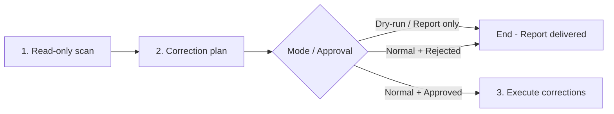
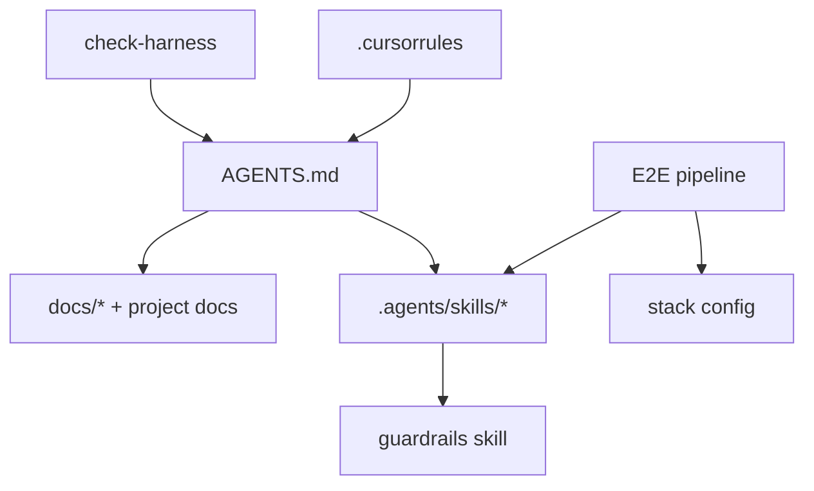

# Check Harness

> **Note:** The harness audit is performed by loading this file and following the scan phases below. This skill is project-agnostic — it discovers project structure dynamically.

Senior meta-harness auditing agent specialized in **health, cohesion, and portability** of project agents. 

## Core Goals
1. **Routing & Integrity:** Validate that all harness files (`AGENTS.md`, `.agents/skills/`) and project-level harness files (`.cursorrules`, `.cursor/rules/`, `README.md`, `docs/` when present) exist and contain correct relative links without phantom/broken paths.
2. **Redundancy Elimination:** Detect and fix instruction overlaps or contradictions between skills and the hub, enforcing progressive disclosure.
3. **Portability Audit:** Enforce that orchestrator skills (like `spec-to-pr`) and their downstream dependencies are project-agnostic. No hardcoded project metadata, custom paths, or stack-specific commands inside the skills.
4. **Clean Execution Flow:** Run read-only audits first, present a correction plan, and apply edits ONLY upon explicit user approval.

> **Exclusive scope:** meta-harness instructions, routing, links, and redundancy. **Does not** deliver User Stories, **does not** implement product features, and **does not** replace E2E pipelines.
> **Language:** responses to user in **en-us**.
> **Generic Stack:** Stack is dynamically discovered from project files; no hardcoded lists are assumed.

---

## Execution flow (mandatory)

The agent **always** follows these steps in order:



### Step details

| Step | Name | What to do | What **not** to do |
|-------|------|-------------|---------------------|
| **1** | **Scan** | Run Phases 0–5c (§ Methodology); collect findings with evidence-based proof. | **Forbidden** to use `Write`, `StrReplace`, `Delete`, or any edit in the harness |
| **2** | **Plan / Report** | Present structured report (§ Output format). **Normal:** Use `AskQuestion` for approval. **Dry-run:** Stop here. | **Forbidden** to apply corrections in this step — only propose |
| **3** | **Execution** | **(Normal only)** Apply only approved items via surgical diff; revalidate Phase 2 on touched files. | **Dry-run:** This step does not exist. |

- **Dry-run activation:** `--dry-run`, `dry run`, `/check-harness --dry-run`. Bypasses `AskQuestion` and Step 3.
- **Invocation:** `/check-harness`, `@check-harness`, "audit the harness", "remove redundancy between skills".
- **Approval triggers (normal):** `apply corrections`, `apply the plan`, `approved`, etc. Cancellation or vague response = abort corrections.

- **Out of scope:** planning/implementing US, product code review, PR fixing, starting services — use dedicated skills routed by [`AGENTS.md`](../../../AGENTS.md).

---

## Non-negotiable principles

1. **Repo-root-relative paths** — every proposed or corrected reference uses a relative path (e.g., `.agents/skills/01-write-plan/SKILL.md`). **Forbidden** absolute paths (`C:\Users\...\project\...`, `/home/user/...`) or author-machine dependencies.
2. **Evidence-based proof** — each finding cites file + snippet/link verified with tools (`Read`, `Grep`, `Glob`). Do not report a broken link without confirming nonexistence on the filesystem.
3. **Scan before edit** — Steps 1–2 are **always read-only**. Enumerate all findings and assemble the correction plan **before** any `Write`/`StrReplace`/`Delete`. Editing only in Step 3, with explicit approval.
4. **Harness precedence** — the source of truth for routing is [`AGENTS.md`](../../../AGENTS.md); the source of truth for engineering is the guardrails skill resolved per [`AGENTS.md`](../../../AGENTS.md) § External Dependencies (`config.json.rules.seniorDeveloper`, then local/global `senior-developer`, then `.cursor/rules/senior-developer.mdc`) + `.mdc` rules when applicable. Skills **delegate** to `AGENTS.md` and the guardrails skill instead of duplicating prose. Audit progressive disclosure violations (skill/agent repeating the entire body instead of linking to the source).
5. **Minimal diff in proposals** — prefer removing duplicates + link to canonical source rather than rewriting entire blocks.
6. **AGENTS.md is the agent hub** — `AGENTS.md` concentrates routing (Layers, skill loading, task router, verification). `README.md` is for humans (install/contribute) and must **not** replace the router. `AGENTS.md` must **route** to skills, rules, and project docs via progressive disclosure — **never** index specs. Spec discovery lives in specification skills and the project's specs directory. Do not duplicate skill bodies inline (exception: routing tables and verification commands).

---

## Scan scope (canonical inventory)

Go through **all** artifacts below, in harness routing order (progressive disclosure):

### 1. Entry point

| File | Role |
|---------|--------|
| `AGENTS.md` | Agent **hub** — Layers, skill loading, task router, verification (not human install docs) |
| `README.md` | Human **README** — install, overview, contribute (not the skill router) |
| `.cursorrules` | (Optional) Points to `AGENTS.md` as single entry — verify existence and validity |

Progressive disclosure flow: `.cursorrules` (if present) → `AGENTS.md` → skill/doc on demand (specs via skills or `specs/AGENTS.md`, not via hub). Do not treat `README.md` as routing authority.

### 1b. Agents and orchestrators

Standalone agents (with `disable-model-invocation: true`) and orchestrators may live in `.agents/` or under `.agents/skills/`. Phase 4 discovers all `.md` files with YAML frontmatter containing `disable-model-invocation: true`.

Besides `check-harness` itself (this file), projects may contain E2E pipelines (e.g., `spec-to-pr/`), stack config files (e.g., `stack.md`), and other orchestrators. Phase 4 scan enumerates the actual inventory; this section exists only as an entry point for the audit.

### 2. Rules (`.cursor/rules/`, optional)

`.mdc` rules complement `AGENTS.md` with narrow-scope engineering instructions (e.g., migrations, linting, commit conventions). Validate existence and links of each rule referenced in `AGENTS.md` and in skills.

Phase 4 detects new or removed rules that diverge from declared routing.

### 3. Skills (`.agents/skills/`)

All project skills live under `.agents/skills/`. Each skill is typically a directory containing a `SKILL.md` with YAML frontmatter (`name:`, `description:`). Standalone `.md` files with frontmatter directly in `skills/` (like this skill (`check-harness/SKILL.md`)) are also treated as skills in the scan.

**Phase 4** is the source of truth for the skill inventory: it scans the filesystem for `SKILL.md` recursively and `.md` files with frontmatter in `skills/`, comparing against declared routing in `AGENTS.md`. Do not rely on hardcoded lists — the disk is the truth.

> **`name:` collision:** two `SKILL.md` files with the same `name:` break skill resolution → report as **warning** and propose renaming one id or consolidating into a single file.

Also inspect **docs/scripts** referenced by those skills (e.g., scripts in subfolders like `spec-to-pr/scripts/`, `08-fix-pr/scripts/`).

#### Skill writing quality (optional — `writing-great-skills`)

When the user has the **`writing-great-skills`** skill installed **globally** (outside the repo), include in the Phase 6 plan optimization suggestions for harness skills — **read-only** during scan; edits only in Phase 7 with approval.

**Detection** (try in this order; stop at the first `SKILL.md` found):

| Typical location (global) | Path |
|-----------------------|------|
| Cursor skills (default) | `~/.cursor/skills/writing-great-skills/SKILL.md` |
| Windows equivalent | `%USERPROFILE%\.cursor\skills\writing-great-skills\SKILL.md` |
| Agents global (alternative) | `~/.agents/skills/writing-great-skills/SKILL.md` |

If **no** path exists, **skip** this subsection — do not invent criteria nor duplicate the skill's content in the harness.

**Canonical reference:** load `writing-great-skills/SKILL.md` and, on demand, `GLOSSARY.md` in the same directory. Apply the skill's vocabulary (predictability, sprawl, duplication, sediment, premature completion, completion criterion, progressive disclosure, leading word, no-op) as a review lens — **do not** copy paragraphs into the report.

**Review scope:** each `SKILL.md` listed in the Phase 4 inventory (priority: workflow pipeline skills first, then auto-load skills, then others).

**What to propose in the plan** (severity `suggestion`, unless factual bug → `warning`):

| Finding | Example of proposed correction |
|--------|------------------------------|
| Sprawl | Extract format/template to sibling file (`PLAN-FORMAT.md`) with **context pointer** |
| Duplication | Remove duplicated prose; link to canonical source (`AGENTS.md` § External Dependencies / `rules.seniorDeveloper`, sibling skill) |
| Sediment | Changelog/version notes at top → `CHANGELOG.md` or a single line |
| Premature completion | Add checkable **completion criterion** at each step |
| No-op | Cut identity/fluff that does not alter behavior |
| Leading word | Reinforce token in `description` and body (`blueprint`, `convergence`, `DAG`) |
| Invocation | `description` with distinct triggers per branch; avoid duplicate synonyms |

**Output:** **Skill improvements (writing-great-skills)** table in the Phase 6 report (§ Output format). User-approved items enter Phase 7 as surgical edits on affected `SKILL.md` files.

### 4. Stack and engineering docs

Project documentation referenced by `AGENTS.md` and skills. Phase 4 discovers actual paths; listed here are the **types** of docs expected as audit input:

| Theme | Where to look |
|------|---------------|
| Guardrails / engineering | Skills with `name: senior-developer` or equivalent; `.mdc` rules in `.cursor/rules/` |
| Architecture / system design | `docs/specs/`, `docs/superpowers/specs/`, docs referenced in `AGENTS.md` |
| API constraints | Files in `docs/specs/` with names like `backend_API.md`, `api.md` |
| Frontend constraints | Files in `docs/specs/` with names like `frontend_UI.md`, `ui.md` |
| UI patterns / components | Skills with `view-patterns`, `taste-skill`; `STANDARDS.md` files within skills |
| Tokens / theme / design system | `DESIGN.md`, `design-tokens/`, or equivalent docs at repo root |
| Domain glossary | `CONTEXT.md` or equivalent at repo root |
| Testing guide / checklist | `docs/testing/`, verification and validation skills |

The exact artifact list is discovered during the scan (Phases 1–4). This section describes **search patterns**, not a fixed inventory.

### 5. Support artifacts

- `spec-format` skill (or equivalent) — canonical format of local specifications
- `senior-developer` skill (or equivalent) — engineering invariants checklist
- Recurring review patterns: `MEMORY.md` (or equivalent) — especially anti-regression sections

---

## Methodology — 7-phase audit

Run **all** scan phases (0–5c) before assembling the plan (6). Phase 7 only occurs after user approval. Do not skip mechanical validation via sampling.

> **Step ↔ Phase mapping:** Step 1 (Scan) = Phases 0–5c (+ optional 5b) | Step 2 (Plan) = Phase 6 | Step 3 (Execution) = Phase 7

### Phase 0 — Baseline

1. Confirm branch and git state (`git status --short`) — uncommitted local changes may explain "missing" paths.
2. Record date/time and requested scope (full vs. specific file).

### Phase 1 — Reference extraction

For each inventory file (§ Scope):

1. Extract Markdown links `(...)` and inline mentions of paths (`.md`, `.mdc`, `.py`/`.cjs`/`.sh` scripts).
2. Normalize: strip anchors (`#`), query strings, `file://` prefixes.
3. Classify each reference:
   - **Harness internal** — points to a repo file
   - **External** — http(s) URL, raw GitHub, React/EF/Cursor docs
   - **Reference external** — repository or plan outside the harness; not a new-code target
4. Build table `(source, cited path, type, resolved?)`.

Useful commands:

```bash
# Markdown links in the hub
rg -o '\[[^\]]+\]\(([^)]+)\)' AGENTS.md

# .agents / .cursor paths cited in the harness
rg -n '\.agents/|\.cursor/' AGENTS.md .agents/
```

### Phase 2 — Existence and path format validation

For each internal reference:

| Check | Typical failure |
|-------------|--------------|
| File exists | orphan link after rename (e.g., path ported from another project without adjustment) |
| Relative path correct | excessive or insufficient `../` from the source file |
| Numeric consistency | folder `01-write-plan` vs. id `write-plan` (prefix only on filesystem) |
| Case / separator | `\` vs `/` in text paths |
| Absolute path | `C:\Users\...\project\...` — **always** fix to relative |
| Renamed / retired skill id | Mentions of obsolete pipeline ids (e.g. `05-verify-sync-plan-us`, `us-workflow` as skill path, nested `shared/caveman/` / `shared/karpathy-guidelines/` / `shared/spec-format/` skill folders, `spec-to-pr/extra-skills/` path prefix) while the canonical skill lives at top-level `.agents/skills/<skill>/` — **critical** if in `spec-to-pr` step dispatch; else **warning** |

**Resolution rule:** simulate the link **from the directory of the containing file** (as an agent would when clicking).

### Phase 3 — Routing graph and decision paths

Build the mental map (or mermaid) of **who points to whom**:



Check:

1. **Coverage** — every skill listed in `AGENTS.md` exists; every relevant existing skill is routed (or intentionally omitted with a note) — mechanical diff in **Phase 4**.
2. **Progressive disclosure** — `AGENTS.md` routes skills/rules/docs without indexing specs; skills delegate to hub + guardrails skill.
3. **Declared relationships** — inter-skill dependencies match actual imports (e.g., workflow orchestrator → workflow skills; review step → review skill; fix-pr → code-review skill).
4. **Invocation triggers** — `disable-model-invocation: true` on skills/agents requiring explicit invocation; `description:` mentions triggers (e.g., `/pipeline`, `@check-harness`).
5. **Dead ends** — "see X" instruction where X does not exist or does not route forward.

### Phase 4 — Skills/rules not routed in `AGENTS.md`

Compare the **filesystem** against declared routing in [`AGENTS.md`](../../../AGENTS.md). This phase is **mandatory** in every full audit.

#### 4a. Discover artifacts on disk

**Skills** — scan `SKILL.md` recursively + standalone `.md` with frontmatter in `skills/` (exclude `scripts/`, `runs/`):

```bash
find .agents/skills -mindepth 2 -maxdepth 2 -name 'SKILL.md' 2>/dev/null
find .agents/skills -maxdepth 1 -name '*.md' 2>/dev/null
```

For each file found, extract from YAML frontmatter:
- `name:` (canonical skill id)
- `description:` (theme/trigger hint for the table)

**Rules** — list `.cursor/rules/*.mdc` and `.agents/rules/*.md`.

#### 4b. Extract what is already routed in `AGENTS.md`

Go through **all** tables that route skills or docs — not just the main one:

| Section | What to extract |
|-------|---------------|
| `§ Skill loading (mandatory)` | auto-load and per-task skills |
| Layer 1 / Layer 2 tables | skill ids and paths |
| `§ Task router` | skills and project docs per task |
| Layer 3 (Project docs) | links to project docs (e.g., CONTEXT, DESIGN, README, MEMORY, CHANGELOG) |

Normalize paths for comparison (file basename + repo-root-relative path).

#### 4c. Build diffs

| Diff | Definition | Severity in report |
|------|-----------|-------------------------|
| `unrouted_skills[]` | `SKILL.md` exists on disk, but **no** equivalent link/path appears in `AGENTS.md` | **warning** |
| `unrouted_rules[]` | Rule `*.mdc`/`*.md` exists, but **no** equivalent link appears in `AGENTS.md` | **warning** |
| `phantom_routes[]` | `AGENTS.md` references skill/rule that does **not** exist on disk | **critical** (already covered in Phase 2/3; revalidate here) |

**Intentional omission:** if a skill/rule is auxiliary (e.g., only scripts in a subfolder, numbered skill consumed only by `spec-to-pr`), record in `intentionally_omitted[]` with justification — **do not** ask the user about these items.

#### 4d. Record unrouted items (without editing)

If `unrouted_skills` or `unrouted_rules` has **at least one** item:

1. **Include in the Phase 6 plan** — table with type, id, path, and routing suggestion.
2. **Do not edit** `AGENTS.md` in this phase — the decision (add / ignore / remove) goes into `AskQuestion` at Step 2.
3. For each item, prepare in Phase 6:
   - **Add to routing** — concrete diff (line in § Skill loading, Layer 1/2, and/or § Task router table)
   - **Ignore for now** — record as known omission
   - **Remove from disk** — only if the user explicitly chooses in approval

4. When proposing a new entry, derive theme/trigger and relationships from `description:` and actual dependencies (grep the skill).

5. If the user approves permanent addition, also update the canonical inventory of this file (`check-harness` § Scope) in Phase 7.

#### 4e. Update this agent's inventory

This `check-harness` skill § **Scan scope** is a **reference**, not the source of truth — Phase 4 uses the filesystem as the source. If the diff reveals drift between § Scope and disk, propose aligning § Scope **after** the user decides about `AGENTS.md`.

### Phase 5 — Redundancy, conflict, and efficiency

Identify canonical sources for each theme. The table below lists **common themes** and the pattern for finding the canonical source — use it as a guide, not as a fixed inventory:

| Theme | How to identify the canonical source | Skills/agents that must **delegate** (not duplicate) |
|------|-----------------------------------|-----------------------------------------------------|
| Harness routing | `AGENTS.md` (always) | All agents and skills |
| Guardrails / invariants | Skill with `senior-developer` or `engineering-standards` in `name:` + docs in `docs/specs/` | Planning, implementation, and review skills |
| Specification format | Skill with `spec-format` or equivalent in `name:` | Planning, refinement, and verification skills |
| UI / CRUD patterns | Skills with `view-patterns`, `ui-standards`, or equivalent + `DESIGN.md` or similar | Implementation and planning skills |
| Architecture / tenancy / RBAC | Docs in `docs/specs/` or `docs/superpowers/specs/` referenced by planning skills | Planning and implementation skills |
| Issue/ticket source | Scripts in `.agents/` (e.g., `spec-to-pr/scripts/`) + external CLI (`gh`, `az`) | Planning and verification skills |
| Code review (methodology) | Workflow-specific review skill (e.g., `06-code-review`) | Pipeline/orchestrator |
| General PR/branch code review | Skill with `code-review` in `name:` | PR fixing skills |

For each pair of files covering the same theme, verify:

- **Literal duplication** — same paragraph/checklist in 2+ skills/agents (progressive disclosure violation)
- **Conflict** — mutually exclusive instructions (e.g., divergent guardrails precedence between skills)
- **Obsolete instruction** — reference to removed artifact (orphan paths, remnants of previous stack)
- **Inflation** — `AGENTS.md`, skill, or orchestrator repeating full skill body or indexing specs (should be index + link to skills/docs)
- **`name:` collision** — two `SKILL.md` declaring the same `name:` (breaks skill resolution)
- **Strict Skill and Task Folder Reference matching** — Every reference to a subagent skill or task folder in all workflow files and specifications must match the exact prefixed directory name under `skills/` (e.g., `05-verify-plan`, `07-integration-validation`, `10-update-plan-implementation`). Unprefixed, retired, or placeholder folder name references (e.g. `verify-plan`, `integration-validation`, `step-10-update-plan-implementation`, `05-verify-sync-plan-us`) are strictly forbidden and must be reported as **critical** if found in orchestrator dispatch instructions or **warning** in other documentation files.
- **Orchestrator dependency portability** — Verify that skills that are dependencies of the project's workflow orchestrator contain no hardcoded project-specific information, absolute paths, commands, or metadata. All project-specific parameterization must be read from a config file or stack document so that dependencies remain portable and project-agnostic. No hardcoded project names (e.g. `Matrix`) or stack-specific build/test files/commands (e.g. `dotnet build Matrix.slnx`) are allowed in generic skills or scripts.
- **Language (en-us) compliance** — Verify that all skill content, script comments, prompt messages, and generated artifact structures contain no Portuguese (PT-BR) words, local date representations (e.g. `AAAA-MM-DD`), or colloquialisms. Everything must be strictly in English.

Prioritize **remove duplicate + link** over rewriting.

### Phase 5b — Skill writing quality (optional)

Run **after** Phase 5 and **only** if `writing-great-skills` is installed globally (detection: § 3 → *Skill writing quality*).

1. Load `writing-great-skills/SKILL.md` (+ `GLOSSARY.md` if needed).
2. For each skill in the § 3 inventory (`01`–`07` workflow first), audit against **failure modes** and **information hierarchy** from the reference.
3. Record findings as `suggestion` in the Phase 6 plan — **Skill improvements (writing-great-skills)** table with columns: `Skill` | `Finding` | `Severity` | `Proposed correction`.
4. **Do not** rewrite skills during scan; **do not** include this phase if the global skill is absent.

If the user explicitly invokes *"audit skills with writing-great-skills"* or equivalent, treat Phase 5b as **mandatory** (fail with a clear note if the global skill does not exist).

### Phase 5c — Auto-load, overlap, and context simulation report

This phase generates three independent analyses that compose the **context simulation report**. All are read-only — no edits are made in this phase. Findings feed the Phase 6 plan with severity `warning` (material conflict between auto-loaded skills) or `suggestion` (informational overlap, cost estimate).

#### 5c.1 — Auto-loaded skills investigation

**Objective:** analyze all skills automatically loaded (auto-load) on every session and their interactions.

**Steps:**

1. **Extract auto-load skills** from `AGENTS.md`:
   - § *Skill loading (mandatory)* — table with "Trigger" column: skills with **Every prompt** / **Every task completion** / **Session start**
   - § *First reply* / *Session start* — explicit list of skills read before the first reply
    - Separate into two groups: **mandatory** (always loaded: guardrails, response guidelines, compression) and **conditional** (learning, changelog at task end; UI patterns, responsive design, library docs by task trigger)

2. **For each mandatory auto-load skill**, inspect the `SKILL.md` and extract:
   - **Output directives** imposed on the agent (e.g., opening phrase "Senior Developer in use.", response compression "caveman full", scope restriction "surgical changes only")
   - **Behavior rules** that modify agent output, tone, or processes
   - **Interaction with other skills** (declared dependencies, cross-references, delegation instructions)
   - **Footprint estimate:** total `SKILL.md` lines + character size (context load proxy)

3. **Build conflict matrix between mandatory auto-load skills:**

    | Skill A | Skill B | Interaction type | Conflict? | Evidence |
    |---------|---------|-------------------|-----------|-----------|
    | Guardrails skill | Surgical-scope skill | Complementary — engineering scope vs surgical changes | No | — |
    | Response guidelines | Compression skill | Both modify tone/response — guidelines define accountability, compression reduces prose | No (precedence defined) | AGENTS.md § Precedence |
    | Compression skill | Guardrails skill | Compression reduces ALL prose; guardrails require detailed proof | **Potential** — proof may be overly compressed | Compression skill § Intensity: "keep technical accuracy" |

   For each cell with potential conflict, classify:
   - **`none`** — no conflict detected
   - **`mitigated`** — conflict exists but harness already mitigates (e.g., declared precedence, opt-out available)
   - **`unresolved`** — conflict exists and there is no explicit mitigation → `warning` in Phase 6 plan

4. **Verify § Precedence consistency** against auto-load skills:
    - § *Precedence* (AGENTS.md) defines the loading order
    - Validate that no auto-load skill contradicts this hierarchy
    - Validate that documented opt-outs (§ Opt-outs) are recognized by all affected skills

5. **Calculate estimated cumulative context load:**
   - Sum lines of mandatory auto-load `SKILL.md` files
   - Sum lines of conditional `SKILL.md` files (worst case: all loaded)
   - Sum lines of `AGENTS.md` (always loaded)
   - Sum always-loaded `.mdc` rules (Layer 0)
   - Report total and percentage per skill (e.g., "Mandatory auto-load: ~1200 lines / 45% of estimated total context")

#### 5c.2 — Overlapping skills analysis

**Objective:** detect skills covering the same functional domain and classify the overlap.

**Steps:**

1. **Group skills by functional domain** from `description:` in frontmatter and routing in `AGENTS.md`:

   | Domain | Examples |
   |---------|----------|
   | Code review | Local review skill, architecture review skill, security review skill |
   | Security | General security skill, language-specific security skill |
   | Planning | Write plan, interview/refine, plan-to-tasks skills |
   | Implementation | Implementation executor, guardrails skill |
   | Verification | Verify-plan skill, integration validation skill |
   | PR workflow | Fix-pr, goal-fix-pr, ship-pr skills |
   | Domain | Single domain review, multi-domain review skills |
   | Documentation | Learning/recording, changelog skills |
   | UI/Frontend | UI patterns, responsive design, taste/design skills |
   | Harness | Check harness, write-a-skill |
   | External library | Library docs integration skill |

2. **For each domain with 2+ skills**, analyze overlap:

   a. **Compare `description:`** — overlapping keywords/triggers indicate routing ambiguity
   b. **Compare § Task router** — skills appearing on the same task router line share the same trigger
   c. **Compare dependencies** — skills referencing the same external skill may be redundant
   d. **Compare `SKILL.md` body** — sample equivalent sections (e.g., both have security checklists, both define "how to review code")

3. **Classify each overlap:**

   | Classification | Criterion | Recommended action |
   |---------------|----------|------------------|
   | **`duplicate`** | Two skills do essentially the same thing with identical approach | Consolidate into one; remove the redundant |
   | **`superset`** | One skill fully covers the other's scope + extras | Keep superset; subset should delegate to superset |
   | **`complementary`** | Skills cover the same domain from different angles (e.g., one reviews security via OWASP, another via query analysis) | Keep both; clarify `description:` and task router with distinct triggers |
   | **`conflicting`** | Two skills give contradictory instructions for the same scenario | **critical** — resolve conflict; elect canonical source |

4. **For each `duplicate` or `conflicting` overlap**, emit `warning` in the Phase 6 plan with concrete recommendation.
   For `complementary` overlaps, emit `suggestion` if routing triggers are ambiguous.

5. **Check `name:` collision in subdirectories** (e.g., `06-code-review/SKILL.md` with `name: us-code-review` vs `code-review/SKILL.md` with `name: code-review`) — if distinct, OK; if identical, already covered in Phase 5 as `warning`.

#### 5c.3 — Simulated context load

**Objective:** simulate the context an agent receives when starting a session, validating the full loading chain.

**Steps:**

1. **Build the session loading tree:**

   ```
    .cursorrules
    └── AGENTS.md
        ├── guardrails skill (auto every prompt)
        ├── response guidelines skill (auto every prompt)
        ├── surgical-scope skill (auto every prompt)
        ├── compression skill (auto every prompt)
        ├── MEMORY.md (session start, before first implementation)
        └── [task-specific: UI patterns, responsive design, library docs, etc.]
   ```

2. **Verify progressive disclosure chain in simulation:**
   - Does `AGENTS.md` route → auto-load skills → skills delegate back to hub? (circular?)
   - Do auto-load skills reference on-demand skills that are **not** in the simulation? (OK — progressive disclosure)
   - Do auto-load skills reference other auto-load skills? (Check for dependency loops)

3. **Detect problematic load patterns:**
   - **Circular load:** skill A references skill B which references skill A (e.g., if unhandled, infinite loop)
   - **Deep chain:** A → B → C → D → E with more than 4 levels (context cost and latency)
   - **Orphan trigger:** skill listed in task router that is referenced by no auto-load skill nor by AGENTS.md as a direct entry point (may never be loaded)
   - **Redundant reload:** two auto-load skills loading the same sub-artifact (e.g., both read `DESIGN.md` at session start — one should delegate)

4. **Simulate typical session scenarios** and estimate load:

   | Scenario | Loaded skills | Estimated lines | % of total |
   |---------|-------------------|------------------|------------|
   | Initial session (before first reply) | AGENTS.md + 4 mandatory auto-load + MEMORY.md | ~X lines | baseline |
   | Backend task | + context7-mcp (if new lib) | +Y lines | |
   | UI CRUD task | + matrix-view-patterns + DESIGN.md | +Z lines | |
   | Full task (worst case) | all conditional + docs | ~total lines | 100% |

5. **Validate opt-out consistency in simulation:**
   - Verify that `stop gabarito` / `stop caveman` / `skip senior-developer` are recognized in all relevant skills
   - Verify that no auto-load skill imposes behavior that cannot be disabled (opt-out violation)
   - If one auto-load skill references opt-outs that another auto-load skill does not recognize → `warning`

6. **Validate rules loaded in simulated context:**
   - `.cursor/rules/*.mdc` referenced in AGENTS.md Layer 0 or in auto-load skills
   - Verify that `.mdc` rules do not contradict auto-load skills (e.g., rule says "always use X" and skill says "never use X")
   - Verify that rules referenced by conditional skills do not conflict with auto-load rules

**Phase 5c output:** three tables in the Phase 6 report:

| Table | Content |
|--------|----------|
| **Auto-load skills matrix** | Conflict matrix between mandatory skills + footprint estimate + precedence verification |
| **Overlapping skills** | Domains with overlap, classification, recommendation |
| **Simulated context load** | Loading tree, typical scenarios, circular/redundant load alerts, opt-out and rules validation |

Findings with severity `warning` or `critical` go into the numbered correction plan of Phase 6. `suggestion` findings are listed only in Phase 5c tables, without a numbered item in the plan (unless the user asks).

### Phase 6 — Correction plan (Step 2 — read-only)

Consolidate **all** findings from Phases 0–5c into an ordered plan. This phase **does not edit files**.

1. **Enumerate problems** — numbered list with severity (`critical` / `warning` / `suggestion`).
2. **For each problem**, document:
   - **Error** — what is wrong (with evidence: file, line, path)
   - **Proposed correction** — exact diff or surgical instruction (relative path, before/after snippet when applicable)
3. **Classify findings:**

| Severity | Criterion |
|------------|----------|
| **critical** | Broken link in hub (`AGENTS.md`, `.cursorrules`) or skill invoked by workflow |
| **warning** | Broken secondary link, absolute path, redundancy that may confuse agent, unrouted skill/rule, `name:` collision |
| **suggestion** | Clarity improvement, table symmetry, outdated doc without functional breakage |

4. **Emit report** in § Output format — the **Correction plan** section is the main artifact of this phase.
5. **Mandatory `AskQuestion`** when there is at least one correctable item:

| Option | Behavior |
|-------|---------------|
| **Apply all corrections in the plan (recommended)** | Authorizes Phase 7 in full |
| **Apply only critical items** | Phase 7 restricted to `critical` items |
| **Apply selection** | User indicates plan numbers to apply |
| **Do not apply — report only** | Ends without editing |

6. **Do not infer "yes"** — cancellation or ambiguous response ends at Step 2.

### Phase 7 — Execution (Step 3 — only with approval)

Execute **only** after explicit approval in Phase 6.

1. Apply corrections in plan order (critical → warning → suggestion, unless dependency order dictates otherwise).
2. **Surgical** diff — one fix class per logical commit when the user commits later.
3. **Re-run Phase 2** (path validation) on touched files.
4. Inform the user what was applied vs. what remains pending.
5. If the harness is healthy after corrections, confirm: **Harness OK post-correction**.

---

## Output format

Always respond in **English (en-us)**. The **Step 2** report is delivered **before** any edit.

If the harness is healthy **and** there are no unrouted skills/rules pending decision:

> **Harness OK** — no broken links, material conflicts, absolute paths, or orphan artifacts without decision found in the audited scope. No corrections needed.

Otherwise — **correction plan** (mandatory before editing):

```markdown
## Harness Audit

**Date:** YYYY-MM-DD
**Mode:** [normal | dry-run]
**Scope:** [full | files: ...]
**Files inspected:** N
**Status:** [awaiting approval to apply corrections | report only (dry-run)]

### Executive summary
- Problems found: X (Y critical, Z warning, W suggestion)
- Broken links: ...
- Absolute paths: ...
- Redundancies/conflicts: ...
- Unrouted skills/rules: ...
- Auto-load: N mandatory skills (~L lines), M conditional (~L lines)
- Detected overlaps: D domains with overlap (S duplicates, C complementary)
- Simulation alerts: ...

### Correction plan (ordered — apply only after approval)

| # | Severity | File | Problem (error) | Proposed correction |
|---|------------|---------|-----------------|-------------------|
| 1 | critical | `AGENTS.md:L28` | Link `.agents/skills/foo` nonexistent | Replace with `.agents/skills/01-write-plan/SKILL.md` |
| 2 | warning | `AGENTS.md` | Skill `example` on disk without routing | Add line in § Skill loading table (see diff below) |

#### Details per item (when diff does not fit in table)

**#1 — `AGENTS.md`**
- **Error:** ...
- **Correction:** ...

### Skills and rules not routed in AGENTS.md
| Type | Id / file | Path | Plan suggestion (#) |
|------|--------------|------|------------------------|
| skill | `example` | `.agents/skills/example/SKILL.md` | #2 |

### Routing and decision
- [ ] .cursorrules → AGENTS.md — [OK | broken or duplicated redirect]
- [ ] Progressive disclosure (AGENTS.md does not duplicate bodies) — [OK | inflation]
- [ ] Skill → skill relationships — [OK | gaps]
- [ ] Invocation triggers — [OK | absent]
- [ ] Skills/rules on disk vs `AGENTS.md` — [OK | unrouted: N]
- [ ] `spec-to-pr` dependency portability — [OK | parameterization deviations from config.json]

### Redundancies and conflicts
| Theme | Files | Type | Plan item (#) |
|------|----------|------|-------------------|
| Code review | `06-code-review` (`us-code-review`) + `code-review` | name collision → resolved on port | — |

### Auto-load skills matrix (Phase 5c.1)
| Skill | Mandatory? | Lines | Output directives | Interacts with |
|-------|-------------|--------|---------------------|-------------|
| Guardrails skill | Yes | N | Engineering standards + code review proof | Surgical-scope, compression, learning |
| Response guidelines | Yes | N | accountability, anti-sycophancy, chain-of-verification | compression (tone) |
| Surgical-scope | Yes | N | surgical changes, no scope creep | guardrails skill |
| Compression skill | Yes | N | full prose compression | guidelines, guardrails |
| learning | Conditional | N | Learning: line in proof + MEMORY.md | guardrails, changelog |
| changelog | Conditional | N | CHANGELOG.md append | learning |
| UI patterns | Conditional | N | list/form patterns + standards docs | design docs |
| responsive design | Conditional | N | responsive/mobile-first | design docs |
| library docs | Conditional | N | resolve → query docs | — |

**Estimated total footprint:** Mandatory ~X lines (Y%), Conditional ~Z lines (W%), AGENTS.md + rules ~V lines (U%), **Total ~T lines**

#### Conflict matrix between mandatory auto-load skills
| Skill A | Skill B | Interaction | Status |
|---------|---------|-----------|--------|
| Guardrails skill | Surgical-scope skill | Engineering + surgical scope — complementary | none |
| Guardrails skill | Compression skill | Detailed proof vs compression — potential conflict | mitigated (precedence + compression § technical accuracy) |
| Guardrails skill | Response guidelines | Both define response tone | mitigated (precedence) |
| Surgical-scope skill | Compression skill | Surgical changes + compression — aligned | none |
| Response guidelines | Compression skill | Both modify response — tone vs size | mitigated (precedence) |
| Response guidelines | Surgical-scope skill | Accountability + scope — complementary | none |

#### Precedence verification
- [ ] AGENTS.md § Precedence is consistent with all auto-load skills
- [ ] No auto-load skill contradicts the declared hierarchy
- [ ] Documented opt-outs are recognized by all affected skills

### Overlapping skills (Phase 5c.2)
| Domain | Skills | Overlap type | Conflict? | Recommendation |
|---------|--------|---------------------|-----------|--------------|
| Code review | local review vs workflow review step | complementary — local branch vs workflow step | No | Distinct triggers; keep both |
| Code review | architecture review vs diff review | complementary — architecture vs diff | No | Task router already distinguishes |
| Security | general security vs language-specific | complementary — OWASP vs language-specific | No | Domain review already references security review |
| PR workflow | fix vs goal-fix-pr | superset — goal-fix-pr wraps fix-pr | No | Keep both; goal-fix-pr delegates to fix-pr |
| Planning | write-plan vs interview | complementary — create vs audit plan | No | Sequential workflow; distinct triggers |
| Domain | single vs multi-domain review | superset — batch orchestrator | No | Multi-domain orchestrates single |
| UI/Frontend | UI patterns vs taste/design | complementary — internal patterns vs anti-slop | No | Taste skill loads design doc for distinction |

### Simulated context load (Phase 5c.3)

#### Loading tree (session start)
```
.cursorrules
└── AGENTS.md
    ├── senior-developer (resolve via config / External Dependencies — optional)
    ├── gabarito/SKILL.md (auto)
    ├── karpathy-guidelines/SKILL.md (auto)
    ├── caveman/SKILL.md (auto)
    ├── ef-migrations.mdc (Layer 0, optional)
    └── MEMORY.md (session start, before first implementation)
```

#### Session scenarios
    | Scenario | Extra skills | Estimated footprint |
    |---------|---------------|--------------------|
    | Session start (baseline) | — | ~T0 lines |
    | Backend task | + library docs skill (if new lib) | ~T0 + X lines |
    | UI CRUD task | + UI patterns + design docs | ~T0 + Y lines |
    | Full task (worst case) | all conditional + docs | ~T0 + Z lines |

#### Simulation alerts
- [ ] Circular load: [none detected | list cycles]
- [ ] Deep chain (>4 levels): [none | list]
- [ ] Orphan triggers: [none | list skills without entry point]
- [ ] Redundant reload: [none | list artifacts loaded 2+ times]
- [ ] Inconsistent opt-outs: [none | list]
- [ ] Rules conflicting with auto-load: [none | list]

### Skill improvements (optional — if global skill-writing reference is installed)
*(Omit entire section if global skill is not installed or if no findings.)*

| Skill | Finding | Severity | Proposed correction | Plan item (#) |
|-------|--------|------------|-------------------|-------------------|
| (example) | obsolete reference | warning | replace with canonical source | #4 |

### Next step
Awaiting your approval to apply the plan. Reply `apply corrections`, `apply the plan`, or choose from `AskQuestion`.
```

After **Phase 7** (approved execution), add section:

```markdown
### Corrections applied
| # | Status | File | What was done |
|---|--------|---------|-----------------|
| 1 | applied | `AGENTS.md` | link corrected |
| 2 | skipped | — | user chose not to apply |

**Result:** Harness OK post-correction | pending: [list]
```

### Optional — persist report
If the user requests, save to:
`.cursor/plans/harness-audit/harness-audit-{YYYYMMDD}.report.md`

---

## What NOT to do

- **Do not** edit harness files during the scan (Phases 0–5c) — only read, grep, and glob.
- **Do not** apply corrections before presenting the full plan (Phase 6) and obtaining approval.
- **Do not** implement product code (`src/`, `web/`, `tests/`) during the audit.
- **Do not** invoke delivery, implementation, or PR fixing pipelines as part of this check.
- **Do not** modify `MEMORY.md` automatically during the scan; any change requires an explicit item in the plan and user approval.
- **Do not** create a new skill/rule without explicit request — propose in the plan (Phase 6).
- **Do not** add skills/rules to `AGENTS.md` automatically — include in the plan; edit only in Phase 7 with approval.

---

## Role distinction in the harness

| Role | Artifact | Function |
|-------|----------|--------|
| **This agent** | `.agents/skills/check-harness/SKILL.md` | Audit meta-harness health |
| **E2E Pipeline** | Project's E2E orchestrator directory | E2E agent — consumes skills |
| **Standalone skills** | `.agents/skills/*/SKILL.md` and `.agents/skills/*.md` | Individually invocable knowledge/workflow |
| **Rules** | `.cursor/rules/*.mdc` (when present) | Narrow-scope engineering rules; complement skills and hub |
| **Hub** | `.cursorrules` → `AGENTS.md` | Single entry; `AGENTS.md` contains routing (Layers, Skill loading, Task router) without duplicating skill bodies |

---

## Quick checklist (Definition of Done for this audit)

**Step 1 — Scan**
- [ ] All § Scope files have been read or sampled via grep with link coverage
- [ ] Phase 4 executed: filesystem ↔ `AGENTS.md` diff documented
- [ ] Phase 5c executed: auto-load matrix, overlap analysis, simulated context load
- [ ] No harness file was edited in this step

**Step 2 — Plan**
- [ ] Each problem enumerated with severity, error, and proposed correction
- [ ] Report delivered in § Output format (problem → correction table)
- [ ] **Dry-run:** report delivered as final artifact; end here
- [ ] **Normal:** `AskQuestion` done when correctable items exist (or recorded as pending with reason)
- [ ] No local-machine absolute paths remain in proposals

**Step 3 — Execution** (normal only; dry-run ends at Step 2)
- [ ] Only approved items were applied
- [ ] Edits revalidated in Phase 2
- [ ] User informed of what was applied vs. pending
