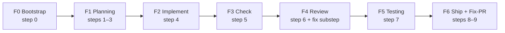
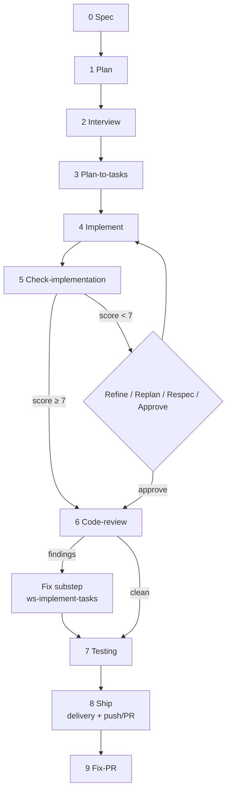
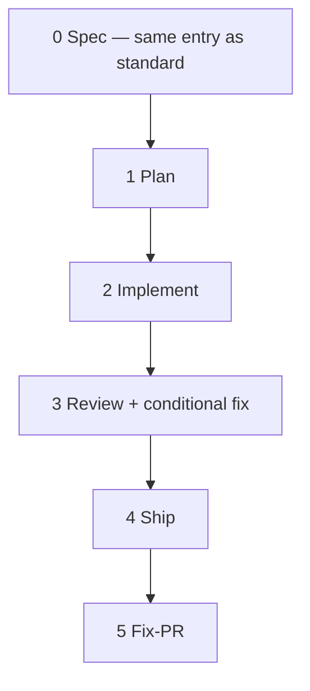
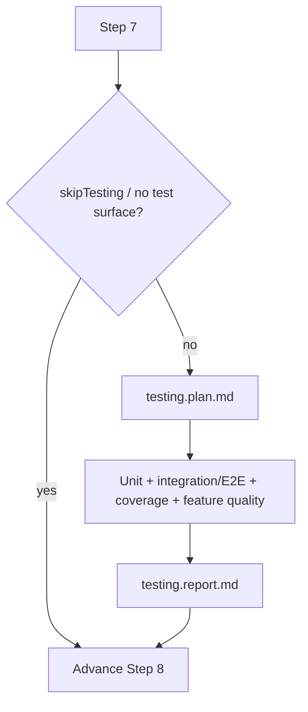
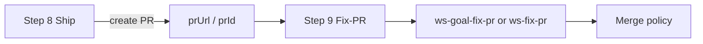

# Spec-to-PR — Diagrams (FSM 0–9)

> **Architecture:** Steps 0–9. Pipeline skills live under `.agents/skills/00`–`09` (+ unprefixed `goal-fix-pr`, `update-plan-implementation`). Dual-mode with [`spec-to-pr-lite`](../spec-to-pr-lite/SKILL.md) (lite steps 0–5). Canonical artifacts: [`ARTIFACTS.md`](ARTIFACTS.md). Gates/config: [`gates.md`](../shared/gates.md), [`config-resolution.md`](../shared/config-resolution.md). Agent contract: [`SKILL.md`](SKILL.md).

---

## 0. Phases (standard)

Lite: F0=0 · F1=1 · F2=2 · F3=3 · F4=4 · F5=5 (no Testing / interview / DAG / check).

---

## 1. Standard pipeline (steps 0–9)

---

## 2. Lite pipeline (steps 0–5)

---

## 3. Skill folder map (filesystem)

| Step (standard) | Skill `name:` | Folder |
|-----------------|---------------|--------|
| 0 | `ws-write-spec` | `00-write-spec` |
| 1 | `ws-write-plan` | `01-write-plan` |
| 2 | `ws-interview` | `02-interview` |
| 3 | `ws-plan-to-tasks` | `03-plan-to-tasks` |
| 4 / 6-fix | `ws-implement-tasks` | `04-implement-tasks` |
| 5 | `ws-verify-plan` | `05-verify-plan` |
| 6 | `ws-code-review` | `06-code-review` |
| 7 | `ws-testing` | `07-testing` |
| 8 | `ws-ship-pr` | `08-ship-pr` |
| 9 | `ws-fix-pr` / `ws-goal-fix-pr` | `09-fix-pr` / `goal-fix-pr` |
| Post | `ws-update-plan-implementation` | `update-plan-implementation` |

---

## 4. Dispatch cycle (per step)

Universal controls ([`gates.md`](../shared/gates.md)): **Next**, **Previous**, **Replay**, **Refine→Replay**, **Commit**, **Undo**.

---

## 5. Step 7 — Testing

Artifacts: `step-07-{slug}.testing.plan.md`, `step-07-{slug}.testing.report.md`.

---

## 6. Ship + Fix-PR split

`ws-ship-pr` with `stopBeforeFixPr: true` in orch mode — no goal-fix loop inside ship.

---

## Legend

| Symbol | Meaning |
|--------|---------|
| Dispatch | Subagent via `dispatch-agent` (host-provided) |
| Inline | Same session (lite) |
| Gate | user-gate / markdown fallback |

## Triggers

`/spec-to-pr` · `@[spec-to-pr]`.
