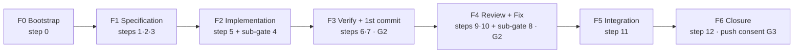
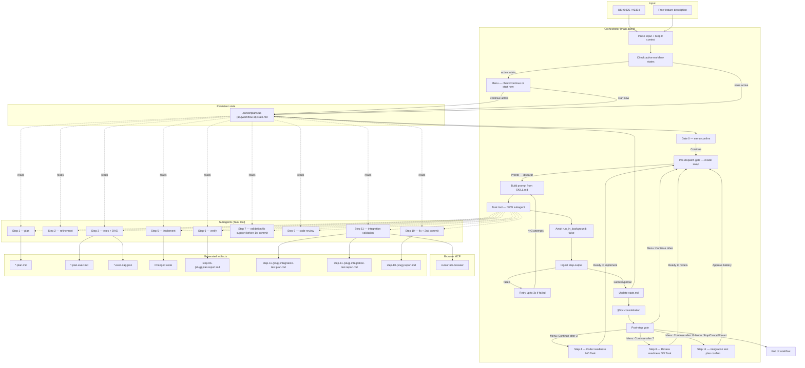
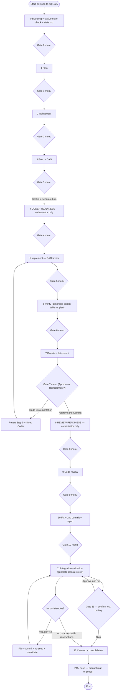
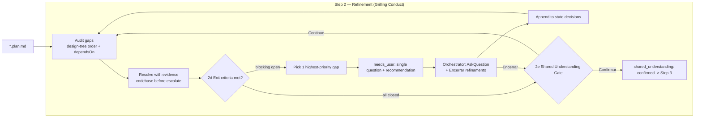
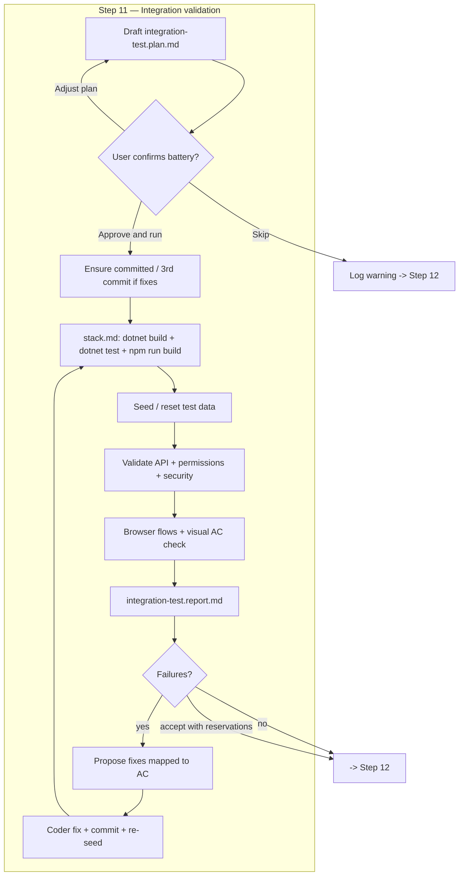
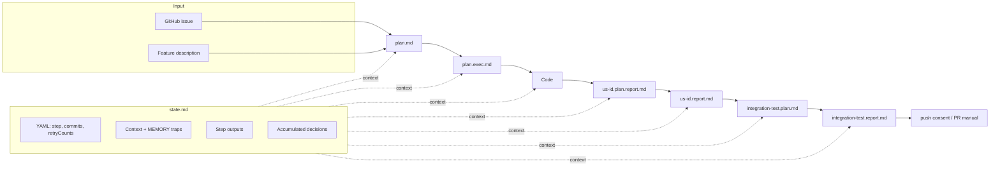
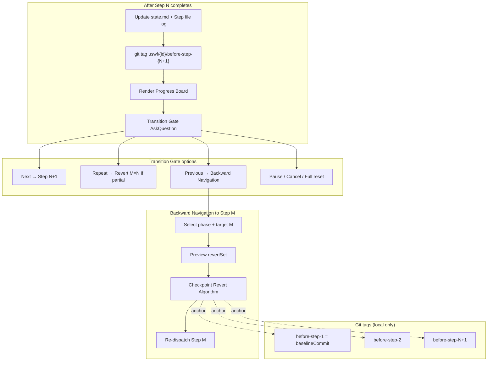

# Spec-to-PR v9.1 — Diagrams

> **Architecture note (v9.1):** Steps 0–11 delegate functional content to dedicated standalone skills. `state.md` is per-workflow memory; `MEMORY.md` is shared/generalizable memory. Step 13 is optional via `--full` (Ship & PR). Stack-agnostic — project metadata from `.agents/skills/shared/config.json`. Canonical artifact paths: [`ARTIFACTS.md`](ARTIFACTS.md).

Visual docs for the [`SKILL.md`](SKILL.md) agent. Human guide: [`README.md`](README.md). Resume rules: [`setup.md`](../shared/setup.md) (canonical).

> **v8.1:** 7 phases (F0–F6); **Authorization Ladder** + hard stops HS-1..5; **Refinement FSM**; **Worktree Fallback**; **State Hygiene**; steps 4/8 → model sub-gates; `state.md` as workflow memory + `MEMORY.md` as shared memory; fresh subagent per step + checkpoint tags + Backward Navigation.

---

## 0. Phases (v8.1 — user view)



Steps **4 and 8** are model sub-gates (F1→F2, F3→F4) — they do not appear as board steps or in `completedSteps`.

---

## 1. Overview — architecture



---

## 2. Full pipeline — steps 0 to 12



---

## 3. Dispatch cycle — per-step micro-loop

```mermaid
sequenceDiagram
    autonumber
    actor U as User
    participant O as Orchestrator
    participant S as state.md
    participant T as Task tool
    participant A as Subagent

    O->>S: Read current state
    O->>O: Build prompt from SKILL.md step section
    O->>T: Task(subagent_type, prompt, run_in_background=false)
    T->>A: New subagent (fresh context)
    A->>S: Read state.md (`Workflow memory` + decisions + doc log) + MEMORY.md (raiz atualizada)
    A->>A: Execute step instructions
    A-->>T: step-output block
    T-->>O: Subagent return

    alt status = failed
        O->>O: retryCounts[step]++
        alt attempt <= 3
            Note over O: Backoff 0s / 30s / 60s
            O->>O: Prompt + RETRY block
            O->>T: New dispatch (same step)
        else exhausted
            O->>U: Gate: Repeat / Stop / Revert
        end
    else status = needs_user
        O->>U: AskQuestion menu (options + recommendation)
        U-->>O: Answers
        O->>T: New subagent (same step + answers)
    else status = success | partial
        O->>S: Persist output + artifacts; consolidar learning em MEMORY.md quando o gate passar
        O->>U: Summary + standard AskQuestion gate
        U-->>O: Menu selection
    end
```

---

## 4. step-output contract

| Field | Description |
|-------|-------------|
| `status` | `success` \| `partial` \| `failed` \| `needs_user` |
| `step` | e.g. `1`, `2`, `5`, `11` |
| `artifacts[]` | Path + `exists: true/false` |
| `summary` | 3-5 bullets for the user |
| `evidence` | Commands/checks run |
| `decisions` | Refinement / domain decisions |
| `doc_consolidation` | Files touched or "none" |
| `needs_user` | Questions when blocked |
| `errors` + `retry_hint` | Used by auto-retry |
| `learning` | Trap/pattern title or `N/A` |

---

## 5. Step 2 — refinement decision tree



---

## 6. Step 11 — integration validation loop



---

## 7. Internal protocols map

```mermaid
mindmap
  root((Spec-to-PR<br/>v8.1))
    Orchestrator
      Menu gates
      state.md under .cursor/plans/us-{id}/
      Retry 3x
      SKILL.md only
    Protocols
      Context loading
      GitHub issue fetch
      Memory-conflict
      Integration validation
      Learning
    Step 0
      Bootstrap
      GitHub issue snapshot
    Step 1
      Plan template
      Layered architecture
    Step 2
      Refinement loop
      Decision log
    Step 3
      Exec + DAG
      check_memory_conflict.py
    Step 4
      Coder readiness pause
    Step 5
      DAG implement
      Worktrees
    Step 6
      Verify readonly
      Feature table report
    Step 7
      Approve + 1st commit
    Step 8
      Review readiness pause
    Step 9
      Code review diff
    Step 10
      Fix + 2nd commit
      Final report
    Step 11
      Integration test plan
      Browser validation
      Fix loop + re-seed
    Step 12
      Cleanup + push consent
```

---

## 8. Artifacts and data flow



---

## 9. Dispatch table (reference)

| Step | subagent_type | Action | readonly | Model hint | Main artifact |
|------|---------------|--------|----------|------------|---------------|
| 0 | — | bootstrap + active-state check + context | — | — | state.md |
| 1 | `generalPurpose` | plan generation | false | Planner | `*.plan.md` |
| 2 | `generalPurpose` | refinement loop | false | Planner | `*.plan.md` (updated) |
| 3 | `generalPurpose` | exec + DAG + memory-conflict | false | Planner | `*.plan.exec.md` + `*.exec.dag.json` |
| 4 | — | Coder readiness (orchestrator) | — | Coder swap | — |
| 5 | `generalPurpose` | implement per DAG level | false | Coder | code |
| 6 | `generalPurpose` | verify vs plan/US | true | Verifier | `step-06-{slug}.plan.report.md` |
| 7 | `shell` + `generalPurpose` | 1st commit + learning | false | shell | commit hash |
| 8 | — | Review readiness (orchestrator) | — | Reviewer swap | — |
| 9 | `generalPurpose` | code review (diff only) | false | Reviewer | Critical/Warning list |
| 10 | `shell` + `generalPurpose` | fix + 2nd commit + report | false | Coder/shell | `step-10-{slug}.report.md` |
| 11 | `generalPurpose` + browser MCP + shell | integration validation loop | false | Verifier/Coder | `integration-test.plan.md` + `.report.md` |
| 12 | — + shell | cleanup + §Doc + push consent | — | shell | state completed |

---

## 8. Checkpoints & Backward Navigation (v8.1)



| Navigation | Algorithm | `M` |
|------------|-----------|-----|
| Full reset | Checkpoint Revert | 1 |
| Previous (any earlier step) | Checkpoint Revert + redispatch | chosen |
| Repeat Step N (with partial output) | Checkpoint Revert + redispatch | N |
| Redo implementation (Step 7) | Backward Navigation shortcut | 5 |

---

## Legend

| Symbol | Meaning |
|--------|---------|
| **Orchestrator** | Main agent; state, gates, dispatch — no direct coding |
| **Subagent** | Task tool with fresh context per dispatch |
| **Gate** | Transition Gate — Next / Repeat / Previous / Pause |
| **Checkpoint tag** | Local git anchor `uswf/{id}/before-step-{N}` |
| **state.md** | Workflow-local memory + `## Step file log` for scoped revert |
| **SKILL.md** | Single source of step instructions (v8.1) |
| **autoMode** | Non-interactive — recommended option at every gate |
| **Step worktree** | `.cursor/plans/us-{id}/worktrees/step-{N}/` — code steps 5, 10, 11 only; max 1 active |

**Out of scope:** Opening/updating Pull Request, `fix-pr`, merge review — manual by the developer **after Step 12** (push consent).

---

## Triggers

- `@[spec-to-pr] 1925`
- `@[spec-to-pr] dry-run 1925`
- `@[spec-to-pr] auto 1925`
- `@[spec-to-pr] auto dry-run 1925`
- `/spec-to-pr US 1925`
- `/spec-to-pr auto US 1925`
- `/spec-to-pr dry-run auto US 1925`
- `/spec-to-pr auto skip-integration US 1925` — skips Step 11 (integration/browser)
- `/spec-to-pr auto skip-tests US 1925` — skips test suites (build still required)
- `/status` — Progress Board only
- "go back" / "back to step X" — Backward Navigation sub-menu (disabled when `autoMode: true`)
