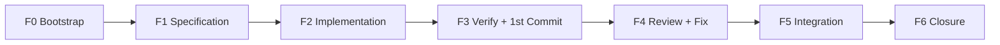

## Audience & load

| Audience | Doc |
|----------|-----|
| **Orchestrator (this file)** | FSM + tool bindings + asserts |
| **Humans** | [`README.md`](README.md), [`docs/faq.md`](docs/faq.md), [`DIAGRAM.md`](DIAGRAM.md) |

**Load:** current step + linked protocols only. Setup → [`setup.md`](../shared/setup.md). Gates (dual-mode) → [`gates.md`](../shared/gates.md). Config/SCM → [`config-resolution.md`](../shared/config-resolution.md). Artifacts → [`ARTIFACTS.md`](ARTIFACTS.md). Dispatch → [`STEP-DISPATCH.md`](STEP-DISPATCH.md) (load only when advancing/dispatching). Stack → `config.json.rules.stackFile` (auto-loaded steps 5,7,9–11). Hub → [`AGENTS.md`](../../../AGENTS.md). Step 2 → [`02-interview`](../02-interview/SKILL.md). Tools → [`tools.md`](../shared/tools.md). Dual-mode with [`spec-to-pr-lite`](../spec-to-pr-lite/SKILL.md): shared skills must stay interchangeable.

## Language

**All skill content and user-facing output: English.** No PT/PT-BR in instructions, gates, banners, Progress Board.

## Native tool contract

Canonical tool names from [`tools.md`](../shared/tools.md). Project params from [`config.json`](../shared/config.json) (repo-root path: `.agents/skills/shared/config.json`). Never narrate undone work.

| Intent | Tool alias | Native | Rule |
|--------|------------|--------|------|
| Step work | `dispatch-agent` | `Task` | `subagent_type: generalPurpose\|shell`; `description: "STP step {N} — {Label}"`; `readonly: true` step 6 only; no resume across steps; step 5 DAG ≤3 parallel |
| User gate | `user-gate` / `user-gate-auto` | `AskQuestion` | **FORCE invoke** every normal-mode gate — see [`gates.md`](../shared/gates.md); ≥2 options; recommended first; cancelled → HS-1; auto → auto-gate |
| Build/test | `build-backend`, `test-backend`, etc. | `Shell` | values from `config.json.verification` |
| Source control | `commit-code`, `push-branch`, etc. | `Shell` | `gh`, `git`; cite real output |
| State | `read-state` / `write-state` | `Read` + `Write`/`StrReplace` | truth source; hygiene before board |
| Search | `search-code` | `Grep`/`Glob` | MEMORY.md index; `{config.plans.dir}/*/*.state.md` resume |
| Browser (step 11) | `browser-mcp` | `CallMcpTool` | normal mode only, non-dry-run, non-skip, gated |
| State check | `run-script validate_state` | `Shell` | optional |
| Code edits | `dispatch-agent` Coder | `Task` | orch never edits — hard stop |

Subagents: native tools for evidence; end with parseable `step-output` block.

User output: post-tool summaries + Progress Board + banners.

### AskQuestion requirement

**FORCE:** Every normal-mode user decision MUST call native `AskQuestion` before any markdown menu. Full contract: [`gates.md`](../shared/gates.md) (slim transition menu, one delivery gate, one ship gate, session-level exposure probe).

Applies to: transitions, entry/resume/config, refinement 2c (2e only if needed), G2-code, delivery, ship, and any ≥2-option clarifying choice. **No separate 4†/8† menus** — phase model hints fold into Advance when crossing F1→F2 or F3→F4.

Cancelled → **HS-1**. `autoMode` → auto-gate index 0. Prefer one `AskQuestion` per assistant message.

---

# Spec-to-PR — Orchestrator

Deterministic FSM; step content delegated to skills via **`Task`**.

## Core Goals
1. **End-to-End Delivery:** Automate the entire feature/US lifecycle from specification bootstrap to PR/Merge (steps 0 to 13).
2. **Context Isolation & State Hygiene:** Run each step in a clean, isolated subagent Task with step-specific worktrees, while keeping state sync (`state.md` + `MEMORY.md`) strictly valid.
3. **Safety & Gates:** Enforce transition gates and model check readiness explicitly before coding and reviewing phases to prevent accidental/incorrect commits.
4. **Portability:** Keep the orchestrator FSM stack-agnostic and configuration-driven, resolving all project metadata and commands dynamically from `config.json` and `stack.md`.

## Invariants

| Topic | Rule |
|-------|------|
| Scope | Steps 0–12 deliver locally (code + plan/result). Push/PR/merge only at Step 13 via the **single ship gate** (required when `fullMode`; optional ask otherwise). No push at Step 12. |
| Auth | G1+ needs gate. AskQuestion cancelled → HS-1. Commit → G2 + explicit menu (HS-2). |
| Isolation | Fresh `Task`/step; `Shell` tag `uswf/{id}/before-step-{N}`; **branch-direct default**; worktree opt-in via config / non-win32 when beneficial (5/10/11). |
| State | Hygiene `Write`/`StrReplace` → asserts → board. Fail → HS-5. |
| Memory | `state.md` short-term (`## Workflow memory`, `## Accumulated decisions`, `## Doc consolidation log`). Root `MEMORY.md` = generalizable patterns. |
| Dual-mode | Shared skills interchangeable with `spec-to-pr-lite`. Config/gates: [`config-resolution.md`](../shared/config-resolution.md), [`gates.md`](../shared/gates.md). `workflowType: standard`. |
| `dryRun` | No `Write` `src/`/`web/`, no commit/push/worktree/browser/MEMORY `Shell`/`Write`. Prefix `[DRY-RUN]`. |
| `autoMode` | No AskQuestion; auto-gate option 0. Prefix `[AUTO]`. HS-3/4/5 pause. No browser MCP. |
| `skipIntegration` | Skip Step 11 → `skippedSteps`+`completedSteps`, log, Step 12. Prefer when no API/UI surface and unit tests green. |
| `skipTests` | Skip test suites in stack.md; build required. `verification.tests: skipped`. |
| `fullMode` | After Step 12 delivery, present Step 13 ship gate (rec: Create PR, monitor, merge). Default: off (ship gate still offered; rec = Skip). |
| Banners | `autoMode` or `dryRun` → Step Output Banner every step. |
| Revert | Workflow manifest + checkpoint only — no global `reset --hard` / `restore .`. |
| Checkpoints | Local tag `uswf/{workflow-id}/before-step-{N}` every boundary. |
| **Workflow artifacts** | **Never `git commit` `.cursor/plans/` files during Steps 0–11.** Code commits (7/10/11 fix) stage `src/`/`web/`/`tests/` only. Delivery commit at Step 12: `step-01-{slug}.plan.md` + `step-12-{slug}.result.md` only. |
| **Pause** | **Pause workflow** keeps **all** artifacts on disk — no cleanup, no delete. `status: active`. |
| `--model` | Set `currentModel` at workflow start. Overrides default. |
| `--model-chain` | Map `{step}:{model}` pairs. Only way to switch models in auto mode. Takes precedence over `--model` at matching steps. Stored in `state.modelChain`. |
| Portability | Keep spec-to-pr fully generic and portable. No hardcoded project-specific metadata, paths, solution names, or commands. All dynamic options and metadata must be resolved from `config.json` or `stack.md`. |

**Legacy aliases** (still accepted): `/us-workflow`, `@[us-workflow]`, `/us-delivery-workflow`, `@[us-delivery-workflow]`.

**Runtime tokens (unchanged):** git tags/worktrees use prefix `uswf/`; plan slugs use `us-{id}`. These are historical tokens, not the skill name.

## Allowed deps

| Resource | Path |
|----------|------|
| Orchestrator | `SKILL.md` |
| **Artifacts** | [`ARTIFACTS.md`](ARTIFACTS.md) — canonical filenames + path resolution |
| **Setup** | `setup.md` — initialization, config bootstrap, flags, resume, stack file generation |
| **Config** | `.agents/skills/shared/config.json` — project identity, stack, issue trackers, verification commands, invariants |
| **Tools** | `tools.md` — canonical tool aliases |
| Stack | `config.json.rules.stackFile` — project-specific stack reference; derived from config.json and auto-loaded for code review & optimization |
| Scripts | Orchestrator: `check_memory_conflict.py`, `validate_state.py` under `spec-to-pr/scripts/`. Converters + thread helpers: **canonical** under `github-provider/scripts/` and `azure-devops-provider/scripts/` (thin shims remain at `spec-to-pr/scripts/` and `08-fix-pr/scripts/` for canonicity). Local register/mirror: `local-spec-provider/scripts/`. |
| Providers | [`github-provider`](../github-provider/SKILL.md) · [`azure-devops-provider`](../azure-devops-provider/SKILL.md) · [`local-spec-provider`](../local-spec-provider/SKILL.md) — `providers.active` owns `fetch-to-spec`; `providers.scm` owns PR/thread/merge intents |
| SCM CLIs | Via provider skills only (`gh` / `az`); orchestrator does not embed platform CLI recipes |
| State | `{config.plans.dir}/{slug}/{workflow-id}.state.md` |
| Skills | `00-write-spec`→0 · `01-write-plan`→1 · `02-interview`→2 · `03-plan-to-tasks`→3 · `04-implement-tasks`→5 build, 10 fix · `05-verify-plan`→6 · `06-code-review`→9 · `07-integration-validation`→11 · `11-ship-pr`→13 |
| Spec | `spec-format` |

Filesystem paths use numeric prefix; skill `name:` unprefixed. Post-12 PR: [`code-review`](../06-code-review/SKILL.md) / [`fix-pr`](../08-fix-pr/SKILL.md).

### Work dir `{us-dir}` = `{config.plans.dir}/{slug}/` (default `.cursor/plans/{slug}/`)

| Entry | `slug` |
|-------|--------|
| Issue `{id}` | `us-{id}` |
| `*.spec.md` | basename or frontmatter `slug:` |

State: `{us-dir}/{workflow-id}.state.md` · Canonical spec: `{us-dir}/step-00-{slug}.spec.md`.

Artifacts: `step-00-{slug}.issue.json`, `step-00-{slug}.spec.md`, `step-01-{slug}.plan.md`, `step-02-{slug}.plan.refined.md`, `step-03-{slug}.plan.exec.md`, `step-03-{slug}.exec.dag.json`, `step-06-{slug}.plan.report.md`, `step-10-{slug}.report.md`, `step-11-{slug}.integration-test.plan.md`, `step-11-{slug}.integration-test.report.md`, `step-12-{slug}.result.md` (Step 12 delivery summary — committable).

**Committable (Step 12 only):** `step-01-{slug}.plan.md` (or `step-02-{slug}.plan.refined.md` if generated), `step-12-{slug}.result.md`. Other plan-dir files stay uncommitted unless user explicitly asks.

Git-ignored: `worktrees/step-{N}/`, `{workflow-id}.baseline/`, `{workflow-id}.archive/`. Never write state under `.agents/`.

---

## Phases F0–F6 ↔ steps 0–13



| Phase | Steps | Executor |
|-------|-------|----------|
| F0 | 0 | Orchestrator + spec subagent |
| F1 | 1,2,3 | Planner subagent |
| F2 | 4†,5 | Coder subagent |
| F3 | 6,7 | Verifier + orch + shell |
| F4 | 8†,9,10 | Reviewer + Coder |
| F5 | 11 | Verifier + optional browser |
| F6 | 12, 13 | Orchestrator + shell (+ ship subagent when fullMode) |

† Steps **4,8** = internal phase model hints on Advance (no dedicated menus) — never in `completedSteps`; log `model-gate` in `## Gate history`.

| `completedSteps` | Phase done |
|------------------|------------|
| 0 | F0 |
| 1–3 | F1 |
| 5 | F2 |
| 6–7 | F3 |
| 9–10 | F4 |
| 11 | F5 |
| 12 | F6 (may continue to 13) |
| 13 | F6 ship complete |

## Step index

| N | Label | Task? | `subagent_type` | Worktree | RO |
|---|-------|-------|-----------------|----------|-----|
| 0 | Spec Creation | ✓ | GP | — | — |
| 1 | Planning and Brainstorm | ✓ | GP | — | — |
| 2 | Refinement (conditional) | ✓ | GP | — | — |
| 3 | Execution Plan and DAG | ✓ | GP | — | — |
| 4† | (internal) Coder phase hint | — | — | — | — |
| 5 | Implementation (DAG) | ✓ | GP | step-5‡ | — |
| 6 | Verification and Report | ✓ | GP | — | ✓ |
| 7 | Decision and First Commit | ✓ | GP+shell | — | — |
| 8† | (internal) Reviewer phase hint | — | — | — | — |
| 9 | Code Review | ✓ | GP | — | — |
| 10 | Fixes, Second Commit and Report | ✓ | GP+shell | step-10‡ | — |
| 11 | Integration Validation and Pre-PR | ✓ | GP+shell | step-11‡ | — |
| 12 | Consolidation and Delivery | ✓ | shell | cleanup | — |
| 13 | Ship & PR | ✓ | GP+shell | — | — |

‡ [Worktree Fallback](#worktree-fallback). GP = `generalPurpose`. Fixed labels for board/banners. Steps 1–3 conditional per [Complexity / Dynamic Execution](#complexity--dynamic-execution).

---

## Protocols

### Authorization Ladder

| Level | Ops | Gate |
|-------|-----|------|
| G0 | Read, RO reports | — |
| G1 | Edit WT, plans, impl (no commit) | Transition gate |
| G2-code | `git commit` **code only** (`src/`, `web/`, `tests/`) | Step 7 / 10 / 11 fix |
| G2-delivery | `git commit` **`{slug}.plan.md` + `{slug}.result.md` only** | Step 12 delivery gate |
| G3 | `git push`, PR create/merge | Step 13 **ship gate only** (not Step 12) |

```text
HS-1: AskQuestion cancelled → STOP; re-present gate. Never infer "yes".
HS-2: Commit without explicit gate menu selection → STOP.
HS-2a: `git add` or commit any `.cursor/plans/` path during Steps 0–11 → STOP (workflow artifacts forbidden until Step 12 delivery commit).
HS-3: Mutating step success + empty files_touched → FAILED.
HS-4: Step 5/10/11 success without expected files on state.branch → FAILED.
HS-5: State Hygiene failed → STOP before Progress Board.
```
Auto: HS-3/4/5 apply; HS-1/2 N/A.

### Transition Discipline

**Normal:** N done → Hygiene → checkpoint `before-step-{N+1}` → Board → summary → Transition Gate → dispatch N+1.

**Auto:** auto-gate + dispatch N+1 same turn.

**Forbidden:** mutating step or commit without gate.

### Refinement FSM (Step 2)

2a/2b/2d → `02-interview`. Orch: 2c Escalate, 2e Shared Understanding, redispatch.

| State | Owner | Output |
|-------|-------|--------|
| 2a Audit | refine | `gap_registry[]` by design-tree |
| 2b Resolve | refine | Close with evidence; codebase before escalate |
| 2c Escalate | orch | AskQuestion — **one** question; max 3 rounds; always **End refinement and advance** |
| 2d Exit | refine | §8 empty or `assumed-default`; `shared_understanding: pending` |
| 2e Shared Understanding | orch | Only if 2c did **not** exit via End refinement. Else auto-confirm. |

Rules: multiple `needs_user` → one by design-tree priority. **End refinement and advance** → log `assumed-default`, set `shared_understanding: confirmed`, skip 2e. Block Step 3 only if interview ran and `refine.shared_understanding !== confirmed`.

**Conditional skip:** If complexity ≠ complex and plan Open Questions empty/resolved → skip Step 2 (`skippedSteps`), log `interview-skip | reason | ISO`, advance to Step 3. See [`gates.md`](../shared/gates.md).

### Complexity / Dynamic Execution

Before Step 1, classify complexity ([`gates.md`](../shared/gates.md)):

| Class | Action |
|-------|--------|
| **simple** | Write stub `step-01-{slug}.plan.md` (goal, files, AC checklist). Skip Steps 1–2–3 (`skippedSteps`). `execMode: sequential`. Jump to Step 5. **Never** blank plan. |
| **standard** | Steps 1 → conditional 2 → 3 → … |
| **complex** | Enforce Steps 1 + 2 + 3 |

Log `complexity | {class} | ISO`. User may override via AskQuestion when ambiguous: **Simple path** / **Standard path** (rec) / **Full grill**.

### Worktree Fallback

```text
dryRun → no worktree
default → branch-direct (preferred on win32 and most consumers)
worktree only when config.plans.useWorktrees=true AND not win32 AND path≤180 AND git worktree add succeeds
```

branch-direct: edits on `state.branch`; subagent `wip(us-{id}): step-{N}` or dirty WT. Post-step 5/10/11: files exist, expected diff, build/tests per stack.md.

### State Hygiene

After step N, before the progress board, the orchestrator MUST execute State Hygiene. To prevent manual markdown formatting errors and streamline execution, run the automated state update utility.

**Automated State Hygiene Update:**
```bash
python .agents/skills/spec-to-pr/scripts/update_state.py \
  .cursor/plans/{slug}/{workflow-id}.state.md \
  --step {N} \
  --status {completed|failed|skipped} \
  --elapsed {elapsedSec} \
  --tokens {promptTokens}:{completionTokens} \
  --model {modelName} \
  --created "{comma_separated_created_files}" \
  --modified "{comma_separated_modified_files}" \
  --deleted "{comma_separated_deleted_files}" \
  --gate-choice "{gateChoice}"
```

**Manual Fallback (if Python is unavailable):**
```yaml
- Check modelChain[N+1] → if set, update currentModel and log model-chain in ## Gate history
- Append ## Step outputs ### Step N (include model: {modelName} in block)
- Append step-output.learning → ## Workflow memory (dedupe)
- Merge files_touched → ## Step file log ### Step N
- Append to ## Step model log: | Step N | {label} | {model} | dispatched {ISO} |
- Record telemetry: elapsedSec, promptTokens, completionTokens, estimated → ## Telemetry ### Step N
- Append to ## Telemetry log: | Step N | {label} | {model} | {elapsedSec}s | {tokens} |
- Recompute workflowManifest; update completedSteps, stepStatus, currentStep
- Assert created paths exist; currentStep = next gate
- Step 2: ## Refinement registry
```

### Model readiness (no separate 4†/8† menus)

When Advance crosses **F1→F2** (after Step 3, before Step 5) or **F3→F4** (after Step 7, before Step 9), the Advance option label includes the recommended model class and concrete model name. User can pick **More… → Switch model** instead. Log `model-gate | F1→F2|F3→F4 | current | recommended | choice | ISO`. Tags `before-step-5`, `before-step-9` still apply.

Steps **4 and 8** are **not** user-facing menus and stay out of `completedSteps` / Progress Board.

`--model-chain` remains the only auto-mode mid-flow switch.

### Step Dispatch & Isolation

Orch calls **`Task`** — never inline step impl.

```yaml
Task:
  subagent_type: generalPurpose | shell
  description: "STP step {N} — {Label}"
  readonly: true   # step 6 only
  run_in_background: false   # step 5 parallel (DAG): ≤3 parallel, same worktree, no file overlap
```

Anchor (`Shell` tag): `uswf/{workflow-id}/before-step-{N} @ {sha}`. Worktree 5/10/11 via `Shell`: `worktree add` → merge → `worktree remove` → `branch -d`. Max 1 active. Audit: `Write` `stepDispatches[]`. No per-DAG-task worktree.

**Step 5 dispatch:**
- `execMode: sequential` → single `Task` `04-implement-tasks` mode `build` with `step-01-*.plan.md` directly (no DAG).
- `execMode: parallel` → DAG: `Task` per level, ≤3 concurrent, no file overlap within level.

### Learning & Memory Protocol

**Purpose:** Prevent repeating mistakes across steps and across workflow runs. `state.md` acts as the intra-workflow knowledge bus, while the compiled `MEMORY.md` inside `.agents/skills/shared/` is the cross-session, persistent anti-regression knowledge base (consumer-owned; installer never copies upstream hub memory).

#### 1. Pre-read Checklist (Memory Consultation)
At the start of every step, the subagent MUST read the following sections:

| Source | Section | Purpose |
|--------|---------|---------|
| `state.md` | `## Workflow memory` | Traps, gotchas, fixes from prior steps — **do not repeat mistakes** |
| `state.md` | `## Accumulated decisions` | Design choices, assumption flags, deviations from plan |
| `state.md` | `## Step outputs` (all `### Step N` blocks) | Prior errors, retry patterns, broken approaches |
| `state.md` | `## Doc consolidation log` | Docs updated during workflow |
| `self-learning/MEMORY.md` → **`.agents/skills/shared/MEMORY.md`** | Index + scope-related sections | Generalizable anti-regression patterns from past workflows |
| `check_memory_conflict.py` | script output | Conflict detection (steps 2,3,5,9,10) |

- **Intra-workflow Avoidance:** Scan `## Step outputs ### Step N` for `errors[]` and `learning` fields. Subagent MUST NOT repeat approaches that prior steps logged as broken.

#### 2. Writing Back Learnings
After step completion, the subagent records in `step-output.learning` (mistakes made, traps/constraints found). The orchestrator appends these to `state.md` `## Workflow memory`.

#### 3. Inter-workflow Promotion (Step 12 Sweep)
At Step 12, the orchestrator reviews all `## Workflow memory` and `step-output.learning` entries, promoting generalizable patterns to the file-based memory system under `self-learning`.
- **Promotion Process:** For each promoted learning, create a new markdown file under `.agents/skills/shared/memory/YYYY-MM-DD-[slug].md`. Then, run the compiler script: `python .agents/skills/self-learning/self_learning.py --compile`.
- **Promotion Criteria:** Technical (framework/api/pattern level, not domain-specific), generalizable, non-duplicate (query/grep memory first), and concise (one line per trap).
- **Target Sections:** Traps, patterns, layers, modules, severity.
- **Exclusions:** Do NOT store logs (→ `CHANGELOG.md`), domain rules (→ `CONTEXT.md` / `specs/`), narratives, or duplicates.
- **`dryRun`:** Log proposed entries in `## Doc consolidation log` only — do not write new entry files to `memory/` or run the compiler.

### Specification Protocol

[`spec-format`](../spec-format/SKILL.md). Canonical spec: `{us-dir}/step-00-{slug}.spec.md` — never live tracker APIs and never `*.issue.json` after Step 0. Tracker credentials/org: `config.json.issueTrackers`. Entry ownership: `config.json.providers` + provider skills below.

| Input | Tracker / provider | Action | Uses Step 0? |
|-------|--------------------|--------|--------------|
| `{n}` or `US {n}` | `providers.active` (legacy: GitHub when enabled) | `slug=us-{n}`; load active provider → `fetch-to-spec` → `{us-dir}/step-00-us-{n}.spec.md` | No — skip to Step 1 |
| `{org}/{project}#{id}` | `azure-devops-provider` | `slug=us-{id}`; `fetch-to-spec` → `{us-dir}/step-00-us-{id}.spec.md` | No — skip to Step 1 |
| `ADO {id}` / `WI {id}` | `azure-devops-provider` | Same as above; org/project from `issueTrackers.azureDevOps` | No — skip to Step 1 |
| `*.spec.md` (any path) | `local-spec-provider` | `fetch-to-spec` (register/normalize) → `{us-dir}/step-00-{slug}.spec.md` | No — skip to Step 1 |
| free-text / no args | none | brainstorm → `00-write-spec` → `{us-dir}/step-00-{slug}.spec.md` (optional mirror via `local-spec-provider`) | Yes — `Task` `00-write-spec` |

#### Provider resolution

Document identically in each provider skill (no shared package):

1. Read `providers.active` / `providers.scm` from `config.json`.
2. If `providers` absent: enabled GitHub → active=`github`; else enabled ADO → `azure-devops`; else `local`. Prefer GitHub if both enabled.
3. If `scm` absent: if active is `github`\|`azure-devops` → scm=active; if active=`local` → parse `project.repoUrl` host (`github.com` → github; `dev.azure.com` / `visualstudio.com` → azure-devops); else STOP and require explicit `providers.scm`.
4. Reject `scm: "local"`.
5. When `providers.active` is present, bare `{n}` / `US {n}` resolve against **active**, not dual-enabled tracker preference. Legacy dual-enabled bare-number rule applies only when `providers` is omitted.

#### Dispatch — `fetch-to-spec` (entry)

| Active / entry | Skill | Intent |
|----------------|-------|--------|
| `github` or GitHub issue id | [`github-provider`](../github-provider/SKILL.md) | `fetch-to-spec` (+ `validate-auth` first when needed) |
| `azure-devops` or ADO id forms | [`azure-devops-provider`](../azure-devops-provider/SKILL.md) | `fetch-to-spec` (+ `validate-auth` first when needed) |
| `local` or `*.spec.md` path | [`local-spec-provider`](../local-spec-provider/SKILL.md) | `fetch-to-spec` |

Orchestrator **must not** embed multi-line `gh` / `az` / hand-written register recipes. Load the provider skill and run `fetch-to-spec`. Auth or config failure → STOP with that provider’s fix instructions; **no** silent fallback to another provider.

**Bare number resolution (legacy, when `providers` omitted):** if only `azureDevOps.enabled` and GitHub disabled → treat `{n}` as ADO work item. If both enabled → bare `{n}` = GitHub; require `ADO {id}` or `{org}/{project}#{id}` for ADO. If the required tracker is disabled or unauthenticated → STOP with fix instructions.

**When `providers.active` is set:** bare `{n}` / `US {n}` use that provider (e.g. `active=azure-devops` → ADO work item). Explicit forms (`ADO {id}`, `{org}/{project}#{id}`, GitHub URL, `*.spec.md`) still select their matching provider.

### Step 0 Entry Gate

Before Step 0, the orchestrator checks the trigger input and determines the entry flow:

1. **Tracker id** (`{n}`, `US {n}`, `ADO {id}`, `WI {id}`, or `{org}/{project}#{id}`):
   - Resolve `providers.active` (algorithm above) → load that provider skill → `fetch-to-spec` → `{us-dir}/step-00-{slug}.spec.md`.
   - Registers `specPath`, `specSource` (`github` | `azure-devops`).
   - **Skips Step 0** — advances directly to the Step 1 gate.

2. **Local `*.spec.md` provided as argument:**
   - Load [`local-spec-provider`](../local-spec-provider/SKILL.md) → `fetch-to-spec`. Registers `specPath`, `specSource: local`.
   - **Skips Step 0** — advances directly to the Step 1 gate.

3. **No arguments (or free-text description as argument):**
   - Entry Menu (AskQuestion):
     - **I have a GitHub issue / ADO work item** (recommended) — same as case 1; skip Step 0 → Step 1.
     - **I have a local `*.spec.md`** — same as case 2.
     - **I want to describe a feature to brainstorm** — `Task` `00-write-spec` → `{us-dir}/step-00-{slug}.spec.md` → Step 1 gate. **This is the only path that uses `00-write-spec`.** Optional post-draft mirror under `plans.specsDir`: delegate to `local-spec-provider`.

After the entry gate, `specPath` is stored in state `## Artifacts.specPath` and snapshotted in `## Artifacts.specSnapshot`.

### Build & Test Validation (7, 10)

Before G2-code commit: `config.json.rules.stackFile` → build (+ tests unless skip) → Coder fix loop. Stage **only** `src/`, `web/`, `tests/` — never `.cursor/plans/`. `skipTests`: `verification.tests: skipped`.

### Integration Validation (11)

`07-integration-validation` via **`Task`**.

| Flag | Effect |
|------|--------|
| `skipIntegration` | no Task; Write skip → step 12 |
| `autoMode` \| `dryRun` | Task without browser; §6 skipped in report |
| normal + gate | `CallMcpTool` cursor-ide-browser |

Gates (normal): **Approve and run test battery** (rec) / **Run without browser** / **Adjust test plan** / **Skip validation** / **Pause workflow**.

Failure (max 3): **Apply fixes and revalidate** (rec) / **Accept with reservations** / **Re-run without fixes** / **Pause**. Fix: G2-code commit only (`src/`/`web/`/`tests/`).

### Workflow Artifact Commit Protocol

| When | Allowed |
|------|---------|
| Steps 0–11 | **Code only** under `src/`, `web/`, `tests/` at Steps 7, 10, 11 fix |
| Steps 0–11 | **Forbidden:** `.cursor/plans/**`, `*.plan.exec.md`, `*.exec.dag.json`, `*.report.md`, `*.plan.report.md`, `*.integration-test.*`, `*.state.md`, `*.issue.json` |
| Step 12 | **`{slug}.plan.md`** (checkmarks updated) + **`{slug}.result.md`** — delivery commit via G2-delivery gate |
| Pause | No commit required; **no delete** of workflow files |

Orch `git add` must be path-scoped — never `git add .` on steps 7/10/11.

### Delivery Result Protocol (Step 12 — before delivery commit)

1. **`Read`** sources: `step-00-{slug}.spec.md`, `step-02-{slug}.plan.refined.md` (or `step-01-{slug}.plan.md` if Step 2 was bypassed), `step-06-{slug}.plan.report.md`, `step-10-{slug}.report.md`, integration report if exists, `## Open items` in state.
2. **`Write`** `{us-dir}/step-12-{slug}.result.md`:

```markdown
# {slug} — Delivery Result

## Expected
<!-- from spec ACs + plan scope -->

## Done
<!-- from verify report + delivery report + completed DAG tasks -->

## Next steps
<!-- open items, reservations, manual follow-ups before PR -->

## References
- Spec: {specPath}
- Plan: step-02-{slug}.plan.refined.md (or step-01-{slug}.plan.md if Step 2 was bypassed)
- Verify: step-06-{slug}.plan.report.md
- Delivery: step-10-{slug}.report.md
```

3. **Capture LOC delta:** `Shell` from repo root:
   - Baseline LOC: `git ls-files src/ web/ tests/ | xargs git show {baselineCommit}: 2>/dev/null | wc -l`
   - Final LOC: `git ls-files src/ web/ tests/ | xargs wc -l 2>/dev/null | tail -1 | awk '{print $1}'`
   - Diff stat: `git diff --stat {baselineCommit} -- src/ web/ tests/ | tail -1`
   - Parse added/removed; store in `telemetry.loc`.
4. **Compute benchmark:** aggregate `telemetry.steps[].elapsedSec` → `totalElapsedSec`; sum `promptTokens + completionTokens` → `totalTokens`; compute `netDelta = added - removed`.
5. **Append Benchmark** to `step-12-{slug}.result.md` per template below; populate from `telemetry.steps[]`.
6. **Update plan checkmarks:** mark completed tasks/ACs `[x]` per verify report + `completedTasks` + `completedSteps` ≥5.
7. Register `resultSnapshot` + `telemetry.workflowEndedAt` in state `## Artifacts`.
8. **G2-delivery gate** → `Shell` stage `step-01-{slug}.plan.md` + `step-02-{slug}.plan.refined.md` (if generated) + `step-12-{slug}.result.md` → `git commit -m "docs({slug}): delivery plan and result"`.
9. Log `step-12-delivery-commit | {sha}` in `## Gate history` and `commits[]`.

`dryRun`: simulate result + plan edits + benchmark; no real commit.

### Optional Artifact Cleanup Protocol (Step 12 — after delivery commit)

**Only when `status: completed` and user explicitly chooses cleanup** — never on **Pause workflow**.

**Gate options:**
- **Delete temporary artifacts** (rec if lean repo) — `step-03-*.plan.exec.md`, `step-03-*.exec.dag.json`, `step-00-*.issue.json`, `step-06-*.plan.report.md`, `step-11-*.integration-test.*.md`, worktrees, baseline, archive, checkpoint tags
- **Keep all artifacts** (rec for audit) — no delete

**Cleanup execution (when user chooses delete):**

1. Delete temp files:
   ```bash
   rm {us-dir}/step-03-{slug}.plan.exec.md
   rm {us-dir}/step-03-{slug}.exec.dag.json
   rm {us-dir}/step-00-{slug}.issue.json
   rm {us-dir}/step-06-{slug}.plan.report.md
   rm {us-dir}/step-11-{slug}.integration-test.plan.md
   rm {us-dir}/step-11-{slug}.integration-test.report.md
   ```
2. Remove checkpoint tags:
   ```bash
   git tag -l "uswf/{workflow-id}/*" | xargs -r git tag -d
   ```
3. Remove worktree dirs + prune branches:
   ```bash
   git worktree list | grep "uswf/{workflow-id}" | awk '{print $1}' | while read wt; do
     git worktree remove "$wt" --force 2>/dev/null
   done
   git branch -l "uswf/{workflow-id}/*" | sed 's/^[* ]*//' | xargs -r git branch -D
   ```
4. Remove baseline backup: `rm -rf {us-dir}/{workflow-id}.baseline/`
5. Remove archive: `rm -rf {us-dir}/{workflow-id}.archive/`

**Preserved (never deleted):** `step-01-{slug}.plan.md`, `step-02-{slug}.plan.refined.md` (if generated), `step-12-{slug}.result.md`, `step-00-{slug}.spec.md`, `{workflow-id}.state.md` (while `status: active`).

**Post-cleanup verification:**
```bash
git worktree list | grep "uswf/{workflow-id}" && echo "WARN: worktree remains" || echo "Clean"
git tag -l "uswf/{workflow-id}/*" | wc -l | xargs -I{} echo "Tags remaining: {}"
git branch -l "uswf/{workflow-id}/*" | wc -l | xargs -I{} echo "Branches remaining: {}"
```

**Pause / `status: active`:** skip cleanup entirely; all files remain for resume. **Dry-run:** log intended deletions only.


### Telemetry & Benchmarking

Orch records wall-clock time, token usage, LOC delta at every step boundary. At Step 12, consolidated benchmark appended to `{slug}.result.md` and Progress Board.

#### Timing

| Event | Record | Field |
|-------|--------|-------|
| Workflow start | `telemetry.workflowStartedAt` | ISO 8601 (bootstrap) |
| Step N dispatch | `telemetry.steps[N].dispatchedAt` | ISO 8601 (before `Task`/`Shell`) |
| Step N finish | `telemetry.steps[N].finishedAt` | ISO 8601 (after return) |
| Step N elapsed | `telemetry.steps[N].elapsedSec` | `(finishedAt - dispatchedAt) / 1000` (int, seconds) |
| Workflow end | `telemetry.workflowEndedAt` | ISO 8601 (Step 12, before cleanup) |
| Total elapsed | `telemetry.totalElapsedSec` | sum of all step `elapsedSec` |

Gate time (AskQuestion waiting) excluded — agent execution time only.

#### Token counting

| Field | Source | Fallback |
|-------|--------|----------|
| `promptTokens` | LLM metadata | estimate: prompt chars / 3.5 |
| `completionTokens` | LLM metadata | estimate: completion chars / 3.5 |
| `totalTokens` | sum | estimate: (prompt + completion chars) / 3.5 |

Labeled `(est.)` when estimated. `Shell` steps (7, 12, 13): elapsed time only; tokens=0.

#### Lines of code delta

At bootstrap + Step 12 delivery:

```bash
# Baseline (bootstrap)
git ls-files src/ web/ tests/ | xargs wc -l 2>/dev/null | tail -1

# Diff (Step 12)
git diff --stat {baselineCommit} -- src/ web/ tests/ | tail -1
```

| Field | Description |
|-------|-------------|
| `telemetry.loc.baseline` | total lines at `baselineCommit` |
| `telemetry.loc.final` | total lines at Step 12 commit |
| `telemetry.loc.added` | `+` lines from diff |
| `telemetry.loc.removed` | `-` lines from diff |
| `telemetry.loc.netDelta` | `added - removed` |

Count only `src/`, `web/`, `tests/`.

#### Step output telemetry contract

```yaml
step-output:
  telemetry:
    elapsedSec: {int}
    promptTokens: {int|null}
    completionTokens: {int|null}
    estimated: {boolean}
```

Orch: validate `telemetry` block → merge into `telemetry.steps[N]`. Missing → HS-5.

#### Benchmark report (Step 12)

```markdown
## Benchmark

| Metric | Value |
|--------|-------|
| Total wall-clock time | {h}h {m}m {s}s ({totalElapsedSec}s agent execution) |
| Steps executed | {N} |
| Total tokens | {sum} (estimated: {bool}) |
| Lines added | +{added} |
| Lines removed | -{removed} |
| Net LOC delta | +{netDelta} |
| Baseline LOC | {baseline} |
| Final LOC | {final} |

### Step breakdown

| Step | Label | Model | Elapsed | Tokens (est.) | Files changed |
|------|-------|-------|---------|---------------|---------------|
| 0 | Spec Creation | {model} | {elapsedSec}s | {tokens} | {n} |
| 1 | Planning | {model} | {elapsedSec}s | {tokens} | {n} |
```

**Token efficiency:** `tokens/loc` ratio. **Velocity:** `loc/min`.

### Step Output Banner

When `autoMode` or `dryRun`, before and after each step:

```markdown
[AUTO] [DRY-RUN] **Starting step {N} {Label}**
[AUTO] **Finished step {N} {Label}**
```

Step 5: one pair per whole step. Print **Finished** on hard stop too.

### Automatic Mode

Parse: `auto` + combinable `dry-run`, `skip-integration`, `skip-tests`, US/spec entry. Legacy user input may pass `automatico`/`automático`; normalize to `auto` internally.

Resume: active `autoMode` same US → continue `currentStep`; else new `workflow-id`.

| Context | Auto choice (index 0) |
|---------|----------------------|
| Step 0 entry gate | **I have a US/issue number** (user must provide in invocation) |
| Complexity ambiguous | **Standard path** |
| Transition 1–6, 9–11 | **Advance to Step N+1** |
| Transition model (auto) | **Advance** (keep current; use `--model-chain` or pause to switch) |
| Phase model hint (F1→F2 / F3→F4) | Keep current model and advance (or apply `modelChain` if set) |
| Step 2 needs_user | first option; early → **End refinement and advance** (auto-confirms 2e) |
| Step 2e (only if shown) | **I confirm shared understanding — advance to Step 3** |
| Step 7 | **Approve, validate build/tests and commit code** |
| Step 11 skipIntegration / no API-UI | skip step |
| Step 11 plan | **Approve and run test battery without browser** |
| Step 11 failure | **Apply fixes and revalidate** |
| Step 12 delivery | **Commit plan and result, keep artifacts** |
| Step 13 ship (`fullMode`) | **Create PR, monitor, and merge when ready** |
| Step 13 ship (not `fullMode`) | **Skip shipping** |

Log `auto-gate | step {N} | {choice} | ISO`. Disabled: backward/repeat/pause menus; Step 3 without shared understanding.

### Checkpoints

Tag `uswf/{workflow-id}/before-step-{N}` = HEAD before step N first mutation. `before-step-1` = `baselineCommit`. Mirror in `checkpoints[]`. Delete on Step 12/reset. Dry-run: log only.

### Progress Board

Render: bootstrap/resume; **phase boundaries** (F0→F1, F1→F2, F2→F3, F3→F4, F4→F5, F5→F6); after failed steps; pause; `/status`; Step 12 final. Skip board on routine Advance between micro-steps when summary already shown (saves tokens). Full template optional via `/status`.

```markdown
## Progress — US {us} (`{workflowId}`)
**Status:** … | **Phase:** {Fx} | **Step:** {N} — {label} | **Branch:** `{branch}` | **Mode:** {autoMode→[AUTO] / dryRun→[DRY-RUN] / fullMode→[FULL] / normal}
**Current model:** {currentModel} | **Step models:** {list}

### Pipeline — Phases
- [x] F0 Bootstrap · [ ] F2 Implementation ← **next** …

### Steps (0–12; +13 when fullMode, omit 4/8)
- [x] 0 [{model}] · [x] 1 [{model}] · … · [ ] 5 ← **next** [{currentModel}]

### Refinement _(Step 2 active only)_
Round {r}/3 · blocking: {n}

### Step 3 Execution Mode _(after Step 3)_
**Mode:** {execMode} · {reason}

### Step 5 DAG _(if execMode: parallel)_
- [x] T1 — …
```

Suffixes: `← next` · `⏭ skipped` · `↻ repeating` · `⏮ reopened`.

**Step 12 final board** — after benchmark:

```markdown
### Telemetry
| Metric | Value |
|--------|-------|
| Total time | {h}h {m}m {s}s ({totalElapsedSec}s) |
| Total tokens | {tokens} (est: {bool}) |
| Lines +/- | +{added} / -{removed} (net: {netDelta}) |
| Token efficiency | {tokens/loc} tokens/LOC |
| Velocity | {loc/min} LOC/min |
```

### Safe Revert & Backward Navigation

**Revert** = manifest to checkpoint M. Scope: `reset --mixed` → per-path restore from `## Step file log` → remove worktrees ≥M → truncate state <M. Verify `preExistingDirty`. Forbidden: global `reset --hard`, `checkout -- .`, `restore .`, `clean -fd`, stash, push `uswf/*` tags.

**Bootstrap revert data:** `baselineCommit`, `preExistingDirty[]`, backup `{workflow-id}.baseline/`. Full reset: M=1 + new workflow-id.

**Backward nav** (normal only): Gate **Go back** or Step 7→5 shortcut. Targets: 1–3,5–7,9–11 in `completedSteps`. Sub-menu: Planning/Implementation/Review/Validation → confirm → checkpoint revert → redispatch M. Log `backward-nav | from | to | ISO`.

---

## State & dispatch

### `state.md` YAML

```yaml
workflowId, slug, us, specSource, specPath
startedAt, endedAt, status: active|completed|cancelled|failed
currentStep, dryRun, autoMode, skipIntegration, skipTests, fullMode
execMode: sequential|parallel|null  # set after Step 3
branch, baselineCommit, preExistingDirty: []
checkpoints, workflowManifest, commits: [{sha, step, message}]
completedSteps, stepStatus, skippedSteps, completedTasks, stepDispatches
refineRound, currentModel, recommendedModel
stepModels: [{step: N, model: "name", dispatched: ISO}]
modelChain: {stepNumber: "modelName"}  # from --model-chain flag
telemetry:
  workflowStartedAt: ISO
  workflowEndedAt: null
  totalElapsedSec: null
  loc:
    baseline: int|null
    final: int|null
    added: int|null
    removed: int|null
    netDelta: int|null
  totalTokens: int|null
  steps: [{ N: int, label: str, dispatchedAt: ISO, finishedAt: ISO, elapsedSec: int, promptTokens: int, completionTokens: int|null, estimated: bool, model: str, filesTouched: int }]
```

Sections: Workflow baseline, manifest, Step file log, Refinement registry, Context, Artifacts, Step outputs, Step model log, Workflow memory, Accumulated decisions, Doc consolidation log, Open items, Gate history.

### Resume / reset

Delegated to [`setup.md`](../shared/setup.md) § Resume / reset. The orchestrator loads this section during bootstrap step 4.

---

### Base Prompt Prefix (`Task` body)

```markdown
# Subagent — Step {STEP} — {Label}
Read state: `.cursor/plans/{slug}/{workflow-id}.state.md`
Skill: {SKILL.md path} — read full.
Orch: SKILL.md § Step {STEP} · model {currentModel} · {modeFlags}
Enhancing skills (mandatory): karpathy-guidelines, caveman, self-learning, gabarito
Read: state workflow memory + decisions + doc log; MEMORY.md index; `config.json.rules.stackFile`.
Anchor: uswf/{workflow-id}/before-step-{STEP} @ {sha} · CWD: {repo-root | worktree}
Role: fresh; no resume. files_touched required (revert). model: {currentModel}.
Rules: no `.cursor/plans/` in git-add except Step 12 G2-delivery; needs_user: ≥2 choices, recommended first.
Learning: read ## Workflow memory + ## Step outputs (all prior steps) for traps/errors. Do NOT repeat broken approaches. Record own mistakes in step-output.learning.
Telemetry required: record elapsedSec (step wall-clock seconds = (finishedAt - dispatchedAt) / 1000, integer), promptTokens + completionTokens (from LLM metadata if available, else estimate chars/3.5 with estimated: true).
End with ```step-output(status, step, artifacts, files_touched, verification, refine, summary, evidence, decisions, doc_consolidation, needs_user, errors, retry_hint, learning, model, telemetry{elapsedSec, promptTokens|null, completionTokens|null, estimated})
```
```

### Transition Gates

Post-step: hygiene → checkpoint (`Shell` tag) → short summary → gate. Board at phase boundaries (see Progress Board).

| Mode | Tool |
|------|------|
| auto | auto-gate table → immediate `Task`/`Shell` |
| normal | **`AskQuestion`** — slim menu per [`gates.md`](../shared/gates.md) |

**AskQuestion (normal) — every transition, steps 0→1 through 11→12:**

Shows `**Current model:** {currentModel}` and `**Next step:** {N+1} — {Label}`.

1. **Advance to Step N+1** (Recommended) — keep `{currentModel}`; at F1→F2 / F3→F4, label may include recommended model
2. **More options…** → Switch model / Repeat / Go back / Pause or cancel

Step 11: More may include **Skip validation**. Step 2: 2e only if interview did not exit via End refinement.

`--model-chain` auto-applies at matching steps (overrides keep-current).
---

## Bootstrap & Entry

Delegated to [`setup.md`](../shared/setup.md) § Bootstrap & Entry. Before Step 0, the orchestrator loads and executes this section.

---

## Step instructions

Step dispatch table (0–13), post-mutating merge note, and Step 12–13 protocols → [`STEP-DISPATCH.md`](STEP-DISPATCH.md). Load only when advancing or dispatching a step.

---

## Error policy

Retry: max 3; backoff 0s→30s→60s. Revert: Checkpoint Algorithm only. Conduct: 4/8 no Task; orch never implements code; fresh Task/step; branch-direct default; G2-code steps 7/10/11; G2-delivery step 12; G3 step 13 only; HS-2a blocks plan-dir commits mid-workflow.

## Post-workflow (outside this agent)

Manual QA after workflow completion (or pause before Step 12) not resumed here. Use [`10-update-plan-implementation`](../10-update-plan-implementation/SKILL.md) (`/10-update-plan-implementation`) — append plan §9, implement delta, update `{slug}.result.md`, certify for PR. Distinct from Step 10 (in-pipeline review fixes).

## Triggers

```
@[spec-to-pr] [auto|dry-run|skip-integration|skip-tests|full|strict] [--model {name}] [--model-chain step:model,...] [US {issue_id} | {org}/{project}#{id} | {name}.spec.md | "feature description"]
/spec-to-pr [flags] [US {issue_id} | {org}/{project}#{id} | {name}.spec.md | "feature description"]
/status | progress | where am I? → Progress Board only
go back | change plan | back to step X → Backward Nav (not in auto)
switch model | change model → More options… on any transition (normal mode)
```

**Model flags:**

| Flag | Argument | Effect |
|------|----------|--------|
| `--model` | `{name}` | Set `currentModel` at start. Overrides default. |
| `--model-chain` | `{step}:{model},...` | Pre-specify per-step models. Overrides `--model`. |
| `--strict` | — | Force full US verification matrix at Step 6 |

`--model-chain` is only way to switch models in **auto mode**. Normal: More… → Switch model. Dual-mode Fast path: use [`spec-to-pr-lite`](../spec-to-pr-lite/SKILL.md) or complexity **simple**.

Gates: [`gates.md`](../shared/gates.md). Config: [`config-resolution.md`](../shared/config-resolution.md).

If invoked **without** US number, spec path, or description:
> **Give me a GitHub issue id, an Azure DevOps work item (`ADO {id}` or `{org}/{project}#{id}`), a path to a hand-written `*.spec.md`, or a free-text feature description to start.**

Examples:
- `/spec-to-pr auto skip-tests skip-integration US 1234`
- `/spec-to-pr --model sonnet-4 "Implement a product analytics dashboard with real-time charts"`
- `/spec-to-pr auto contoso/project#5678`
- `/spec-to-pr ADO 2416`
- `/spec-to-pr specs/my-feature.spec.md`
- `/spec-to-pr full US 99`
- `/spec-to-pr auto --model-chain 5:sonnet-4,9:gemini-3-pro,10:sonnet-4 US 1234`
- `/spec-to-pr --model sonnet-4 auto skip-tests US 567`
