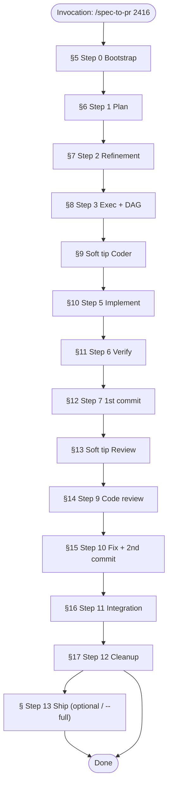

# FAQ — Spec-to-PR

> **Architecture note (v10.0):** Steps 0–11 delegate their functional content to dedicated skills (`00`–`07`). Stack detected via `.agents/skills/shared/config.json`; tools via `tools.md`. Project-agnostic. Step 13 optional via `--full`. Dual-mode gate UX: [`gates.md`](../../shared/gates.md); config/SCM: [`config-resolution.md`](../../shared/config-resolution.md). **Session model** on every transition; switch via Pause → Cursor → Resume (no `--model` / `--model-chain`). Step dispatch table + Step 12/13 protocols for **standard** orch: [`STEP-DISPATCH.md`](../STEP-DISPATCH.md) (load when advancing; **not** the lite Steps 1–5 index). The orchestration mechanics (phases, gates, worktrees, banners, state.md) remain valid.
>
> **Audience:** developers, tech leads, and agents who need to understand **how** the end-to-end User Story delivery pipeline works.
> **Order:** sections follow **execution sequence** (F0→F6, steps 0–12; 13 with `--full`), from invocation to closure.
> **Complements:** [`README.md`](../README.md) · [`SKILL.md`](../SKILL.md) · [`DIAGRAM.md`](../DIAGRAM.md)

---

## Quick index *(execution order)*

| # | Section | Pipeline moment |
|---|---------|-----------------|
| 1 | [Overview](#1-overview) | — |
| 2 | [What it does and does not do](#2-what-the-workflow-does-and-does-not-do) | — |
| 3 | [Timeline](#3-timeline-execution-order) | Full map |
| 4 | [How to start](#4-how-to-start-inputs-and-modes) | Before Step 0 |
| 5 | [**F0 — Step 0: Initialization**](#5-f0--step-0-workflow-initialization) | Bootstrap |
| 6 | [**F1 — Step 1: Planning**](#6-f1--step-1-planning-and-brainstorm) | Specification |
| 7 | [**F1 — Step 2: Refinement**](#7-f1--step-2-refinement) | Specification |
| 8 | [**F1 — Step 3: Execution Plan + DAG**](#8-f1--step-3-execution-plan-and-dag) | Specification |
| 9 | [**Soft tip: Coder readiness**](#9-soft-tip-coder-readiness-f1f2) | F1→F2 |
| 10 | [**F2 — Step 5: Implementation**](#10-f2--step-5-implementation-dag) | Implementation |
| 11 | [**F3 — Step 6: Verification**](#11-f3--step-6-verification-and-report) | Verify |
| 12 | [**F3 — Step 7: 1st commit**](#12-f3--step-7-decision-and-1st-commit) | Verify + G2 |
| 13 | [**Soft tip: Review readiness**](#13-soft-tip-review-readiness-f3f4) | F3→F4 |
| 14 | [**F4 — Step 9: Code review**](#14-f4--step-9-code-review) | Review |
| 15 | [**F4 — Step 10: Fix + 2nd commit**](#15-f4--step-10-fixes-2nd-commit-and-report) | Review + G2 |
| 16 | [**F5 — Step 11: Integration**](#16-f5--step-11-integration-validation-and-pre-pr) | Pre-PR |
| 17 | [**F6 — Step 12: Closure**](#17-f6--step-12-consolidation-and-final-cleanup) | Cleanup + G3 |
| 18 | [Gates and navigation](#18-gates-navigation-and-checkpoints) | Cross-cutting |
| 19 | [Artifacts and state](#19-artifacts-and-shared-state) | Cross-cutting |
| 20 | [Special modes](#20-special-modes-auto-dry-run-skip) | Cross-cutting |
| 21 | [Troubleshooting](#21-troubleshooting) | — |

---

## 1. Overview

### What is the Spec-to-PR?

An **orchestrated pipeline** for delivering a User Story (or feature described in free text) end-to-end: plan → implementation → verification → code review → integration validation → closure. The **orchestrator** (main agent) coordinates **sub-agents** dedicated per step, maintains persistent state, and enforces **authorization gates** before any side effect (commit, push, code edit).

**Evidence:** [`README.md`](../README.md), [`SKILL.md`](../SKILL.md) § Phase Architecture.

### Who executes what?

| Role | Responsibility |
|------|----------------|
| **Orchestrator** | State, gates, sub-agent dispatch, git checkpoints, Progress Board — **does not implement code** |
| **Sub-agent** | Executes an isolated step (clean context via `Task`, never `resume` between steps) |
| **User** | Decides at gates (`AskQuestion`) — except in `auto` mode |

### What are the 7 phases (F0–F6)?

**Human** view of the pipeline. Internally, `state.md` tracks **steps 0–12** for checkpoints and revert.

| Phase | Name | Steps |
|-------|------|-------|
| F0 | Bootstrap | 0 |
| F1 | Specification | 1, 2, 3 |
| F2 | Implementation | 4†, 5 |
| F3 | Verification + 1st commit | 6, 7 |
| F4 | Review + fixes | 8†, 9, 10 |
| F5 | Pre-PR integration | 11 |
| F6 | Closure | 12 |

† Steps **4 and 8** are **phase soft tips** (Coder/Reviewer) — never in `completedSteps`.

---

## 2. What the workflow does and does not do

### What it does

| # | Action | Steps |
|---|--------|-------|
| 1 | Fetches GitHub issue snapshot for the US | 0 |
| 2 | Generates detailed implementation plan | 1 |
| 3 | Refines gaps (refinement) | 2 |
| 4 | Breaks into parallelizable DAG tasks | 3 |
| 5 | Implements code by DAG levels | 5 |
| 6 | Verifies implementation vs plan | 6 |
| 7 | Commits approved implementation | 7 |
| 8 | Local code review (diff vs base branch) | 9 |
| 9 | Fixes findings + 2nd commit | 10 |
| 10 | Integration validation (API, tests, optional browser) | 11 |
| 11 | Cleans temporaries, consolidates docs, push consent | 12 |

### What it does **not** do

- Open or update Pull Request — **optional Step 13** via `--full` / ship gate (or `/spec-to-pr-lite` Step 5). Without ship consent, PR remains manual after delivery.
- Automatic push to remote — only via Step 13 / lite Step 5 ship gate (never at Step 12 delivery)
- Commit without explicit G2 gate (Steps 7, 10, 11)
- Infer "yes" when the user cancels an `AskQuestion` (HS-1)
- Prefer `AskQuestion` at gates; use markdown menu with same options when the tool is unavailable ([`gates.md`](../../shared/gates.md))

**Evidence:** [`SKILL.md`](../SKILL.md) § Allowed dependencies, § Authorization Ladder, § User gates (AskQuestion).

---

## 3. Timeline (execution order)



| Step | FAQ Section | Executor | Gate after |
|------|-------------|----------|------------|
| 0 | [§5](#5-f0--step-0-workflow-initialization) | Orchestrator | Transition → Step 1 |
| 1 | [§6](#6-f1--step-1-planning-and-brainstorm) | Planner sub-agent | Transition → Step 2 |
| 2 | [§7](#7-f1--step-2-refinement) | Planner sub-agent | Transition → Step 3 |
| 3 | [§8](#8-f1--step-3-execution-plan-and-dag) | Planner sub-agent | Transition + sub-gate 4 → Step 5 |
| 4† | [§9](#9-sub-gate-4-coder-readiness) | Orchestrator | Embedded in F1→F2 gate |
| 5 | [§10](#10-f2--step-5-implementation-dag) | Coder sub-agent | Transition → Step 6 |
| 6 | [§11](#11-f3--step-6-verification-and-report) | Verifier sub-agent (readonly) | Transition → Step 7 |
| 7 | [§12](#12-f3--step-7-decision-and-1st-commit) | Orchestrator + sub-agent + shell | G2 + sub-gate 8 → Step 9 |
| 8† | [§13](#13-sub-gate-8-review-readiness) | Orchestrator | Embedded in F3→F4 gate |
| 9 | [§14](#14-f4--step-9-code-review) | Reviewer sub-agent | Transition → Step 10 |
| 10 | [§15](#15-f4--step-10-fixes-2nd-commit-and-report) | Coder sub-agent + shell | G2 → Step 11 |
| 11 | [§16](#16-f5--step-11-integration-validation-and-pre-pr) | Sub-agent + browser + shell | Transition → Step 12 |
| 12 | [§17](#17-f6--step-12-consolidation-and-final-cleanup) | Orchestrator + shell | One delivery gate (no push) |
| 13 | Ship | `11-ship-pr` | One ship gate |

---

## 4. How to start (inputs and modes)

### How do I invoke the workflow?

```text
@[spec-to-pr] 2416
/spec-to-pr US 2416
@[spec-to-pr] contoso/MyProject#2416
@[spec-to-pr] ADO 2416
@[spec-to-pr] specs/my-feature.spec.md
@[spec-to-pr] auto 2416
@[spec-to-pr] dry-run 2416
@[spec-to-pr] auto skip-integration 2416
@[spec-to-pr] soft-delete for suppliers
```

### What input does each form accept?

| Input | What Step 0 interprets |
|-------|------------------------|
| Number (`2416`) or `US 2416` | Active provider `fetch-to-spec` (default GitHub when `providers` omitted / `active=github`) → `.cursor/plans/us-2416/` via [`github-provider`](../../github-provider/SKILL.md) |
| `{org}/{project}#{id}` | Azure DevOps work item → `.cursor/plans/us-{id}/` via [`azure-devops-provider`](../../azure-devops-provider/SKILL.md) `fetch-to-spec` |
| `ADO {id}` / `WI {id}` | Same; org/project from `config.json.issueTrackers.azureDevOps` |
| `*.spec.md` path | Local spec → [`local-spec-provider`](../../local-spec-provider/SKILL.md) `fetch-to-spec` → `{us-dir}/step-00-{slug}.spec.md` |
| Free text (`soft-delete for suppliers`) | Brainstorm via `00-write-spec` — slug from title |
| `auto` | `autoMode: true` — no interactive menus |
| `dry-run` | `dryRun: true` — simulation without side effects |
| `skip-integration` | `skipIntegration: true` — skips Step 11 entirely |
| `skip-tests` | `skipTests: true` — skips test suites (build still runs) |

### Where do provider skills live, and how do I get them?

| Provider | Path | Owns |
|----------|------|------|
| [`github-provider`](../../github-provider/SKILL.md) | `.agents/skills/github-provider/` | GitHub `fetch-to-spec`, auth, PR create/threads/merge |
| [`azure-devops-provider`](../../azure-devops-provider/SKILL.md) | `.agents/skills/azure-devops-provider/` | ADO work item→spec, auth, PR create/threads/merge |
| [`local-spec-provider`](../../local-spec-provider/SKILL.md) | `.agents/skills/local-spec-provider/` | Local `*.spec.md` register/normalize; PR via `providers.scm` |

`providers.active` selects who runs `fetch-to-spec`. `providers.scm` selects who runs PR/thread/merge intents.

If your consumer project already had `spec-to-pr` installed **before** these folders existed upstream, plain `update` will not create them. Install the new skills with:

```bash
npx github:jpolvora/workflow-skills update --include-new
```

(Or pick them in the interactive installer.)

### What happens if an active workflow already exists?

In **normal mode**, Step 0 checks `.cursor/plans/*/*.state.md` and offers a menu: resume, restart from scratch, or start a new workflow. In **auto mode**, resumes only `autoMode: true` workflow **for the same US**; ignores other active ones.

### What is the final global output?

- Code committed on the working branch (`state.branch`)
- Artifacts in `.cursor/plans/us-{id}/` (plan, reports)
- `state.md` with `status: completed`
- Optionally: Step 13 ship gate (push / PR / merge) when `--full` or user chooses Create PR; otherwise stop after delivery

---

## 5. F0 — Step 0: Workflow Initialization

### What is Step 0?

**Bootstrap** of the pipeline. The orchestrator prepares the environment: parses flags, creates or resumes state, captures git baseline, **resolves specification** (`*.spec.md` — from GitHub issue, Azure DevOps work item, or hand-written local file), and renders the initial Progress Board. **Does not dispatch a sub-agent** except when brainstorming via `00-write-spec`.

### How is it done?

1. Parse `workflow-id`, flags (`dryRun`, `autoMode`, `skipIntegration`, `skipTests`) and **entry** (GitHub id, ADO id, or `*.spec.md`)
2. Check for active workflows (resume or new)
3. Create `{us-dir}/{workflow-id}.state.md` in `.cursor/plans/{slug}/`
4. Capture baseline: `baselineCommit`, `preExistingDirty`, tag `before-step-1`
5. **Specification Protocol** (see [`SKILL.md`](../SKILL.md) + [`ARTIFACTS.md`](../ARTIFACTS.md)): resolve `providers.active` → load provider skill → `fetch-to-spec`:
   - **GitHub:** [`github-provider`](../../github-provider/SKILL.md) owns fetch/convert → `step-00-{slug}.spec.md`
   - **Azure DevOps:** [`azure-devops-provider`](../../azure-devops-provider/SKILL.md) owns fetch/convert → `step-00-{slug}.spec.md`
   - **Hand-written:** [`local-spec-provider`](../../local-spec-provider/SKILL.md) owns register/normalize → `step-00-{slug}.spec.md` under `{us-dir}`
6. **Memory & Decisions Consultation** (protocol): read `## Workflow memory`, `## Accumulated decisions` and `## Doc consolidation log` from `state.md` (on resume), then consult `MEMORY.md` (root) only on relevant scope
7. Initial Progress Board + Transition Gate → Step 1 (or auto-advance in `autoMode`)

### Input

| Field | Source |
|-------|--------|
| GitHub id **or** ADO id **or** `*.spec.md` | User message |
| Mode flags | `auto`, `dry-run`, `skip-*` in invocation |
| GitHub auth | `gh` CLI authenticated (`gh auth status`) when `issueTrackers.github.enabled` |
| ADO auth | `ADO_PAT` / `AZURE_DEVOPS_PAT` when `issueTrackers.azureDevOps.enabled` |
| Previous state | `{workflow-id}.state.md` (if resume) |

### Output

| Artifact | Path |
|----------|------|
| Workflow state | `.cursor/plans/{slug}/{workflow-id}.state.md` |
| **Canonical spec** | `.cursor/plans/{slug}/step-00-{slug}.spec.md` |
| GitHub issue snapshot (optional) | `.cursor/plans/{slug}/{slug}.issue.json` |
| Git checkpoint | Local tag `uswf/{workflow-id}/before-step-1` |
| Progress Board | Rendered in chat |

### Frequently asked questions

**Does Step 0 alter code?** No. Authorization level G0 (read-only).

**What is `workflow-id`?** Unique execution identifier in the form `{slug}-{YYYYMMDDTHHMMSSZ}` (issue runs: `us-{id}-{YYYYMMDDTHHMMSSZ}`), e.g. `us-2416-20260621T214006` or `spec-provider-skills-20260713T142006Z-7cdbef`. Distinct from the US number and from `step-NN-*` step artifact filenames. See [`ARTIFACTS.md`](../ARTIFACTS.md).

**Can I validate the state?** Optionally: `python .agents/skills/spec-to-pr/scripts/validate_state.py {workflow-id}`.

---

## 6. F1 — Step 1: Planning and Brainstorm

### What is Step 1?

Generation of the **detailed plan** for the US: scope, technical design, implementation steps, permissions, tests, and checklist. Stack-agnostic — all project-specific parameters read from `config.json` and `stack.md`.

### How is it done?

Sub-agent `generalPurpose` (Planner model) executes the **Context Loading Protocol**: reads rules, docs, glossary, issue snapshot, and `MEMORY.md`. Produces `step-01-{slug}.plan.md` with sections 0–8 (Summary, DoR, Design, Step-by-Step, Permissions, Tests, Constraints, Checklist, Open Questions).

### Input

| Field | Source |
|-------|--------|
| `state.md` | Workflow context |
| `step-00-{slug}.issue.json` | Acceptance criteria, issue description |
| Rules/docs | Via Context Loading Protocol |
| `MEMORY.md` | Patterns and traps |

### Output

| Artifact | Path |
|----------|------|
| Plan | `.cursor/plans/{slug}/step-01-{slug}.plan.md` |
| `step-output` | Block in sub-agent return (status, summary, artifacts) |

---

## 7. F1 — Step 2: Refinement

### What is Step 2?

**Audit and interrogation** of the plan produced in Step 1. The sub-agent runs the `02-interview` skill FSM: audit the plan against the spec, acceptance criteria, codebase, `MEMORY.md`, and project rules. Closes gaps with evidence.

### How does it work?

Starts with a **design tree** of the plan (architecture → layers → routes/models → tests → security). For each branch, checks coverage, consistency, and evidence in the codebase. Records `gap_registry[]` with severity `blocking` or `non-blocking`.

### Refinement FSM states

| State | Description |
|-------|-------------|
| **2a — Audit** | Build gap registry per design tree branch |
| **2b — Resolve** | Close gaps with codebase evidence before escalating |
| **2c — Escalate** | One question per round (max 3 rounds); **End refinement** uses assumed defaults |
| **2d — Exit** | Registry empty or all `assumed-default`; shared_understanding: pending |
| **2e — Shared Understanding** | Orchestrator gate: confirm or continue refinement |

---

## 8. F1 — Step 3: Execution Plan and DAG

### What is Step 3?

Breaks the implementation plan into **atomic tasks** organized in a **DAG** (Directed Acyclic Graph) of topological levels, for safe parallel execution. Detects plan size and recommends sequential or parallel execution.

### How is it done?

1. Reads `step-01-{slug}.plan.md` and extracts all implementation steps (files, acceptance criteria, dependencies)
2. Evaluates plan size against thresholds (files, layers, dependencies, tasks)
3. **Small plan** → `execMode: sequential` — single file `step-03-{slug}.plan.exec.md` with flat steps
4. **Large plan** → `execMode: parallel` — generates `step-03-{slug}.plan.exec.md` + `step-03-{slug}.exec.dag.json` with `levels` and non-overlapping `files[]` per level
5. Runs `check_memory_conflict.py` against `MEMORY.md` to detect conflicts
6. Runs `validate_state.py` to assert state integrity

### Input

| Field | Source |
|-------|--------|
| `step-01-{slug}.plan.md` | Step 1 |
| `MEMORY.md` | Patterns and traps |
| `config.json.stack` | Layers, paths, invariants |

### Output

| Artifact | Content |
|----------|---------|
| `step-03-{slug}.plan.exec.md` | Implementation steps or DAG task list |
| `step-03-{slug}.exec.dag.json` | DAG structure (missing when `execMode: sequential`) |
| `execMode` | `sequential` or `parallel` (set in `state.md`) |

### Frequently asked questions

**When is `execMode: sequential` vs `parallel`?** The orchestrator checks thresholds: ≤2 files, ≤2 layers, ≤3 tasks → sequential. Above thresholds → parallel DAG.

---

## 9. Soft tip: Coder readiness (F1→F2)

### What is it?

A **phase soft tip** embedded in the F1→F2 transition banner (after Step 3). Not a board step — never in `completedSteps`. Suggests considering a Coder-class model for implementation (Steps 5, 10).

### How to switch

There is **no** in-gate model picker. To change model:

1. **Pause** at the transition gate
2. Switch model in the Cursor UI
3. **Resume** the workflow

Banner always shows `Current model` and the Pause → Cursor → Resume path ([`gates.md`](../../shared/gates.md)).

---

## 10. F2 — Step 5: Implementation (DAG)

### What is Step 5?

**Code implementation** following the DAG or sequential plan. Each level of the DAG is dispatched to a dedicated sub-agent. Files are created/modified in the working tree (worktree or branch-direct). **No commit yet.**

### Parallel execution (DAG)

- Levels processed sequentially
- Up to **3** sub-agents in parallel per level
- No file overlap within a level (each task gets exclusive `files[]`)
- Same worktree or branch-direct for all tasks

### Worktree Fallback

| Condition | Strategy |
|-----------|----------|
| `dryRun` | No worktree |
| Windows or path > 180 chars | branch-direct (edits on branch, no worktree) |
| `git worktree add` fails | branch-direct (logged in `## Gate history`) |
| Normal | Step worktree |

### Input

| Field | Source |
|-------|--------|
| `step-03-{slug}.plan.exec.md` | Step 3 |
| `step-03-{slug}.exec.dag.json` | Step 3 (when parallel) |
| `state.md` | Branch, manifest |
| Anchor tag | `uswf/{id}/before-step-5` |

### Output

| Artifact | Content |
|----------|---------|
| Code changed | Source files under `src/`, `web/`, `tests/` (not yet committed) |
| `## Step file log` | Paths touched in state |
| `verification` block | Build/tests local in step-output |
| `learning` | Candidate patterns/traps |

### Frequently asked questions

**Why use a worktree?** Isolates step edits; allows surgical revert via checkpoint.

**What if I'm on Windows?** Worktree creation may fail on long paths. The **Worktree Fallback** protocol automatically switches to branch-direct mode.

---

## 11. F3 — Step 6: Verification and Report

### What is Step 6?

**Read-only verification** comparing implementation against the spec and plan. Generates `step-06-{slug}.plan.report.md` with a feature-by-feature table. Does not modify any file.

### How is it done?

1. Reads the spec (`step-00-{slug}.spec.md`), plan (`step-01-{slug}.plan.md`), and the current code
2. For each acceptance criterion, checks: **Implemented** / **Not implemented** / **Implemented differently**
3. Writes `step-06-{slug}.plan.report.md` with the table + additional features + gaps

### Input

| Field | Source |
|-------|--------|
| Spec | `step-00-{slug}.spec.md` |
| Plan | `step-01-{slug}.plan.md` |
| Code | Current working tree |
| GitHub issue | `step-00-{slug}.issue.json` (optional) |

### Output

| Artifact | Path |
|----------|------|
| Verification report | `.cursor/plans/{slug}/step-06-{slug}.plan.report.md` |

### Frequently asked questions

**Does Step 6 alter code?** No. Authorization level G0 (read-only). Strictly read-only.

---

## 12. F3 — Step 7: Decision and 1st Commit

### What is Step 7?

**G2 gate** for the first commit. The orchestrator presents verification results (score, findings), then:
1. **Gate G2** — user decides to approve, reject, or adjust
2. If approved: runs build (+ tests unless `skipTests`) → on success → `git commit` code only (`src/`, `web/`, `tests/`)
3. On failure: fix loop with Coder sub-agent, max 3 retries

### G2 gate menu

- **Approve, validate build/tests and commit code** (Recommended)
- **Reject — back to Step 5** (revert checkpoint)
- **Reject — back to Step 6** (adjust verification)
- **Pause or cancel**

### Commit scope

Only files under `src/`, `web/`, `tests/`. **Never** `.cursor/plans/` files (forbidden until Step 12 delivery commit).

---

## 13. Soft tip: Review readiness (F3→F4)

### What is it?

A **phase soft tip** embedded in the F3→F4 transition banner (after Step 7). Not a board step. Suggests considering a Thinking/Reviewer-class model for review (Steps 9, 10).

### How to switch

No in-gate picker. **Pause** → switch model in Cursor → **Resume**. Same banner contract as §9 ([`gates.md`](../../shared/gates.md)).

---

## 14. F4 — Step 9: Code Review

### What is Step 9?

**Local code review** of the diff vs base branch, using the `06-code-review` skill — same methodology as `fix-pr`. The reviewer sub-agent runs a two-phase analysis: triage → investigation with evidence-backed proof.

### How is it done?

1. Scoped diff: `git diff {base_branch}...HEAD -- 'src/**' 'web/src/**' 'tests/**'`
2. **Phase 1 — Triage:** list hypotheses anchored to changed lines (security, correctness, patterns)
3. **Phase 2 — Investigation + Proof:** for each hypothesis, complete 4 steps (evidence read, failure scenario, missing protection, discards)
4. **Generalization by class:** sweep sibling occurrences of each confirmed defect
5. **Review Patterns check:** grep `MEMORY.md` → `## Review Patterns` for applicable patterns

### Classification

| Class | Score | Description |
|-------|-------|-------------|
| **No feedback** | — | No findings; proceed |
| **Critical** | 9/10 | Security vulnerability, data loss, broken invariant |
| **Warning** | 7/10 | Functional issue, missing edge case |
| **Suggestion** | 6/10 | Clarity, minor improvement |

### Frequently asked questions

**What if there are no findings?** Report says "No feedback" and workflow advances to Step 10.

**Can I apply fixes automatically?** Step 9 is analysis only. Fixes happen in Step 10.

---

## 15. F4 — Step 10: Fixes, 2nd Commit, and Report

### What is Step 10?

Fixes findings from Step 9, creates the 2nd commit, and generates `step-10-{slug}.report.md`. The Coder sub-agent applies **surgical fixes** (no scope expansion), runs build/tests, and commits.

### Fix mode

1. Read findings from Step 9 (file:line, severity, analysis)
2. For each confirmed finding, sweep **sibling occurrences** — fix the class, not the instance
3. Apply fixes surgically — no refactoring beyond the finding
4. Run `build-backend`, `test-backend`, `build-frontend` (+ `test-frontend` if UI)
5. If `skipTests`: build only
6. On failure: fix loop, max 3 retries
7. G2 gate → `git commit` code only

### Output

| Artifact | Content |
|----------|---------|
| Fixed code | Working tree (committed after gate) |
| `step-10-{slug}.report.md` | Problem → fix → anti-regression test documentation |

---

## 16. F5 — Step 11: Integration Validation and Pre-PR

### What is Step 11?

**Integration test battery** before opening a PR. Generates a test plan, runs build + automated tests, executes API/permission checks, and optionally browser tests.

### How is it done?

1. Generate `step-11-{slug}.integration-test.plan.md` with 8 sections (Prerequisites, Seed, Build/Tests, API, Permissions, Browser, Evidence, Exit criteria)
2. Present plan → gate: **Approve and run** / **Adjust plan** / **Skip** / **Pause**
3. On approve: build → tests → seed → API checks → permission matrix → browser (if gated and normal mode)
4. On failure: fix → revalidate, max 3 iterations
5. Write `step-11-{slug}.integration-test.report.md` — pass/fail per AC

### Browser tests

| Mode | Browser |
|------|---------|
| Normal + gated | `CallMcpTool` cursor-ide-browser |
| Auto | Skipped (auto-gate: **Approve without browser**) |
| Dry-run | Skipped |
| `skipIntegration` | Step 11 skipped entirely |

---

## 17. F6 — Step 12: Consolidation and Final Cleanup

### What is Step 12?

**Delivery consolidation** and optional cleanup. The orchestrator:
1. Generates `step-12-{slug}.result.md` (delivery summary with benchmark)
2. Captures LOC delta and computes benchmark (wall-clock time, tokens, LOC)
3. Updates plan checkmarks (`step-01-{slug}.plan.md` (or `step-02-{slug}.plan.refined.md`))
4. **MEMORY.md sweep** — promotes generalizable learnings from `## Workflow memory` to root `MEMORY.md`
5. **G2-delivery gate** — commits `step-01-{slug}.plan.md` (or `step-02-{slug}.plan.refined.md`) + `step-12-{slug}.result.md` only
6. **Cleanup gate** — delete temp artifacts (`.plan.exec.md`, `.exec.dag.json`, worktrees, tags) or keep all
7. **Push consent** — optional; tags never pushed
8. Sets `status: completed`

### Step 12 delivery commit

Only two files are committed: `step-01-{slug}.plan.md` (or `step-02-{slug}.plan.refined.md`) (with updated checkmarks) and `step-12-{slug}.result.md`.

### Benchmark report

```markdown
## Benchmark
| Metric | Value |
|--------|-------|
| Total wall-clock time | {h}h {m}m {s}s |
| Steps executed | {N} |
| Total tokens | {sum} |
| Lines +/- | +{added}/-{removed} |
```

---

## 18. Gates, navigation, and checkpoints

### Transition Gate (after every step)

| Action | Menu option |
|--------|-------------|
| **Next** | Advance to Step N+1 |
| **Repeat** | Repeat Step N (partial revert if `files_touched` exists) |
| **Previous** | Go back to earlier step — sub-menu by phase |
| **Pause** | Pause / cancel without revert / cancel and revert all |

### Authorization Ladder

| Level | Operations | Gate |
|-------|------------|------|
| G0 | Read, RO reports | — |
| G1 | Edit plans, state (no commit) | Transition gate |
| G2-code | `git commit` code only (`src/`, `web/`, `tests/`) | Steps 7, 10, 11 fix |
| G2-delivery | `git commit` `step-01-{slug}.plan.md` (or `step-02-{slug}.plan.refined.md`) + `step-12-{slug}.result.md` | Step 12 |
| G3 | `git push`, PR create/merge | Step 13 ship gate only |

### Hard stops

| Code | Condition |
|------|-----------|
| HS-1 | AskQuestion cancelled → stop; never infer "yes" |
| HS-2 | Commit without explicit gate → stop |
| HS-2a | `git add` `.cursor/plans/` during Steps 0–11 → stop |
| HS-3 | Mutating step success + empty `files_touched` → failed |
| HS-4 | Step 5/10/11 success without expected files on branch → failed |
| HS-5 | State hygiene failed → stop before Progress Board |

### Git checkpoints

Local tags `uswf/{workflow-id}/before-step-{N}` created after each step. Used for **Backward Navigation** and **Repeat Step N**. Never pushed.

---

## 19. Artifacts and shared state

### Workflow artifacts

Everything under `{plans-dir}/{slug}/` (default `.cursor/plans/{slug}/`). Canonical names: [`ARTIFACTS.md`](../ARTIFACTS.md). `MEMORY.md` is shared at repo root.

| Artifact | Path |
|----------|------|
| State | `{us-dir}/{workflow-id}.state.md` |
| Spec (canonical) | `{us-dir}/step-00-{slug}.spec.md` |
| GitHub issue (optional) | `{us-dir}/step-00-{slug}.issue.json` |
| Plan | `{us-dir}/step-01-{slug}.plan.md` |
| Refined plan | `{us-dir}/step-02-{slug}.plan.refined.md` |
| Execution plan | `{us-dir}/step-03-{slug}.plan.exec.md` |
| DAG | `{us-dir}/step-03-{slug}.exec.dag.json` |
| Verification | `{us-dir}/step-06-{slug}.plan.report.md` |
| Fix / review report | `{us-dir}/step-10-{slug}.report.md` |
| Integration test plan | `{us-dir}/step-11-{slug}.integration-test.plan.md` |
| Integration test report | `{us-dir}/step-11-{slug}.integration-test.report.md` |
| Delivery result | `{us-dir}/step-12-{slug}.result.md` |
| Technical memory (root) | `MEMORY.md` |

> Resume / Active Resume rules: see [`setup.md`](../../shared/setup.md) § Resume / Reset (canonical). This FAQ does not redefine them.

### State file sections (`state.md`)

- Workflow baseline (`workflowId`, `slug`, `branch`, `baselineCommit`)
- Manifest (`completedSteps`, `stepStatus`, `skippedSteps`, `execMode`)
- Context (`currentModel` session-derived; `modelChain` removed / ignored if leftover; `refineRound`)
- Artifacts (`specPath`, `specSnapshot`, `resultSnapshot`)
- Step outputs (all `### Step N` blocks)
- Workflow memory (learnings, traps within this workflow)
- Accumulated decisions (design choices, deviations)
- Doc consolidation log (docs updated)
- Gate history (model changes, auto-gates, checkpoints)
- Telemetry (timing, tokens, LOC per step)

---

## 20. Special modes: Auto, Dry-run, Skip

### Auto mode (`auto`)

| Aspect | Behavior |
|--------|----------|
| Menus | All auto-selected (option 0) |
| Gates | Auto-advance to next step |
| Dispatch | Next step in **same turn** |
| Resume | Only `autoMode: true` workflow for **same US** |
| Browser | Never in Step 11 |
| Prefix | `[AUTO]` in messages |
| Hard stops | HS-3, HS-4, HS-5 still pause |

### Dry-run (`dry-run`)

| Aspect | Behavior |
|--------|----------|
| Code | Steps 5, 10 **do not edit** source files; Step 11 validates only |
| Commits | Simulated only |
| Worktrees | Not created |
| MEMORY.md | Not changed |
| Browser | Never |
| Prefix | `[DRY-RUN]` |

### `skip-integration`

Skips **Step 11 entirely** — no plan, no battery, no browser. Goes directly to Step 12.

### `skip-tests`

Skips **test** commands in `stack.md` at Steps 7, 10, and Step 11 §3. **Build still runs** — commit never with broken build.

---

## 21. Troubleshooting

### The workflow stopped with HS-5 — what now?

**HS-5 (State Hygiene failed):** The post-step state validation (`validate_state.py`) detected inconsistencies. The step block contains the error details. **Do not retry blindly** — the state may be corrupt. Options:
1. **Pause** (Recommended) — inspect `state.md` manually, fix, resume
2. **Repeat Step N** — triggers checkpoint revert; state is recreated from last valid checkpoint
3. **Cancel** — clean abort

### Step 5/10/11 shows HS-3 or HS-4

**HS-3:** Step succeeded but `files_touched` is empty → possible simulation or dry-run without flag. Check `dryRun` in state. If not dry-run, the sub-agent may have failed silently → **Repeat Step N** to re-dispatch.

**HS-4:** Step 5/10/11 succeeded but expected files are not on `state.branch`. The worktree/branch-direct merge may have failed → check `## Gate history` for worktree logs. **Repeat Step N** after manual inspection.

### The workflow paused mid-step — can I resume?

Yes. Re-invoke with the same US number: `/spec-to-pr 2416`. The orchestrator detects `status: active` and offers to resume. In auto mode, pass `auto US 2416`.

### How do I switch models mid-workflow?

1. Choose **Pause workflow** at any transition gate (or hard-stop pause).
2. Switch the model in the Cursor UI.
3. Resume with the same US/spec (`/spec-to-pr 2416` or lite equivalent).

The orchestrator re-reads the session model into `currentModel` and logs `model-change` when it differs. There is no in-gate model picker and no `--model-chain` flag.

### What happens if I cancel an AskQuestion?

The orchestrator **never infers "yes"**. HS-1 activates: stop, re-present the gate with a warning.

### AskQuestion is missing / the agent only prints 1/2/3

Prefer native `AskQuestion` when available. If the runtime does not expose it, the orchestrator presents the **same gate options** as a short markdown list (Recommended first) and waits for your reply. Slim menu shape (Advance / More…, one delivery, one ship): [`gates.md`](../../shared/gates.md). Optional log: `askquestion-fallback | {gate} | ISO`.

### Step 11 wants to use the browser but I'm on auto/dry-run

Browser is skipped automatically in auto, dry-run, and `skipIntegration` modes. If you're in normal mode and don't want browser, choose **Run without browser** at the test plan gate.

### Build/tests fail and I'm stuck in a fix loop

Max 3 retries per step. After exhaustion, the workflow pauses with a warning. Options:
1. **Pause** — fix the issue manually, then resume
2. **Repeat Step** — revert to checkpoint and re-dispatch
3. **Skip validation** (Step 11 only) — advance without passing
    
