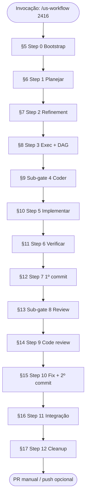

# FAQ — US Delivery Workflow

> **Nota de arquitetura (v9.1):** Steps 0–11 delegam seu conteúdo funcional a skills dedicadas (`00`–`07`). Stack detectada via `config.json`; ferramentas via `tools.md`. Projeto-agnóstico. Step 13 opcional via `--full`. A mecânica de orquestração (fases, gates, worktrees, banners, state.md) permanece válida.

> **Público:** desenvolvedores, líderes técnicos e agentes que precisam entender **como funciona** o pipeline ponta a ponta de entrega de User Stories.  
> **Ordem deste documento:** as seções seguem a **sequência de execução** (F0→F6, steps 0–12; 13 com `--full`), da invocação inicial até o fechamento.  
> **Complementa:** [`README.md`](../README.md) · [`SKILL.md`](../SKILL.md) · [`DIAGRAM.md`](../DIAGRAM.md)

---

## Índice rápido *(ordem de execução)*

| # | Seção | Momento no pipeline |
|---|--------|---------------------|
| 1 | [Visão geral](#1-visão-geral) | — |
| 2 | [O que faz e não faz](#2-o-que-o-workflow-faz-e-não-faz) | — |
| 3 | [Linha do tempo](#3-linha-do-tempo-ordem-de-execução) | Mapa completo |
| 4 | [Como iniciar](#4-como-iniciar-inputs-e-modos) | Antes do Step 0 |
| 5 | [**F0 — Step 0: Inicialização**](#5-f0--step-0-inicialização-do-workflow) | Bootstrap |
| 6 | [**F1 — Step 1: Planejamento**](#6-f1--step-1-planejamento-e-brainstorm) | Especificação |
| 7 | [**F1 — Step 2: Refinement**](#7-f1--step-2-refinement) | Especificação |
| 8 | [**F1 — Step 3: Exec + DAG**](#8-f1--step-3-plano-de-execução-e-dag) | Especificação |
| 9 | [**Sub-gate 4: Coder readiness**](#9-sub-gate-4-preparação-para-codificação) | F1→F2 |
| 10 | [**F2 — Step 5: Implementação**](#10-f2--step-5-implementação-dag) | Implementação |
| 11 | [**F3 — Step 6: Verificação**](#11-f3--step-6-verificação-e-relatório) | Verify |
| 12 | [**F3 — Step 7: 1º commit**](#12-f3--step-7-decisão-e-1º-commit) | Verify + G2 |
| 13 | [**Sub-gate 8: Review readiness**](#13-sub-gate-8-preparação-para-code-review) | F3→F4 |
| 14 | [**F4 — Step 9: Code review**](#14-f4--step-9-code-review) | Review |
| 15 | [**F4 — Step 10: Fix + 2º commit**](#15-f4--step-10-correções-2º-commit-e-relatório) | Review + G2 |
| 16 | [**F5 — Step 11: Integração**](#16-f5--step-11-validação-de-integração-e-pré-pr) | Pré-PR |
| 17 | [**F6 — Step 12: Fechamento**](#17-f6--step-12-consolidação-e-limpeza-final) | Cleanup + G3 |
| 18 | [Gates e navegação](#18-gates-navegação-e-checkpoints) | Transversal |
| 19 | [Artefatos e estado](#19-artefatos-e-estado-compartilhado) | Transversal |
| 20 | [Modos especiais](#20-modos-especiais-auto-dry-run-skip) | Transversal |
| 21 | [Troubleshooting](#21-troubleshooting) | — |

---

## 1. Visão geral

### O que é o US Delivery Workflow?

É um **pipeline orquestrado** para entregar uma User Story (ou feature descrita em texto livre) no Matrix, de ponta a ponta: plano → implementação → verificação → code review → validação de integração → fechamento. O **orquestrador** (agente principal) coordena **subagentes** dedicados por step, mantém estado persistente e aplica **gates de autorização** antes de qualquer efeito colateral (commit, push, edição de código).

**Evidência:** [`README.md`](../README.md), [`SKILL.md`](../SKILL.md) § Phase Architecture.

### Quem executa o quê?

| Papel | Responsabilidade |
|-------|------------------|
| **Orquestrador** | Estado, gates, dispatch de subagentes, checkpoints git, Progress Board — **não implementa código** |
| **Subagente** | Executa um step isolado (contexto limpo via `Task`, nunca `resume` entre steps) |
| **Usuário** | Decide nos gates (`AskQuestion`) — exceto em modo `auto` |

### O que são as 7 fases (F0–F6)?

Visão **humana** do pipeline. Internamente o `state.md` rastreia **steps 0–12** para checkpoints e revert.

| Fase | Nome | Steps |
|------|------|-------|
| F0 | Bootstrap | 0 |
| F1 | Especificação | 1, 2, 3 |
| F2 | Implementação | 4†, 5 |
| F3 | Verificação + 1º commit | 6, 7 |
| F4 | Review + correções | 8†, 9, 10 |
| F5 | Integração pré-PR | 11 |
| F6 | Fechamento | 12 |

† Steps **4 e 8** são **sub-gates de modelo** — não entram em `completedSteps`.

---

## 2. O que o workflow faz e não faz

### O que faz?

| # | Ação | Steps |
|---|------|-------|
| 1 | Busca snapshot da issue GitHub da US | 0 |
| 2 | Gera plano detalhado .NET 10 + React | 1 |
| 3 | Refina lacunas (refinement) | 2 |
| 4 | Quebra em tarefas DAG paralelizáveis | 3 |
| 5 | Implementa código por níveis do DAG | 5 |
| 6 | Verifica implementação vs plano | 6 |
| 7 | Commita implementação aprovada | 7 |
| 8 | Code review local (diff vs `master`) | 9 |
| 9 | Corrige achados + 2º commit | 10 |
| 10 | Valida integração (API, testes, browser opcional) | 11 |
| 11 | Limpa temporários, consolida docs, consentimento de push | 12 |

### O que **não** faz?

- Abrir ou atualizar Pull Request ([`fix-pr`](../08-fix-pr/SKILL.md) é **manual**, após Step 12)
- Push automático para remote (só com consentimento explícito no Step 12)
- Commit sem gate G2 explícito (Steps 7, 10, 11)
- Inferir "sim" quando o usuário cancela um `AskQuestion` (HS-1)

**Evidência:** [`SKILL.md`](../SKILL.md) § Allowed dependencies, § Authorization Ladder.

---

## 3. Linha do tempo (ordem de execução)



| Etapa | Seção FAQ | Executor | Gate após |
|-------|-----------|----------|-----------|
| 0 | [§5](#5-f0--step-0-inicialização-do-workflow) | Orquestrador | Transition → Step 1 |
| 1 | [§6](#6-f1--step-1-planejamento-e-brainstorm) | Subagente Planner | Transition → Step 2 |
| 2 | [§7](#7-f1--step-2-refinement) | Subagente Planner | Transition → Step 3 |
| 3 | [§8](#8-f1--step-3-plano-de-execução-e-dag) | Subagente Planner | Transition + sub-gate 4 → Step 5 |
| 4† | [§9](#9-sub-gate-4-preparação-para-codificação) | Orquestrador | Embutido no gate F1→F2 |
| 5 | [§10](#10-f2--step-5-implementação-dag) | Subagente Coder | Transition → Step 6 |
| 6 | [§11](#11-f3--step-6-verificação-e-relatório) | Subagente Verifier (readonly) | Transition → Step 7 |
| 7 | [§12](#12-f3--step-7-decisão-e-1º-commit) | Orquestrador + subagente + shell | G2 + sub-gate 8 → Step 9 |
| 8† | [§13](#13-sub-gate-8-preparação-para-code-review) | Orquestrador | Embutido no gate F3→F4 |
| 9 | [§14](#14-f4--step-9-code-review) | Subagente Reviewer | Transition → Step 10 |
| 10 | [§15](#15-f4--step-10-correções-2º-commit-e-relatório) | Subagente Coder + shell | G2 → Step 11 |
| 11 | [§16](#16-f5--step-11-validação-de-integração-e-pré-pr) | Subagente + browser + shell | Transition → Step 12 |
| 12 | [§17](#17-f6--step-12-consolidação-e-limpeza-final) | Orquestrador + shell | G3 push consent |

---

## 4. Como iniciar (inputs e modos)

### Como invoco o workflow?

```text
@[us-workflow] 2416
/us-workflow US 2416
@[us-workflow] auto 2416
@[us-workflow] dry-run 2416
@[us-workflow] auto skip-integration 2416
@[us-workflow] us-2375.plan.md
@[us-workflow] soft-delete em fornecedores
```

### Qual o input de cada forma?

| Input | O que o Step 0 interpreta |
|-------|---------------------------|
| Número (`2416`) | Issue no GitHub → pasta `.cursor/plans/us-2416/` |
| `us-2375.plan.md` | Retoma/continua a partir de plano existente |
| Texto livre (`soft-delete em fornecedores`) | Feature sem US — slug como pasta |
| `auto` / `automatico` | `autoMode: true` — sem menus interativos |
| `dry-run` / `simular` | `dryRun: true` — simulação sem side effects |
| `skip-integration` | `skipIntegration: true` — pula Step 11 inteiro |
| `skip-tests` | `skipTests: true` — pula suites de teste (build continua) |

### O que acontece se já existe workflow ativo?

Em **modo normal**, o Step 0 verifica `.cursor/plans/*/*.state.md` e oferece menu: continuar, reiniciar do zero ou iniciar novo workflow. Em **modo auto**, retoma apenas workflow `autoMode: true` **da mesma US**; ignora outros ativos.

### Qual o output global ao final?

- Código commitado na branch de trabalho (`state.branch`)
- Artefatos em `.cursor/plans/us-{id}/` (plano, relatórios)
- `state.md` com `status: completed`
- Opcionalmente: push (consentimento Step 12) — PR manual pelo desenvolvedor

---

## 5. F0 — Step 0: Inicialização do Workflow

### O que é o Step 0?

**Bootstrap** do pipeline. O orquestrador prepara o ambiente: parseia flags, cria ou retoma estado, captura baseline git, **resolve especificação** (`*.spec.md` — de US id (issue GitHub) ou arquivo local) e renderiza o Progress Board inicial. **Não dispara subagente.**

### Como é feito?

1. Parse de `workflow-id`, flags (`dryRun`, `autoMode`, `skipIntegration`, `skipTests`) e **entrada** (US id **ou** `*.spec.md`)
2. Verificação de workflows ativos (resume ou novo)
3. Criação de `{us-dir}/{workflow-id}.state.md` em `.cursor/plans/{slug}/`
4. Captura de baseline: `baselineCommit`, `preExistingDirty`, tag `before-step-1`
5. **Specification Protocol:** modo GitHub → `gh issue view {n}` + `github-issue-to-spec.py` → `{slug}.spec.md`; modo local → copiar/usar spec existente
6. **Memory & Decisions Consultation** (protocolo): ler primeiro as seções `## Workflow memory`, `## Accumulated decisions` e `## Doc consolidation log` do `state.md` (em resume) e depois consultar `MEMORY.md` (raiz) só no escopo relevante
7. Progress Board inicial + Transition Gate → Step 1 (ou auto-advance em `autoMode`)

### Input

| Campo | Origem |
|-------|--------|
| US id **ou** `*.spec.md` | Mensagem do usuário |
| Flags de modo | `auto`, `dry-run`, `skip-*` na invocação |
| Config GitHub | `gh` CLI autenticado (`gh auth status`) |
| Estado anterior | `{workflow-id}.state.md` (se resume) |

### Output

| Artefato | Caminho |
|----------|---------|
| Estado do workflow | `.cursor/plans/{slug}/{workflow-id}.state.md` |
| **Spec canônico** | `.cursor/plans/{slug}/{slug}.spec.md` |
| Snapshot issue GitHub (opcional) | `.cursor/plans/{slug}/{slug}.issue.json` |
| Checkpoint git | Tag local `uswf/{workflow-id}/before-step-1` |
| Progress Board | Renderizado no chat |

### Perguntas frequentes

**O Step 0 altera código?** Não. Nível de autorização G0 (leitura).

**O que é `workflow-id`?** Identificador único da execução (ex.: `us-2416-20260621T214006`), distinto do número da US.

**Posso validar o estado?** Opcionalmente: `python .agents/skills/us-workflow/scripts/validate_state.py {workflow-id}`.

---

## 6. F1 — Step 1: Planejamento e Brainstorm

### O que é o Step 1?

Geração do **plano detalhado** da US no padrão .NET 10 + React: escopo, design técnico, passos de implementação, permissões, testes e checklist.

### Como é feito?

Subagente `generalPurpose` (modelo Planner) executa o **Context Loading Protocol**: lê rules, docs, glossário, snapshot da issue e `MEMORY.md`. Produz `us-{id}.plan.md` com seções 0–8 (Resumo, DoR, Design, Passo a Passo, Permissões, Testes, Restrições, Checklist, Perguntas em Aberto).

### Input

| Campo | Origem |
|-------|--------|
| `state.md` | Contexto do workflow |
| `us-{id}.issue.json` | Critérios de aceite, descrição da issue |
| Rules/docs | Via Context Loading Protocol |
| `MEMORY.md` | Patterns e traps |

### Output

| Artefato | Caminho |
|----------|---------|
| Plano | `.cursor/plans/us-{id}/us-{id}.plan.md` |
| `step-output` | Bloco no retorno do subagente (status, summary, artifacts) |

### Gate após Step 1

**Transition Gate:** Avançar → Step 2 | Repetir | Voltar | Pausar.

---

## 7. F1 — Step 2: Refinement

### O que é o Step 2?

**Refinement** — interrogatório ativo de lacunas no plano antes da implementação (skill `refine` = abreviação de *refinement*). Filosofia **grilling** ([Matt Pocock](https://github.com/mattpocock/skills/blob/main/skills/productivity/grilling/SKILL.md)): entrevistar ramo a ramo até **entendimento compartilhado** — ambiguidades, edge cases e contradições fechados até critérios testáveis.

### Como é feito?

Máquina de estados (**Refinement FSM**): Audit → Resolve → Escalate → Shared Understanding.

1. Subagente audita seções 0–8 do plano e cada AC (happy path, validação, auth, tenant, etc.) — ordena gaps pela **árvore de design** (escopo → domínio → auth → comportamento → edge cases)
2. Mantém **gap registry** (`blocking` vs `non-blocking`, `dependsOn`)
3. Resolve com evidência (**explora codebase antes de escalar** — código, docs, spec, MEMORY) ou escala ao usuário
4. Orquestrador apresenta **exatamente uma pergunta por rodada** (`AskQuestion`) + opção **Encerrar refinamento e avançar**
5. Máximo 3 rodadas de escalação; depois só responder ou encerrar
6. Após critérios técnicos (2d), gate **Shared Understanding** — usuário confirma antes de Step 3
7. Atualiza `plan.md` in-place e `## Refinement registry` no state

### Input

| Campo | Origem |
|-------|--------|
| `us-{id}.plan.md` | Step 1 |
| `us-{id}.issue.json` | Snapshot da issue |
| `MEMORY.md` | Traps conhecidas |
| Respostas do usuário | Gates de escalação |

### Output

| Artefato | Conteúdo |
|----------|----------|
| `us-{id}.plan.md` | Atualizado — §8 vazio, sem TBDs bloqueantes |
| `## Refinement registry` | No `state.md` |
| `## Accumulated decisions` | Decisões e `assumed-default` |

### Perguntas frequentes

**O que é um gap `blocking`?** Impede testes objetivos ou muda escopo/AC — exige resposta ou default explícito.

**Posso pular o refinement?** Parcialmente — **Encerrar refinamento e avançar** aplica defaults recomendados, mas ainda exige o gate **Shared Understanding** antes de Step 3.

**Posso ir direto para implementação sem confirmar entendimento?** Não — Step 3 só após **Confirmo entendimento compartilhado** (gate 2e), exceto em `autoMode` com `blocking_open: 0`.

**O subagente pode retornar `success` com lacunas bloqueantes?** Não, se `refineRound < 1` e nenhum `assumed-default` foi logado.

---

## 8. F1 — Step 3: Plano de Execução e DAG

### O que é o Step 3?

Transforma o plano refinado em **tarefas atômicas** com dependências, prompts literais para o Coder e um **DAG** de execução paralela.

### Como é feito?

1. Roda **Memory-Conflict Protocol** (`check_memory_conflict.py` vs `MEMORY.md`)
2. Divide o plano em tasks `T1`, `T2`, … com `files[]`, `acceptance`, `coderPrompt`, `dependsOn`
3. Monta níveis topológicos (`levels`) — até **3 tasks paralelas** por nível, sem overlap de arquivos
4. Gera `plan.exec.md` (narrativa) e `exec.dag.json` (máquina)

### Input

| Campo | Origem |
|-------|--------|
| `us-{id}.plan.md` | Steps 1–2 |
| Resultado memory-conflict | Script Python |
| `state.md` | Contexto |

### Output

| Artefato | Caminho |
|----------|---------|
| Plano de execução | `.cursor/plans/us-{id}/us-{id}.plan.exec.md` |
| DAG JSON | `.cursor/plans/us-{id}/us-{id}.exec.dag.json` |

Formato DAG: `{"targetModel":"...", "tasks":[...], "levels":[["T1"],["T2","T3"]]}`

### Gate após Step 3

**Transition Gate F1→F2** — inclui **sub-gate 4** (troca de modelo Coder) antes de disparar Step 5.

---

## 9. Sub-gate 4: Preparação para Codificação

### O que é o Step 4?

**Não é um step do board.** É um **sub-gate de modelo** na transição F1→F2, embutido no gate após o Step 3. Garante que o LLM atual é adequado para codificação (classe Coder).

### Como é feito?

Orquestrador inspeciona `currentModel` no state:
- Se já é Coder-class → avança automaticamente
- Senão → menu: **Confirmar troca para modelo Coder** (recomendado) | Continuar com atual (warning) | Pausar
- Log em `## Gate history`: `model-gate | F1→F2 | …`
- **Nunca** adiciona `4` a `completedSteps`

### Input / Output

| | |
|---|---|
| **Input** | Modelo LLM atual, preferência do usuário |
| **Output** | Log no gate history; dispatch do Step 5 |

---

## 10. F2 — Step 5: Implementação (DAG)

### O que é o Step 5?

**Implementação do código** seguindo o DAG, nível a nível, com isolamento por worktree (ou branch-direct no Windows/paths longos).

### Como é feito?

1. Orquestrador decide **Worktree Fallback**: `step-worktree` ou `branch-direct`
2. Em worktree: cria `.cursor/plans/us-{id}/worktrees/step-5/` na branch `state.branch`
3. Para cada nível do DAG: até 3 subagentes `generalPurpose` (Coder) em paralelo
4. Cada task implementa conforme `coderPrompt` e `files[]` do JSON
5. Após cada nível: atualiza `completedTasks` no Progress Board
6. Ao final: **Post-step verification** (arquivos no disco, diff esperado, build/testes)
7. Merge do worktree → branch principal; remove worktree
8. **HS-3/HS-4** se `files_touched` vazio ou arquivos esperados ausentes

### Input

| Campo | Origem |
|-------|--------|
| `us-{id}.plan.exec.md` | Step 3 |
| `us-{id}.exec.dag.json` | Step 3 |
| `state.md` | Branch, manifest |
| Tag âncora | `uswf/{id}/before-step-5` |

### Output

| Artefato | Conteúdo |
|----------|----------|
| Código alterado | `src/Matrix.`, `web/src/` (não commitado ainda) |
| `## Step file log` | Paths tocados no state |
| `verification` block | Build/testes locais no step-output |
| `learning` | Patterns/traps candidatos |

### Perguntas frequentes

**Por que worktree?** Isola edições do step; permite revert cirúrgico via checkpoint.

**O que é branch-direct?** Fallback quando worktree falha (Windows, path longo) — edita direto na branch.

**Dry-run no Step 5?** Simula apenas; registra o que *seria* alterado, sem tocar arquivos.

---

## 11. F3 — Step 6: Verificação e Relatório

### O que é o Step 6?

**Auditoria readonly** da implementação contra o plano e os ACs da US. Gera tabela de qualidade feature a feature.

### Como é feito?

Subagente `generalPurpose` com `readonly: true` (Verifier):
1. Compara código vs `plan.md` e ACs da issue
2. Gera `us-{id}.plan.report.md` com tabela estruturada

Colunas da tabela:
- **Feature / AC**
- **Status:** Implementada | Falta implementar | Divergente
- **Qualidade:** Excelente | Regular | Insuficiente
- **Notas:** evidências (path/símbolo), edge cases faltantes

### Input

| Campo | Origem |
|-------|--------|
| Código na branch | Step 5 |
| `us-{id}.plan.md` | Steps 1–2 |
| `us-{id}.issue.json` | Snapshot |

### Output

| Artefato | Caminho |
|----------|---------|
| Relatório de verificação | `.cursor/plans/us-{id}/us-{id}.plan.report.md` |

---

## 12. F3 — Step 7: Decisão e 1º Commit

### O que é o Step 7?

**Gate G2** — o usuário decide se aprova a implementação e faz o **primeiro commit**, refaz com outro modelo Coder, ou repete a verificação.

### Como é feito?

1. Orquestrador exibe resumo do relatório Step 6
2. Menu `AskQuestion`:
   - **Aprovar, validar build/testes e commitar** (recomendado)
   - **Refazer implementação com outro modelo Coder** (= Backward Navigation ao Step 5)
   - **Repetir verificação** (re-run Step 6)
   - **Pausar / cancelar**
3. Se aprovado: **Build & Test Validation Protocol** — comandos exatos em [`stack.md`](../stack.md) § Validation & Quality Commands (testes se `skipTests: false`). Se houver falha, o step pode disparar subagente de apoio para corrigir e revalidar antes do commit.
4. Shell: stage apenas arquivos do workflow (não `git add .`), commit `feat(us-{id}): implementação US {id}`
5. Log: `step-7-commit | {sha}` em `commits[]` e `## Gate history`
6. Sub-gate 8 embutido no gate de avanço → Step 9

### Input

| Campo | Origem |
|-------|--------|
| `us-{id}.plan.report.md` | Step 6 |
| Código unstaged | Step 5 |
| Decisão do usuário | Gate G2 |

### Output

| Artefato | Conteúdo |
|----------|----------|
| Commit | `{sha, step: 7, message}` em `commits[]` |
| Branch atualizada | Código commitado em `state.branch` |

### Perguntas frequentes

**Pode commitar sem o usuário escolher?** Não — HS-2 proíbe commit oportunístico.

**E se o build falhar?** Não commita; oferece retry ou pausa.

**`skip-tests` afeta o Step 7?** Sim — roda só build; `verification.tests: skipped`.

---

## 13. Sub-gate 8: Preparação para Code Review

### O que é o Step 8?

**Sub-gate de modelo** na transição F3→F4, embutido no gate após o Step 7. Garante LLM adequado para review (classe thinking/reviewer).

### Como é feito?

Mesma lógica do sub-gate 4:
- Se já é reviewer-class → avança
- Senão → menu de troca de modelo
- Log: `model-gate | F3→F4 | …`
- **Nunca** em `completedSteps`

### Input / Output

| | |
|---|---|
| **Input** | Modelo LLM atual |
| **Output** | Log; dispatch do Step 9 |

---

## 14. F4 — Step 9: Code Review

### O que é o Step 9?

**Code review local** do diff da branch vs `master`, usando a skill interna [`code-review`](../06-code-review/SKILL.md) — mesma metodologia do [`fix-pr`](../08-fix-pr/SKILL.md).

### Como é feito?

1. Subagente Reviewer carrega `.agents/skills/06-code-review/SKILL.md`
2. Escopo: diff definido em [`stack.md`](../stack.md) § **Code Review Diff Scope (Step 9)**, limitado ao manifest do workflow (`{base_branch}` detectado dinamicamente — ver `stack.md` § Dynamic Environment Detection)

3. Análise em **duas fases** (triagem → investigação com prova)
4. **Generalização por classe** de defeito — reporta todas as ocorrências
5. Score gate: reporta apenas issues com score ≥ 6
6. **Não corrige** — só detecta (correções no Step 10)

### Input

| Campo | Origem |
|-------|--------|
| Diff escopado | `{base_branch}...HEAD` (ver `stack.md`) |
| `workflowManifest` | State — paths desta US |
| Skill `code-review` | Metodologia |

### Output

| Artefato | Conteúdo |
|----------|----------|
| Relatório de review | Critical / Warning / Suggestion com Análise, Caminhos, Score |
| Ou | **"Sem feedback"** se limpo |

---

## 15. F4 — Step 10: Correções, 2º Commit e Relatório

### O que é o Step 10?

Corrige achados do Step 9 (por **classe de defeito**, não só instância), faz o **segundo commit** e gera o relatório de entrega.

### Como é feito?

1. Subagente Coder (+ shell) — orquestrador **nunca** implementa fixes
2. Worktree step-10 (ou branch-direct)
3. Corrige issues do Step 9 + varre ocorrências irmãs do mesmo padrão
4. Build & Test Validation Protocol
5. Merge worktree → branch
6. **Gate G2** explícito → commit `fix(us-{id}): correções pós-review`
7. Gera `us-{id}.report.md` (resumo de entrega)
8. Learning protocol acumula candidatos

### Input

| Campo | Origem |
|-------|--------|
| Relatório Step 9 | Critical/Warning list |
| Código na branch | Pós Step 7 |

### Output

| Artefato | Caminho |
|----------|---------|
| Código corrigido | Commitado |
| Relatório de entrega | `.cursor/plans/us-{id}/us-{id}.report.md` |
| Commit | `{sha, step: 10}` em `commits[]` |

---

## 16. F5 — Step 11: Validação de Integração e Pré-PR

### O que é o Step 11?

**Bateria de validação** antes da PR: plano de testes de integração, execução (build, testes, seed, API, browser opcional) e loop de correção.

### Como é feito?

**Se `skipIntegration: true`:** step inteiro pulado → Step 12.

Caso contrário:
1. Gera `us-{id}.integration-test.plan.md` a partir dos ACs
2. Exibe plano ao usuário (gate de confirmação — pulado em `auto`)
3. Se aprovado:
   - §1–§5: build, testes, seed, API/permissões/segurança
   - §6 browser: **só** se `autoMode: false` **e** `dryRun: false`
4. Gera `us-{id}.integration-test.report.md`
5. Loop de correção (máx. 3 iterações) se houver falhas
6. Opção **Pular validação** → Step 12 com warning

### Input

| Campo | Origem |
|-------|--------|
| ACs / plano / relatórios | Steps 1–10 |
| Flags | `skipIntegration`, `skipTests`, `autoMode`, `dryRun` |
| Ambiente local | API, DB seed, credenciais |

### Output

| Artefato | Caminho |
|----------|---------|
| Plano de testes | `.cursor/plans/us-{id}/us-{id}.integration-test.plan.md` |
| Relatório | `.cursor/plans/us-{id}/us-{id}.integration-test.report.md` |
| Commits de fix | `{sha, step: 11}` (se loop de correção) |

### Perguntas frequentes

**Browser roda em `auto`?** Nunca. UI ACs marcados como `⏭ pulado`.

**Qual a diferença entre `skip-integration` e "Pular validação"?** `skip-integration` é flag na invocação (pula step inteiro); "Pular validação" é escolha no gate do Step 11.

**Quantas iterações de correção?** Máximo 3; depois hard stop ou aceitar com ressalvas.

---

## 17. F6 — Step 12: Consolidação e Limpeza Final

### O que é o Step 12?

**Fechamento** do workflow: sweep final da consolidação de documentação (§Doc), eventuais ajustes remanescentes em `MEMORY.md`, limpeza de temporários e **consentimento de push** (G3).

### Como é feito?

1. Gate: consolidar docs + limpar temporários?
2. **Learning write flow final:** revisar candidatos ainda pendentes para `MEMORY.md` (só patterns técnicos genéricos, gate do usuário)
3. Atualiza `state.md`: `status: completed`, `completedSteps: [0..12]`, `endedAt`
4. Progress Board final (todos `[x]`)
5. Limpeza opcional:
   - `plan.exec.md`, `exec.dag.json`
   - Worktrees `step-*/`
   - Branches `uswf/{id}/step-*`
   - Baseline/archive internos
   - Tags checkpoint `uswf/{id}/*`
6. **Push consent (G3):** pergunta se deseja push — nunca automático
7. Lembrete: **abrir PR é manual** (fora do escopo)

### Input

| Campo | Origem |
|-------|--------|
| `learning` acumulado | Todos os steps que produziram aprendizado relevante |
| `## Doc consolidation log` | Todos os steps |
| Commits na branch | Steps 7, 10, 11 |

### Output

| Artefato | Conteúdo |
|----------|----------|
| `state.md` | `status: completed` |
| `MEMORY.md` | Atualizado (se aprovado) |
| Branch limpa | Sem worktrees/tags locais do workflow |

---

## 18. Gates, navegação e checkpoints

### O que é o Transition Gate?

Menu `AskQuestion` após cada step: **Avançar** | **Repetir** | **Voltar (Previous)** | **Pausar**. Em modo normal, o próximo step só dispara **após** a seleção.

### O que é a Authorization Ladder?

| Nível | Operação | Gate |
|-------|----------|------|
| G0 | Leitura | Nenhum |
| G1 | Editar arquivos | Transition gate |
| G2 | `git commit` | Steps 7, 10, 11 |
| G3 | `git push` | Step 12 apenas |

### O que são os checkpoints git?

Tags locais **nunca pushed**:

```text
uswf/{workflow-id}/before-step-1   # baseline (Step 0)
uswf/{workflow-id}/before-step-2   # antes do Step 1
…
uswf/{workflow-id}/before-step-13  # após Step 12
```

Usados pelo **Checkpoint Revert Algorithm** para voltar/repetir steps sem afetar arquivos pré-existentes fora do workflow.

### O que é Backward Navigation?

Voltar a **qualquer step já concluído** (1–3, 5–7, 9–11):
1. Escolher fase → step alvo `M`
2. Preview do que será desfeito vs preservado
3. Confirmar → revert + redispatch do Step M

**Desabilitado em `autoMode`** — sugerir mudar para modo normal.

### O que é State Hygiene?

Após cada step o orquestrador sincroniza `## Step file log`, manifest, `completedSteps` e valida existência de arquivos/commits **antes** do Progress Board. Falha → **HS-5** (stop).

---

## 19. Artefatos e estado compartilhado

### Onde ficam os arquivos?

Tudo sob `.cursor/plans/us-{id}/` — **nada** em `.agents/`.

| Artefato | Caminho |
|----------|---------|
| Estado | `{workflow-id}.state.md` |
| Issue GitHub | `us-{id}.issue.json` |
| Plano | `us-{id}.plan.md` |
| Exec | `us-{id}.plan.exec.md` |
| DAG | `us-{id}.exec.dag.json` |
| Verificação | `us-{id}.plan.report.md` |
| Entrega | `us-{id}.report.md` |
| Testes integração | `us-{id}.integration-test.plan.md` / `.report.md` |
| Worktrees (gitignored) | `worktrees/step-{N}/` |
| Memória compartilhada | `MEMORY.md` (raiz) |

### O que é o `step-output`?

Contrato de retorno de cada subagente:

| Campo | Descrição |
|-------|-----------|
| `status` | `success` \| `partial` \| `failed` \| `needs_user` |
| `step` | Número do step |
| `artifacts[]` | Paths + `exists: true/false` |
| `summary` | 3–5 bullets para o usuário |
| `evidence` | Comandos/checks executados |
| `decisions` | Decisões de domínio |
| `learning` | Pattern/trap candidato ou `N/A` |
| `errors` + `retry_hint` | Para retry (máx. 3) |

### O que é o Progress Board?

Checklist markdown em pt-BR renderizado no chat: progresso steps 0–12, tasks DAG (Step 5), artefatos-chave. Comando `/status` renderiza só o board, sem dispatch.

---

## 20. Modos especiais (auto, dry-run, skip)

### Modo automático (`auto`)

| Aspecto | Comportamento |
|---------|---------------|
| Gates | Sempre opção recomendada (primeira) |
| Dispatch | Próximo step no **mesmo turno** |
| Resume | Só workflow `autoMode: true` da **mesma US** |
| Browser | Nunca no Step 11 |
| Prefixo | `[AUTO]` nas mensagens |
| Hard stops | HS-3, HS-4, HS-5 ainda pausam |

### Dry-run (`dry-run`)

| Aspecto | Comportamento |
|---------|---------------|
| Código | Steps 5, 10, 11 **não editam** `src/Matrix.`/`web/src/` |
| Commits | Simulados apenas |
| Worktrees | Não criados |
| MEMORY.md | Não alterado |
| Browser | Nunca |
| Prefixo | `[DRY-RUN]` |

### `skip-integration`

Pula **Step 11 inteiro** — sem plano, sem bateria, sem browser. Vai direto ao Step 12.

### `skip-tests`

Pula os comandos de **teste** em [`stack.md`](../stack.md) nos Steps 7, 10 e §3 do Step 11. **Build continua** — commit nunca em build quebrado.

---

## 21. Troubleshooting

### O workflow parou com HS-5 — o que fazer?

State Hygiene falhou (arquivo/commit esperado ausente). Verifique `state.md` vs disco; rode `validate_state.py`. Corrija inconsistência e retome com `/us-workflow {id}`.

### Step 5 retornou success mas arquivos não existem (HS-4)

Tratado como FAILED. Orquestrador oferece retry (até 3x com backoff 0s/30s/60s).

### Quero voltar ao Step 1 depois de implementar

Use **Backward Navigation** no Transition Gate (modo normal): Previous → Planejamento → Step 1. Preview + confirm → Checkpoint Revert.

### Worktree falhou no Windows

**Worktree Fallback** usa `branch-direct` — edita na branch sem worktree. Logado no state.

### Posso retomar depois de pausar?

Sim: `/us-workflow {id}` ou `@[us-workflow] {id}` — Step 0 detecta estado ativo e oferece continuar.

### O orquestrador implementou código no Step 10 — é bug?

Sim — violação das Conduct Rules. Steps 5/10/11 code work é **sempre** subagente Coder.

### Onde está a especificação completa?

[`SKILL.md`](../SKILL.md) — fonte de verdade para o orquestrador. Este FAQ é guia humano; em caso de divergência, prevalece o agente.

---

## Mapa de evidências

| Tópico | Arquivo |
|--------|---------|
| Visão geral e happy path | [`README.md`](../README.md) |
| Steps, protocols, gates | [`SKILL.md`](../SKILL.md) |
| Diagramas Mermaid | [`DIAGRAM.md`](../DIAGRAM.md) |
| Validação de state | [`scripts/validate_state.py`](../scripts/validate_state.py) |
| Memory conflict | [`scripts/check_memory_conflict.py`](../scripts/check_memory_conflict.py) |
| Code review (Step 9) | [`.agents/skills/06-code-review/SKILL.md`](../06-code-review/SKILL.md) |
| GitHub issue fetch | [`scripts/github-issue-to-spec.py`](../scripts/github-issue-to-spec.py) (via `gh issue view {n}`) |
