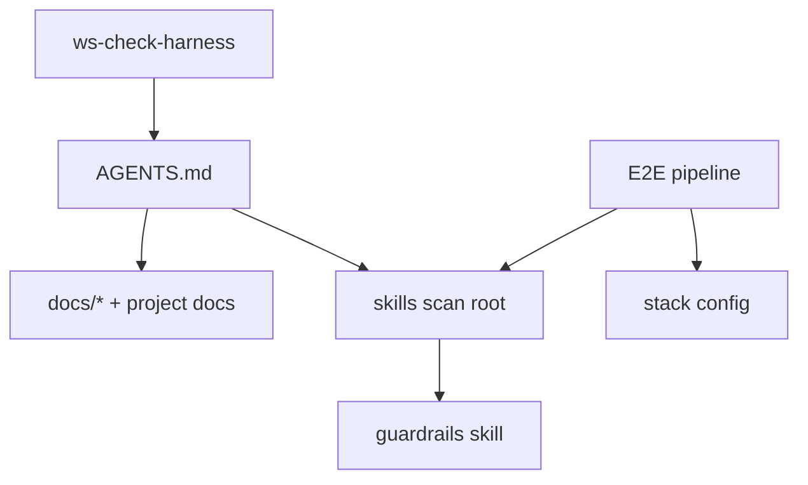

# Check Harness — Scan Scope & Phases

Load this file when running a ws-check-harness audit (after `SKILL.md` Step 1 begins).

Contains: canonical scan inventory (§ Scan scope) and Phases 0–7 methodology.

## Hub resolution details (Phase 0)

Detect **Install mode** and **Skills scan root** before routing audits (summary also in `SKILL.md`). Execution `Mode` (`normal` | `dry-run`) is orthogonal — do not conflate it with Install mode.

| Install mode | Detection (required evidence) | Primary hub | Skills scan root | Integrity gate |
|--------------|------------------------------|-------------|------------------|----------------|
| **upstream** | `bin/skill-dependencies.json` **and** `bin/cli.js` **and** at least one `.agents/skills/ws-*/SKILL.md` | Root `AGENTS.md` (+ dual-hub drift vs `{sharedDir}/AGENTS.md`) | `.agents/skills` | Required (Phase 3 item 7) |
| **consumer** | Upstream evidence incomplete (markers and/or SoT absent); typically `{sharedDir}/AGENTS.md` present | `{sharedDir}/AGENTS.md` (`.agents/skills/ws-shared/AGENTS.md`) | `{skillsRoot}` (+ optional `{globalSkillsRoot}` hybrid) | Skip / not required |

**Hard rule:** Package markers (`bin/skill-dependencies.json` + `bin/cli.js`) **without** `.agents/skills` SoT ⇒ **Install mode: consumer** for skills inventory. Optional one-line informational note only (markers present, SoT absent) — not a problem-count item. Do **not** select `.agents/skills` as upstream skills scan root without SoT evidence.

**Consumer ignores stray `src/skills`:** When Install mode is consumer, do not scan a folder named `src/skills` for Phase 4 inventory even if it exists.

**Verification (Install mode):** At an upstream package root → report `Install mode: upstream` + skills scan root `.agents/skills`. In a consumer tree with only `{skillsRoot}` / global install → `Install mode: consumer` + scan root under `.agents/skills` and/or `{globalSkillsRoot}`.

**Consumer rules:**

- Primary hub is always `.agents/skills/ws-shared/AGENTS.md` when present. Missing root `AGENTS.md` is **OK** when `defaults.autoload` is false/omitted/missing. Thin root pointer is **OK**.
- Do **not** warn that root lacks skill loading when the ws-shared hub has it.
- Route Phase 4 against **ws-shared/AGENTS.md** (and root only if it also lists skills).
- If root `AGENTS.md` is absent or product-owned: do **not** emit a correction-plan item **unless** effective `defaults.autoload` is `true` (see flag-gated bullet below). At most a one-line informational note suggesting a thin pointer when the flag is off.
- Links to `ws-shared/config.json` are healthy when the file exists. Unconfigured seed placeholders → **informational** (`ws-configure-project`), not a correction-plan item.
- Empty optional rule keys (e.g. `rules.seniorDeveloper: ""`) must **not** appear as numbered correction-plan items.
- Missing `config.json` when `config.json.example` exists → **warning** (seed + ws-configure-project).
- Pipeline / orch / provider skills may be intentionally omitted from the promoted table when the hub marks them orch-only.
- Sections titled **Extra package (optional)**: missing Extra skill paths are **intentional omission**. When Extra skills **are** on disk, they must appear in that section (else unrouted warning).
- Phase 5b sprawl on managed upstream skills → **Upstream debt (informational)**; do **not** count toward consumer “Problems found” unless the user asked to optimize those skills.
- **Dual-hub `ws-senior-developer`:** When consumer root `AGENTS.md` autoloads `ws-senior-developer` while `ws-shared/AGENTS.md` documents on-demand opt-in, treat as **intentional consumer override** — not hub drift, not a correction-plan item. Same when upstream root `AGENTS.md` autoloads for dogfood while ws-shared stays opt-in default.
- **Dual-hub via `autoload.md`:** When root `AGENTS.md` references `{sharedDir}/autoload.md` (or `.agents/skills/ws-shared/autoload.md`) and Always-applied skills differ from shared-hub on-demand defaults, treat as **intentional consumer root override** — not dual-hub drift. Missing root `AGENTS.md` remains **OK** when effective `defaults.autoload` is false/omitted.
- **`defaults.autoload` flag-gated root check:** Effective value is `true` only when project `config.json` exists and `defaults.autoload` is JSON boolean `true` (omitted/missing/not-true → false). When effective **true**: missing root `AGENTS.md`, or root that does not instruct loading Always-applied via an `autoload.md` reference → **critical** (suggest `ws-configure-project --section autoload`). When effective **false**: missing root remains **OK**. Helper SoT: `python {skillsRoot}/ws-configure-project/scripts/configure_autoload.py --check`.
- **`autoload.md` Always-applied (when file present):** For each skill id in the Always-applied table, path form must be repo-relative (`.agents/skills/...`) or a declared token (`{skillsRoot}` / `{globalSkillsRoot}`). Absolute author-machine paths → **critical**. If `SKILL.md` is missing from both `{skillsRoot}` and `{globalSkillsRoot}` → **warning** (suggest install skill or remove row). Optional helper: `python {skillsRoot}/ws-configure-project/scripts/configure_autoload.py --check`.

## Path token expand algorithm

Canonical contract: [`../ws-shared/tools.md`](../ws-shared/tools.md) § Path tokens.

1. If the cited string contains `{skillsRoot}` / `{sharedDir}` / `{plansDir}` / `{reviewsDir}` / `{us-dir}`, substitute from the map (nested: expand `{sharedDir}` after `{skillsRoot}` if needed).
2. Result is **repo-root-relative**. Check existence from **repo root**, not from the citing file’s directory.
3. If braces remain after known-token substitution, treat as **template** — do **not** flag broken.
4. Undeclared shorthand `ws-shared/MEMORY.md` → **warning** (prefer `{sharedDir}/MEMORY.md`).
5. Markdown link targets `(...)`: real relative or repo-root paths only (no brace tokens).

## Scan scope (canonical inventory)

Go through **all** artifacts below, in harness routing order (progressive disclosure):

### 1. Entry point

| File | Role |
|---------|--------|
| Resolved hub (§ Hub resolution) | Agent **hub** — skill loading, task router, verification (not human install docs) |
| Root `AGENTS.md` | Upstream: full hub. Consumer: optional thin pointer to `ws-shared/AGENTS.md` (absent is OK; never required by shipped skills) |
| `.agents/skills/ws-shared/AGENTS.md` | Consumer primary hub (always installed with workflows/full) |
| `README.md` | Human **README** — install, overview, contribute (not the skill router) |
| Optional host entry pointer | Thin file pointing at `AGENTS.md` when the consumer/host uses one — verify if present; **not required** |

Progressive disclosure flow: optional host entry → resolved hub → skill/doc on demand (specs via skills or `specs/AGENTS.md`, not via hub). Do not treat `README.md` as routing authority.

### 1b. Agents and orchestrators

Standalone agents (with `disable-model-invocation: true`) and orchestrators may live in `.agents/` or under `.agents/skills/`. Phase 4 discovers all `.md` files with YAML frontmatter containing `disable-model-invocation: true`.

Besides `ws-check-harness` itself (this file), projects may contain E2E pipelines (e.g., `ws-spec-to-pr/`), stack config files (e.g., `STACK.md`), and other orchestrators. Phase 4 scan enumerates the actual inventory; this section exists only as an entry point for the audit.

### 2. Optional project rules (`config.json.rules.*`)

Optional consumer rule paths are declared in `config.json` under `rules.*` (e.g. `efMigrations`, `viewPatterns`, `seniorDeveloper`). Audit only paths that are set and non-empty. Do **not** require a host-specific rules directory. Validate existence and links of each referenced path in `AGENTS.md` and in skills.

Phase 4 detects new or removed skills that diverge from declared routing; treat missing optional rule files as **warning** when the config key is set.

### 3. Skills (mode-aware skills scan root)

Skill inventory is driven by **Install mode** (§ Hub resolution). Each skill is typically a directory containing a `SKILL.md` with YAML frontmatter (`name:`, `description:`). Standalone `.md` files with frontmatter directly under the scan root are also treated as skills.

| Install mode | Discover `SKILL.md` under | Notes |
|--------------|---------------------------|-------|
| **upstream** | `.agents/skills` | Sole skill-content SoT. Hub literals under `.agents/skills/…` are filesystem-true. |
| **consumer** | `{skillsRoot}` (+ optional `{globalSkillsRoot}` with local override) | Install layout token `{skillsRoot}` (default `.agents/skills`). Ignore stray `src/skills`. |

**Phase 4** is the source of truth for the skill inventory: it scans the filesystem for `SKILL.md` under the **skills scan root** resolved in Phase 0, comparing against declared routing in the resolved hub (§ Hub resolution; `ws-shared/AGENTS.md` in consumer mode). Do not rely on hardcoded lists — the skills scan root on disk is the truth.

> **`name:` collision vs Local Override:** two `SKILL.md` files with the same `name:` within the same scope break skill resolution → report as **warning** and propose renaming one id or consolidating. However, when a local skill in `{skillsRoot}` shares the same `name:` as a global skill in `{globalSkillsRoot}`, the local project skill acts as an **intentional workspace override** → treat as a valid override (do NOT flag as a collision warning). (Consumer / hybrid installs only.)

Also inspect **docs/scripts** referenced by those skills (e.g., scripts in subfolders like `ws-spec-to-pr/scripts/`, `ws-fix-pr/scripts/`).

### 3b. Pipeline skill structure (canonical — when `ws-spec-to-pr` is present)

Phase 4 still **discovers** inventory from the **skills scan root** (§ 3). When this hub ships `ws-spec-to-pr` / `ws-spec-to-pr-lite`, use the table below as the **alignment contract** for Phases 2 / 5 (phantom paths, retired ids, Step↔folder drift). Expected folders are checked under the skills scan root: upstream → `.agents/skills/ws-*`; consumer → `{skillsRoot}/ws-*` (hub routing tables may still cite install-path literals `.agents/skills/...`). Consumers without the workflow package: skip § 3b checks.

| Folder (disk) | Frontmatter `name:` | FSM step (standard) | Role |
|---------------|---------------------|---------------------|------|
| `ws-write-spec` | `ws-write-spec` | 0 | Spec |
| `ws-write-plan` | `ws-write-plan` | 1 | Plan |
| `ws-interview` | `ws-interview` | 2 | Interview (plan grill) |
| `ws-plan-to-tasks` | `ws-plan-to-tasks` | 3 | DAG / exec |
| `ws-implement-tasks` | `ws-implement-tasks` | 4 build; 6 fix→re-review | Implement |
| `ws-verify-plan` | `ws-verify-plan` | 5 | Check-implementation |
| `ws-code-review` | `ws-code-review` | 6 | Local review |
| `ws-testing` | `ws-testing` | 7 | Testing (standard only; lite skips) |
| `ws-ship-pr` | `ws-ship-pr` | 8 | Delivery + push/PR |
| `ws-fix-pr` | `ws-fix-pr` | 9 | One-shot PR threads |
| `ws-goal-fix-pr` | `ws-goal-fix-pr` | 9 | Thread convergence loop |
| `ws-update-plan-implementation` | `ws-update-plan-implementation` | Post | Plan deltas after workflow |

**Rules:**

1. **Folder == frontmatter `name:`** for all twelve pipeline skills (`ws-*`). FSM step numbers stay `0`–`9` / Post in tables; they are **not** part of the folder name. `ws-goal-fix-pr` shares FSM step **9** with `ws-fix-pr`; `ws-update-plan-implementation` is **Post**.
2. **`name:` / folder** use the `ws-` prefix (e.g. `ws-testing`, `ws-goal-fix-pr`). No numeric `NN-` folder prefixes.
3. **`invocation_names`** should include bare short id and `ws-*` only — no retired `NN-*` folder aliases.
4. **Orchestrator dispatch** (`ws-spec-to-pr/STEP-DISPATCH.md`, orch `SKILL.md`): use `ws-*` folder ids. STEP-DISPATCH is **standard-only** (0–9); lite keeps its own 0–5 table.
5. **Upstream `bin/skill-dependencies.json`:** workflow package skill ids must match folder names on disk under the skills scan root (`.agents/skills/` when Install mode is upstream; `{skillsRoot}/` when consumer).

**Forbidden folder / path ids** (**critical** in orch dispatch / Layer 2 / `skill-dependencies.json` / live skill bodies; **warning** in human FAQ with an explicit LEGACY banner). Exempt: `CHANGELOG.md` history only:

| Forbidden (do not use as path or install id) | Canonical |
|----------------------------------------------|-----------|
| `00-write-spec` … `09-fix-pr` (numeric-prefixed folders) | matching `ws-*` folder |
| bare `goal-fix-pr` / `update-plan-implementation` as **folder** / install id | `ws-goal-fix-pr` / `ws-update-plan-implementation` |
| `07-integration-validation` | `ws-testing` |
| `08-fix-pr` | `ws-fix-pr` |
| `09-goal-fix-pr` / `10-goal-fix-pr` | `ws-goal-fix-pr` |
| `10-update-plan-implementation` / `11-update-plan-implementation` | `ws-update-plan-implementation` |
| `11-ship-pr` | `ws-ship-pr` |
| `ws-integration-validation` (as skill id / path) | `ws-testing` |
| Nested `ws-shared/<utility-skill>/` as skill folders | Top-level `.agents/skills/<skill>/` |
| `us-workflow` | `ws-spec-to-pr` |
| `writing-great-skills` | `ws-write-a-skill` |
| `.agents/skills/shared` / `skills/shared/` (retired hub folder) | `.agents/skills/ws-shared` / `skills/ws-shared/` |
| `hub.dir: "shared"` in `skill-dependencies.json` | `hub.dir: "ws-shared"` |
| `pathTokens.sharedDir` default `.agents/skills/shared` | `.agents/skills/ws-shared` |

#### Skill writing quality (optional — `ws-write-a-skill`)

When **`ws-write-a-skill`** is installed (shipped Extra or global), include in the Phase 6 plan optimization suggestions for harness skills — **read-only** during scan; edits only in Phase 7 with approval.

**Detection** (try in this order; stop at the first `SKILL.md` found):

| Typical location | Path |
|------------------|------|
| Upstream SoT (Install mode upstream) | `.agents/skills/ws-write-a-skill/SKILL.md` |
| Packaged Extra / consumer install | `.agents/skills/ws-write-a-skill/SKILL.md` |
| User-level skills directory for the host | host-specific user skills path containing `ws-write-a-skill/SKILL.md` |
| Agents global (alternative) | `~/.agents/skills/ws-write-a-skill/SKILL.md` |

If **no** path exists, **skip** this subsection — do not invent criteria nor duplicate the skill's content in the harness.

**Canonical reference:** load `ws-write-a-skill/SKILL.md` and, on demand, `GLOSSARY.md` in the same directory. Apply the skill's vocabulary (predictability, sprawl, duplication, sediment, premature completion, completion criterion, progressive disclosure, leading word, no-op) as a review lens — **do not** copy paragraphs into the report.

**Review scope:** each `SKILL.md` listed in the Phase 4 inventory (priority: workflow pipeline skills first, then auto-load skills, then others).

**What to propose in the plan** (severity `suggestion`, unless factual bug → `warning`):

| Finding | Example of proposed correction |
|--------|------------------------------|
| Sprawl | Extract format/template to sibling file (`PLAN-FORMAT.md`) with **context pointer** |
| Duplication | Remove duplicated prose; link to canonical source (`AGENTS.md` § External Dependencies / `rules.seniorDeveloper`, sibling skill) |
| Sediment | Changelog/version notes at top → `CHANGELOG.md` or a single line |
| Premature completion | Add checkable **completion criterion** at each step |
| No-op | Cut identity/fluff that does not alter behavior |
| Leading word | Reinforce token in `description` and body (`blueprint`, `convergence`, `DAG`) |
| Invocation | `description` with distinct triggers per branch; avoid duplicate synonyms |

**Output:** **Skill improvements (ws-write-a-skill)** table in the Phase 6 report (§ Output format). User-approved items enter Phase 7 as surgical edits on affected `SKILL.md` files.

### 4. Stack and engineering docs

Project documentation referenced by `AGENTS.md` and skills. Phase 4 discovers actual paths; listed here are the **types** of docs expected as audit input:

| Theme | Where to look |
|------|---------------|
| Guardrails / engineering | Skills with `name: senior-developer` or equivalent; paths from `config.json.rules.*` when set |
| Architecture / system design | `docs/specs/` (when present), docs referenced in `AGENTS.md` |
| API constraints | Files in `docs/specs/` with names like `backend_API.md`, `api.md` |
| Frontend constraints | Files in `docs/specs/` with names like `frontend_UI.md`, `ui.md` |
| UI patterns / components | Skills with `view-patterns`, `taste-skill`; `STANDARDS.md` files within skills |
| Tokens / theme / design system | `DESIGN.md`, `design-tokens/`, or equivalent docs at repo root |
| Domain glossary | `CONTEXT.md` or equivalent at repo root |
| Testing guide / checklist | `docs/testing/`, verification and validation skills |

The exact artifact list is discovered during the scan (Phases 1–4). This section describes **search patterns**, not a fixed inventory.

### 5. Support artifacts

- `ws-spec-format` skill (or equivalent) — canonical format of local specifications
- `senior-developer` skill (or equivalent) — engineering invariants checklist
- Recurring review patterns: `MEMORY.md` (or equivalent) — especially anti-regression sections

---

## Methodology — 7-phase audit

Run **all** scan phases (0–5c) before assembling the plan (6). Phase 7 only occurs after user approval. Do not skip mechanical validation via sampling.

> **Step ↔ Phase mapping:** Step 1 (Scan) = Phases 0–5c (+ optional 5b) | Step 2 (Plan) = Phase 6 | Step 3 (Execution) = Phase 7

### Phase 0 — Baseline

1. Confirm branch and git state (`git status --short`) — uncommitted local changes may explain "missing" paths.
2. Record date/time and requested scope (full vs. specific file).
3. **Resolve Install mode + primary hub + skills scan root** per § Hub resolution (`upstream` | `consumer`). Record evidence in Phase 0 notes: which markers matched/failed, whether SoT (`.agents/skills/ws-*/SKILL.md`) was present, resolved `Install mode`, resolved `Skills scan root`, and which hub file(s) will be used for Phase 4 routing.
4. **Windows stdio (mandatory when using Python print scans):** skill/hub markdown contains `→` (U+2192) and other non-cp1252 glyphs. Before any Python one-liner that **prints** file contents, force UTF-8 or set `PYTHONIOENCODING=utf-8`. Otherwise Windows consoles raise `UnicodeEncodeError: 'charmap' codec can't encode character '\u2192'`.

```bash
# Prefer env for the whole scan shell:
export PYTHONIOENCODING=utf-8
# Or at the top of each python - <<'PY' block:
# import sys
# sys.stdout.reconfigure(encoding="utf-8", errors="replace")
# sys.stderr.reconfigure(encoding="utf-8", errors="replace")
```

5. **Python heredoc string escapes (Windows / bash):** never write `replace('\', '/')` inside `python - <<'PY'` — the `\'` ends the string early → `SyntaxError: unterminated string literal`. Prefer `Path.as_posix()`, or write a temp `.py` file, or use `replace(chr(92), "/")` / `replace("\\", "/")` with a double-quoted Python string. Prefer compiling skill scripts with `python -m py_compile` over ad-hoc one-liners when validating syntax.
6. **Load path token map** (§ Path token map) from `{sharedDir}/config.json` when present (else `config.json.example` defaults) + [`tools.md`](../ws-shared/tools.md) § Path tokens. Record the resolved map in the Phase 0 notes / report. **Do not** run Phase 1/2 path existence or relative rewrites until this map is loaded.

### Phase 1 — Reference extraction

For each inventory file (§ Scope):

1. Extract Markdown links `(...)` and inline mentions of paths (`.md`, `.mdc`, `.py`/`.cjs`/`.sh` scripts), including brace tokens (`{skillsRoot}`, `{sharedDir}`, `{plansDir}`, `{reviewsDir}`, `{us-dir}`).
2. Normalize: strip anchors (`#`), query strings, `file://` prefixes.
3. Classify each reference:
   - **Path token** — contains a declared brace token → expand via § Path token map (repo-root existence later)
   - **Harness internal** — points to a repo file (relative or `.agents/...` from root)
   - **External** — http(s) URL, raw GitHub, framework docs
   - **Reference external** — repository or plan outside the harness; not a new-code target
   - **Template** — braces left after known-token expand (`{slug}`, etc.) → skip existence
4. Build table `(source, cited path, class, expanded path?, type, resolved?)`.

Useful commands:

```bash
# Markdown links in the hub
rg -o '\[[^\]]+\]\(([^)]+)\)' AGENTS.md

# Path tokens in skills/hubs (must expand before broken-link claims)
# Install mode upstream (skills scan root = .agents/skills):
rg -n '\{skillsRoot\}|\{sharedDir\}|\{plansDir\}|\{reviewsDir\}' AGENTS.md .agents/skills/ --glob '*.md'
# Install mode consumer ({skillsRoot}, often .agents/skills; guard missing roots):
rg -n '\{skillsRoot\}|\{sharedDir\}|\{plansDir\}|\{reviewsDir\}' AGENTS.md .agents/skills/ --glob '*.md' 2>/dev/null || true

# .agents paths cited in the harness (also flag leftover host-specific dirs if present)
rg -n '\.agents/|\.cursor/' AGENTS.md .agents/ 2>/dev/null || true
```

### Phase 2 — Existence and path format validation

**Before each check:** if the citation is a path token or mixed token path, **expand** per § Path token map. Never treat `{sharedDir}/MEMORY.md` as a filesystem-relative path from the citing file (that produces false `../` “fixes”).

For each internal reference (post-expansion when applicable):

| Check | Typical failure |
|-------------|--------------|
| File exists | orphan link after rename (e.g., path ported from another project without adjustment). When Install mode is `upstream` and Skills scan root is `.agents/skills`, hub literals under `.agents/skills/…` must exist on disk (filesystem-true). **Consumer Install mode:** resolve and require the install-path / `{skillsRoot}` file on disk. |
| Relative path correct | excessive or insufficient `../` from the source file (**Markdown links only**; token prose uses repo-root expand) |
| Token in Markdown link target | `(...{sharedDir}...)` — GitHub cannot expand braces → **warning**: rewrite link target to a real relative/repo-root path; keep token form in surrounding prose if desired |
| Numeric consistency | folder `ws-write-plan` vs. `name: ws-write-plan` (numeric prefix on filesystem only; `ws-` on `name:`) |
| Case / separator | `\` vs `/` in text paths |
| Absolute path | `C:\Users\...\project\...` — **always** fix to relative or declared token |
| Bare relative link resolution | Link `docs/faq.md` inside a skill directory resolved from repo root (`docs/faq.md`) instead of containing folder (`.agents/skills/.../docs/faq.md`) → **warning**; resolution must use containing directory |
| Undeclared shorthand | bare `ws-shared/MEMORY.md` without braces → **warning**; propose `{sharedDir}/MEMORY.md` (not a guessed `../ws-shared/` from an arbitrary skill) |
| Renamed / retired skill id | Mentions of obsolete pipeline **folder** or path ids from § 3b (e.g. `07-integration-validation`, `11-ship-pr`, `08-fix-pr`, `09-goal-fix-pr`, `10-update-plan-implementation`, `05-verify-sync-plan-us`, `us-workflow`, nested `ws-shared/ws-tdah/` skill folders, retired `ws-caveman`) while the canonical skill lives at the § 3b path — **critical** if in `ws-spec-to-pr` / lite dispatch, Layer 2 hubs, or `bin/skill-dependencies.json`; else **warning**. Exempt: `CHANGELOG.md` history; FAQ/docs with an explicit LEGACY banner only |
| Step ↔ folder drift | Root / `{sharedDir}/AGENTS.md` Layer 2 row has Step `08` but path still points at `11-ship-pr`, or skill column `ws-fix-pr` paired with `ws-ship-pr` — **critical** |
| Dual-hub path parity | Root `AGENTS.md` and `{sharedDir}/AGENTS.md` disagree on pipeline folder paths for the same skill id — **critical** |
| Extra-package optional | Hub links Extra skills that are not on disk → **intentional omission** (not broken/critical) when the section is labeled Extra/optional |
| Consumer `config.json` | Missing while `config.json.example` exists → **warning** (seed/copy); placeholders after seed → **suggestion** (`ws-configure-project`), not a broken-link warning |
| `autoload.md` Always-applied paths | Absolute path → **critical**; non-portable path form → **warning**; skill id missing under `{skillsRoot}` and `{globalSkillsRoot}` → **warning** (install or remove row). Helper: `configure_autoload.py --check` |
| Root `AGENTS.md` + `autoload.md` | When root references `autoload.md`, Always-applied vs shared-hub on-demand mismatch is **intentional override** (not drift). Missing root remains **OK** when `defaults.autoload` effective false |
| `defaults.autoload` + root `AGENTS.md` | When effective `defaults.autoload` is **true**: missing root or root without `autoload.md` Always-applied instruction → **critical** (suggest `ws-configure-project --section autoload`). When false/omitted/missing config: missing root **OK**. Helper: `configure_autoload.py --check` |

**Resolution rule:**

| Citation form | Resolve from |
|---------------|--------------|
| Markdown link `(relative/path)` | Directory of the **containing file** (click simulation) |
| Declared path token / expanded token | **Repo root** after § Path token map expand |
| Hub routing table literal `.agents/skills/...` | **Repo root** for path shape; **existence:** path must exist under the skills scan root / `{skillsRoot}` on disk (upstream `.agents/skills` is filesystem-true). |
| Bare relative (no `./` / `../`), e.g. `docs/faq.md`, `README.md` | Directory of the **containing file** — **not** repo root |

**Bare relative links (common false positive):** a Markdown link whose target is the bare relative path `docs/faq.md` inside `.agents/skills/ws-spec-to-pr/SKILL.md` resolves to `.agents/skills/ws-spec-to-pr/docs/faq.md`. Do **not** flag `{repo}/docs/faq.md` as broken. A leading `docs/` segment does **not** imply repo-root resolution unless the citing file is at repo root and the intent is clearly a top-level `docs/` tree.

**Do not propose** rewriting healthy token prose to `../…` “to make it relative.” That is a false fix.

**Pipeline structure spot-check (when `ws-spec-to-pr` is present):**

```bash
# Expected folders present (folder == frontmatter name:) under skills scan root
# Install mode upstream:
ls -d .agents/skills/ws-{write-spec,write-plan,interview,plan-to-tasks,implement-tasks,verify-plan,code-review,testing,ship-pr,fix-pr,goal-fix-pr,update-plan-implementation} 2>/dev/null
# Install mode consumer ({skillsRoot}, often .agents/skills):
ls -d .agents/skills/ws-{write-spec,write-plan,interview,plan-to-tasks,implement-tasks,verify-plan,code-review,testing,ship-pr,fix-pr,goal-fix-pr,update-plan-implementation} 2>/dev/null

# Retired folder strings must not appear as live paths (exempt CHANGELOG / LEGACY FAQ)
# Install mode upstream:
rg -n '00-write-spec|08-ship-pr|09-fix-pr|07-integration-validation|11-ship-pr|08-fix-pr|09-goal-fix-pr|10-update-plan-implementation|ws-integration-validation' \
  AGENTS.md .agents/skills/ bin/skill-dependencies.json \
  --glob '!**/CHANGELOG.md' --glob '!**/docs/faq.md'
# Install mode consumer (guard missing hubs / skills root):
rg -n '00-write-spec|08-ship-pr|09-fix-pr|07-integration-validation|11-ship-pr|08-fix-pr|09-goal-fix-pr|10-update-plan-implementation|ws-integration-validation' \
  AGENTS.md .agents/skills/ bin/skill-dependencies.json \
  --glob '!**/CHANGELOG.md' --glob '!**/docs/faq.md' 2>/dev/null || true
```

### Phase 3 — Routing graph and decision paths

Build the mental map (or mermaid) of **who points to whom**:



Skills scan root: `.agents/skills` (Install mode upstream) or `{skillsRoot}` / `.agents/skills` (consumer).

Check:

1. **Coverage** — every skill listed in `AGENTS.md` exists; every relevant existing skill is routed (or intentionally omitted with a note) — mechanical diff in **Phase 4**.
2. **Progressive disclosure** — `AGENTS.md` routes skills/rules/docs without indexing specs; skills delegate to hub + guardrails skill.
3. **Declared relationships** — inter-skill dependencies match actual imports (e.g., workflow orchestrator → workflow skills; review step → review skill; fix-pr → code-review skill).
4. **Invocation triggers** — `disable-model-invocation: true` on skills/agents requiring explicit invocation; `description:` mentions triggers (e.g., `/pipeline`, `@ws-check-harness`).
5. **Dead ends** — "see X" instruction where X does not exist or does not route forward.
6. **Orchestrator dependency closure** (when upstream `bin/skill-dependencies.json` present) — for each orchestrator (e.g. `ws-spec-to-pr`, `ws-spec-to-pr-lite`), extract every dispatched skill id (step-table `ws-*` ids, providers from the shared entry matrix, fix-pr loop skills) and assert each appears in `dependencies["<orch>"]`, directly or transitively via another listed dep. Missing id → **critical** (selective install of that orchestrator yields a broken workflow).
7. **Skill integrity manifest** (upstream Install mode only) — when `bin/skill-integrity.json` is expected, confirm it is present and `node bin/generate-skill-integrity.js --check` (or `npm run verify-integrity`) exits 0 (committed digests match hashed package SoT / installer inputs and `package.json` version). Stale/missing → **critical** for release hygiene. **Consumer Install mode:** skip / do not require `bin/skill-integrity.json`. **Correction (do not invent digests):** `npm run generate-integrity`, then re-run `--check`, and commit `bin/skill-integrity.json` with the skill/package change (root `AGENTS.md` § Upstream skill integrity regenerate). Never tell consumers to use `--force-integrity` as the fix for upstream drift.
8. **SCM provider intent parity** (when both `ws-github-provider` and `ws-azure-devops-provider` exist) — required intents from [`../ws-shared/scm-provider-contract.md`](../ws-shared/scm-provider-contract.md) must appear in both `SKILL.md` intent tables and both `INTENTS.md` headings. An extra intent on one SCM without the other (and without an allowlist row) → **critical**. Mechanical check: `node test/test-provider-parity.js`.

### Phase 4 — Skills/rules not routed in the resolved hub

Compare the **filesystem** against declared routing in the **resolved hub** (§ Hub resolution; [`ws-shared/AGENTS.md`](../ws-shared/AGENTS.md) in consumer mode, or root `AGENTS.md` in upstream mode). This phase is **mandatory** in every full audit.

#### 4a. Discover artifacts on disk

**Skills** — scan `SKILL.md` recursively under the Phase 0 **skills scan root** + standalone `.md` with frontmatter at that root (exclude `scripts/`, `runs/`). Unrouted/phantom diffs use this inventory only.

```bash
# Install mode upstream (SoT):
find .agents/skills -mindepth 2 -maxdepth 2 -name 'SKILL.md' 2>/dev/null
find .agents/skills -maxdepth 1 -name '*.md' 2>/dev/null

# Install mode consumer ({skillsRoot}, often .agents/skills; + optional {globalSkillsRoot}):
find .agents/skills -mindepth 2 -maxdepth 2 -name 'SKILL.md' 2>/dev/null
find .agents/skills -maxdepth 1 -name '*.md' 2>/dev/null
# Do not scan src/skills when Install mode is consumer
```

For each file found, extract from YAML frontmatter:
- `name:` (canonical skill id)
- `description:` (theme/trigger hint for the table)

**Optional project rules** — for each non-empty `config.json.rules.*` path, verify the file exists. Also list `.agents/rules/*.md` when present.

#### 4b. Extract what is already routed in the resolved hub

Go through **all** tables that route skills or docs in the **primary hub** (§ Hub resolution) — not just the main one:

| Section | What to extract |
|-------|---------------|
| `§ Skill loading (mandatory)` | auto-load and per-task skills |
| Layer / Skill index / Promoted tables | skill ids and paths |
| `{sharedDir}/AGENTS.md` (`.agents/skills/ws-shared/AGENTS.md`) Skill loading / Promoted / Task router tables | always extract when present (consumer primary hub); compare to root hub when both exist (dual-hub drift) |
| `§ Task router` | skills and project docs per task |
| Layer 3 / External deps / project docs | links to project docs (e.g., CONTEXT, DESIGN, README, MEMORY, CHANGELOG) |
| Upstream `bin/skill-dependencies.json` (when present) | workflow package skill **folder** ids must exist under skills scan root: `.agents/skills/` (upstream) or `{skillsRoot}` / `.agents/skills/` (consumer) |

Normalize paths for comparison (file basename + repo-root-relative path).

#### 4c. Build diffs

| Diff | Definition | Severity in report |
|------|-----------|-------------------------|
| `unrouted_skills[]` | `SKILL.md` exists on disk, but **no** equivalent link/path appears in the **resolved hub** | **warning** |
| `unrouted_rules[]` | Rule `*.mdc`/`*.md` exists, but **no** equivalent link appears in the resolved hub | **warning** |
| `phantom_routes[]` | Hub references skill/rule that does **not** exist on disk under the **skills scan root** (upstream: `.agents/skills/ws-<id>/SKILL.md`; consumer: `{skillsRoot}/ws-<id>/…`). | **critical** (already covered in Phase 2/3; revalidate here) — **except** Extra-package optional paths when missing (intentional omission) |

**Intentional omission:** if a skill/rule is auxiliary (e.g., only scripts in a subfolder, numbered skill consumed only by `ws-spec-to-pr`, Extra package when not installed, hub marks “orch-only”), record in `intentionally_omitted[]` with justification — **do not** ask the user about these items.

#### 4d. Record unrouted items (without editing)

If `unrouted_skills` or `unrouted_rules` has **at least one** item:

1. **Include in the Phase 6 plan** — table with type, id, path, and routing suggestion.
2. **Do not edit** `AGENTS.md` in this phase — the decision (add / ignore / remove) goes into `user-gate` at Step 2.
3. For each item, prepare in Phase 6:
   - **Add to routing** — concrete diff (line in § Skill loading, Layer 1/2, and/or § Task router table)
   - **Ignore for now** — record as known omission
   - **Remove from disk** — only if the user explicitly chooses in approval

4. When proposing a new entry, derive theme/trigger and relationships from `description:` and actual dependencies (grep the skill).

5. If the user approves permanent addition, also update the canonical inventory of this file (`ws-check-harness` § Scope) in Phase 7.

#### 4e. Update this agent's inventory

This `ws-check-harness` skill § **Scan scope** is a **reference**, not the source of truth — Phase 4 uses the filesystem as the source. If the diff reveals drift between § Scope and disk, propose aligning § Scope **after** the user decides about `AGENTS.md`.

### Phase 5 — Redundancy, conflict, and efficiency

Identify canonical sources for each theme. The table below lists **common themes** and the pattern for finding the canonical source — use it as a guide, not as a fixed inventory:

| Theme | How to identify the canonical source | Skills/agents that must **delegate** (not duplicate) |
|------|-----------------------------------|-----------------------------------------------------|
| Skill loading banner | Primary `SKILL.md` files must include `> When this skill is loaded, output "{ws-skillName} loaded."` (auxiliary `.md` files must not include it) | `ws-write-a-skill`, `ws-check-harness` |
| Harness routing | `AGENTS.md` (always) | All agents and skills |
| Guardrails / invariants | Skill with `senior-developer` or `engineering-standards` in `name:` + docs in `docs/specs/` | Planning, implementation, and review skills |
| Specification format | Skill with `ws-spec-format` or equivalent in `name:` | Planning, refinement, and verification skills |
| UI / CRUD patterns | Skills with `view-patterns`, `ui-standards`, or equivalent + `DESIGN.md` or similar | Implementation and planning skills |
| Architecture / tenancy / RBAC | Docs in `docs/specs/` (when present) or other docs referenced by planning skills | Planning and implementation skills |
| Issue/ticket source | Scripts in `.agents/` (e.g., `ws-spec-to-pr/scripts/`) + external CLI (`gh`, `az`) | Planning and verification skills |
| Code review (methodology) | Workflow-specific review skill (e.g., `ws-code-review` / `ws-code-review`) | Pipeline/orchestrator |
| Testing (pre-PR) | `ws-testing` / `ws-testing` | Orchestrator Step 7 (standard) |
| General PR/branch code review | Skill with `code-review` in `name:` | PR fixing skills |

For each pair of files covering the same theme, verify:

- **Literal duplication** — same paragraph/checklist in 2+ skills/agents (progressive disclosure violation)
- **Conflict** — mutually exclusive instructions (e.g., divergent guardrails precedence between skills)
- **Obsolete instruction** — reference to removed artifact (orphan paths, remnants of previous stack)
- **Inflation** — `AGENTS.md`, skill, or orchestrator repeating full skill body or indexing specs (should be index + link to skills/docs)
- **`name:` collision** — two `SKILL.md` declaring the same `name:` (breaks skill resolution)
- **Strict Skill and Task Folder Reference matching** — Every reference to a subagent skill or task **folder** in workflow files must match the § 3b directory name on disk (e.g. `ws-verify-plan`, `ws-testing`, `ws-ship-pr`, `ws-fix-pr`, `ws-goal-fix-pr`, `ws-update-plan-implementation`). Retired or placeholder folder references (e.g. `00-write-spec`, bare `verify-plan` / `testing` / `goal-fix-pr` as a **path**, `07-integration-validation`, `11-ship-pr`, `08-fix-pr`, `10-goal-fix-pr`, `11-update-plan-implementation`, `05-verify-sync-plan-us`) are **critical** in orchestrator dispatch / hubs / `skill-dependencies.json`, else **warning**. Prose labels (“Testing”, step titles) and short `invocation_names` are fine; folder / install ids stay `ws-*`.
- **FSM step ↔ skill map** — Standard orch steps 0–9 must resolve to § 3b skills (`ws-testing`→7, `ws-ship-pr`→8, `ws-fix-pr`/`ws-goal-fix-pr`→9). Lite steps 0–5 must not require `ws-testing`. Mismatches in `STEP-DISPATCH.md` or orch skill tables → **critical**.
- **Orchestrator dependency portability** — Verify that skills that are dependencies of the project's workflow orchestrator contain no hardcoded project-specific information, absolute paths, commands, or metadata. All project-specific parameterization must be read from a config file or stack document so that dependencies remain portable and project-agnostic. No hardcoded project names (e.g. `Matrix`) or stack-specific build/test files/commands (e.g. `dotnet build Matrix.slnx`) are allowed in generic skills or scripts.
- **Language (en-us) compliance** — Verify that all skill content, script comments, prompt messages, and generated artifact structures contain no Portuguese (PT-BR) words, local date representations (e.g. `AAAA-MM-DD`), or colloquialisms. Everything must be strictly in English.

Prioritize **remove duplicate + link** over rewriting.

### Phase 5a — Automated duplication and budget gates

Run these scripts as mechanical gates during Step 1 (Phases 0–5c). Fail the scan when either exits non-zero. Do not treat qualitative Phase 5 / 5b / 5c.1 line counting as a substitute.

```bash
node {skillsRoot}/ws-check-harness/scripts/check_duplicates.cjs --json --repo-root {repoRoot}
node {skillsRoot}/ws-check-harness/scripts/measure_harness.cjs --scenario standard --json --repo-root {repoRoot}
```

- `check_duplicates.cjs`: exit 1 when any normative block (≥ 6 lines) repeats across tracked files outside the allowlist.
- `measure_harness.cjs`: exit 1 when `fixedPreambleBytes > 18000`, harness reduction is under 45%, artifact-read reduction is under 40%, or `defaults.gateGranularity` is `phase` with more than 5 blocking gates.
- Record `defaults.contextBudget` (config) against the JSON `completeDispatchBytes` field in the Phase 6 report. The scripts remain the fail-closed gates; qualitative Phase 5c.1 counts stay informational.

On `--json`, keep the stdout payloads in the scan evidence. Skip neither script in upstream Install mode.

### Phase 5b — Skill writing quality (optional)

Run **after** Phase 5 and **only** if `ws-write-a-skill` is installed (detection: § 3 → *Skill writing quality*).

1. Load `ws-write-a-skill/SKILL.md` (+ `GLOSSARY.md` if needed).
2. For each skill in the § 3 / Phase 4 inventory (pipeline `ws-*` + providers first), audit against **failure modes** and **information hierarchy** from the reference.
3. Record findings:
   - **Upstream / Consumer managed skills** (orch, providers, pipeline, shipped harness): severity `suggestion` under **Upstream debt (informational)** — do **not** add to consumer correction-plan problem count unless the user asked to optimize those skills.
   - **Consumer-authored** skills only: include in Phase 6 plan **Skill improvements (ws-write-a-skill)** as actionable suggestions.
4. **Do not** rewrite skills during scan; **do not** include this phase if the skill is absent.

If the user explicitly invokes *"audit skills with ws-write-a-skill"* or equivalent, treat Phase 5b as **mandatory** (fail with a clear note if the skill does not exist) and include sprawl findings in the correction plan even for managed skills.

### Phase 5c — Auto-load, overlap, and context simulation report

This phase generates three independent analyses that compose the **context simulation report**. All are read-only — no edits are made in this phase. Findings feed the Phase 6 plan with severity `warning` (material conflict between auto-loaded skills) or `suggestion` (informational overlap, cost estimate).

#### 5c.1 — Auto-loaded skills investigation

**Objective:** analyze all skills automatically loaded (auto-load) on every session and their interactions.

**Steps:**

1. **Extract auto-load skills** from `AGENTS.md`:
   - § *Skill loading (mandatory)* — table with "Trigger" column: skills with **Every prompt** / **Every task completion** / **Session start**
   - § *First reply* / *Session start* — explicit list of skills read before the first reply
    - Separate into two groups: **mandatory** (always loaded: guardrails, response guidelines, compression) and **conditional** (learning, ws-changelog at task end; UI patterns, responsive design, library docs by task trigger)

2. **For each mandatory auto-load skill**, inspect the `SKILL.md` and extract:
   - **Output directives** imposed on the agent (e.g., opening phrase "Senior Developer in use.", response compression "ws-tdah", scope restriction "surgical changes only")
   - **Behavior rules** that modify agent output, tone, or processes
   - **Interaction with other skills** (declared dependencies, cross-references, delegation instructions)
   - **Footprint estimate:** total `SKILL.md` lines + character size (context load proxy)

3. **Build conflict matrix between mandatory auto-load skills:**

    | Skill A | Skill B | Interaction type | Conflict? | Evidence |
    |---------|---------|-------------------|-----------|-----------|
    | Guardrails skill | Surgical-scope skill | Complementary — engineering scope vs surgical changes | No | — |
    | Response guidelines | Compression skill | Both modify tone/response — guidelines define accountability, compression reduces prose | No (precedence defined) | AGENTS.md § Precedence |
    | Compression skill | Guardrails skill | Compression reduces ALL prose; guardrails require detailed proof | **Potential** — proof may be overly compressed | Compression skill: "keep technical accuracy" |

   For each cell with potential conflict, classify:
   - **`none`** — no conflict detected
   - **`mitigated`** — conflict exists but harness already mitigates (e.g., declared precedence, opt-out available)
   - **`unresolved`** — conflict exists and there is no explicit mitigation → `warning` in Phase 6 plan

4. **Verify § Precedence consistency** against auto-load skills:
    - § *Precedence* (AGENTS.md) defines the loading order
    - Validate that no auto-load skill contradicts this hierarchy
    - Validate that documented opt-outs (§ Opt-outs) are recognized by all affected skills

5. **Calculate estimated cumulative context load:**
   - Sum lines of mandatory auto-load `SKILL.md` files
   - Sum lines of conditional `SKILL.md` files (worst case: all loaded)
   - Sum lines of `AGENTS.md` (always loaded)
   - Sum always-loaded `.mdc` rules (Layer 0)
   - Report total and percentage per skill (e.g., "Mandatory auto-load: ~1200 lines / 45% of estimated total context")

#### 5c.2 — Overlapping skills, instruction duplication & composition topology analysis

**Objective:** detect instruction duplication across skills, verify that each skill has a well-defined single role, and confirm all skills participate in a collaborative, complementing, or composed topology without un-composed slop.

**Steps:**

1. **Group skills by functional domain** from `description:` in frontmatter and routing in `AGENTS.md`:

   | Domain | Examples |
   |---------|----------|
   | Code review | Local review skill (`ws-code-review`), quality gates (`ws-fable-judge`) |
   | Security | Secrets leak review (`ws-secrets-leak-review`), adversarial audit (`ws-fable-judge`) |
   | Planning | Write spec (`ws-write-spec`), write plan (`ws-write-plan`), interview (`ws-interview`), task DAG (`ws-plan-to-tasks`) |
   | Implementation | Build executor (`ws-implement-tasks`), engineering delivery gate (`ws-senior-developer`), surgical diffs (`ws-karpathy-guidelines`) |
   | Verification | Score verification (`ws-verify-plan`), pre-PR testing (`ws-testing`), pre-ship proof (`ws-senior-developer`) |
   | PR workflow | Thread resolution (`ws-fix-pr`), thread loop (`ws-goal-fix-pr`), delivery & ship (`ws-ship-pr`) |
   | Specs & Indexing | Spec schema (`ws-spec-format`), project PRD index (`ws-spec-index`), auto-sync (`ws-sync-spec`) |
   | Documentation & Memory | Self-learning anti-regression (`ws-self-learning`), changelog (`ws-changelog`) |
   | Harness & Meta | Check harness (`ws-check-harness`), workflow simulation (`ws-check-workflows`), write a skill (`ws-write-a-skill`) |

2. **Audit instruction duplication, role clarity & composition**:

   a. **Instruction Block Duplication**: Scan `SKILL.md` bodies for duplicated verbatim instruction blocks (e.g. repeated checklists, duplicated provider logic, parallel verification procedures). Skills must **delegate** to canonical composed primitives (e.g. `ws-fable-judge`, `ws-secrets-leak-review`, `ws-spec-format`, `ws-senior-developer`, `ws-karpathy-guidelines`) rather than copy-pasting parallel instructions.
   b. **Role Definition Clarity**: Assert that every skill defines a sharp, non-overlapping single responsibility in its frontmatter `description:` and header section.
   c. **Composition Topology**: Verify that orchestrators (`ws-spec-to-pr`, `ws-spec-to-pr-lite`, `ws-multi-spec`) delegate step execution to pipeline skills, and high-level wrappers (e.g. `ws-goal-fix-pr`) compose underlying primitives (`ws-fix-pr`, `ws-goal-loop`) without implementing redundant inline logic.

3. **Classify each overlap & duplication finding:**

   | Classification | Criterion | Recommended action |
   |---------------|----------|------------------|
   | **`duplicate`** | Two skills do essentially the same thing or duplicate large instruction blocks | Consolidate into canonical skill; delegate from consumer |
   | **`superset`** | One skill fully covers another's scope + extras | Keep superset; subset should delegate to superset |
   | **`complementary`** | Skills cover the same domain from distinct, non-overlapping angles (e.g. macro delivery gate `ws-senior-developer` vs micro diff hygiene `ws-karpathy-guidelines`) | Keep both; verify distinct triggers in task router |
   | **`uncomposed_slop`** | A skill reimplements logic already owned by a canonical primitive instead of delegating | Refactor skill body to compose/link canonical primitive |
   | **`conflicting`** | Two skills give contradictory instructions for the same scenario | **critical** — resolve conflict; elect canonical source |

4. **For each `duplicate`, `uncomposed_slop`, or `conflicting` overlap**, emit `warning` in the Phase 6 plan with concrete refactoring recommendations. For `complementary` overlaps, emit `suggestion` if routing triggers are ambiguous.

5. **Check `name:` collision in subdirectories** — verify frontmatter `name:` matches § 3b (`ws-` + folder suffix) for pipeline skills.

#### 5c.3 — Simulated context load

**Objective:** simulate the context an agent receives when starting a session, validating the full loading chain.

**Steps:**

1. **Build the session loading tree:**

   ```
    AGENTS.md
        ├── guardrails skill (auto every prompt)
        ├── response guidelines skill (auto every prompt)
        ├── surgical-scope skill (auto every prompt)
        ├── compression skill (auto every prompt)
        ├── MEMORY.md (session start, before first implementation)
        └── [task-specific: UI patterns, responsive design, library docs, etc.]
   ```

2. **Verify progressive disclosure chain in simulation:**
   - Does `AGENTS.md` route → auto-load skills → skills delegate back to hub? (circular?)
   - Do auto-load skills reference on-demand skills that are **not** in the simulation? (OK — progressive disclosure)
   - Do auto-load skills reference other auto-load skills? (Check for dependency loops)

3. **Detect problematic load patterns:**
   - **Circular load:** skill A references skill B which references skill A (e.g., if unhandled, infinite loop)
   - **Deep chain:** A → B → C → D → E with more than 4 levels (context cost and latency)
   - **Orphan trigger:** skill listed in task router that is referenced by no auto-load skill nor by AGENTS.md as a direct entry point (may never be loaded)
   - **Redundant reload:** two auto-load skills loading the same sub-artifact (e.g., both read `DESIGN.md` at session start — one should delegate)

4. **Simulate typical session scenarios** and estimate load:

   | Scenario | Loaded skills | Estimated lines | % of total |
   |---------|-------------------|------------------|------------|
   | Initial session (before first reply) | AGENTS.md + 4 mandatory auto-load + MEMORY.md | ~X lines | baseline |
   | Backend task | + context7-mcp (if new lib) | +Y lines | |
   | UI CRUD task | + matrix-view-patterns + DESIGN.md | +Z lines | |
   | Full task (worst case) | all conditional + docs | ~total lines | 100% |

5. **Validate opt-out consistency in simulation:**
   - Verify that `stop ws-gabarito` / `stop ws-tdah` / `skip senior-developer` are recognized in all relevant skills
   - Verify that no auto-load skill imposes behavior that cannot be disabled (opt-out violation)
   - If one auto-load skill references opt-outs that another auto-load skill does not recognize → `warning`

6. **Validate optional project rules loaded in simulated context:**
   - Paths from non-empty `config.json.rules.*` referenced in AGENTS.md or auto-load skills
   - Verify that optional rule files do not contradict auto-load skills
   - Verify that rules referenced by conditional skills do not conflict with auto-load rules

**Phase 5c output:** three tables in the Phase 6 report:

| Table | Content |
|--------|----------|
| **Auto-load skills matrix** | Conflict matrix between mandatory skills + footprint estimate + precedence verification |
| **Overlapping skills** | Domains with overlap, classification, recommendation |
| **Simulated context load** | Loading tree, typical scenarios, circular/redundant load alerts, opt-out and rules validation |

Findings with severity `warning` or `critical` go into the numbered correction plan of Phase 6. `suggestion` findings are listed only in Phase 5c tables, without a numbered item in the plan (unless the user asks).

### Phase 6 — Correction plan (Step 2 — read-only)

Consolidate **all** findings from Phases 0–5c into an ordered plan. This phase **does not edit files**.

1. **Enumerate problems** — numbered list with severity (`critical` / `warning` / `suggestion`).
2. **For each problem**, document:
   - **Error** — what is wrong (with evidence: file, line, path; include **expanded** path when the citation used tokens)
   - **Proposed correction** — exact diff or surgical instruction (relative path, before/after snippet when applicable). Preserve declared path tokens in prose; only rewrite Markdown link targets to real relatives. Never “normalize” `{sharedDir}/…` into `../ws-shared/…` as a default fix.
3. **Classify findings:**

| Severity | Criterion |
|------------|----------|
| **critical** | Broken link in hub (`AGENTS.md`) or skill invoked by workflow (after token expand) |
| **warning** | Broken secondary link, absolute path, token-in-link-target, undeclared `ws-shared/` shorthand, redundancy that may confuse agent, unrouted skill/rule, `name:` collision |
| **suggestion** | Clarity improvement, table symmetry, outdated doc without functional breakage |

4. **Emit report** in § Output format — the **Correction plan** section is the main artifact of this phase.
5. **Mandatory `user-gate`** when there is at least one correctable item:

| Option | Behavior |
|-------|---------------|
| **Apply all corrections in the plan (recommended)** | Authorizes Phase 7 in full |
| **Apply only critical items** | Phase 7 restricted to `critical` items |
| **Apply selection** | User indicates plan numbers to apply |
| **Do not apply — report only** | Ends without editing |

6. **Do not infer "yes"** — cancellation or ambiguous response ends at Step 2.

### Phase 7 — Execution (Step 3 — only with approval)

Execute **only** after explicit approval in Phase 6.

1. Apply corrections in plan order (critical → warning → suggestion, unless dependency order dictates otherwise).
2. **Surgical** diff — one fix class per logical commit when the user commits later.
3. **Re-run Phase 2** (path validation **with path token map**) on touched files.
4. Inform the user what was applied vs. what remains pending.
5. If the harness is healthy after corrections, confirm: **Harness OK post-correction**.

---
