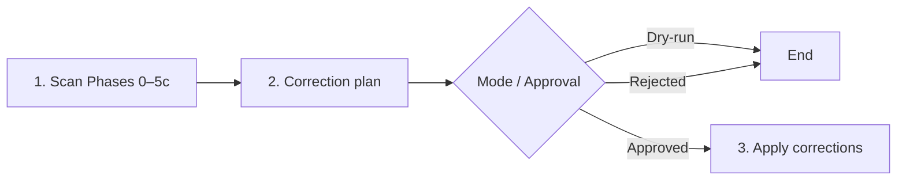

---

name: ws-check-harness
description: Audit harness integrity — validates AGENTS.md routing, pipeline folder/step alignment (ws-* folders == frontmatter name), retired path ids, broken links (after path-token expand), orphan skills/rules, absolute paths, redundancy, and portability. Read-only scan → correction plan → apply with approval.
disable-model-invocation: true
version: 0.0.95
---

# Check Harness

Meta-harness audit: health, cohesion, portability of agent routing. Project-agnostic; discovers structure dynamically. Language: **en-us**. Exclusive scope: meta-harness (not product features or E2E delivery).

## Goals

1. Validate hub + skill links, routing, retired pipeline ids, progressive disclosure.
2. Enforce portability (no hardcoded project metadata in skills).
3. Scan read-only → correction plan → edit only with approval (or stop on `--dry-run`).

## Execution flow

| Step | Do | Done when |
|------|-----|-----------|
| **1 Scan** | Load [`PHASES.md`](PHASES.md); run Phases 0–5c; collect evidence | Findings table ready; **no edits** |
| **2 Plan** | Emit report per [`REPORT-FORMAT.md`](REPORT-FORMAT.md); `user-gate` unless dry-run | Report delivered; dry-run ends here |
| **3 Execute** | Apply approved items only; re-run Phase 2 on touched files | User informed of applied vs pending |

Invoke: `/ws-check-harness`, `@ws-check-harness`, or “audit the harness”. Dry-run: `--dry-run` / `dry run`.

## Principles

1. **Repo-root-relative paths** or declared path tokens — never absolute author-machine paths.
2. **Evidence** — each finding cites verified file/snippet after token expand.
3. **Scan before edit** — Phases 0–5c + Phase 6 are read-only.
4. **Hub precedence** — resolved hub is routing SoT; skills link, they do not paste skill bodies.
5. **Minimal diffs** — remove duplicates + link; preserve healthy `{skillsRoot}` / `{sharedDir}` / `{plansDir}` prose (only rewrite Markdown link targets to real paths).

## Path token map (load in Phase 0)

Canonical: [`tools.md`](../shared/tools.md) § Path tokens · [`config-resolution.md`](../shared/config-resolution.md).

| Token | Resolve (first match) | Default |
|-------|----------------------|---------|
| `{skillsRoot}` | `pathTokens.skillsRoot` | `.agents/skills` |
| `{sharedDir}` | `pathTokens.sharedDir` | `.agents/skills/shared` |
| `{plansDir}` | `plans.dir` | `.agents/plans` |
| `{reviewsDir}` | `reviews.dir` | `.agents/codereviews` |
| `{us-dir}` | `{plansDir}/{slug}/` | skip existence if slug unknown |

Expand braces before any broken-link claim. Remaining unknown braces → template (skip). Bare `shared/MEMORY.md` → warning (prefer `{sharedDir}/MEMORY.md`). Token-only prose outside links is healthy; Markdown `(...)` targets must be real paths.

## Hub resolution (Phase 0)

| Mode | Detection | Primary hub |
|------|-----------|-------------|
| **Upstream** | `bin/skill-dependencies.json` + `.agents/AGENTS.md` | Root `AGENTS.md` (+ dual-hub drift) |
| **Consumer** | `{sharedDir}/AGENTS.md` without upstream markers | `{sharedDir}/AGENTS.md` |

Consumer: missing root `AGENTS.md` is OK. Extra-package optional missing paths = intentional omission. Phase 5b sprawl on managed upstream skills → Upstream debt (informational), not consumer problem count (unless user asked to optimize).

## Scan + methodology

**Always load** [`PHASES.md`](PHASES.md) for: Scan scope inventory, pipeline § 3b contract, Phases 0–7 procedures (including 5b/5c).

**Skill integrity manifest (Phase 3, upstream only):** when `bin/skill-integrity.json` is expected, require `node bin/generate-skill-integrity.js --check` (or `npm run verify-integrity`) exit 0. Stale/missing → **critical**. Correction: `npm run generate-integrity`, re-run `--check`, commit `bin/skill-integrity.json` with the package change. Full procedure: [`PHASES.md`](PHASES.md) Phase 3 item 7.

Step ↔ Phase: Step 1 = Phases 0–5c · Step 2 = Phase 6 · Step 3 = Phase 7.

## Output

Healthy + no unrouted items → **Harness OK**. Else emit full report from [`REPORT-FORMAT.md`](REPORT-FORMAT.md). Optional persist: `{plansDir}/harness-audit/harness-audit-{YYYYMMDD}.report.md`.

## Guardrails

- Edit harness only in Phase 7 after approval; never during scan.
- Do not implement product code or start delivery/PR pipelines as part of this check.
- Do not auto-add skills to hubs or create skills without an approved plan item.

## Definition of Done

**Scan:** path token map loaded; Phases 0–5c done; § 3b + retired ids checked when `ws-spec-to-pr` present; Phase 4 hub↔disk diff; Phase 5c context report; zero edits.

**Plan:** severity + evidence + proposed correction; report format; dry-run stops; else `user-gate`.

**Execute (normal):** only approved items; Phase 2 revalidate; report applied vs pending.
