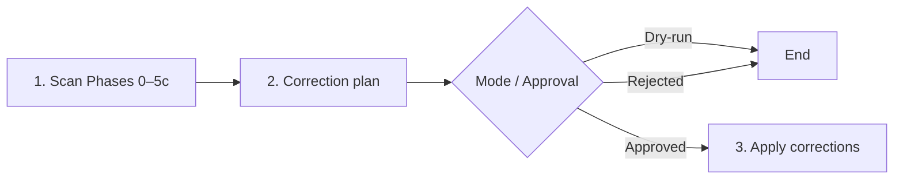

# Check Harness

> When this skill is loaded, output "ws-check-harness loaded."

Meta-harness audit: health, cohesion, portability of agent routing. Project-agnostic; discovers structure dynamically. Language: **en-us**. Exclusive scope: meta-harness (not product features or E2E delivery).

## Goals

1. Validate hub + skill links, routing, retired pipeline ids, progressive disclosure.
2. Audit skill role clarity, composition topology, and instruction duplication across skills.
3. Enforce portability (no hardcoded project metadata in skills).
4. Scan read-only → correction plan → edit only with approval (or stop on `--dry-run`).

## Execution flow

| Step | Do | Done when |
|------|-----|-----------|
| **1 Scan** | Load [`PHASES.md`](PHASES.md); run Phases 0–5c including Phase 5a (`check_duplicates.cjs`, `measure_harness.cjs`); collect evidence | Findings table ready; mechanical gates exit 0; **no edits** |
| **2 Plan** | Emit report per [`REPORT-FORMAT.md`](REPORT-FORMAT.md); `user-gate` unless dry-run | Report delivered; dry-run ends here |
| **3 Execute** | Apply approved items only; re-run Phase 2 on touched files | User informed of applied vs pending |

Invoke: `/ws-check-harness`, `@ws-check-harness`, or “audit the harness”. Dry-run: `--dry-run` / `dry run`.

## Principles

1. **Repo-root-relative paths** or declared path tokens — never absolute author-machine paths.
2. **Evidence** — each finding cites verified file/snippet after token expand.
3. **Scan before edit** — Phases 0–5c + Phase 6 are read-only.
4. **Hub precedence** — resolved hub is routing SoT; skills link, they do not paste skill bodies.
5. **Minimal diffs** — remove duplicates + link; preserve healthy `{skillsRoot}` / `{sharedDir}` / `{plansDir}` prose (only rewrite Markdown link targets to real paths).

## Path token map (load in Phase 0)

Canonical: [`tools.md`](../ws-shared/tools.md) § Path tokens · [`config-resolution.md`](../ws-shared/config-resolution.md).

| Token | Resolve (first match) | Default |
|-------|----------------------|---------|
| `{skillsRoot}` | `pathTokens.skillsRoot` | `.agents/skills` |
| `{sharedDir}` | `pathTokens.sharedDir` | `.agents/skills/ws-shared` |
| `{plansDir}` | `plans.dir` | `.agents/plans` |
| `{reviewsDir}` | `reviews.dir` | `.agents/codereviews` |
| `{us-dir}` | `{plansDir}/{slug}/` | skip existence if slug unknown |
| `{globalSkillsRoot}` | `WORKFLOW_SKILLS_GLOBAL_DIR` / `~/.agents/skills` | `~/.agents/skills` |

Expand braces before any broken-link claim. Remaining unknown braces → template (skip). Bare `ws-shared/MEMORY.md` → warning (prefer `{sharedDir}/MEMORY.md`). Token-only prose outside links is healthy; Markdown `(...)` targets must be real paths.

Load the token map from project `{sharedDir}/config.json` when present. **Install mode** may set a separate audit field **Skills scan root** (`.agents/skills` upstream); that does **not** redefine `{skillsRoot}` for consumer install layout.

## Hub resolution & Mixed Install Support (Phase 0)

**Install mode** (`upstream` | `consumer`) selects the primary hub **and** the **Skills scan root** used by Phases 1–5c inventory. Execution **Mode** (`normal` | `dry-run`) is orthogonal — do not rename it.

| Install mode | Detection (first match) | Primary hub | Skills scan root |
|--------------|-------------------------|-------------|------------------|
| **upstream** | Package markers (`bin/skill-dependencies.json` + `bin/cli.js`) **and** SoT evidence (≥1 `.agents/skills/ws-*/SKILL.md`) | Root `AGENTS.md` (+ dual-hub drift vs `{sharedDir}/AGENTS.md`) | `.agents/skills` |
| **consumer** | Else (including markers present but SoT absent) | `{sharedDir}/AGENTS.md` | `{skillsRoot}` (+ `{globalSkillsRoot}` hybrid) |

**Detection notes:**
- Upstream requires **both** package markers **and** SoT under `.agents/skills/`. Markers without SoT ⇒ hard **Install mode: consumer** for skills inventory; optional one-line informational note only (markers present, SoT absent).
- Consumer must **not** invent inventory from a stray `src/skills` folder when Install mode is consumer.
- Hub resolution alone is not sufficient for skills SoT; Install mode drives the scan root.
- **Upstream hub literals:** when Skills scan root is `.agents/skills`, hub citations under `.agents/skills/ws-<id>/…` are filesystem-true (no SoT-id equivalence / dogfood-lag exceptions). Consumer behavior unchanged.

**Global & Mixed Install Rules:**
- Skills may be installed globally (`{globalSkillsRoot}`) or locally (`{skillsRoot}`).
- **Local Overrides:** Local project skills in `{skillsRoot}` take precedence over global skills in `{globalSkillsRoot}`. If a skill exists in both locations, the local project version is the active override — do **not** flag duplicate `name:` entries across global vs local as a collision error.
- **Config Precedence:** Local `{sharedDir}/config.json` overrides global `{globalSkillsRoot}/ws-shared/config.json`.

Consumer: missing root `AGENTS.md` is OK when `defaults.autoload` is false/omitted. When `defaults.autoload` is true, missing or incomplete root (no `autoload.md` Always-applied instruction) is **critical** (`configure_autoload.py --check`). When root `AGENTS.md` references `autoload.md`, Always-applied vs shared-hub on-demand mismatch is intentional consumer override (not dual-hub drift). Extra-package optional missing paths = intentional omission. Phase 5b sprawl on managed upstream skills → Upstream debt (informational), not consumer problem count (unless user asked to optimize).

## Scan + methodology

**Always load** [`PHASES.md`](PHASES.md) for: Scan scope inventory, pipeline § 3b contract, Phases 0–7 procedures (including 5b/5c).

**Skill integrity manifest (Phase 3, upstream only):** when **Install mode** is `upstream`, require `bin/skill-integrity.json` and `node bin/generate-skill-integrity.js --check` (or `npm run verify-integrity`) exit 0 against hashed package SoT / installer inputs. Stale/missing → **critical**. Correction: `npm run generate-integrity`, re-run `--check`, and commit `bin/skill-integrity.json` with the package change. When **Install mode** is `consumer`, skip / do not require `bin/skill-integrity.json`. Full procedure: [`PHASES.md`](PHASES.md) Phase 3 item 7.

Step ↔ Phase: Step 1 = Phases 0–5c · Step 2 = Phase 6 · Step 3 = Phase 7.

## Output

Healthy + no unrouted items → **Harness OK**. Else emit full report from [`REPORT-FORMAT.md`](REPORT-FORMAT.md). On explicit persist, write the completed report to a temporary input file and run `node {skillsRoot}/ws-shared/scripts/persist_diagnostic.cjs --kind harness --input <report>`; the helper stores a timestamped comparable artifact under `plans.diagnosticsDir` (default `.agents/plans/diagnostics`). Default audit remains read-only.

## Guardrails

- Edit harness only in Phase 7 after approval; never during scan.
- Do not implement product code or start delivery/PR pipelines as part of this check.
- Do not auto-add skills to hubs or create skills without an approved plan item.

## Definition of Done

**Scan:** path token map loaded from `{sharedDir}/config.json` when present; Install mode + Skills scan root resolved; Phases 0–5c done (Phase 5a ran `check_duplicates.cjs` and `measure_harness.cjs` to exit 0); § 3b + retired ids checked when `ws-spec-to-pr` present; Phase 4 hub↔disk diff; Phase 5c context report; zero edits.

**Plan:** severity + evidence + proposed correction; report format; dry-run stops; else `user-gate`.

**Execute (normal):** only approved items; Phase 2 revalidate; report applied vs pending.

**Verification (Install mode — AC10):**
- At upstream package root (markers + SoT) → report `Install mode: upstream` and Skills scan root `.agents/skills`.
- In a consumer tree with only `{skillsRoot}` / global install → report `Install mode: consumer` and Skills scan root under `.agents/skills` and/or `{globalSkillsRoot}`.
