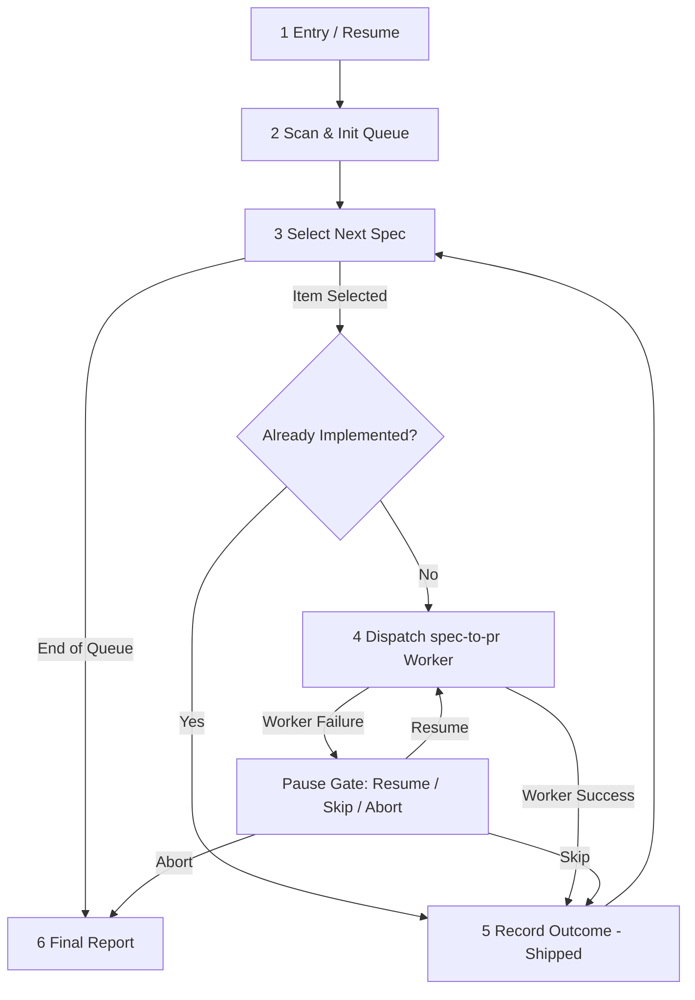

# `ws-long-runner` — Protocol & Master Loop FSM

Master loop specification for batch spec delivery.

## Master Loop Phases (1–6)

### Phase 1: Entry / Resume
- Parse raw arguments:
  - Existing state file (`{plansDir}/ws-long-runner/*.state.md`) → load state, skip scan, continue at first non-terminal item.
  - Explicit spec list (`*.spec.md` paths) → construct new run queue with items marked `pending`.
  - No arguments → proceed to Phase 2 (Blank-list scan).

### Phase 2: Scan & Init Queue
- Resolve `{specsDir}` from `config.json` → `plans.specsDir` (default `.agents/specs`).
- `Glob` `{specsDir}/**/*.spec.md` (excluding non-spec files).
- Present `user-gate` multi-select gate to the user with sorted spec paths.
- Generate `runId` (`lr-{YYYYMMDDTHHMMSSZ}`).
- Write initial run state file at `{plansDir}/ws-long-runner/{runId}.state.md`.

### Phase 3: Select Next Spec
- Find the next item with `status: pending` or `status: in_progress`.
- If no more pending items remain → proceed to Phase 6 (Final Report).
- Run the already-implemented probe (see [`STATE.md`](STATE.md)).

### Phase 4: Dispatch `spec-to-pr` Worker
- Mark state item `status: in_progress`. Update state file `updatedAt`.
- Dispatch `spec-to-pr` subagent via `dispatch-agent`:
  - `description: "ws-long-runner worker — {slug}"`
  - Arguments: `/spec-to-pr full auto {specPath}` (and pass `dryRun` if set).
- Await completion or worker exit `step-output`.

### Phase 5: Record Outcome
- Read worker `step-output`:
  - On `status: shipped`: update item `status: shipped`, set `prNumber`, `prUrl`, `updatedAt`.
  - On failure or missing `step-output`: mark item `status: failed`, present `user-gate` failure menu:
    - **Resume (Recommended):** Re-dispatch worker for same spec.
    - **Skip:** Mark item `status: skipped`, record `reason`, proceed to next item.
    - **Abort run:** Mark run state `status: paused`, exit loop to Phase 6.

### Phase 6: Final Report
- Summarize run metrics (total items, shipped, skipped, failed, open PRs).
- Set overall run state `status: completed` (or `status: paused` if aborted).
- Present summary report to the user.

## Dependency Matrix

| Need | Source |
|------|--------|
| Per-spec FSM | [`../spec-to-pr/SKILL.md`](../spec-to-pr/SKILL.md) |
| State schema & probe | [`STATE.md`](STATE.md) |
| Usage examples | [`EXAMPLES.md`](EXAMPLES.md) |
