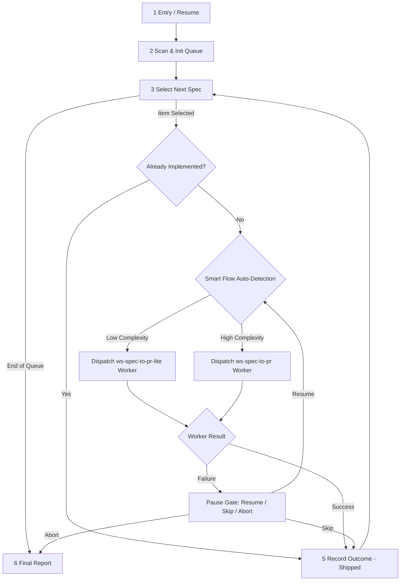

# `ws-multi-spec` — Protocol & Master Loop FSM

Master loop specification for smart multi-spec batch delivery.

## Master Loop Phases (1–6)

### Phase 1: Entry / Resume
- Parse raw arguments:
  - Existing state file (`{plansDir}/ws-multi-spec/*.state.md`) → load state, skip scan, continue at first non-terminal item.
  - Explicit spec list (`*.spec.md` paths) → construct new run queue with items marked `pending`.
  - No arguments → proceed to Phase 2 (Blank-list scan).

### Phase 2: Scan & Init Queue
- Resolve `{specsDir}` from `config.json` → `plans.specsDir` (default `.agents/specs`).
- `Glob` `{specsDir}/**/*.spec.md` (excluding non-spec files).
- Present `user-gate` multi-select gate to the user with sorted spec paths.
- Generate `runId` (`ms-{YYYYMMDDTHHMMSSZ}`).
- Write initial run state file at `{plansDir}/ws-multi-spec/{runId}.state.md`.

### Phase 3: Select Next Spec & Flow Auto-Detection
- Find the next item with `status: pending` or `status: in_progress`.
- If no more pending items remain → proceed to Phase 6 (Final Report).
- Run the already-implemented probe (see [`STATE.md`](STATE.md)).

#### Smart Flow Auto-Detection Logic
Evaluate the target `*.spec.md` file:
1. **Explicit Frontmatter**: Check frontmatter `complexity:` or `flow:` field if present (`lite` / `fast` / `standard` / `full`).
2. **Threshold Scan**:
   - Count sections / requirements / tasks / files in spec.
   - If implementation tasks ≤ 3 AND estimated files ≤ 6 AND layers ≤ 2 (matching `config.json.dagThresholds` limits) → select **`ws-spec-to-pr-lite`**.
   - Otherwise → select **`ws-spec-to-pr`** (full standard orchestrator).
3. Log selected `flowMode` (`lite` or `standard`) into the item state row.

### Phase 4: Dispatch Worker
- Mark state item `status: in_progress`, `flowMode: {lite|standard}`. Update state file `updatedAt`.
- Dispatch subagent via `dispatch-agent`:
  - `description: "ws-multi-spec worker [{flowMode}] — {slug}"`
  - Command: if `flowMode == lite`: `/ws-spec-to-pr-lite full auto {specPath}` else: `/ws-spec-to-pr full auto {specPath}` (pass `dryRun` if set).
- Await completion or worker exit `step-output`.

### Phase 5: Record Outcome
- Read worker `step-output`:
  - On `status: shipped`: update item `status: shipped`, set `prNumber`, `prUrl`, `updatedAt`.
  - On failure or missing `step-output`: mark item `status: failed`, present `user-gate` failure menu:
    - **Resume (Recommended):** Re-dispatch worker for same spec.
    - **Skip:** Mark item `status: skipped`, record `reason`, proceed to next item.
    - **Abort run:** Mark run state `status: paused`, exit loop to Phase 6.

### Phase 6: Final Report
- Summarize run metrics (total items, shipped, skipped, failed, open PRs, flow mode breakdown).
- Set overall run state `status: completed` (or `status: paused` if aborted).
- Present summary report to the user.

## Dependency Matrix

| Need | Source |
|------|--------|
| Per-spec Standard FSM | [`../ws-spec-to-pr/SKILL.md`](../ws-spec-to-pr/SKILL.md) |
| Per-spec Lite FSM | [`../ws-spec-to-pr-lite/SKILL.md`](../ws-spec-to-pr-lite/SKILL.md) |
| State schema & probe | [`STATE.md`](STATE.md) |
| Usage examples | [`EXAMPLES.md`](EXAMPLES.md) |
