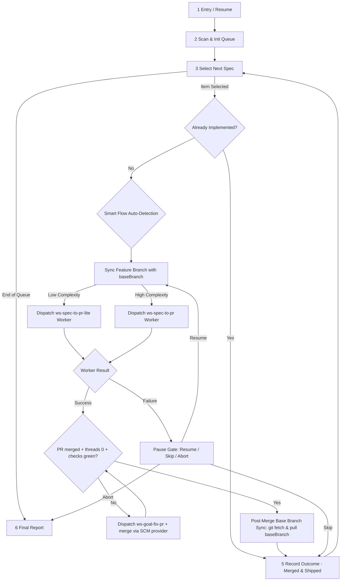

# `ws-spec-multi` — Protocol & Master Loop FSM

Master loop specification for smart multi-spec batch delivery.

## Master Loop Phases (1–6)

### Phase 1: Entry / Resume
- Detect base branch `baseBranch`: query active branch via SCM/git (`git rev-parse --abbrev-ref HEAD`) or read `config.json` `project.baseBranch` (default `develop` or `main`).
- Parse raw arguments:
  - Existing state file (`{plansDir}/ws-spec-multi/*.state.md`) → load state and `baseBranch`, skip scan, continue at first non-terminal item (unmerged PR rows re-enter Phase 4b convergence gate).
  - **Queue integrity on load:** run the fail-closed duplicate guard (duplicate `#` or duplicate `slug`/`specPath` → stop and surface). A `completed` run whose table still holds any `pending`/`in_progress` row is corrupt (phantom row); surface it and re-dispatch nothing (see [`STATE.md`](STATE.md) § Resume Policy).
  - **Supersede retirement:** when the loaded run's frontmatter sets `supersedesRunId` and that prior run is still `active`, run `node {skillsRoot}/ws-spec-multi/scripts/retire_superseded_run.cjs --run {plansDir}/ws-spec-multi/{runId}.state.md` (resolves the exact id; fails closed when unresolved) before dispatching; never leave two `active` runners on one lineage.
  - Explicit spec list (`*.spec.md` paths) → construct new run queue with items marked `pending` and recorded `baseBranch`.
  - No arguments → proceed to Phase 2 (Blank-list scan).

### Phase 2: Scan & Init Queue
- Resolve `{specsDir}` from `config.json` → `plans.specsDir` (default `.agents/specs`).
- Run `node {skillsRoot}/ws-spec-multi/scripts/list_pending_specs.cjs --specs-dir {specsDir} --plans-dir {plansDir} --json`.
- Present `user-gate` multi-select **only** with sorted `pending[]` paths (index `[ ]` / `[~]`, plus untracked specs of record). Do **not** list `[x]` / Done-log / already-merged items, or `step-00-*.spec.md` copies.
- If `pending[]` is empty: report no unfinished specs and stop (no state file).
- Generate `runId` (`ms-{YYYYMMDDTHHMMSSZ}`).
- **Supersede retirement:** when this new run supersedes an existing run, record its id in the run's `supersedesRunId` frontmatter, then run `node {skillsRoot}/ws-spec-multi/scripts/retire_superseded_run.cjs --run {plansDir}/ws-spec-multi/{runId}.state.md` before dispatching the first worker; the helper writes the superseded run's terminal `status` (`cancelled` / `superseded`) with an advancing `updatedAt` and fails closed when the named run cannot be resolved, so at most one `active` runner exists per lineage.
- Write initial run state file at `{plansDir}/ws-spec-multi/{runId}.state.md` containing `baseBranch: {baseBranch}` in YAML frontmatter, plus `totalItems: {n}` where `{n}` is the frozen selection length. Assign each row a stable `#` (1..n) once; the `#` index is display-only and is never re-allocated. Row identity is `specPath` (fallback `slug`). One row per selected spec.

### Phase 3: Select Next Spec & Flow Auto-Detection
- Find the next item with `status: pending` or `status: in_progress`.
- If no more pending items remain → proceed to Phase 6 (Final Report).
- Run the already-implemented probe (see [`STATE.md`](STATE.md)).

#### Smart Flow Auto-Detection Logic
Evaluate the target `*.spec.md` file:
1. **Explicit Frontmatter**: Check frontmatter `complexity:` or `flow:` field if present (`lite` / `fast` / `standard` / `full`). Map `lite`/`fast` → `flowMode: lite`; `standard`/`full` → `flowMode: standard`.
2. **Classifier (preferred)**: When no overriding frontmatter, run [`ws-classify-complexity`](../ws-classify-complexity/SKILL.md) on the spec (writes `step-00-{slug}.classify.md` under `{us-dir}` when a plans slug exists, or use `--output-dir` next to the spec). Map recommendation `lite` → **`ws-spec-to-pr-lite`**; `standard` → **`ws-spec-to-pr`**. Do **not** hardcode numeric thresholds in this skill — `classify.cjs` reads live `{sharedDir}/config.json` → `dagThresholds`.
3. **Fallback** (classifier unavailable): Read `dagThresholds` from `{sharedDir}/config.json` (keys `maxImplementationSteps`, `maxExpectedFiles`, `maxLayers`). Count sections / requirements / path refs / layers from the spec the same way as the classifier. If all counts are within those limits → `lite`; else `standard`.
4. Log selected `flowMode` (`lite` or `standard`) and classifier evidence into the item state row.

### Phase 4: Pre-Dispatch Base Sync & Dispatch Worker
- **Base Branch Sync Preflight**:
  - Before starting work on `{slug}` (new spec or resuming paused/failed work):
  - Ensure local `baseBranch` (`main`/`master`/`develop`) is fully updated (`git checkout {baseBranch} && git pull {gitRemote} {baseBranch}`).
  - Create or sync the spec feature branch (`git checkout -b feature/{slug}` or `git checkout feature/{slug} && git merge {baseBranch}`) from the updated `baseBranch`.
  - This guarantees every feature branch starts from an up-to-date base containing all PRs merged by previous specs in the batch or external commits.
  - On merge/rebase conflict: pause with Phase 5 `user-gate` (Resume after resolving, Skip, Abort).
- Transition the **existing** row for `{specPath}` (fallback `{slug}`) to `status: in_progress`, `flowMode: {lite|standard}` — a keyed in-place update, never a new appended row. Before writing, run the fail-closed duplicate guard (no duplicate `#`, no duplicate `slug`/`specPath`); on conflict, do not write and surface it. Set the row `updatedAt` and run frontmatter `updatedAt` to the current UTC timestamp. The item count stays at `totalItems`.
- **Required child artifact set (dispatch contract):** the dispatched worker is a
  full child orchestrator (`ws-spec-to-pr` / `ws-spec-to-pr-lite`) and MUST persist
  its own run under the **same `{plansDir}/{slug}/`** directory the batch uses, with
  the workflow id `{child-workflow-id}`:
  - `{plansDir}/{slug}/{child-workflow-id}.state.json` — machine SoT, including `state.handoffs`, plus its `.state.md` render
  - `{plansDir}/{slug}/step-01-{slug}.plan.md` — contract name (never an ad-hoc `plan.md`)
  - the other `step-NN-{slug}.*` artifacts for the steps the pipeline actually ran
  - `{plansDir}/{slug}/telemetry.jsonl`
  - `{plansDir}/{slug}/step-08-*.result.md` for a completed child (delivery-evidence key)
  The child orch creates the state at dispatch; the worker honors and updates it.
  The batch and the worker agree on `{plansDir}/{slug}` and `{child-workflow-id}`.
- Dispatch subagent via `dispatch-agent`:
  - `description: "ws-spec-multi worker [{flowMode}] — {slug}"`
  - Command: if `flowMode == lite`: `/ws-spec-to-pr-lite full auto {specPath}` else: `/ws-spec-to-pr full auto {specPath}` (pass `dryRun` if set and `baseBranch: {baseBranch}`).
- Await completion or worker exit `step-output`.

### Phase 4b: Delivery Convergence, Code-Review Wait, & Post-Merge Base Sync
Every created PR MUST complete full code-review convergence, merge, and post-merge base branch sync before queue advancement:
1. **Detect PR**: Read worker `step-output` and query SCM provider (`gh` CLI / ADO API) to capture `prNumber` and `prUrl`.
2. **Run Convergence Loop (`ws-goal-fix-pr`)**:
   - Dispatch [`ws-goal-fix-pr`](../ws-goal-fix-pr/SKILL.md) for `<prNumber>`.
   - Wait **30 seconds** post-PR creation for automated code-review actions (e.g. Agentic Code Reviewer or SCM review bots) and CI pipelines to execute on SCM infrastructure.
   - Poll thread status (`list-threads`) and resolve review threads until `activeThreads == 0`.
   - Verify required CI checks are green (`checksStatus == green`).
3. **Execute PR Merge & Close**:
   - Once threads are 0 and checks green, master MUST execute PR merge via SCM provider: `gh pr merge {prNumber} --merge` (or SCM merge API) to merge and close the PR into `baseBranch`.
   - If merge fails due to base branch drift, master syncs the branch with `baseBranch` (`git merge {baseBranch}`), pushes, and retries merge until state is `MERGED`.
   - Confirm PR status is `state: MERGED` (`merged: true`).
4. **Post-Merge Base Branch Synchronization**:
   - Immediately after PR merge success (`state: MERGED`), master MUST execute post-merge sync:
     - `git fetch {gitRemote}`
     - `git checkout {baseBranch} && git pull {gitRemote} {baseBranch}` (and pull `workingBranch` if different).
   - This ensures `baseBranch` (`main`/`master`/`develop`) on local disk matches the remote merged state before the next spec worker creates a new feature branch (`git checkout -b feature/{slug}`).
5. **Strict Block & Prohibition**: Leaving PRs open or unmerged is FORBIDDEN. Master orchestrator MUST NOT dispatch the next spec worker until the current spec PR is confirmed fully merged (`merged: true`, `activeThreads: 0`, `state: MERGED`) and base branches are synced locally.
6. If convergence fails (max iterations, checks red, escalation): mark item `status: failed` and present Phase 5 `user-gate` failure menu.
7. **Parent-child handoff:** when the child worker for `{slug}` reaches a terminal state (parsed `step-output`, or the child state reports a terminal `status` with `endedAt`), transition the parent queue row in place and advance the run frontmatter `updatedAt` immediately — a parent row left `in_progress` (or a frozen parent `updatedAt`) beside a terminal child is a defect.

### Phase 5: Record Outcome
- **Fail-closed child-exit guard (executable):** record terminal rows through
  `node {skillsRoot}/ws-spec-multi/scripts/record_child_outcome.cjs --run {plansDir}/ws-spec-multi/{runId}.state.md --slug {slug} --status shipped|failed|skipped [--plans-dir {plansDir}] [--pr-number N] [--pr-url U] [--reason TEXT]`.
  This helper is the executable queue-transition path: on `--status shipped` it
  invokes `verify_child_artifacts.cjs` and, when child state / `step-01` is absent,
  exits non-zero **without writing** — so a `shipped` row without child state cannot
  be recorded (mirroring the monitor `missing-artifact` class). It also enforces the
  keyed in-place row update, the fail-closed duplicate guard, and the advancing
  `updatedAt`. Do not hand-edit a `shipped` row around this guard.
- Update the **existing** row for `{specPath}` (fallback `{slug}`) in place — never append a second row for the same spec. Run the fail-closed duplicate guard before writing; set the row `updatedAt` and the run frontmatter `updatedAt` to now. Reported totals use the frozen `totalItems`.
- Row transitions:
  - On full merge convergence & post-merge sync: set `status: shipped`, `merged: true`, `activeThreads: 0`, `prNumber`, `prUrl`, `updatedAt`.
  - On failure or unresolvable PR state: mark item `status: failed`, present `user-gate` failure menu:
    - **Resume (Recommended):** Re-sync feature branch with `baseBranch` and re-dispatch worker or convergence gate for same spec.
    - **Skip:** Mark item `status: skipped`, record `reason`, proceed to next item.
    - **Abort run:** Mark run state `status: paused`, exit loop to Phase 6.
- **Child git cleanup (Phase A):** Successful child workers run mandatory Phase A via their own orch (`ws-spec-to-pr` / lite) when child **shipping is terminal** — shared script `node {skillsRoot}/ws-spec-to-pr/scripts/cleanup_workflow_git.cjs --workflow-id {child-workflow-id}` ([`../ws-spec-to-pr/protocols/artifact-cleanup.md`](../ws-spec-to-pr/protocols/artifact-cleanup.md)). Skipped / failed / aborted children do **not** auto-clean. The batch `runId` is **not** a `uswf/{workflow-id}` cleanup target.

### Phase 6: Final Report
- Summarize run metrics from the frozen queue: total items (`totalItems`), shipped & merged, skipped, failed, flow mode breakdown, `baseBranch`. Before reporting, assert exactly one row per selected spec and every row terminal (`shipped` / `skipped` / `failed`); any surviving `pending`/`in_progress` row is a phantom — surface it, do not silently recount.
- **Delivery-evidence honesty (no fabrication):** claim delivery evidence for an item ONLY when its child state exists (`verify_child_artifacts.cjs --slug {slug}` exits 0) and, for a completed child, `{plansDir}/{slug}/step-08-*.result.md` is present. An item whose row is `shipped` but that lacks child state is reported as a defect, never counted as evidenced delivery.
- Set overall run state `status: completed` (or `status: paused` if aborted).
- Present summary report to the user.
- Batch-level `completed` does not invoke Phase A for `runId`; per-child cleanup already ran (or was skipped) in Phase 5.

## Dependency Matrix

| Need | Source |
|------|--------|
| Per-spec Standard FSM | [`../ws-spec-to-pr/SKILL.md`](../ws-spec-to-pr/SKILL.md) |
| Per-spec Lite FSM | [`../ws-spec-to-pr-lite/SKILL.md`](../ws-spec-to-pr-lite/SKILL.md) |
| PR Delivery & Checklist | [`../ws-ship-pr/SKILL.md`](../ws-ship-pr/SKILL.md) |
| Thread Convergence Loop | [`../ws-goal-fix-pr/SKILL.md`](../ws-goal-fix-pr/SKILL.md) |
| State schema & probe | [`STATE.md`](STATE.md) |
| Usage examples | [`EXAMPLES.md`](EXAMPLES.md) |
