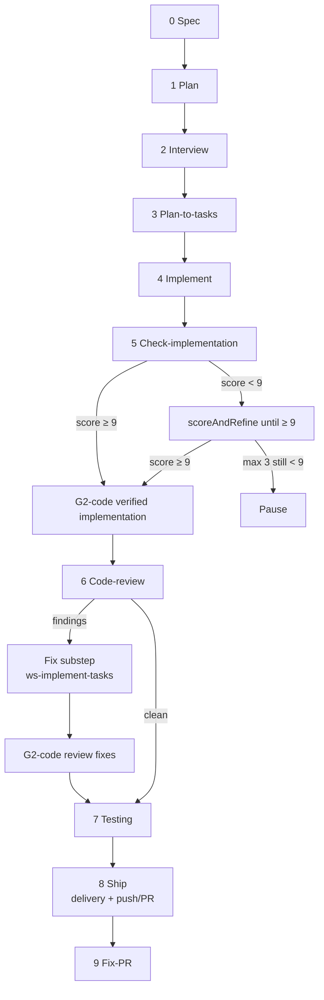
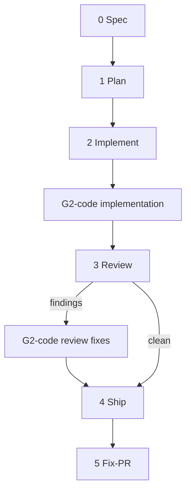

# FAQ — Spec-to-PR

This FAQ documents the canonical behavior of the modern **Spec-to-PR** (Steps 0–9) and **Spec-to-PR Lite** (Steps 0–5) orchestrated workflows.

> **Architecture:**
> - Shared config: [`.agents/skills/ws-shared/config.json`](../../ws-shared/config.json) (see [`config-resolution.md`](../../ws-shared/config-resolution.md))
> - Shared gates: [`gates.md`](../../ws-shared/gates.md)
> - SCM intents: [`scm-provider-contract.md`](../../ws-shared/scm-provider-contract.md) (GitHub and Azure DevOps implement the same required intents)
> - Dynamic paths: [Path tokens](../../ws-shared/tools.md#path-tokens) (`{plansDir}`, `{sharedDir}`, etc.)
> - Model Selection: Switch model only via **Pause → IDE/Agent model picker → Resume** (no in-gate model picker or CLI flags).

---

## Quick Index

| Section | Topic |
| :--- | :--- |
| 1. [Overview](#1-overview) | Core goals, Roles, standard vs. lite differences |
| 2. [Execution Timeline](#2-execution-timeline) | Standard (0–9) and Lite (0–5) step breakdown |
| 3. [Start Options & Modes](#3-start-options--modes) | Command triggers, free-text vs. tracker IDs, dry-run, auto-mode |
| 4. [FSM Steps 0–9 Breakdown](#4-fsm-steps-09-breakdown) | Deep-dive into each individual step of the standard workflow |
| 5. [Gates & Universal Controls](#5-gates--universal-controls) | G0-G3 Authorization ladder, HS-1 to HS-5 Hard Stops |
| 5a. [When does the pipeline commit?](#when-does-the-pipeline-commit-code) | Product commits after verify and after review-fix |
| 6. [Artifacts & State Lifecycle](#6-artifacts--state-lifecycle) | state.md structure, plansDir artifacts, git checkpoints |
| 7. [Troubleshooting](#7-troubleshooting) | Handling HS pauses, worktree issues, and retry loops |
| 8. [Verify score & SCM providers](#8-verify-score--scm-providers) | Step 5 bar ≥ 9; GitHub/Azure intent parity |

---

## 1. Overview

### What is Spec-to-PR?
Spec-to-PR is a deterministic **orchestrated software delivery pipeline** designed to automate the entire lifecycle of a User Story or feature request: from initial spec bootstrap, through plan formulation, implementation, check-implementation verification, a **product commit** of workflow-touched files, local code review of that committed diff vs the base branch, a **second product commit** for review fixes, testing, shipping (delivery artifacts + push/PR), and resolving PR threads.

### Standard vs. Lite Modes
The hub supports two workflows depending on target speed and project complexity:
*   **Standard (`ws-spec-to-pr`)**: Detailed 10-step lifecycle (0 to 9) containing plan refinement interviews, sequential or parallel DAG execution, read-only verify gates (advance at score ≥ 9), a required product commit after verify, local code review of `{base}...HEAD`, a second product commit for review fixes, and testing batteries.
*   **Lite (`ws-spec-to-pr-lite`)**: Fast-track 6-step lifecycle (0 to 5) skipping Plan Refinement interviews, DAG creation, verify gates, and step-7 testing. Product commit after implement (before review), then a second commit for review fixes. Steps are executed inline in a single session.

### Who is responsible for what?
*   **Orchestrator Agent**: Manages FSM state, checkpoints, user gates, state hygiene, and dispatches. It **never** writes or edits code directly.
*   **Subagents (`dispatch-agent`)**: Spun up with fresh, clean context to implement specific tasks (e.g. planner, coder, verifier, reviewer). No session memory leaks between steps.
*   **User**: Provides steering decisions at transition gates and approves PR shipping.

---

## 2. Execution Timeline

### Standard FSM Timeline (Steps 0–9)



### Lite FSM Timeline (Steps 0–5)



---

## 3. Start Options & Modes

### Invocation Examples
```bash
# Standard interactive start
/ws-spec-to-pr US 1234
/ws-spec-to-pr specs/feature.spec.md

# Non-interactive automated dry-run
/ws-spec-to-pr auto dry-run US 1234

# Skip integration testing
/ws-spec-to-pr skip-testing "Add real-time alerts to the feed"

# Lite workflow trigger
/ws-spec-to-pr-lite US 5678
```

### Modes & Flags
*   `dry-run` (`dryRun: true`): Simulates all operations. Prevents source edits, git commits, remote pushes, browser automation, and memory updates.
*   `auto` (`autoMode: true`): Disables interactive menus. Auto-selects options (index 0). Workflow pauses only on hard stops or if a verify score stays below 9 after max scoreAndRefine rounds.
*   `skip-testing`: Skips standard Step 7 Testing entirely, moving directly to Step 8 Ship.
*   `skip-tests`: Skips the execution of testing suites (e.g. `npm run test` or `pytest`) in STACK.md. Build checks are still enforced.
*   Mutation (inside Step 7): not a CLI flag by default — configure `verification.mutationTest` and set `defaults.skipMutationTesting: false` to opt in. Empty `mutationTest` or `skipMutationTesting: true` skips mutation without failing.
*   **Feature-branch gate** (new start only): after identity, ask stay-on-current / create `feat/{slug}` from HEAD / create from `baseBranch`. Resume skips this gate.
*   **Runtime audit**: `defaults.enableAuditing: true` wraps the run with [`ws-audit`](../../ws-audit/SKILL.md). Default `false`.
*   **testingModel**: optional `defaults.testingModel` for standard Step 7 only; empty uses `executionModel`.

---

## 4. FSM Steps 0–9 Breakdown

### Step 0: Spec Creation
*   **Executor**: Orchestrator (dispatches provider skill or `ws-write-spec`).
*   **Role**: Resolves the input description or ticket ID into a canonical spec:
    *   **GitHub ID**: Dispatches [`ws-github-provider`](../../ws-github-provider/SKILL.md) to fetch the issue into `{specsDir}/{slug}.spec.md`, then register `step-00-{slug}.spec.md`.
    *   **Azure DevOps ID**: Dispatches [`ws-azure-devops-provider`](../../ws-azure-devops-provider/SKILL.md) to fetch the work item into `{specsDir}/{slug}.spec.md`, then register `step-00-{slug}.spec.md`.
    *   **Local Spec**: Normalizes into `{specsDir}`, then registers `step-00-{slug}.spec.md` using [`ws-local-spec-provider`](../../ws-local-spec-provider/SKILL.md).
    *   **Free-text**: Invokes `ws-write-spec` → `{specsDir}/{slug}.spec.md`, then registers into `{us-dir}/step-00-` before planning.

### Step 1: Planning and Brainstorm
*   **Executor**: Planner subagent (`ws-write-plan` / `ws-write-plan`).
*   **Role**: Analyzes the spec and codebase to write a plan file: `step-01-{slug}.plan.md`. This plan covers design, files to modify/create, and acceptance criteria checks.

### Step 2: Plan Refinement (Interview)
*   **Executor**: Planner subagent (`ws-interview` / `ws-interview`).
*   **Role**: Audits the plan against the spec and codebase. If there are ambiguities, escalates to the user for confirmation (max 3 rounds) and outputs `step-02-{slug}.plan.refined.md`.
*   **Conditional Skip**: Skipped automatically if complexity is simple, no open questions exist in the plan, and no blocking gaps are detected.

### Step 3: Execution Plan and DAG
*   **Executor**: Planner subagent (`ws-plan-to-tasks` / `ws-plan-to-tasks`).
*   **Role**: Parses the plan and splits it into atomic implementation tasks:
    *   **Small plan**: flat list of sequential tasks (`execMode: sequential`).
    *   **Large plan**: directed acyclic graph (`execMode: parallel`), outputting `step-03-{slug}.exec.dag.json`.

### Step 4: Implementation
*   **Executor**: Coder subagent (`ws-implement-tasks` / `ws-implement-tasks`).
*   **Role**: Writes code to target paths inside a git worktree (if enabled) or directly on the branch. If parallel, spins up up to 3 parallel subagents per DAG level. The **required** product commit is after Step 5 (optional G2-code under More options only).

### Step 5: Check-implementation
*   **Executor**: Verifier subagent (read-only) (`ws-verify-plan` / `ws-verify-plan`).
*   **Role**: Evaluates the written code against the spec/plan and publishes an integer score (0–10).
    *   **Score ≥ 9**: Passes gate, then **required G2-code** of workflow-touched product files (skip if the stage set is empty; never empty commit).
    *   **Score < 9**: Runs `scoreAndRefine` (re-implement flagged tasks + re-verify) until ≥ 9 (max 3 rounds, then Pause). Product commit runs only after score ≥ 9. Never auto-approve below 9.
    *   Do not dispatch Step 6 while workflow product files remain uncommitted.

### Step 6: Code Review
*   **Executor**: Reviewer subagent (`ws-code-review` / `ws-code-review`).
*   **Role**: Reviews the **committed** diff vs `config.project.baseBranch` (`git diff {base}...HEAD`). Uncommitted workflow product files → STOP (do not dispatch review).
    *   **Fix → re-review**: If Critical or Warning findings are present, runs `ws-implement-tasks` `mode=fix`, then re-reviews (max 3 rounds; `autoMode` autofix). Records traps/gaps in state/memory each round. Advance only when clean; Pause on residual after max rounds.
    *   **Review-fix commit**: After the loop, a **second** G2-code commit of workflow-touched product files if any changed (one commit for all fix rounds). Skip if review was clean with no extra product files.

### Step 7: Testing
*   **Executor**: Verifier subagent (`ws-testing` / `ws-testing`).
*   **Role**: Writes a test plan and executes unit, integration, and optionally browser verification. Optional **mutation testing** runs after green suite checks when `verification.mutationTest` is set and `defaults.skipMutationTesting` is false; score below `verification.mutationThreshold` fails Step 7 (strengthen tests before Advance). Lite has no Step 7 — mutation is standard-only.

### Step 8: Ship
*   **Executor**: Orchestrator + ship subagent (`ws-ship-pr` / `ws-ship-pr`).
*   **Role**: Compiles the delivery summary in `step-08-{slug}.result.md` (including benchmark telemetry) and presents the **Combined Ship Gate**:
    1.  Commit configured delivery artifacts, then create PR
    2.  Commit configured delivery artifacts, push only
    3.  Commit configured delivery artifacts, skip PR
    4.  Skip delivery commit and skip shipping
    5.  Pause
*   **Artifact commits**: Stage only artifacts enabled by `defaults.deliveryCommitArtifacts` (see `ARTIFACTS.md` § Step 8). Mid-workflow plan files remain forbidden until Step 8. Product/source files were already committed after verify and after review-fix.

### Step 9: Fix-PR
*   **Executor**: PR fixing subagent (`ws-fix-pr` / `ws-goal-fix-pr`).
*   **Role**: Triggered if a PR is created. Polls the remote PR for comments, runs code fixes iteratively, commits, and pushes until all review threads are resolved.

---

## 5. Gates & Universal Controls

### Authorization Ladder (G0–G3)
| Level | Allowed Operations | Trigger Phase |
| :--- | :--- | :--- |
| **G0** | Read codebase, fetch issue metadata, output reports | Steps 0, 1, 2, 3, 5, 6, 7 (plan) |
| **G1** | Modify workspace files, update state files, draft plans | Step 4, Step 6 (fix), Step 7 (fix) |
| **G2-code** | Commit workflow-touched product files only (`files_touched`; never `{plansDir}`, never `git add -A`) | After Step 5 (required); after Step 6 review-fix if files remain; Step 7 fix. Lite: after Step 2 and after Step 3 fixes. |
| **G2-delivery** | Commit configured delivery artifacts only (`defaults.deliveryCommitArtifacts`) | Step 8 delivery checkpoint |
| **G3** | Run `git push`, create remote PR, merge PR | Step 8 ship action / Step 9 |

### When does the pipeline commit code?

Two **required** product commits (G2-code), then ship:

1. **After verify (standard Step 5)** / **after implement (lite Step 2)** — workflow-touched created/updated/deleted product files only. Code review then diffs `{base}...HEAD` (`config.project.baseBranch`, usually `main`/`master`).
2. **After review-fix** — a second commit if the fix loop changed product files (one commit for all fix rounds). Skip if review was clean.
3. **Step 8 / lite Step 4** — configured `{plansDir}` delivery artifacts + push/PR. Not the first product save.

Never `git add -A`. Never stage `{plansDir}` before Step 8. Unrelated dirty files stay unstaged. Empty commits are forbidden. `dryRun` simulates commits only.

### Hard Stops (HS-1 to HS-5)
If any of these conditions are met, the workflow immediately pauses and exits:
*   **HS-1**: User cancelled or closed the interactive menu. Re-presents menu on resume.
*   **HS-2**: Rogue commit detected (a git commit executed without going through the gate menu).
*   **HS-2a**: Accidental staging/commit of files inside `{plansDir}/` during Steps 0–7.
*   **HS-3**: A mutating code step succeeded but `files_touched` was reported empty.
*   **HS-4**: Touched files reported by the subagent are missing or deleted on the active branch.
*   **HS-5**: State hygiene validation failed (corrupt YAML schema in `state.md`).

### Universal Step Controls (Transition Gate)
Every step transition exposes:
*   **Next (Advance)**: Advance to the next step.
*   **Previous**: Rollback state to an earlier step (restores matching checkpoint).
*   **Replay / Refine**: Re-dispatch the current step.
*   **Commit**: G2-code menu (required after verify / after review-fix when product files remain; optional under More options at other boundaries).
*   **Undo**: Revert to the checkpoint taken before the current step started.
*   **Pause**: Saves workspace state and pauses.

---

## 6. Artifacts & State Lifecycle

### Which machine-readable artifacts prove progress?

The Node state runtime writes the frontmatter state atomically, then publishes `run.json`, `run.md`, and the repo-level plans index from that committed snapshot. Per-step JSONL records contain dispatch, finish, and bypass evidence. `plan.index.json` hash-checks plan slices, while `ac-ledger.json` links every acceptance criterion to observed files, tests, commits, findings, and sabotage results. The Step 5 score is derived from that ledger and cannot be overridden.

### Path Tokens
All file references in workflow logs use bracketed path tokens which are resolved against `.agents/skills/ws-shared/config.json`:
*   `{skillsRoot}`: Path to installation folder (default `.agents/skills`).
*   `{sharedDir}`: Path to shared seeds (default `.agents/skills/ws-shared`).
*   `{plansDir}`: Path to plans workspace (default `.agents/plans`).
*   `{reviewsDir}`: Path to review summaries (default `.agents/codereviews`).
*   `{us-dir}`: Path to specific US folder `{plansDir}/us-{id}`.

### Git Checkpoints
At the beginning of every step (e.g. before Step 4 starts mutating), the orchestrator tags the HEAD commit with:
`uswf/{workflow-id}/before-step-{N}`
If you rollback, Nav Backward, or Undo, the orchestrator resets the working tree back to this tag. Checkpoint tags are strictly local and are never pushed to remote.

---

## 7. Troubleshooting

### My workflow paused with HS-5. What do I do?
An HS-5 indicates that `state.md` YAML parsing or schema validation failed.
1.  Open the state file in your editor: `{plansDir}/us-{id}/{workflow-id}.state.md`.
2.  Fix any malformed YAML characters (e.g. unquoted colons, unresolved strings, or syntax errors).
3.  Run the Node `validate_state.cjs` pre-advance check, then type `/ws-spec-to-pr US {id}` to resume.

For comparable environment reports, run `ws-doctor --persist` or persist the harness report under `plans.diagnosticsDir`. Use `workflow-skills telemetry report` to inspect per-run audit counts and median elapsed time by pipeline and step.

### Step 4/6/7 failed to write files (HS-4)
If the subagent claims to have written files but they are not present:
*   Check if you are running in worktree mode (`plans.useWorktrees: true`). If worktree creation failed, the system reverted to branch-direct mode.
*   Verify your workspace path length. Windows has a 260-character limit. Retrying the step in branch-direct mode (by updating config to `useWorktrees: false`) usually resolves path limits.

### How do I change models mid-workflow?
Workflows do not provide an in-gate model selector.
1.  Select **Pause workflow** at the transition gate.
2.  Switch your model in the session host.
3.  Resume the workflow: `/ws-spec-to-pr US {id}`.
4.  The orchestrator detects the new session model, updates `currentModel` in state, and logs the transition.

### Stale `uswf/` tags, worktrees, or branches after a workflow
On successful end-of-workflow (`status: completed`), orch always runs **Phase A** git runtime cleanup for that `{workflow-id}` via:

```bash
python {skillsRoot}/ws-spec-to-pr/scripts/cleanup_workflow_git.py --workflow-id {workflow-id}
```

This is **mandatory** even if you chose **Keep all artifacts** (that choice only skips Phase B plan-dir temp markdown). See [`protocols/artifact-cleanup.md`](../protocols/artifact-cleanup.md).

*   **Failed / cancelled / paused** runs do **not** auto-clean. Re-run the script manually with the leftover `{workflow-id}` to clear local `uswf/{workflow-id}/*` tags, matching worktrees, and local branches.
*   **`WARN: leftover: …` (exit 2):** cleanup finished but some names remain — treat the listed names as the inventory to inspect; orch may still claim ended.
*   **Dirty worktrees:** default `--dirty-policy force` logs dirty paths then `git worktree remove --force`. Use `--dirty-policy stop` to exit 1 without removing (no half-registered worktree).
*   **Protected branches:** cleanup never deletes `main`, `master`, or `develop` (exact names), nor `project.baseBranch` / `project.workingBranch` from `config.json`. The primary worktree is never removed.
*   **dryRun:** pass `--dry-run` to log intended removals with zero git mutations.

---

## 8. Verify score & SCM providers

### What score is required to leave Step 5?
Standard check-implementation advances only at overall score **≥ 9**. Score **< 9** always runs `scoreAndRefine` (re-implement flagged tasks + re-verify) until ≥ 9. Max **3** rounds per Step 5 visit, then Pause (fail closed). Resume continues. Never auto-approve below 9, including in `autoMode`. Optional polish (Accept As-Is) only when the score is already ≥ 9 and the `scoreAndRefine` flag is on. Lite has no Step 5 verify gate.

### Do GitHub and Azure DevOps support the same PR operations?
Yes. Both implement the required intents in [`scm-provider-contract.md`](../../ws-shared/scm-provider-contract.md): `validate-auth`, `fetch-to-spec`, `create-pr`, `list-threads`, `sweep-prior-work`, `check-pr-status`, `resolve-thread`, `comment-issue`, `merge-pr`. Host CLI recipes stay inside each provider `INTENTS.md`. An extra intent on one side without the other (and without an allowlist row) fails `npm run test` (`test/test-provider-parity.js`). [`ws-local-spec-provider`](../../ws-local-spec-provider/SKILL.md) is not an SCM implementer; it delegates PR intents to `providers.scm`.

