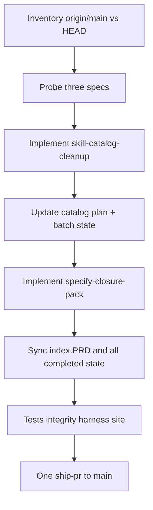

# Combined next PR (3 specs + unshipped develop)

ws-multi-spec loaded. Named orch wins routing, but your instruction overrides the default merge loop: **one PR**, not three sequential PRs. Classify and implement sequentially; ship once.

**Delivery override (explicit):** skip per-spec `feature/{slug}` branches, skip per-spec `ws-ship-pr` / merge, skip Phase 4b "must merge before next spec." Stay on `develop` (or one `feat/next-release` from current `develop`). `baseBranch` is `main`. After all product work, one `ws-ship-pr` (create PR `develop`/`feat` → `main`, then `ws-goal-fix-pr` until threads are 0).

## Current state (already verified)

- **[fix-pr-proactive-class-sweep](.agents/specs/fix-pr-proactive-class-sweep.spec.md)** is implemented in-tree: [COOPERATIVE_FIX.md](.agents/skills/ws-fix-pr/scripts/COOPERATIVE_FIX.md), [ws-fix-pr/SKILL.md](.agents/skills/ws-fix-pr/SKILL.md) Step 5, [AUTO_FIX.md](.agents/skills/ws-fix-pr/scripts/AUTO_FIX.md), [ws-goal-fix-pr/SKILL.md](.agents/skills/ws-goal-fix-pr/SKILL.md) Act round, evals, and [test/test-fix-pr-proactive-class-sweep.js](test/test-fix-pr-proactive-class-sweep.js). FEATURES 0.3.31 already names it. [index.PRD](.agents/specs/index.PRD) still has `[ ]`. Treat as **already-implemented**; do not re-author. Remaining: AC check, mark `[x]`, cite in PR body.
- **[skill-catalog-cleanup](.agents/specs/skill-catalog-cleanup.spec.md)** is open. Workflows still lists the three Extra candidates and `ws-patterns-backend` / `ws-patterns-frontend` in [bin/skill-dependencies.json](bin/skill-dependencies.json). A `{plansDir}/skill-catalog-cleanup/step-00-*.spec.md` copy exists; no implement yet. Classifier: **standard** (11 ACs, installer + skills + tests + docs, well over 6 files).
- **[specify-closure-pack](.agents/specs/specify-closure-pack.spec.md)** is open. [validate_spec.cjs](.agents/skills/ws-spec-format/scripts/validate_spec.cjs) has no `--mode`. [FORMAT.md](.agents/skills/ws-spec-format/FORMAT.md) and [ws-write-spec/SKILL.md](.agents/skills/ws-write-spec/SKILL.md) lack closure sections / lookup-before-gate / authoring validate. Classifier: **standard** (19 ACs, format + write-spec + both orch Step 0 + lite safety valve + tests).
- Package is already **0.3.33**. FEATURES already records 0.3.31 (fix-pr sweep, audit quoting), 0.3.32 (session leases), 0.3.33 (scoreAndRefine second pass). Those commits are the "unshipped new features." Include them as-is in this PR. Do not reopen hermes `[~]`.
- Dirty tree has consumer hub files (`config.json`, `MEMORY.md`, `backend.md`, `frontend.md`, changelog) plus plan scratch. **Do not commit consumer-owned hub data.** Inspect `bin/cli.js`, `bin/generate-skill-evals.js`, and dirty tests at execute start; keep only diffs that belong to these specs or already-committed product work.

## Execute after confirm

### 0. Inventory and register

1. `git log origin/main..HEAD --oneline` and `gh pr list --base main --head develop` so the PR body lists unshipped 0.3.31–0.3.33 work.
2. Register remaining specs via `node .agents/skills/ws-local-spec-provider/scripts/register_local_spec.cjs` (catalog already has `step-00`; closure needs register). Write classify artifacts with `node .agents/skills/ws-classify-complexity/scripts/classify.cjs`. Accept **standard** for catalog and closure.
3. Write `{plansDir}/ws-multi-spec/ms-{UTC}.state.md` with all three slugs, `flowMode: standard` for the two workers, `skipped` + `already-implemented` for fix-pr, and a note that ship is deferred to one combined PR.

### 1. skill-catalog-cleanup (standard implement)

**Task A — Extra demotion**

- Move `ws-activity-report`, `ws-fable-domain`, `ws-update-plan-implementation` from `packages.workflows.skills` to `packages.extra.skills` in both [bin/skill-dependencies.json](bin/skill-dependencies.json) and [.agents/skills/ws-shared/skill-dependencies.json](.agents/skills/ws-shared/skill-dependencies.json).
- AC2: empty provider/configure deps on `ws-activity-report`.
- AC3: drop `ws-fable-domain` from `dependencies.ws-write-plan`. Update [ws-write-plan/SKILL.md](.agents/skills/ws-write-plan/SKILL.md): domain adapters run only when the folder exists **and** `fable.enabled` / `autoDetectDomain`; missing folder is skip, not STOP.
- AC4: drop `ws-update-plan-implementation` from `dependencies.ws-spec-to-pr`. Keep PROTOCOLS/DIAGRAM/hubs as **optional Extra**, not a required FSM step.
- **AC5 graph audit (required, not listed as a child-task bullet):** any remaining Workflows → Extra edge would still install those folders. Drop `ws-fable-domain` from `dependencies.ws-fable-method` and `ws-activity-report` from `dependencies.ws-pre-daily` (pre-daily stays Workflows; runtime loads activity-report when installed). Then prove with a scratch `install --package workflows --yes`.

**Task B — patterns merge**

- Add [.agents/skills/ws-patterns/SKILL.md](.agents/skills/ws-patterns/SKILL.md): one body, consult/record `{sharedDir}/backend.md` vs `frontend.md` by task layer, en-us `user-gate` (`Register this preference in the {backend|frontend} patterns file? ("
")`). No Portuguese. Keep consumer files and `.template` seeds unchanged.
- Delete `ws-patterns-backend/` and `ws-patterns-frontend/` (no shims).
- Retarget live SoT only: `packages.workflows.skills`, orch dep arrays, [autoload.md](.agents/skills/ws-shared/autoload.md) Always-applied (one `ws-patterns` row), [configure_autoload.py](.agents/skills/ws-configure-project/scripts/configure_autoload.py) `DEFAULT_ALWAYS_APPLIED`, [bin/cli.js](bin/cli.js) `afterSkillCopy` seed on `ws-patterns`, [build_dispatch_context.cjs](.agents/skills/ws-spec-to-pr/scripts/build_dispatch_context.cjs), [ws-implement-tasks/SKILL.md](.agents/skills/ws-implement-tasks/SKILL.md), both orch consult lines, [config.schema.json](.agents/skills/ws-shared/config.schema.json) descriptions, [measure_harness.cjs](.agents/skills/ws-check-harness/scripts/measure_harness.cjs), root + shared `AGENTS.md` / `CATALOG.md`, `README.md`, `FEATURES.md`, evals that name the old ids.
- Do not rewrite historical `{plansDir}` / Done-log rows except index.PRD status.

**Tests:** extend [test/test-install.js](test/test-install.js) for AC1/AC5 membership (Workflows scratch omits the three Extra folders; Full still has them). Extend [test/test-autoload-configure.js](test/test-autoload-configure.js) so `--section patterns` emits `ws-patterns` only. Update any count assertions (catalog today: 48 skills / 45 W + 3 E → **47 skills / 41 W + 6 E**). Watch [CATALOG.md](CATALOG.md) UTF-8 LF size ≤ 24000 B (MEMORY: CATALOG 24 KB).

Product-commit this spec's files after verify of this slice. Then update `{plansDir}/skill-catalog-cleanup/` workflow state (`status` implemented/completed, not MERGED) and the matching row in `{plansDir}/ws-multi-spec/{runId}.state.md`.

### 2. specify-closure-pack (standard implement)

Keep `ACn` one-liners and `{specsDir}` vs `{plansDir}` split. Do not backfill historical specs.

- [FORMAT.md](.agents/skills/ws-spec-format/FORMAT.md): `## Out of Scope` table (Feature, Reason); `## Assumptions & Open Questions` table (Assumption, Chosen default, Rationale, Confirmed); nine implicit-requirement dimensions from the spec Notes; `N/A because` collapse rule.
- [validate_spec.cjs](.agents/skills/ws-spec-format/scripts/validate_spec.cjs): `--mode=authoring|compat`, default **compat**. Authoring fails on missing closure headings, zero Out of Scope data rows, empty/placeholder Chosen default or Rationale. Compat keeps current errors and **warns** on missing closure without failing.
- [ws-write-spec/SKILL.md](.agents/skills/ws-write-spec/SKILL.md): resolve facts from codebase, `{sharedDir}/MEMORY.md`, and stack file **before** any `user-gate`; map present dimensions to ACs or one Assumptions `N/A because` row; gray area with ≥2 product options → `{specsDir}/{slug}.context.md` with Feature Boundary / Implementation Decisions / Deferred Ideas; never write empty `context.md`; invoke `node …/validate_spec.cjs --mode=authoring` and do not finish while non-zero.
- Standard [STEP-DISPATCH.md](.agents/skills/ws-spec-to-pr/STEP-DISPATCH.md) Step 0 and lite Step 0: skip `ws-local-spec-provider` register when authoring validation of a **newly written** spec fails. Register of a pre-closure spec stays allowed under **compat**.
- Lite: after the opening implement list exists, `user-gate` continue-lite vs switch-to-standard when that list has **> 5** steps (`dagThresholds.maxImplementationSteps` stays 3).
- [autoload.md](.agents/skills/ws-shared/autoload.md) vocabulary: `{specsDir}/{slug}.context.md` is an optional spec companion, not a plan artifact.
- [test/test-spec-validation.js](test/test-spec-validation.js): authoring fail (missing Out of Scope, empty assumption cells, empty Out of Scope), compat warning-without-fail, full authoring-pass fixture.
- FEATURES + autoload describe the closure pack.

Product-commit this slice after verify. Then update `{plansDir}/specify-closure-pack/` workflow state and the matching multi-spec row the same way as catalog.

### 3. After implement: index.PRD + state (mandatory)

Do this **after product implement is done and before ship**, for every completed slug (`fix-pr-proactive-class-sweep`, `skill-catalog-cleanup`, `specify-closure-pack`).

**Per-spec / batch state**

- `{us-dir}/*.state.md`: `status: completed` (or implemented) for the worker run; keep `merged: false` until the combined PR merges. Write `step-08-{slug}.result.md` when delivery artifacts are on (cite product commit SHA).
- `{plansDir}/ws-multi-spec/{runId}.state.md`: set each item `status` to `completed` (fix-pr may stay `skipped` + `already-implemented` if no worker ran). Do **not** mark `shipped` / `merged: true` until the single PR is merged.
- Child-task Status in `{specsDir}` copies / `step-00` only if those task lists are the SoT; do not rewrite unrelated historical plan folders.

**index.PRD via `ws-spec-index sync`**

- Load [ws-spec-index](.agents/skills/ws-spec-index/SKILL.md) `sync` for the three slugs (E1 = product-commit SHA on this branch; PR URL is added after create).
- Feature map bullets → `[x]`.
- Next-specs table rows → `[x]` done (keep hermes `[~]` untouched).
- Done log: one row per slug with title + commit SHA now; fill **PR / Commit** with the GitHub PR URL after `ws-ship-pr` creates it (second pass, same files).
- Never auto-write `Verified:`.
- Open Next-spec line: drop the three closed slugs from the open list.

### 4. Changelog, version, ship

- One **Learning** line (N/A unless ≥2 failures). Append [CHANGELOG.md](.agents/skills/ws-shared/CHANGELOG.md) locally only if that file is the configured changelog and is meant to ship; do not commit gitignored consumer copies.
- **Version:** if 0.3.33 never reached `main`, keep a **single** bump for this release PR via `npm run build-site:bump` (likely **0.3.34** if 0.3.33 is already stamped on unshipped develop; do not bump twice). Align `packageVersion` in both skill-dependencies files.
- Same commit as hashed edits: `npm run generate-integrity` && `npm run verify-integrity` (LF; MEMORY trap on CRLF).
- Proof: `npm run test` (exit 0); `ws-check-harness` Phases 0–5c → 0 critical (retired pattern ids, Extra membership, hub drift); `ws-check-workflows` if orch dispatch changed.
- Combined local review of `{base}...HEAD` (`ws-code-review`), then `ws-ship-pr` once. PR body lists: unshipped 0.3.31–0.3.33 commits, catalog Extra + `ws-patterns`, specify-time closure pack, fix-pr class sweep (already in tree). After create, `ws-goal-fix-pr` using the new cooperative contract (that is dogfood of spec 2).

## Out of this PR

- hermes remaining `[~]` work, `harness-spec-benchmark`, `skill-family-naming`, `unique-skill-script-runtime`
- Backfilling closure sections on old `{specsDir}` files
- Compatibility shims for `ws-patterns-backend` / `ws-patterns-frontend`
- Committing `config.json`, MEMORY, consumer `backend.md` / `frontend.md`, or untracked plan scratch unless `deliveryCommitArtifacts` says to at ship
