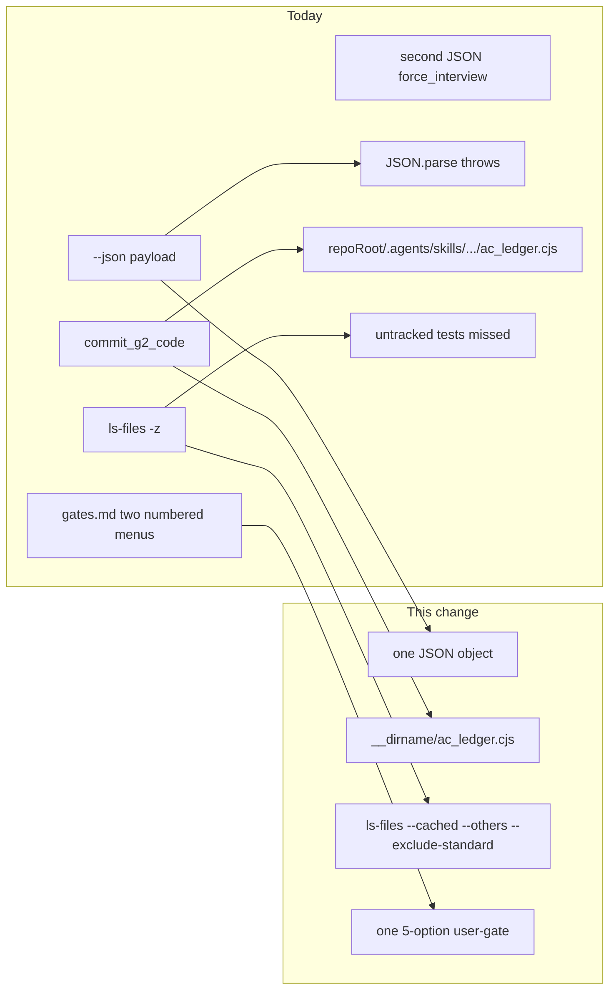

# Consolidated Gemini review fixes

Sources: [muse-spark-1.3-post-pr-review.md](.cursor/plans/muse-spark-1.3-post-pr-review.md) (verdicts + discard pile) and [forward_review_fixes_133df0ed.plan.md](.cursor/plans/forward_review_fixes_133df0ed.plan.md) (locked execution). User choice: **locked Forward-fix scope**.

**Execute:** D1 + D2a + D3 + Step 8 combined menu.
**Do not execute:** D2b (`commit_g2_code` markdown dual-write), D4 (`gitTrackedSet` cache), Phase 3 us-328 / `.cursor/plans` hygiene, amend of `1769ff75`, dirty `ws-benchmarks` tree.

## Context from muse-spark (do not re-solve)

Green items already on `develop`: `ac_ledger.cjs` scoreState self-heal, `classify.cjs` spec-touched layers, `build_dispatch_context.cjs` `\z`→`$`, process-waste stubs + `test-workflow-process-waste.js`. Leave them alone.

Traps to honor while editing:
- G2 staging stays `files_touched` only. Never `git add -A`.
- Regen integrity only for this change’s hashed files. Leave concurrent dirty `ws-benchmarks` unstaged.
- `check_memory_conflict.py` path matching and missing-MEMORY exit 0 stay unchanged.

## 1. D1 — one JSON from `check_memory_conflict.py`

File: [`.agents/skills/ws-spec-to-pr/scripts/check_memory_conflict.py`](.agents/skills/ws-spec-to-pr/scripts/check_memory_conflict.py) L470–487.

Today `--json` prints the full payload, then `--soft-exit` + traps prints a second `{"force_interview": true}` (L484–486). `JSON.parse(stdout)` throws. Help text at L435 still documents the second object.

Change:
- `--json`: print **one** object. `force_interview` = any trap `force_interview` **or** (`--soft-exit` and traps nonempty).
- `--json --soft-exit` + traps: `sys.exit(0)`, **no second print**.
- `--json` only + traps: `sys.exit(2)` unchanged (keeps [test/test-classifier-history.js](test/test-classifier-history.js) L123–125).
- No `--json` + `--soft-exit` + traps: human report on stdout, exit 0, **no extra JSON**.
- Update `--soft-exit` help: exit 0 with the same `--json` payload, not a second object.
- Do not change missing-MEMORY exit 0 or path matching.

Tests in [test/test-classifier-history.js](test/test-classifier-history.js):
- `--json --soft-exit` + overlapping trap: exit 0, `JSON.parse(stdout)` once, `force_interview === true`.
- `--json` only: still exit 2, one object (existing assert).

## 2. D2a — portable ledger path in `commit_g2_code.cjs`

File: [`.agents/skills/ws-spec-to-pr/scripts/commit_g2_code.cjs`](.agents/skills/ws-spec-to-pr/scripts/commit_g2_code.cjs) L88–89.

Replace `path.join(repoRoot, '.agents', 'skills', 'ws-spec-to-pr', 'scripts', 'ac_ledger.cjs')` with `path.join(__dirname, 'ac_ledger.cjs')`. Covers project-local, global, and hybrid installs.

Do **not** add markdown dual-write at L82. JSON-only state write stays.

Test in [test/test-runtime-portability.js](test/test-runtime-portability.js): source contains `__dirname` + `ac_ledger.cjs` and does **not** contain `'.agents', 'skills', 'ws-spec-to-pr'`.

## 3. D3 — untracked files in `probe_test_surface.cjs`

File: [`.agents/skills/ws-testing/scripts/probe_test_surface.cjs`](.agents/skills/ws-testing/scripts/probe_test_surface.cjs) L39.

Change to `git ls-files -z --cached --others --exclude-standard`. Keep the FS-walk fallback when git fails.

Existing [test/test-runtime-portability.js](test/test-runtime-portability.js) L34–47 uses `temp()` **without git**, so they already hit the FS-walk path. The new case must `git init` a temp repo, set empty `verification.backendTest`, write an **untracked** `test/new-feature.test.js`, run probe with `--repo-root`, expect `hasTestSurface: true`. Confirm ignored `node_modules` still excluded.

## 4. Step 8 — one combined user-gate, two state phases

Contract: **one prompt, five options**. State still records close (`status: completed`, `shipStatus: pending`) then ship (`shipAction` / `shipStatus`). Option 5 restores the old two-prompt close-then-ship flow.

Options (Recommended = 1 when `fullMode`):

1. Commit delivery artifacts and Create PR
2. Commit delivery artifacts and Push only
3. Commit delivery artifacts and Skip shipping
4. Skip delivery commit and Create PR
5. More options / Separate gates / Pause

Update so they no longer list two separate numbered menus:

- [`.agents/skills/ws-shared/runtime/gates.md`](.agents/skills/ws-shared/runtime/gates.md): dual-mode row L17 (“two gates”) plus L193–221 (phase A 3-way + phase B 5-way) plus auto-gate rows L290–293. Keep G2-delivery / MEMORY / changelog / `ws-ship-pr` semantics.
- [`.agents/skills/ws-spec-to-pr/STEP-DISPATCH.md`](.agents/skills/ws-spec-to-pr/STEP-DISPATCH.md): keep the Step 8 table row at L55; rewrite **§ Step 8 A/B** (L124–157) so the interactive prompt is the five-option menu, then mechanical close then ship.
- [`.agents/skills/ws-spec-to-pr/PROTOCOLS.md`](.agents/skills/ws-spec-to-pr/PROTOCOLS.md) L199–221 still duplicates the two menus; L261–262 already say “combined gate”. Make the numbered lists match the five options. Auto-gate index 0 stays “commit delivery then create PR” (`fullMode`) / skip-PR variant when not `fullMode`.
- [`.agents/skills/ws-spec-to-pr/docs/faq.md`](.agents/skills/ws-spec-to-pr/docs/faq.md) L163–171 still lists a separate 5-option Ship gate. Rewrite that bullet to the combined menu so the contradiction does not remain.

Lite has no duplicate Step 8 section; it inherits `gates.md`. No orch FSM code in this pass.

If [test/test-delivery-commit-artifacts.js](test/test-delivery-commit-artifacts.js) or [test/test-artifact-economy.js](test/test-artifact-economy.js) assert old close-gate strings, update those matches. `Commit configured delivery artifacts` stays in option 1, so the existing includes-assert should still pass.

## 5. Verify (same change, no extra features)

Baseline then targeted:

1. `python -m py_compile .agents/skills/ws-spec-to-pr/scripts/check_memory_conflict.py`
2. `node --check` on `commit_g2_code.cjs` and `probe_test_surface.cjs`
3. `node test/test-classifier-history.js`
4. `node test/test-runtime-portability.js`
5. `node test/test-artifact-economy.js` and `node test/test-delivery-commit-artifacts.js` if Step 8 strings changed
6. `npm run generate-integrity && npm run verify-integrity` (hashed skill/scripts/docs). **No version bump** (release PR owns one patch).
7. Changelog + `Learning:` per session contract. Stage only this change’s files.

## Explicit non-goals (muse-spark items deferred)

- Rebase/amend `1769ff75` (commit-message trap stays historical).
- Moving [`.agents/plans/us-328/`](.agents/plans/us-328/) or `.cursor/plans/`.
- [`workflow_state.cjs`](.agents/skills/ws-shared/runtime/scripts/workflow_state.cjs) `gitTrackedSet` cache (Defect 4).
- `commit_g2_code.cjs` writing `.state.md` (Defect 2b). Must reuse the canonical markdown serializer if ever done later; do not hand-render frontmatter.
- Dirty `ws-benchmarks` working tree.
