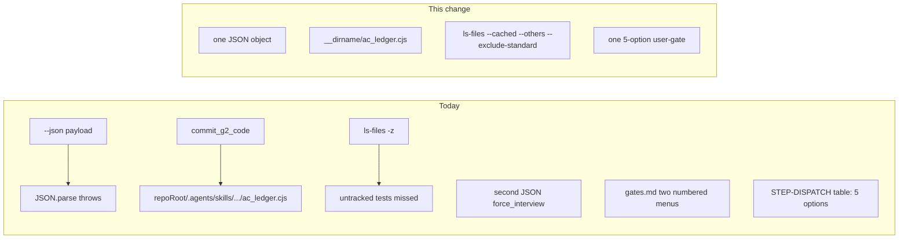

# Forward-fix remaining Gemini review defects

Scope locked: **D1 + D2a + D3 + Step 8 combined menu**. Out of scope: amend/split `1769ff75`, us-328 plan archive, `.cursor/plans`, `gitTrackedSet` cache, `commit_g2_code` markdown dual-write.

## Current vs target

## 1. D1 — single JSON from `check_memory_conflict.py`

File: [`.agents/skills/ws-spec-to-pr/scripts/check_memory_conflict.py`](.agents/skills/ws-spec-to-pr/scripts/check_memory_conflict.py) (print at L470–487).

- When `--json`: print **one** object. Set `force_interview` to any trap `force_interview` **or** (`--soft-exit` and traps nonempty).
- If traps and `--soft-exit`: `sys.exit(0)` with **no second print**.
- If traps and not `--soft-exit`: `sys.exit(2)` unchanged (keeps [`test/test-classifier-history.js`](test/test-classifier-history.js) L123–125).
- Update `--soft-exit` help: exit 0 with the same `--json` payload, not a second object.
- `--json` absent + `--soft-exit` + traps: keep human report on stdout, exit 0, no extra JSON (orch that needs JSON must pass `--json`).

Tests: extend [`test/test-classifier-history.js`](test/test-classifier-history.js) (already imported by [`test/test-orchestrator-intelligence.js`](test/test-orchestrator-intelligence.js)):
- `--json --soft-exit` + overlapping trap: exit 0, `JSON.parse(stdout)` once, `force_interview === true`.
- `--json` only: still exit 2, one object.

## 2. D2a — portable ledger path in `commit_g2_code.cjs`

File: [`.agents/skills/ws-spec-to-pr/scripts/commit_g2_code.cjs`](.agents/skills/ws-spec-to-pr/scripts/commit_g2_code.cjs) L88–89.

Replace `path.join(repoRoot, '.agents', 'skills', 'ws-spec-to-pr', 'scripts', 'ac_ledger.cjs')` with `path.join(__dirname, 'ac_ledger.cjs')`.

Do **not** add markdown dual-write.

Test: in [`test/test-runtime-portability.js`](test/test-runtime-portability.js) (already reads this skill tree), assert `commit_g2_code.cjs` source contains `__dirname` + `ac_ledger.cjs` and does **not** contain `'.agents', 'skills', 'ws-spec-to-pr'`.

## 3. D3 — untracked files in `probe_test_surface.cjs`

File: [`.agents/skills/ws-testing/scripts/probe_test_surface.cjs`](.agents/skills/ws-testing/scripts/probe_test_surface.cjs) L39.

Change to `git ls-files -z --cached --others --exclude-standard`. Keep the FS-walk fallback when git fails (non-git temp dirs in existing tests).

Test: git-init a temp repo with empty `verification.backendTest`, write an **untracked** `test/new-feature.test.js`, run probe with `--repo-root`, expect `hasTestSurface: true`. Place this in [`test/test-runtime-portability.js`](test/test-runtime-portability.js) next to the existing probe cases (L34–47). Confirm ignored `node_modules` still excluded.

## 4. Step 8 — one combined user-gate, two state phases

Chosen contract: **one prompt, five options**; state still records close (`status: completed`, `shipStatus: pending`) then ship (`shipAction` / `shipStatus`). Option 5 **More / Separate gates / Pause** restores the old two-prompt close-then-ship flow.

Options (Recommended = 1 when `fullMode`):

1. Commit delivery artifacts and Create PR
2. Commit delivery artifacts and Push only
3. Commit delivery artifacts and Skip shipping
4. Skip delivery commit and Create PR
5. More options / Separate gates / Pause

Update these so they no longer list two separate numbered menus:

- [`.agents/skills/ws-shared/runtime/gates.md`](.agents/skills/ws-shared/runtime/gates.md): dual-mode row L17 (“two gates”) plus L193–221 (phase A 3-way + phase B 5-way). Keep G2-delivery / MEMORY / changelog / `ws-ship-pr` semantics.
- [`.agents/skills/ws-spec-to-pr/STEP-DISPATCH.md`](.agents/skills/ws-spec-to-pr/STEP-DISPATCH.md): keep the Step 8 table row; rewrite **§ Step 8 A/B** (L124–157) so the interactive prompt is the five-option menu, then mechanical close then ship.
- [`.agents/skills/ws-spec-to-pr/PROTOCOLS.md`](.agents/skills/ws-spec-to-pr/PROTOCOLS.md) L199–221 still duplicates the two menus; L261–262 already say “combined gate”. Make the numbered lists match the five options. Auto-gate index 0 stays “commit delivery then create PR” (`fullMode`) / skip-PR variant when not `fullMode`.

Lite has no duplicate Step 8 section; it inherits `gates.md`. Do not invent orch FSM code; this pass is contract prose.

If [`test/test-artifact-economy.js`](test/test-artifact-economy.js) or similar asserts old close-gate strings, update those matches.

## 5. Verify and ship hygiene (same change, no extra features)

- Narrow: `node test/test-classifier-history.js`, `node test/test-runtime-portability.js`, `node test/test-artifact-economy.js`.
- Then `npm run generate-integrity && npm run verify-integrity` (hashed skill/scripts/docs). **No version bump** in this commit (release PR owns one patch).
- Changelog + `Learning:` per session contract after the edit; no us-328 history rewrite.

## Explicit non-goals

- Rebase/amend `1769ff75`
- Moving `.agents/plans/us-328/` or `.cursor/plans/`
- `workflow_state.cjs` `gitTrackedSet` cache
- `commit_g2_code.cjs` writing `.state.md`
- Dirty `ws-benchmarks` working tree (leave untouched)
