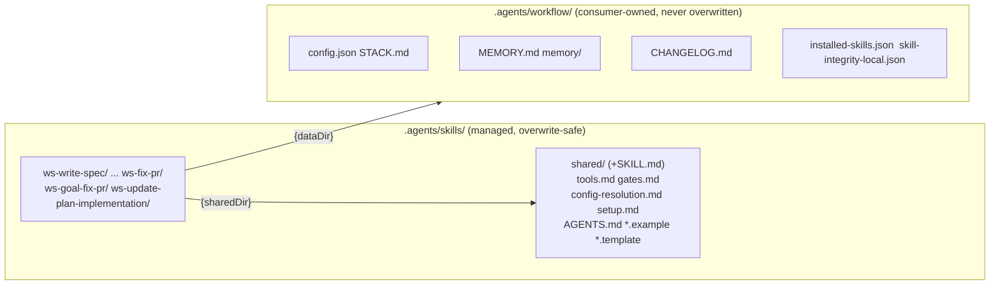

# Make workflow-skills compatible with `npx skills`

## Why / current state

`npx skills` (vercel-labs/skills) already treats `.agents/skills/` as a discovery root and tolerates all custom frontmatter, so every skill is *discovered* today. Three things stop them *working* after install:

- **Blocker 1 (data-loss):** `shared/` has no `SKILL.md` (never installed by the CLI), and it holds consumer data (`config.json`, `MEMORY.md`, `STACK.md`, `CHANGELOG.md`, `memory/`, `installed-skills.json`, `skill-integrity-local.json`). The CLI's `cleanAndCreateDirectory` does `rm -rf` before copy, and `skills update` runs non-interactively, so if `shared/` ever became installable it would delete that data.
- **Blocker 2 (broken links):** the CLI installs each skill into a dir named after frontmatter `name`, not the source folder. The 12 pipeline folders (`00-write-spec`…`09-fix-pr`, `goal-fix-pr`, `update-plan-implementation`) have `name: ws-*`, so they install to `ws-*/` and the ~19 `../0N-name/` relative links dangle.
- **Blocker 3 (no deps):** the CLI has no dependency resolution; installing `spec-to-pr` alone yields a broken orchestrator.

Decisions locked with the user: **1A** (new `.agents/workflow/` data dir + `{dataDir}` token; `shared/` becomes an installable skill of immutable assets) and **2A** (rename the 12 folders to `ws-*`). This inverts the current internal convention (numeric folders + consumer data in `shared/`) that `check-harness` and `check-workflows` actively enforce, so those validators, the installer, the integrity manifest, the dependency graph, the tests, the site, and ~8 scripts all change together. This is a large refactor; it is phased so each phase leaves the tree buildable and ends at a verifiable checkpoint.

## Scope decisions (committed)

- `{dataDir}` default = `.agents/workflow` (joins the `.agents/plans`, `.agents/codereviews` family), configurable via `config.json` `pathTokens.dataDir`.
- Consumer-owned files move to `{dataDir}/`: `config.json`, `MEMORY.md`, `memory/`, `STACK.md`, `CHANGELOG.md`, `installed-skills.json`, `skill-integrity-local.json`, plus a shipped `.agents/workflow/.gitignore`.
- `shared/` keeps only immutable shipped assets (`tools.md`, `gates.md`, `config-resolution.md`, `setup.md`, `AGENTS.md`, `config.schema.json`, `*.example`, `*.template`, `skill-dependencies.json`) and gains a `SKILL.md` (`name: shared`) so `npx skills` installs it to `.agents/skills/shared/`.
- All 12 pipeline folders rename to their `ws-*` name; folder == frontmatter `name`; orchestrators (`spec-to-pr`, `spec-to-pr-lite`) already match and do not move.
- Pipeline skills are actionable by **both** `ws-{skill-name}` and `{skill-name}` (`invocation_names` = strip-`ws-` short + full `ws-*`; drop numeric `0N-*` and non-canonical shorts like `fix-pr`).
- Phase 1 includes a **full-repo** path scan (not only relative skill links) until live `0N-*` / old folder paths are gone outside the allowlist.
- Included ecosystem pieces: README `npx skills` section (with `--all` guidance for Blocker 3), an orchestrator missing-dependency preflight, and a root `skills.sh.json` for skills.sh grouping.
- Excluded: `.claude-plugin` / `.cursor-plugin` marketplace manifests — they conflict with the repo's harness-neutrality rule (no host-product coupling) and a NVIDIA-style finder plugin is a separate design.

## Reference split (the core of 1A)



`{sharedDir}` references that point at immutable assets stay; references to the seven consumer files switch to `{dataDir}`.

## Phase 0 - Token contract

- Add `{dataDir}` (→ `pathTokens.dataDir`, default `.agents/workflow`) to [.agents/skills/shared/tools.md](.agents/skills/shared/tools.md) Path-tokens table and [.agents/skills/shared/config-resolution.md](.agents/skills/shared/config-resolution.md). Change config-resolution.md "Config path (only)" from `.agents/skills/shared/config.json` to `.agents/workflow/config.json`.
- Add `pathTokens.dataDir` to [.agents/skills/shared/config.json.example](.agents/skills/shared/config.json.example) and [.agents/skills/shared/config.schema.json](.agents/skills/shared/config.schema.json).

## Phase 1 - Remove folder numbering; real `ws-*` names (2A)

### Folder = frontmatter `name`

`git mv` so directory name equals `name:` (Agent Skills / `npx skills` install path):

| Old folder | New folder (`name:`) |
|------------|----------------------|
| `00-write-spec` | `ws-write-spec` |
| `01-write-plan` | `ws-write-plan` |
| `02-interview` | `ws-interview` |
| `03-plan-to-tasks` | `ws-plan-to-tasks` |
| `04-implement-tasks` | `ws-implement-tasks` |
| `05-verify-plan` | `ws-verify-plan` |
| `06-code-review` | `ws-code-review` |
| `07-testing` | `ws-testing` |
| `08-ship-pr` | `ws-ship-pr` |
| `09-fix-pr` | `ws-fix-pr` |
| `goal-fix-pr` | `ws-goal-fix-pr` |
| `update-plan-implementation` | `ws-update-plan-implementation` |

Orchestrators `spec-to-pr` / `spec-to-pr-lite` and non-pipeline skills already match; no rename.

### Invocation contract (actionable by both forms)

For every pipeline skill, frontmatter must satisfy:

- `name: ws-{skill-name}` (unchanged; already true)
- `invocation_names` **exactly** (order flexible):
  1. `{skill-name}` — short form = `name` with the `ws-` prefix stripped
  2. `ws-{skill-name}` — full form = `name`

| `name` | Required `invocation_names` |
|--------|-----------------------------|
| `ws-write-spec` | `write-spec`, `ws-write-spec` |
| `ws-write-plan` | `write-plan`, `ws-write-plan` |
| `ws-interview` | `interview`, `ws-interview` |
| `ws-plan-to-tasks` | `plan-to-tasks`, `ws-plan-to-tasks` |
| `ws-implement-tasks` | `implement-tasks`, `ws-implement-tasks` |
| `ws-verify-plan` | `verify-plan`, `ws-verify-plan` |
| `ws-code-review` | `code-review`, `ws-code-review` |
| `ws-testing` | `testing`, `ws-testing` |
| `ws-ship-pr` | `ship-pr`, `ws-ship-pr` |
| `ws-fix-pr` | `fix-pr`, `ws-fix-pr` |
| `ws-goal-fix-pr` | `goal-fix-pr`, `ws-goal-fix-pr` |
| `ws-update-plan-implementation` | `update-plan-implementation`, `ws-update-plan-implementation` |

**Drop** all numeric aliases (`00-write-spec`, `09-fix-pr`, …). **Drop** extra shorts that are not the strip-`ws-` form (e.g. retire `fix-pr` → use `fix-pr` / `ws-fix-pr` only; update slash-command docs `/ship-pr` stays valid via `ship-pr`).

Hosts may invoke `/write-spec`, `@ws-write-spec`, etc. Skill bodies and hubs document both forms.

### Full reference path scan (mandatory gate)

Do **not** stop at the ~19 relative links. After `git mv`, run a **repo-wide** scan and replace until clean.

**Patterns to find (live tree; fail Phase 1 if any remain outside allowlist):**

```text
0[0-9]-[a-z0-9-]+          # numeric folders / aliases
(?<!ws-)goal-fix-pr       # old unprefixed folder (keep as short invocation text only where intentional)
(?<!ws-)update-plan-implementation
\.\./0[0-9]-
skills/0[0-9]-
\.agents/skills/0[0-9]-
\.agents/skills/goal-fix-pr/
\.agents/skills/update-plan-implementation/
\.agents/skills/08-ship-pr/
\.agents/skills/09-fix-pr/
```

**Scan roots:** `.agents/skills/`, `.agents/AGENTS.md`, root `AGENTS.md`, `README.md`, `bin/` (`cli.js`, `skill-dependencies.json`, `build-site.js`, …), `test/`, `docs/` (then rebuild), `shared/skill-dependencies.json` mirror. Scripts under providers that hardcode `09-fix-pr` (e.g. `fetch_threads.cjs`).

**Allowlist (do not rewrite):**
- `CHANGELOG.md` historical entries
- Archived plan/state artifacts under `.agents/specs/**` / `.agents/plans/**` unless they are still used as live docs
- Explicit “LEGACY / retired id” banners inside `check-harness` that list old ids as **forbidden** examples

**Replace map (path segments):** every old folder segment → new `ws-*` segment (including markdown links, code fences, JSON skill ids, test path lists, STEP-DISPATCH, DIAGRAM, FAQ, hub Layer 2 tables).

**Done when:**
1. `ls .agents/skills/0{0..9}-*` → empty; `goal-fix-pr/` and `update-plan-implementation/` folders gone (only `ws-*` remain).
2. Grep for live `0[0-9]-` skill path/alias hits → 0 outside allowlist.
3. Each of the 12 skills has `invocation_names` = short + `ws-*` only.
4. Relative links like `../ws-write-spec/SKILL.md` resolve on disk.

## Phase 2 - shared/ becomes a skill; move consumer data

- Add `.agents/skills/shared/SKILL.md` (`name: shared`, description = "workflow config and shared assets hub").
- Split the ~130 `shared/` references: the seven consumer files → `{dataDir}/…` (`.agents/workflow/…`); immutable assets stay `{sharedDir}` / `../shared/`. Highest-density files: [self-learning/SKILL.md](.agents/skills/self-learning/SKILL.md), [check-harness/SKILL.md](.agents/skills/check-harness/SKILL.md), [configure-project/SKILL.md](.agents/skills/configure-project/SKILL.md), [changelog/SKILL.md](.agents/skills/changelog/SKILL.md), [spec-to-pr/SKILL.md](.agents/skills/spec-to-pr/SKILL.md).
- Add shipped `.agents/skills/shared/workflow.gitignore` template (installer lands it as `.agents/workflow/.gitignore`).

## Phase 3 - Installer, dependency graph, integrity

- [bin/skill-dependencies.json](bin/skill-dependencies.json): rename all 12 ids in `packages.workflows.skills` and every `dependencies` key/value to `ws-*`.
- [bin/install-rules.js](bin/install-rules.js): add `shared/SKILL.md` + `workflow.gitignore` to `HUB_WHITELIST`; move `CONSUMER_OWNED_HUB_FILES` / `CONSUMER_OWNED_HUB_DIRS` semantics to a new data-dir target.
- [bin/cli.js](bin/cli.js): retarget `ensureSharedConsumerArtifacts`, `installedSkillsManifestPath`, config seeding, and `ensurePathTokensInConfig` (add `dataDir`) from `.agents/skills/shared/` to `.agents/workflow/`; keep `shared/` hub copy for immutable assets only; keep `assertNotSelfOverwrite`.
- [bin/skill-integrity-lib.js](bin/skill-integrity-lib.js): `localIntegrityPath` → `.agents/workflow/`; keep `HUB_DIR = 'shared'` for immutable-asset hashing (now includes `SKILL.md`).
- Regenerate [bin/skill-integrity.json](bin/skill-integrity.json) via `npm run generate-integrity` (skill keys become `ws-*`; hub adds `SKILL.md`).

## Phase 4 - Validators

- [check-harness/SKILL.md](.agents/skills/check-harness/SKILL.md): rewrite the §3b folder/step table and Rules 1-2 to "folder == frontmatter `name` == `ws-*`" (step number tracked only in AGENTS.md), update the retired-id list, the `ls 0{0..9}-*` spot-check, Phase 2/5 matching, and the `{sharedDir}` consumer-file guidance (now `{dataDir}`).
- [check-workflows/scripts/check_workflows.py](.agents/skills/check-workflows/scripts/check_workflows.py): rewrite `expected_steps`/`aux_skills` maps to `ws-*`, `resolve_skills_dir` + `SHARED_DEPS_PATH`, and the `shared/config.json` state-isolation assertion to `.agents/workflow/config.json`. Update [check-workflows/SKILL.md](.agents/skills/check-workflows/SKILL.md) folder lists.

## Phase 5 - Scripts

Prerequisite: the **Add skill evals** plan has already moved the compiler to `.agents/skills/self-learning/scripts/self_learning.py`. Do not cite the old root path.

- Repoint config/MEMORY paths inside these scripts to `.agents/workflow/` (**post–Phase 1** paths):
  - [`.agents/skills/self-learning/scripts/self_learning.py`](.agents/skills/self-learning/scripts/self_learning.py)
  - [`.agents/skills/spec-to-pr/scripts/check_memory_conflict.py`](.agents/skills/spec-to-pr/scripts/check_memory_conflict.py)
  - [`.agents/skills/ws-ship-pr/scripts/verify.sh`](.agents/skills/ws-ship-pr/scripts/verify.sh)
  - [`.agents/skills/local-spec-provider/scripts/detect_specs_dir.py`](.agents/skills/local-spec-provider/scripts/detect_specs_dir.py)
  - [`.agents/skills/local-spec-provider/scripts/register_local_spec.py`](.agents/skills/local-spec-provider/scripts/register_local_spec.py)
  - [`.agents/skills/azure-devops-provider/scripts/fix_pr_azure_context.py`](.agents/skills/azure-devops-provider/scripts/fix_pr_azure_context.py)
- Fix hardcoded `09-fix-pr` / `ws-fix-pr` path in [`.agents/skills/github-provider/scripts/fetch_threads.cjs`](.agents/skills/github-provider/scripts/fetch_threads.cjs) → `.agents/skills/ws-fix-pr/…` (incl. `COOPERATIVE_FIX.md`).

## Phase 6 - Hubs, docs, ecosystem

- Update folder ids and consumer-data paths in root [AGENTS.md](AGENTS.md), [.agents/AGENTS.md](.agents/AGENTS.md), [.agents/skills/shared/AGENTS.md](.agents/skills/shared/AGENTS.md), [.agents/skills/shared/setup.md](.agents/skills/shared/setup.md).
- [README.md](README.md): add an `npx skills add jpolvora/workflow-skills --all` section (with the no-dep-resolution note) alongside the existing installer.
- Add root `skills.sh.json` (groupings: Orchestrators, Pipeline, Providers, Utilities, Review, Harness).
- Add a missing-dependency preflight to [spec-to-pr/SKILL.md](.agents/skills/spec-to-pr/SKILL.md) and [spec-to-pr-lite/SKILL.md](.agents/skills/spec-to-pr-lite/SKILL.md): if `{sharedDir}/tools.md` or required `ws-*` skills are absent, print the exact `npx skills add ... --all` command and stop.
- Rebuild the site (`npm run build-site:bump`) so [docs/index.html](docs/index.html) regenerates; fix static `shared/` prose in [bin/build-site.js](bin/build-site.js) and [docs/uninstall-installed-skills-manifest.md](docs/uninstall-installed-skills-manifest.md).

## Phase 7 - Update tests and verify

- Rewrite [test/test-install.js](test/test-install.js): pipeline path lists → `ws-*` (lines ~202-208, 252-256, 344-345, 648-658, 695-716, 830-875, 1123-1129) and the Phase 9/10 consumer-data assertions + ignore patterns from `.agents/skills/shared/` to `.agents/workflow/`.
- Run in order: `npm run generate-integrity && npm run verify-integrity`, `npm run test`, then `check-harness` and `check-workflows` (0 critical), then a scratch `npx skills add <local path> --all` dry-run to confirm the installed tree has intact `ws-*` links and no consumer data under `shared/`.

## Risks

- Highest-risk edits are the installer/integrity/test triad and the two validators; each phase ends buildable and Phase 7 is the gate before any claim of done.
- Renames use `git mv` to preserve history; integrity is regenerated (never hand-edited).
- This is upstream package content, so the release checklist (version bump, integrity regen, hub drift, tests) applies before any PR.