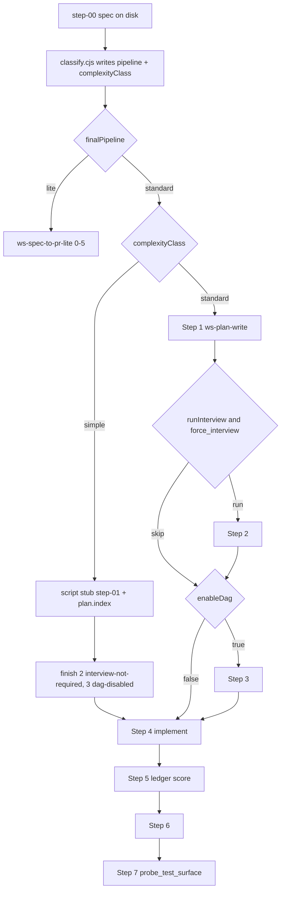

# Spec-to-PR speed and determinism

Judge evidence (no live sandbox write in this planning pass): static walk of every skip/loop in [STEP-DISPATCH.md](.agents/skills/ws-spec-to-pr/STEP-DISPATCH.md) + [gates.md](.agents/skills/ws-shared/runtime/gates.md); live run `.agents/plans/us-328/` (docs-only prose fix, ~13 min through Step 6, interview ran, 105 KB plan artifacts vs ~20 LOC); existing unit tests in `test/test-artifact-economy.js` / `test/test-workflow-state-contract.js`. Highest-ROI finding: **the simple path is documented but agents do not take it**.

## What is going wrong

Two orthogonal axes already exist and must stay separate:

- Pipeline classifier (`lite` | `standard`) in [classify.cjs](.agents/skills/ws-classify-complexity/scripts/classify.cjs)
- Complexity gate (`simple` | `standard` | `complex`) in [gates.md](.agents/skills/ws-shared/runtime/gates.md) (skip or stub Steps 1–3)

They fail in production because of instruction collisions and metric bugs:

- [SKILL.md](.agents/skills/ws-spec-to-pr/SKILL.md) `autoMode ≠ skip planning` table says **Never skip Steps 1–3**. Agents treat that as absolute, so the simple path never fires in `autoMode`. us-328 classify.md literally wrote `runInterview: true … autoMode auto-accepts, never skips Steps 1–3`.
- Complexity class is LLM-only. No test asserts `complexity | simple`. classify.cjs emits pipeline only.
- `classify.cjs` sets `layers = max(specLayers, configLayers)`. This repo’s `stack.backend.layers` has 3 entries, so almost every spec looks multi-layer and `runInterview` trips on `layers > 2`.
- Agents often hand-write `step-00-*.classify.md` instead of keeping the script artifact as SoT.
- Step 3 docs contradict: STEP-DISPATCH “no stubs” vs PROTOCOLS `write_sequential_dag.cjs`. Agents waste turns guessing.
- `files_touched` is agent-reported. us-328 listed 12 wiki HTML files that never landed in the product commit.
- Step 0 always re-sweeps and re-copies an already-valid `{specsDir}` spec.

Quality bars stay: `minVerifyScore` 9, G2-code, HS-1..HS-5, no `{plansDir}` in product commits, no host/IDE product names, path tokens only.

## P0 — Make skip paths fire (first PR)

This is the surgical win. us-328 would have skipped interview + full plan write, used a stub plan, and kept Steps 5–6–7.

1. **Untangle autoMode vs simple path** in [SKILL.md](.agents/skills/ws-spec-to-pr/SKILL.md) and the duplicate table in [STEP-DISPATCH.md](.agents/skills/ws-spec-to-pr/STEP-DISPATCH.md):
   - Keep: autoMode never waives planning for `standard`/`complex`.
   - Add: simple-path stub + skip 2/3 **still applies** in autoMode.
   - Align [gates.md](.agents/skills/ws-shared/runtime/gates.md) line 117 with STEP-DISPATCH: Step 1 is stubbed (not omitted); Steps 2–3 are skipped.

2. **Script the complexity gate** in [classify.cjs](.agents/skills/ws-classify-complexity/scripts/classify.cjs):
   - Emit `complexityClass: simple|standard|complex` plus `runInterview` into classify.md **and** state JSON (`update_state` field).
   - `simple` when spec path-refs are docs/test-only (md/html/txt + one test file), AC count ≤ 6, no Open Questions, no schema/API/tenancy signals. Conservative: uncertain → `standard`.
   - Count **spec-touched** layers (path-refs mapped onto `stack.backend.layers[].path`), never the raw configured layer count.
   - Orch must run the script and must not rewrite classify.md by hand. Add `## Subagent contract` to [ws-classify-complexity/SKILL.md](.agents/skills/ws-classify-complexity/SKILL.md).

3. **Stub plan by script**, not by LLM: new `write_simple_plan_stub.cjs` (goal + files from path-refs + AC checklist). Then `plan_index.cjs build`, `finish --status skipped` for steps 2 and 3. Persist `complexityClass` so pre-advance 4 accepts the stub without a refined plan.

4. **Existing-spec Step 0 short circuit**: if `{specsDir}` spec already validates under `--mode=authoring` (or `--mode=compat` for pre-closure), skip `ws-spec-write` reformulation and `search_plan_history.cjs` full-body scan. Still: register copy, `ac_ledger.cjs init`, classify.cjs, `finish --step 0`.

5. **Resolve Step 3 stub contradiction**: STEP-DISPATCH / ARTIFACTS / PROTOCOLS / [state-hygiene.md](.agents/skills/ws-spec-to-pr/protocols/state-hygiene.md) all say: `enableDag: false` → `finish dag-disabled`, **no** `write_sequential_dag.cjs` files. Keep the script for tests and `enableDag: true` sequential-under-threshold only. Fix the pre-advance cheat sheet that still requires `step-03-*.plan.exec.md`.

6. **`files_touched` ∩ git**: in [workflow_state.cjs](.agents/skills/ws-shared/runtime/scripts/workflow_state.cjs) `normalizeFilesTouched`, drop paths not in `git status --porcelain` / `git diff --name-only` (plus newly created untracked that exist on disk). Log dropped phantoms. This stops wiki HTML pollution in handoffs.

Tests (temp consumer, no live LLM): classify fixtures for docs-micro / multi-layer / open-questions; simple-path pre-advance 4 without interview/DAG artifacts; autoMode wording regression in STEP-DISPATCH; files_touched phantom drop; existing-spec skip does not call search_plan_history on bodies.

## P1 — Cut redundant orch work (second PR)

Keep quality gates; shrink tokens and wall-clock.

- **One canonical score/ship algorithm** in `gates.md`. STEP-DISPATCH keeps the action column plus one-line “Contract: gates.md § X”. PROTOCOLS links only. Target the duplicated autoMode table, post-mutating order, and Step 5/6 score tables.
- **Cap [search_plan_history.cjs](.agents/skills/ws-spec-to-pr/scripts/search_plan_history.cjs)**: index.json first; read at most top-3 matching workflow bodies.
- **[probe_test_surface.cjs](.agents/skills/ws-testing/scripts/probe_test_surface.cjs)**: `git ls-files` instead of full `walk()`. Persist `hasTestSurface` on state so Step 7 skip is O(1) when already known.
- **Persist `force_interview` at Step 1**; Step 4 re-runs `check_memory_conflict.py` only if plan mtime changed.
- **Missing `## Subagent contract`** on skills `build_dispatch_context.cjs` actually dispatches or classifies: `ws-plan-to-tasks`, `ws-fix-pr`, providers as needed. Move [ws-plan-verify](.agents/skills/ws-plan-verify/SKILL.md) anti-deliberation block **into** the injected contract (today it sits above the contract, so thin dispatch drops it).
- **Wiki sync**: STEP-DISPATCH says mandatory; skill says offered. Make it `plans.wiki.enabled` (default false unless wiki dir exists).

Do not invent a verification-manifest format in P1. Do not change version-bump policy (us-328 63-file stamp blast is a separate release-process issue).

## P2 — Process-waste judge + verification reuse (third PR)

- After Step 4, write `.runtime/verification-manifest.json` (alias exits, `scan_stack_invariants.cjs`, sabotage). Steps 5/6/7 **re-run only if `files_touched` changed**; otherwise link the manifest. Step 8 `workflowMode` PREPARE credits pinned SHA.
- Sandbox fixture `test/fixtures/fx-docs-micro/` (existing-spec, 1 md + 1 test AC) plus `test/test-workflow-process-waste.js`:
  - classify → `complexityClass: simple`, `runInterview: false`
  - stub plan exists; steps 2–3 skipped with canonical reasons
  - `files_touched` ⊆ git paths
  - artifact-byte ceiling vs product LOC
- Optional: extend `benchmarks/fixtures` oracle. Not a live `/ws-spec-to-pr` LLM run in CI.

## Out of scope

- New third orchestrator or collapsing standard into lite
- Lowering `minVerifyScore`, skipping Step 5/6 on standard orch, or auto-approving below bar
- Decoupling package version stamps from hub-hash edits
- Host-specific dispatch or product-branded skill prose
- Running a live agent sandbox as part of this implementation (unit/script fixtures only)

## Verification per PR

- Narrow tests listed above, then `node test/test-artifact-economy.js`, `node test/test-workflow-state-contract.js`, `node test/test-classifier-history.js`
- `ws-check-harness` Phases 0–5c on touched skills
- `npm run generate-integrity && npm run verify-integrity` if hashed bodies change
- FEATURES.md + hub/README only if user-visible skip behavior is described
- One patch bump per release PR, not per phase commit
