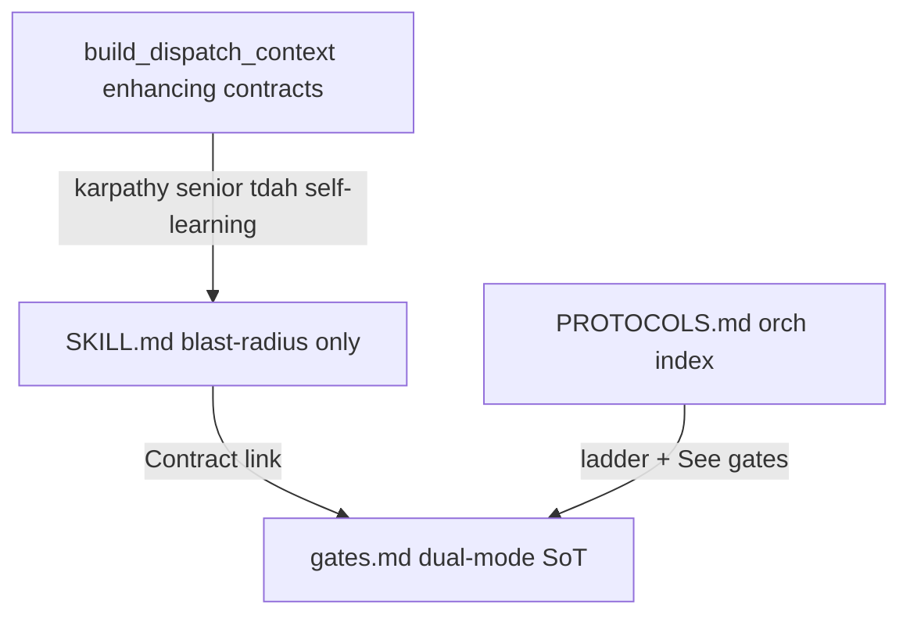

# Pipeline Guardrails + skill shrink (dedup)

## Verdict

Canonical safety already lives in [`gates.md`](.agents/skills/ws-shared/runtime/gates.md) and [`PROTOCOLS.md`](.agents/skills/ws-spec-to-pr/PROTOCOLS.md). Standard orch dispatch via [`build_dispatch_context.cjs`](.agents/skills/ws-spec-to-pr/scripts/build_dispatch_context.cjs) **already inlines** `## Subagent contract` from karpathy, senior-developer, tdah, and self-learning plus a MEMORY slice.

Pipeline skills still (a) miss a few blast-radius do/don'ts and (b) **restate** shared contracts (memory, minVerifyScore loops, G2 staging, handoff boilerplate, stack cheat sheets). Fix both: **one SoT + lean local Guardrails**, not more copied prose.

Estimated shrink from dedup alone: ~110–135 lines across the 11 pipeline skills, plus ~15–20 in `PROTOCOLS.md`, without weakening enforcement.



## Single-owner map (committed)

| Concern | Single owner | Skills keep |
|---------|--------------|-------------|
| HS-1–HS-5, G2 algorithm, dirty-tree STOP, skipQualityGates matrix, Reach-10, autoMode gates | [`gates.md`](.agents/skills/ws-shared/runtime/gates.md) | One-line pointer if subagent can violate (e.g. no self-commit) |
| Orch step timing, dispatch prefix, pre-advance | [`PROTOCOLS.md`](.agents/skills/ws-spec-to-pr/PROTOCOLS.md) / STEP-DISPATCH | Do not restate tables |
| Surgical scope, senior proof, reply shape, memory consult/learning | Injected enhancing `## Subagent contract` | Do **not** re-explain `read-memory` / karpathy in step bodies when orch-dispatched |
| Skill blast radius (writable paths, mode barriers, CLI SoT) | Each skill `## Guardrails` + `## Subagent contract` | 3–6 + ≤~12 contract bullets |
| Source anonymization | Hub `AGENTS.md` + one `setup.md` row + `ws-spec-write` | Not every skill |
| Visual References | Keep phrase in the four skills tests assert ([`test-visual-attachment-ingest.js`](test/test-visual-attachment-ingest.js)); optional shared 3-line fragment if tests still match | Do not delete the heading name |

## Lean skill pattern

Replace scattered Rules / long gate restatements with:

```markdown
## Guardrails
- 3–6 blast-radius bullets (writable paths, forbid self-commit/{plansDir}, mode hard stops)
- Contract: [`gates.md`](../ws-shared/runtime/gates.md) § {name} · orch: [`PROTOCOLS.md`](../ws-spec-to-pr/PROTOCOLS.md) § {name}

## Subagent contract
- Mechanics only (CLIs, artifacts, evidence schema). Cap lean; enhancing contracts stay injected.

## Steps
- Skill mechanics only — no minVerifyScore tables, no G2 algorithms, no karpathy/memory essays
```

Fold Guardrails into existing `## Rules of Engagement` / `## Subagent contract` when that is shorter than adding a third heading. Prefer positive enclosure ([`SKILL_AUTHORING.md`](.agents/skills/ws-write-a-skill/SKILL_AUTHORING.md)).

## Shrink targets (dedup first)

### A. Boilerplate present in 8–10 skills — remove from skills

- **"After step finish, orch persists the handoff…"** → own in PROTOCOLS Base Prompt / step-output schema only; drop from each `## Subagent contract`.
- **Full `read-memory` / every-backend Pre-work essays** in implement / plan-write / fix paths → one pointer: "Injected self-learning contract + MEMORY slice; return `memory_consult`." Keep a **standalone** one-liner for `/implement-tasks` without orch.
- **minVerifyScore / scoreAndRefine round tables** in [`ws-plan-verify`](.agents/skills/ws-plan-verify/SKILL.md) handoff and [`ws-implement-tasks`](.agents/skills/ws-implement-tasks/SKILL.md) ScoreAndRefine section → `Contract: gates.md § Check-implementation` / `§ Score & Refine` (item 4 for second pass). Keep: "do not author/override score; ledger CLI owns math."
- **G2 staging algorithms** duplicated in [`ws-fix-pr`](.agents/skills/ws-fix-pr/SKILL.md) / [`COOPERATIVE_FIX.md`](.agents/skills/ws-fix-pr/scripts/COOPERATIVE_FIX.md) → point to `gates.md` § Required G2-code; keep **path-scoped `git add -- <paths>`** as fix-pr blast radius (standalone `/fix-pr` commits).
- **Stack anti-pattern cheat sheets** repeated in implement / verify / review → "run `scan_stack_invariants.cjs`; honor stack pack" + link; do not paste `.Result` / `.Wait()` lists thrice.
- **SCM provider resolution tables** in ship / fix-pr / goal-fix-pr → `config-resolution.md` + `scm-provider-contract.md` pointer.
- **Visual References** instructions: keep the required phrase and one shared sentence pattern; avoid four divergent paragraphs (tests require the phrase in four SKILL.md files).

### B. Helper / orch contracts — thin mirrors

- [`PROTOCOLS.md`](.agents/skills/ws-spec-to-pr/PROTOCOLS.md): keep HS/G0–G3 as a **short ladder**; replace long G2/minVerifyScore prose with `See gates.md § …`.
- Do **not** invent a new mega-`guardrails.md` that every skill must load (progressive disclosure + context budget). Prefer existing `gates.md` as the portable SoT.
- Optional tiny shared fragments under `ws-shared/runtime/` only if they remove ≥3 copies without breaking tests (`visual-references.md` ~3 lines; stack-scan pointer ~5 lines). Prefer links over new files when one link to `gates.md` / script header suffices.

### C. What must stay local (do not over-dedup)

| Skill | Keep |
|-------|------|
| `ws-plan-verify` | Ledger CLI, DO NOT debate score, product immutable + Shell |
| `ws-implement-tasks` | TDD red/green, build vs fix modes, files_touched return, no self-commit |
| `ws-plan-interview` | gap_registry, grilling cap, shared_understanding emit |
| `ws-fix-pr` | fixPrPlan mutation barrier, plan-gate fields, batch staging |
| `ws-goal-fix-pr` | AC7–AC8 revision/blocked, never merge |
| `ws-testing` | probe skip, mutation/sabotage precedence |
| `ws-spec-write` | resolve_spec_path, authoring validate, `{specsDir}` vs `{plansDir}` |
| `ws-code-review` | 4-part proof, finding format (standalone loop may stay short) |

### D. Standalone / lite risk

- Skills invoked **without** `build_dispatch_context` (`/fix-pr`, `/plan-verify`, lite orch) still need Guardrails + Contract links; do not delete commit/score rules and rely only on injection.
- Lite does not use `build_dispatch_context.cjs` today — do not assume enhancing contracts are present; keep skill-local Guardrails. Optional follow-up (out of scope): wire lite to the same builder.

## Gap-fill (only blast radius; after or with shrink)

Net-add only what is missing and **skill-owned**. Prefer replacing a long paragraph with a shorter Guardrails bullet.

### P0

| Skill | Add (lean) | Shrink while editing |
|-------|------------|----------------------|
| `ws-implement-tasks` | Exact `files_touched`; no `git add`/`commit`/`push`, no `{plansDir}`, no `git add -A`; DAG path isolation; sabotage-aware tests when plan requires; no managed `ws-*` rewrites | Drop memory essay, ScoreAndRefine table → gates link; drop handoff boilerplate; thin stack cheat sheet |
| `ws-plan-verify` | Shell against product tree; no host question-only that blocks Shell; no product edits; no Advance-imply below `minVerifyScore`; negatives are gaps (cap via ledger) | Drop orch scoreAndRefine/Reach-10/G2 handoff prose → gates link |
| `ws-plan-interview` | MEMORY PathPattern / `force_interview` never soft-skip; emit `shared_understanding` correctly | Keep Grilling Protocol; avoid restating orch skip matrix |
| `ws-plan-write` | Write only assigned plan artifact; no git | Drop long memory Pre-work; pointer to injected/consult contract |
| `ws-testing` | Fail-closed mutation/sabotage; no product edits; `skipQualityGates` ≠ skip build/test; orch max-3 then Pause (one line) | Keep probe/mutation tables (local SoT) |

### P1

| Skill | Change |
|-------|--------|
| `ws-spec-write` | Anonymization bullets; existing-spec short-circuit one-liner |
| `ws-code-review` | Portable `localReviewCommand` only (drop host-branded path); dirty-tree → gates pointer; workflow fix-loop half → PROTOCOLS pointer where safe for standalone |
| `ws-ship-pr` | No benchmarks; workflowMode = push/PR only |
| `ws-plan-to-tasks` | No git; no inventing stubs when DAG off |
| `ws-fix-pr` | Managed-skill one-liner; staging → gates link + keep path-scoped add |
| `ws-classify-complexity` | Tiny consolidated Don't (axes / hand-write classify / mid-flight flip) |

### P2

- [`setup.md`](.agents/skills/ws-shared/runtime/setup.md) § External dependencies: **Source anonymization** → hub `AGENTS.md`.

## Explicitly leave orch-only

Do **not** paste into step skills: HS enforcement, G2 timing algorithm, pre-advance `validate_state`, Step 8 menus, Reach-10, `autoMode ≠ skip planning`, checkpoint tags.

## Verification

1. Preserve `Visual References` string in the four skills asserted by `test/test-visual-attachment-ingest.js`.
2. Enhancing-skill `## Subagent contract` stays ≤40 lines (`build_dispatch_context.cjs` throws otherwise).
3. Grep: no leftover host-branded `cursor-reviewer` contract paths; no resurrected minVerifyScore/G2 tables in step skills.
4. Run `test/test-context-budget.js` / harness duplicate checks / targeted skill tests; regenerate integrity only when preparing a ship commit.

## Out of this plan

- Full Extra/utility `ws-*` audit
- Wiring lite orch to `build_dispatch_context.cjs` (recommended follow-up)
- New monolithic shared guardrails skill
