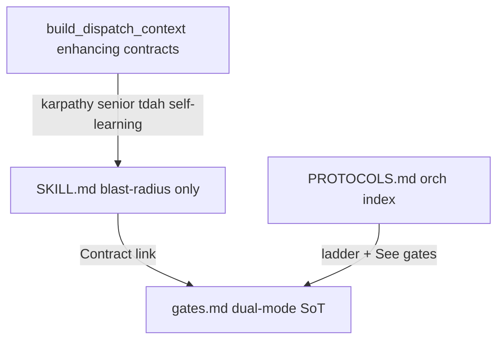

# Pipeline Guardrails + skill shrink (dedup)

## Verdict

Canonical safety already lives in [`gates.md`](.agents/skills/ws-shared/runtime/gates.md) and [`PROTOCOLS.md`](.agents/skills/ws-spec-to-pr/PROTOCOLS.md). Standard orch dispatch via [`build_dispatch_context.cjs`](.agents/skills/ws-spec-to-pr/scripts/build_dispatch_context.cjs) **already inlines** `## Subagent contract` from karpathy, senior-developer, tdah, and self-learning plus a MEMORY slice.

Pipeline skills still (a) miss a few blast-radius do/don'ts and (b) **restate** shared contracts (memory, minVerifyScore loops, G2 staging, handoff boilerplate, stack cheat sheets). Fix both: **one SoT + lean local Guardrails**, not more copied prose.

Estimated shrink from dedup alone: ~110–135 lines across the 11 pipeline skills, plus ~15–20 in `PROTOCOLS.md`, without weakening enforcement.

Recheck 2026-09-15 (grep counts): `G2-code` 90 hits, `minVerifyScore` 80, `scoreAndRefine` 61, `dispatch-agent` 64, `user-gate` 121, `fixPrPlan` 39, `autoMode` 50, orch handoff boilerplate 10–11x, `Visual References` 12x, `Starting step` 5x, `Commit configured delivery artifacts` 14x, `cleanup_workflow_git` 3x, `fable.enabled` 5x, `askQuestionTool` 12x. Biggest new wins are orch-helper triplication (Step 8 x3, model-role chain x5, G2 hunk algorithm x4) — see Shrink C/D–F. Revised total with D–F: ~200–260 lines removed, skills stay standalone via one-line Contract pointers.



## Single-owner map (committed)

| Concern | Single owner | Skills keep |
|---------|--------------|-------------|
| HS-1–HS-5, G2 algorithm, dirty-tree STOP, skipQualityGates matrix, Reach-10, autoMode gates | [`gates.md`](.agents/skills/ws-shared/runtime/gates.md) | One-line pointer if subagent can violate (e.g. no self-commit) |
| Orch step timing, dispatch prefix, pre-advance | [`PROTOCOLS.md`](.agents/skills/ws-spec-to-pr/PROTOCOLS.md) / STEP-DISPATCH | Do not restate tables |
| Surgical scope, senior proof, reply shape, memory consult/learning | Injected enhancing `## Subagent contract` | Do **not** re-explain `read-memory` / karpathy in step bodies when orch-dispatched |
| Skill blast radius (writable paths, mode barriers, CLI SoT) | Each skill `## Guardrails` + `## Subagent contract` | 3–6 + ≤~12 contract bullets |
| G2 hunk-separation algorithm (preExistingDirty, `git apply --cached`, `restore --staged`) | [`tools.md`](../ws-shared/runtime/tools.md) `commit-code` (full) · [`gates.md`](../ws-shared/runtime/gates.md) § Required G2-code save points (timing) | Skills/helpers keep 1 line: `Follow tools.md commit-code; fix-pr scope = batch paths only` |
| Step 8 combined gate 5 options + close→ship sequence + Phase A cleanup | [`gates.md`](../ws-shared/runtime/gates.md) § Step 8 combined gate (full) · [`artifact-cleanup.md`](../ws-spec-to-pr/protocols/artifact-cleanup.md) (Phase A) | PROTOCOLS / STEP-DISPATCH / lite keep 2–3 lines + `ws-ship-pr` args |
| Subagent model chain (`fixPrPlan→reviewer`, `fixPrExec→execution`, numeric 9 exclusion, `current` token) | [`tools.md`](../ws-shared/runtime/tools.md) § Subagent model preferences (full chain) | fix-pr keeps 2-row table; PROTOCOLS / STEP-DISPATCH / gates banner keep pointer |
| Verbose preview (`Starting step N` + 4–8 bullets), host binding (`askQuestionTool` tiers), session banner | [`config-resolution.md`](../ws-shared/runtime/config-resolution.md) § Verbose + [`host-dispatch.md`](../ws-shared/runtime/host-dispatch.md) · [`gates.md`](../ws-shared/runtime/gates.md) banner | Orchs + STEP-DISPATCH keep 1–2 line pointers, no pasted bullet spec |
| Universal step controls (Next/More/Previous/Replay/Commit/Undo), `autoMode ≠ skip planning` table | [`gates.md`](../ws-shared/runtime/gates.md) (both tables) | PROTOCOLS / STEP-DISPATCH / orch SKILLs pointer only |
| Fable routing, mutation/sabotage precedence, benchmark ban | [`config-resolution.md`](../ws-shared/runtime/config-resolution.md) § Fable · `ws-testing` (mutation/sabotage SoT) · [`delivery-result.md`](../ws-spec-to-pr/protocols/delivery-result.md) (elapsedSec = Timing only) | Step skills keep 1-line honor/trigger pointer |
| Source anonymization | Hub `AGENTS.md` + one `setup.md` row + `ws-spec-write` | Not every skill |
| Visual References | Keep phrase in the four skills tests assert ([`test-visual-attachment-ingest.js`](test/test-visual-attachment-ingest.js)); optional shared 3-line fragment if tests still match | Do not delete the heading name |

## Lean skill pattern

Replace scattered Rules / long gate restatements with:

```markdown
## Guardrails
- 3–6 blast-radius bullets (writable paths, forbid self-commit/{plansDir}, mode hard stops)
- Contract: [`gates.md`](../ws-shared/runtime/gates.md) § {name} · orch: [`PROTOCOLS.md`](../ws-spec-to-pr/PROTOCOLS.md) § {name}

## Subagent contract
- Mechanics only (CLIs, artifacts, evidence schema). Cap lean; enhancing contracts stay injected.

## Steps
- Skill mechanics only — no minVerifyScore tables, no G2 algorithms, no karpathy/memory essays
```

Fold Guardrails into existing `## Rules of Engagement` / `## Subagent contract` when that is shorter than adding a third heading. Prefer positive enclosure ([`SKILL_AUTHORING.md`](.agents/skills/ws-write-a-skill/SKILL_AUTHORING.md)).

## Shrink targets (dedup first)

### A. Boilerplate present in 8–10 skills — remove from skills

- **"After step finish, orch persists the handoff…"** → own in PROTOCOLS Base Prompt / step-output schema only; drop from each `## Subagent contract`.
- **Full `read-memory` / every-backend Pre-work essays** in implement / plan-write / fix paths → one pointer: "Injected self-learning contract + MEMORY slice; return `memory_consult`." Keep a **standalone** one-liner for `/implement-tasks` without orch.
- **minVerifyScore / scoreAndRefine round tables** in [`ws-plan-verify`](.agents/skills/ws-plan-verify/SKILL.md) handoff and [`ws-implement-tasks`](.agents/skills/ws-implement-tasks/SKILL.md) ScoreAndRefine section → `Contract: gates.md § Check-implementation` / `§ Score & Refine` (item 4 for second pass). Keep: "do not author/override score; ledger CLI owns math."
- **G2 staging algorithms** duplicated in [`ws-fix-pr`](.agents/skills/ws-fix-pr/SKILL.md) / [`COOPERATIVE_FIX.md`](.agents/skills/ws-fix-pr/scripts/COOPERATIVE_FIX.md) → point to `tools.md commit-code` (full) + `gates.md` § Required G2-code (timing); keep **path-scoped `git add -- <paths>`** as fix-pr blast radius (standalone `/fix-pr` commits).
- **Stack anti-pattern cheat sheets** repeated in implement / verify / review → "run `scan_stack_invariants.cjs`; honor stack pack" + link; do not paste `.Result` / `.Wait()` lists thrice.
- **SCM provider resolution tables** in ship / fix-pr / goal-fix-pr → `config-resolution.md` + `scm-provider-contract.md` pointer.
- **Visual References** instructions: keep the required phrase and one shared sentence pattern; avoid four divergent paragraphs (tests require the phrase in four SKILL.md files).

### B. Helper / orch contracts — thin mirrors

- [`PROTOCOLS.md`](.agents/skills/ws-spec-to-pr/PROTOCOLS.md): keep HS/G0–G3 as a **short ladder**; replace long G2/minVerifyScore prose with `See gates.md § …`.
- Do **not** invent a new mega-`guardrails.md` that every skill must load (progressive disclosure + context budget). Prefer existing `gates.md` as the portable SoT.
- Optional tiny shared fragments under `ws-shared/runtime/` only if they remove ≥3 copies without breaking tests (`visual-references.md` ~3 lines; stack-scan pointer ~5 lines). Prefer links over new files when one link to `gates.md` / script header suffices.

### C. Rechecked sweep 2026-09-15 — new dedup (keep contracts strong)

Evidence: `G2-code` 90x, `Commit configured delivery artifacts` 14x, `fixPrPlan` 39x, `Starting step` 5x, `cleanup_workflow_git` 3x, `fable.enabled` 5x, `benchmark` 7x outside bench skills, `More options` 9x. Rule: full prose lives once; callers keep a 1–2 line Contract pointer + their blast-radius delta.

#### D. Orch-helper triplication (largest new win, ~50–70 lines)

- **Step 8 combined gate x3** (`gates.md` 193–221 vs `PROTOCOLS.md` 195–217 vs `STEP-DISPATCH.md` 124–154 — same 5 options + close→ship sequence): keep full in `gates.md`; PROTOCOLS keeps `delivery-result.md → combined gate → ws-ship-pr(workflowMode, shipAction, stopBeforeFixPr)` (3 lines); STEP-DISPATCH keeps per-step Action row only. Same for **Phase A** `cleanup_workflow_git.py` 3x → keep in `artifact-cleanup.md`, others one-liner with terminal-`shipStatus` condition.
- **Check-implementation / Score&Refine / Reach-10 x3** (gates §§ vs PROTOCOLS §§ vs STEP-DISPATCH § Step 5 + `ws-plan-verify` §5 + `ws-implement-tasks` § ScoreAndRefine): keep full in `gates.md`; PROTOCOLS keeps ladder row + `Contract: gates.md` link; STEP-DISPATCH keeps Action-column dispatch verbs (`dispatch verify → scoreAndRefine substep → Reach-10 offer → G2-code`) without repasting tables; `ws-plan-verify` Handoff shrinks to `return score+report; orch owns gate per gates.md` (keep ledger CLI + DO NOT author score + Shell-not-question-only); `ws-implement-tasks` second-pass shrinks to `gates.md item 4 + full-diff + files_touched-only deletes`.
- **Post-mutating transition x2** (PROTOCOLS vs STEP-DISPATCH — same update_state→G2→checkpoint→pre-advance→board order): keep full order once in STEP-DISPATCH § Post-mutating transition; PROTOCOLS § Transition Discipline becomes `See STEP-DISPATCH § Post-mutating transition; G2 algorithm: gates.md`.

#### E. Shared-algorithm pastes (medium win, ~40–55 lines)

- **G2 hunk algorithm x4** (`tools.md commit-code` full vs `gates.md` § Required G2-code vs `COOPERATIVE_FIX.md` 100–108 vs `ws-fix-pr` Step 5): keep full **only** in `tools.md commit-code`; `gates.md` keeps timing table + `Algorithm: tools.md commit-code`; COOPERATIVE_FIX + fix-pr shrink to `Follow tools.md commit-code; scope = this batch paths; preExistingDirty stays unstaged; empty stage → comment-only 0–5`.
- **Model-role chain x5** (`tools.md` §§ vs `ws-fix-pr` 53–64 vs PROTOCOLS Model readiness vs STEP-DISPATCH Model Switching vs `gates.md` banner 64–66): keep full chain in `tools.md`; fix-pr keeps its 2-row role table (skill SoT for standalone); PROTOCOLS/STEP-DISPATCH/gates shrink to `Resolve per tools.md § Subagent model preferences; Step 9 bypasses numeric 9`.
- **Stack cheat-sheet x3 + rule-pack list x3** (`.Result/.Wait()/[Authorize]/any/Promises/subscriptions` in implement/verify/review; `abp-angular/typescript-node/nextjs-react/php-laravel` in review/spec-write/plan-write): replace pasted lists with `Run scan_stack_invariants.cjs; honor {sharedDir}/runtime/stacks/ pack for {stack}` + link; keep `ws-code-review` 4-part proof (unique, not dedupable).
- **SCM tables x4** (fix-pr 44–51 vs goal-fix-pr 38–45 vs ship-pr 19–26+Step5 vs `tools.md`/`config-resolution.md`): keep full in `config-resolution.md` § SCM + `scm-provider-contract.md`; callers shrink to `Resolve providers.scm per config-resolution; intents per scm-provider-contract (never raw gh/az; reject local for PR intents)`.
- **`read-memory` routing x4** (implement Build-2/Fix-2 vs plan-write Step1 vs COOPERATIVE_FIX Discovery-2 vs `tools.md read-memory` full): keep full routing in `tools.md read-memory`; skills keep `Apply injected slice + return memory_consult; standalone: tools.md read-memory` (implement keeps TDD/sabotage linkage line; fix-pr keeps `sourcesConsulted` field rule).

#### F. Small one-liner normalizations (~25–35 lines)

- **Verbose/host/banner x3–5x** (`Starting step` 5x, `askQuestionTool` 12x, `Orchestrator session model` 3x, `More options` 9x): keep bullet spec in `config-resolution.md` § Verbose + `host-dispatch.md` + `gates.md` banner/controls; orchs + STEP-DISPATCH + PROTOCOLS shrink to pointers. Do not paste 4–8 bullet template more than once.
- **`autoMode ≠ skip planning` x2** (standard SKILL 46–55 vs STEP-DISPATCH 9–18): keep in `gates.md` auto-gate + one orch table; other file points to it.
- **Fable 5x / mutation-sabotage 3x / benchmark-ban 4x**: skills shrink to `Honor config-resolution § Fable` / `Mutation+sabotage: ws-testing SoT; verify links ledger, does not re-specify thresholds` / `Never benchmark; elapsedSec = Timing only → delivery-result.md`.
- **Visual References 12x** (spec-write 5x alone): normalize to one sentence `When spec has ## Visual References: Read each ok image (skip PDF)` + preserve-sidecar rule in spec-write only; tests still match phrase.
- **`Entry check` 11x identical one-liner**: intentionally kept (standalone guard) — do not expand, do not delete.

### G. What must stay local (do not over-dedup)

| Skill | Keep |
|-------|------|
| `ws-plan-verify` | Ledger CLI, DO NOT debate score, product immutable + Shell |
| `ws-implement-tasks` | TDD red/green, build vs fix modes, files_touched return, no self-commit |
| `ws-plan-interview` | gap_registry, grilling cap, shared_understanding emit |
| `ws-fix-pr` | fixPrPlan mutation barrier, plan-gate fields, batch staging |
| `ws-goal-fix-pr` | AC7–AC8 revision/blocked, never merge |
| `ws-testing` | probe skip, mutation/sabotage precedence |
| `ws-spec-write` | resolve_spec_path, authoring validate, `{specsDir}` vs `{plansDir}` |
| `ws-code-review` | 4-part proof, finding format (standalone loop may stay short) |

### H. Standalone / lite risk

- Skills invoked **without** `build_dispatch_context` (`/fix-pr`, `/plan-verify`, lite orch) still need Guardrails + Contract links; do not delete commit/score rules and rely only on injection.
- Lite does not use `build_dispatch_context.cjs` today — do not assume enhancing contracts are present; keep skill-local Guardrails. Optional follow-up (out of scope): wire lite to the same builder.

## Gap-fill (only blast radius; after or with shrink)

Net-add only what is missing and **skill-owned**. Prefer replacing a long paragraph with a shorter Guardrails bullet. Each add is one line; full prose stays in its SoT (no new copies).

### P0 (verified gaps 2026-09-15 — grep-backed)

| Skill | Add (lean, 1 line each) | Shrink while editing |
|-------|-------------------------|----------------------|
| `ws-implement-tasks` | Exact `files_touched` (created/modified/deleted, repo-relative, no `{plansDir}`); no `git add`/`commit`/`push` in any form (staging is orch-owned); DAG sibling isolation (edit only assigned task files); sabotage-ready tests (assertions must fail on inverted code, no tautologies); no managed `ws-*` rewrites unless task names that file | Drop memory essay, ScoreAndRefine table → gates link; drop handoff boilerplate; thin stack cheat sheet |
| `ws-plan-verify` | Shell-required (product-tree inspection via Shell; never host question-only/readonly — PROTOCOLS Step 5 owns this, skill restates 1 line so standalone `/plan-verify` can't go Shell-less); no product/spec/plan edits (report only); no Advance-imply below `minVerifyScore`; negatives are gaps (cap via ledger); below-bar quick score must escalate to full matrix, never finalize in quick mode | Drop orch scoreAndRefine/Reach-10/G2 handoff prose → gates link |
| `ws-plan-interview` | `force_interview` (from `check_memory_conflict.py`) overrides `softSkipEligible` — never soft-skip on MEMORY PathPattern match; emit `shared_understanding` correctly (auto-confirmed only via 2c End, else pending) | Keep Grilling Protocol; avoid restating orch skip matrix |
| `ws-plan-write` | Write only assigned plan artifact; no product edits; no `git add`/`commit`/`push`; no managed `ws-*` rewrites; §6 invariant plan mandatory (touched framework boundaries without checks → blocking gap for interview, not silent pass) | Drop long memory Pre-work; pointer to injected/consult contract |
| `ws-testing` | Fail-closed mutation/sabotage; no product **or test-source** edits (report gaps → `ws-implement-tasks` fix mode); `skipQualityGates` ≠ skip build/test/leak scans (quality gates only); probe-machine skip only (never judgment); orch max-3 then Pause (one line) | Keep probe/mutation tables (local SoT) |

### P1

| Skill | Change |
|-------|--------|
| `ws-spec-write` | Anonymization 1-liner (strip private names/paths/hosts; paraphrase consumer pastes — hub SoT, skill restates for standalone); do-not-overwrite differing spec-of-record without explicit overwrite intent (register `--force` rule already covers plan copy); existing-spec short-circuit one-liner |
| `ws-code-review` | Portable `localReviewCommand` only (drop `cursor-reviewer`/`scripts/cursor-reviewer` branded path — grep must hit 0); dirty-tree → gates fail-closed pointer (committed `{base}...HEAD` only, never dirty WT as snapshot); workflow fix-loop table → PROTOCOLS pointer, keep short standalone loop; sibling sweep beyond diff stays |
| `ws-ship-pr` | No benchmarks (1 line; `generate-telemetry-aggregate.cjs` is not a harness benchmark); workflowMode = push/PR only (no delivery commit, no goal-fix loop when `stopBeforeFixPr`); external-post anonymization 1-liner (PR body/issue comments: generic wording, no private paths/hosts) |
| `ws-plan-to-tasks` | No git; no state/ledger writes (return paths only); no inventing stubs/DAG when `enableDag` false (STOP or sequential-stub note — orch owns the stub); DAG path isolation stays |
| `ws-fix-pr` | Managed-skill one-liner (no `ws-*` rewrites unless batch names that file); staging → `tools.md commit-code` + gates timing link + keep path-scoped add; external-post anonymization 1-liner (resolution comments: generic class wording); one `fixPrPlan`→`fixPrExec` pair per batch (already present — keep, don't expand) |
| `ws-classify-complexity` | Tiny consolidated Don't (axes / hand-write classify / mid-flight flip); `complex` forces `standard` stays |
| `ws-spec-to-pr-lite` | MEMORY consult aligns to `tools.md read-memory` (both backends, not grep-only — current Invariant 9 misses vault when `enableSpecMemoIntegration`); rest unchanged (no verify/testing dispatch, role keys ignored, safety valve stays) |

### P2

- [`setup.md`](.agents/skills/ws-shared/runtime/setup.md) § External dependencies: **Source anonymization** → hub `AGENTS.md` (skills that post externally — `ws-ship-pr` create-pr/comment-issue, `ws-fix-pr` resolve-thread — each keep a 1-line pointer, not pasted prose).
- Providers (`github`/`azure-devops`/`local`): no new guardrails — contract already owns spec-of-record-first, `ws-spec-write` reformulation (never raw copy), `--force`-only overwrite, delegate-or-STOP PR intents, `validate-auth` before remote mutation. Keep as-is; do not paste provider tables into callers.

## Explicitly leave orch-only

Do **not** paste into step skills: HS enforcement, G2 timing algorithm, pre-advance `validate_state`, Step 8 menus, Reach-10, `autoMode ≠ skip planning`, checkpoint tags.

## Verification

1. Preserve `Visual References` string in the four skills asserted by `test/test-visual-attachment-ingest.js`.
2. Enhancing-skill `## Subagent contract` stays ≤40 lines (`build_dispatch_context.cjs` throws otherwise).
3. Grep (must drop, not just move): `After step finish` → 0 in SKILLs (owned by PROTOCOLS Base Prefix + STEP-DISPATCH post-transition); `Commit configured delivery artifacts` → 1 file (gates.md); `cleanup_workflow_git` → 1 file (artifact-cleanup.md + 1 pointer each orch); `Starting step` template → 1 file (config-resolution); `cursor-reviewer` branded path → 0 (portable `localReviewCommand` only); `minVerifyScore` tables → gates + 1-line pointers in verify/implement; G2 hunk prose (`git apply --cached`) → tools.md only.
3b. Grep (must appear — new guardrails): `force_interview` in `ws-plan-interview` (overrides soft-skip); `question-only` in `ws-plan-verify` (Shell-required); `skipQualityGates` in `ws-testing` (≠ skip build/test); `git` prohibition in `ws-plan-write` + `ws-plan-to-tasks` (no commit/push/state writes); `managed` (`ws-*` no-rewrite) in implement/plan-write/fix-pr; `read-memory` routing in lite (both backends, not grep-only); `anonym` pointer in spec-write/ship-pr/fix-pr.
4. Run `test/test-context-budget.js` / harness duplicate checks / targeted skill tests; regenerate integrity only when preparing a ship commit.
5. Standalone spot-check: `/fix-pr`, `/plan-verify`, lite Step 2→3 still gate correctly from skill-local Guardrails alone (no injected contract).

## Out of this plan

- Full Extra/utility `ws-*` audit
- Wiring lite orch to `build_dispatch_context.cjs` (recommended follow-up)
- New monolithic shared guardrails skill
