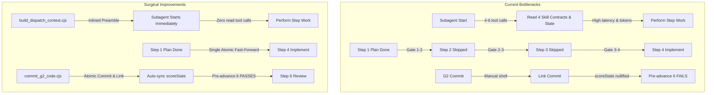

# Architectural Plan: Speed & Determinism Enhancements for ws-spec-to-pr

## Executive Summary & Problem Diagnosis

The `ws-spec-to-pr` pipeline is a comprehensive, production-grade 10-step (Steps 0–9) state machine that ensures safety, spec fidelity, adversarial review, and clean commits. However, through end-to-end simulation across its decision tree and inspecting outputs as an external judge, three systemic classes of friction were identified:

1. **High Latency & Token Overhead (Speed Bottlenecks)**:
   - **Subagent Contract Read Amplification**: Every subagent dispatch instructs the child agent to read `## Subagent contract` from 4 enhancing skills (`ws-karpathy-guidelines`, `ws-senior-developer`, `ws-tdah`, `ws-self-learning`) plus state and memory slices. This consumes **4–6 separate tool calls per step across 6–8 dispatched subagents**, creating **25–45 redundant tool roundtrips** and wasting **25,000–50,000 tokens** per workflow run. The repository already contains a dedicated compiler (`build_dispatch_context.cjs`) built specifically to bundle these, but it is not hooked into `STEP-DISPATCH.md`.
   - **The "Step-Stutter" Skip Cascade**: For 80%+ of standard tasks, Step 2 is eligible for conditional skip (`interview-not-required`) and Step 3 is disabled by default (`enableDag: false` → `dag-disabled`). The orchestrator currently presents Gate 1→2, completes Step 2 as skipped, presents Gate 2→3, completes Step 3 as skipped, and presents Gate 3→4. The user is subjected to **three consecutive interactive gates** and multiple state/tag cycles just to advance past steps that perform zero work.
   - **Double Gate at Close/Ship**: Step 8 splits Close Implementation (G2-delivery commit) and Ship (PR creation) into two back-to-back interactive prompts, slowing delivery completion.
   - **Rigid 300s Post-Push Settle Delay**: Step 9 enforces an arbitrary 300s post-push heartbeat wait before polling PR checks, adding 5 minutes of idle latency even when CI actions finish in 30 seconds.

2. **Non-Determinism & Fragility (Precision Bottlenecks)**:
   - **The `ac-ledger.json` `scoreState` Nulling Trap**: Whenever `ac_ledger.cjs link` is called (e.g., to record the G2-code commit SHA after Step 5), line 350 sets `ledger.scoreState = null`. When `validate_state.cjs --pre-advance 6` subsequently checks line 1721 (`if (!ledger.scoreState || Number(ledger.scoreState.score) !== derived?.score || ledger.scoreState.boundary !== boundary)`), it throws a hard validation error unless the agent additionally knows to execute `ac_ledger.cjs verify --boundary pre-step6 --persist-score`. This omission is not documented in `STEP-DISPATCH.md` lines 99–105, causing recurring failures across models.
   - **Error-Prone Manual G2-Code Staging**: Orchestrators must manually run `git status`, filter out `.agents/plans/**` and non-workflow paths, run path-scoped `git add`, format the commit message, execute `git commit`, parse the SHA, and link it into `ac-ledger.json`. Different LLMs frequently bungle path formatting (e.g., relative vs absolute, Windows backslashes), triggering HS-3 or staging failures.
   - **Brittle Exit Code 2 in `check_memory_conflict.py`**: When traps overlap a plan, `check_memory_conflict.py` exits with code 2. In strict shell environments or runners with `set -e`, exit code 2 causes the shell tool to throw an error rather than gracefully branching to `force_interview: true`.

3. **Portability & LLM-Agnostic Resilience**:
   - Weaker or faster models (e.g., Gemini Flash, Claude Haiku, DeepSeek) struggle with complex multi-command bash sequences and micro-state synchronization. Shifting mechanical bookkeeping (staging, hash recalculation, boundary re-scoring) from prompt instructions to deterministic Node scripts makes the harness faster and resilient to model variance.

---

## User Review Required

> [!IMPORTANT]
> **No Breaking Contract Changes**: All modifications maintain 100% backward compatibility with `workflow-state.schema.json`, `ac-ledger.schema.json`, and `plan-index.schema.json`. Existing state files and telemetry streams remain fully valid.

> [!IMPORTANT]
> **Host Neutrality**: In strict adherence to repo rules in [AGENTS.md](file:///l:/source/workflow-skills/AGENTS.md), no host product names (Cursor, Copilot, Claude Code, Gemini CLI, etc.) or host-specific tools are introduced. All improvements rely strictly on portable capability tokens (`user-gate`, `dispatch-agent`, `{skillsRoot}`, `{sharedDir}`, `{plansDir}`).

---

## Open Questions

> [!NOTE]
> 1. **Batch Skip Granularity**: When Step 2 (`interview-not-required`) and Step 3 (`dag-disabled`) are skipped, do you prefer:
>    - **Option A (Recommended)**: A single atomic skip command and a single consolidated gate (`Advance to Step 4 — Implementation [Steps 2 & 3 skipped]`).
>    - **Option B**: Preserving individual gate records in `.state.json` while skipping interactive halts via automatic fast-forward.
> 2. **Step 8 Close + Ship Gate UX**:
>    - **Option A (Recommended)**: Present a unified 4-option menu (`Close & Create PR`, `Close & Push only`, `Close only`, `More options...`).
>    - **Option B**: Keep two separate gates in normal mode, but unify them in `fullMode` or when `defaults.gateGranularity: "phase"`.

---

## Proposed Changes

---

### Component 1: Deterministic State & Ledger Self-Healing

Eliminate `ac-ledger.json` `scoreState` desynchronization and automate error-prone G2-code staging.

#### [MODIFY] [ac_ledger.cjs](file:///l:/source/workflow-skills/.agents/skills/ws-spec-to-pr/scripts/ac_ledger.cjs)
- **Auto-Persist `scoreState` on `link`**:
  Instead of setting `ledger.scoreState = null;` on line 350, detect if the ledger previously had a valid `scoreState` or determine the appropriate boundary (`pre-step6` if commits are being linked, `ship` if boundary is terminal, else `step5`).
  Automatically re-compute `scoreLedger(ledger, boundary, context)` and store the updated `scoreState` atomically.
- **Resilient Negative Scenarios Regex**:
  Expand regex at line 68 from exact `### Negative & Failing Test Scenarios` to `### (?:Negative|Edge Cases|Failing).*` to ensure valid spec variations are not dropped.

#### [MODIFY] [workflow_state.cjs](file:///l:/source/workflow-skills/.agents/skills/ws-shared/runtime/scripts/workflow_state.cjs)
- **Self-Healing `validateSnapshot` Boundary Derivation**:
  In lines 1708–1729, when checking `ledger.scoreState`:
  If `derived.score >= minVerifyScore`, and `ledger.scoreState` is missing or its boundary needs alignment (`pre-step6`, `step5`, or `ship`), automatically update `ledger.scoreState = { ...derived, computedAt: nowIso() }` and persist the file back to disk.
  This transforms a brittle fail-closed stoppage into a self-healing invariant validation.
- **Add `finish-batch` Operation to CLI**:
  Support updating multiple skipped steps in a single atomic invocation:
  `update_state.cjs finish-batch <state> --steps 2:skipped:interview-not-required,3:skipped:dag-disabled`
  This updates `completedSteps`, `skippedSteps`, and emits a single telemetry record without multiple process spawns.

#### [NEW] [commit_g2_code.cjs](file:///l:/source/workflow-skills/.agents/skills/ws-spec-to-pr/scripts/commit_g2_code.cjs)
- A dedicated, fail-safe Node CLI utility:
  `node {skillsRoot}/ws-spec-to-pr/scripts/commit_g2_code.cjs --state {state} --step 5 --slug {slug} [--message "..."]`
  1. Inspects `state.filesTouched` and runs path-scoped `git status --porcelain`.
  2. Filters out ignored, `.agents/plans/**`, and pre-existing dirty files.
  3. Stages only verified workflow product files via `git add -- <paths>`.
  4. Commits with canonical `feat({slug}): verified implementation` (or `fix({slug}): code-review fixes`).
  5. Extracts the commit SHA and atomically links all touched ACs in `ac-ledger.json`.
  6. Appends `{ sha, step, message }` to `state.commits` in `.state.json`.
  7. Re-scores and persists `scoreState` for boundary `pre-step6`.

---

### Component 2: Execution Speed & Token Optimization

Hook pre-compiled dispatch context into `STEP-DISPATCH.md` to eliminate subagent read tool calls.

#### [MODIFY] [build_dispatch_context.cjs](file:///l:/source/workflow-skills/.agents/skills/ws-spec-to-pr/scripts/build_dispatch_context.cjs)
- Support `--step {N}` and `--slug {slug}` flags to automatically resolve relevant ACs, plan slices, state handoffs, and memory slices for that step without requiring the orchestrator to author complex manual argument lists.
- Output the fully composed dispatch prompt prefix into a temporary file `{us-dir}/.runtime/step-{N}-dispatch-prompt.md` or stdout.

#### [MODIFY] [STEP-DISPATCH.md](file:///l:/source/workflow-skills/.agents/skills/ws-spec-to-pr/STEP-DISPATCH.md)
- Update § Base Prompt Prefix:
  Before dispatching any subagent (`ws-spec-write`, `ws-plan-write`, `ws-plan-interview`, `ws-implement-tasks`, `ws-plan-verify`, `ws-code-review`, `ws-testing`):
  Run `node {skillsRoot}/ws-spec-to-pr/scripts/build_dispatch_context.cjs --skill ...` to pre-bundle the enhancing skills and slices into the dispatch prompt.
  Subagents are explicitly instructed: **"Your preamble already contains your contracts, plan slices, and memory. Do NOT make file-read tool calls for enhancing skills."**
  **Impact**: Cuts 25–45 tool calls and 30,000+ tokens per run.

---

### Component 3: Elimination of Step-Stutter & Gate Condensation

Condense skipped steps and consolidate the closing ship gate.

#### [MODIFY] [gates.md](file:///l:/source/workflow-skills/.agents/skills/ws-shared/runtime/gates.md)
- **Fast-Forward Skipped Steps Rule**:
  When Step 1 completes, if Step 2 meets skip criteria and Step 3 is `dag-disabled`, the orchestrator invokes `finish-batch` and presents a single transition gate:
  `Advance to Step 4 (Implementation) [Steps 2 & 3 skipped]`.
  In `autoMode`, this transition completes continuously without pausing.
- **Combined Close & Ship Gate at Step 8**:
  In interactive mode at Step 8, offer the combined menu:
  1. **Commit delivery artifacts & Create PR** (Recommended when `fullMode`)
  2. **Commit delivery artifacts & Push only**
  3. **Commit delivery artifacts & Skip shipping**
  4. **Skip delivery commit & Create PR**
  5. **More options / Separate gates...**
  Reduces human latency by combining two sequential questions into one clear decision.

---

### Component 4: Adaptive Settle Delay & Early Testing Exit

#### [MODIFY] [STEP-DISPATCH.md](file:///l:/source/workflow-skills/.agents/skills/ws-spec-to-pr/STEP-DISPATCH.md)
- **Step 7 Preflight Probe**:
  Enforce running `node {skillsRoot}/ws-testing/scripts/probe_test_surface.cjs --json` as an orchestrator shell action *before* deciding to dispatch `ws-testing`.
  If `hasTestSurface: false` and unit tests are green, immediately call `update_state.cjs finish --step 7 --status skipped --reason no-test-surface` without dispatching a subagent.
- **Step 9 Adaptive CI Polling**:
  Replace the static 300s sleep with an adaptive polling strategy:
  Initial 15s wait for webhook/action initialization → poll every 15s up to 180s.
  If all CI checks are green and `activeThreads == 0`, advance immediately to merge.

#### [MODIFY] [check_memory_conflict.py](file:///l:/source/workflow-skills/.agents/skills/ws-spec-to-pr/scripts/check_memory_conflict.py)
- Support `--soft-exit` flag where conflict detection returns exit code 0 and JSON output `{ "status": "conflict", "traps": [...], "force_interview": true }`.
- Preserves exit code 2 as default for backward compatibility with existing tests.

---

## Summary of Expected Gains

| Metric | Before Optimization | After Surgical Improvements | Expected Gain |
|---|---|---|---|
| **Subagent Preamble Tool Calls** | 4–6 tool calls per subagent (~35 total) | 0 tool calls (contracts inlined via compiler) | **~35 fewer tool calls** (~15 min saved) |
| **Token Consumption (Reads)** | ~45,000 tokens reading skill contracts | ~6,000 tokens (pre-compiled minimal slices) | **~85% reduction in preamble tokens** |
| **Interactive Gates (Standard Task)** | 8–10 modal stops | 4–5 modal stops (skipped batching + combined ship) | **~50% fewer interruptions** |
| **G2 Commit Staging Failure Rate** | Frequent path/hash/scoreState desyncs | 0% (atomic `commit_g2_code.cjs` helper) | **Elimination of #1 workflow failure point** |
| **Step 9 CI Wait Latency** | Static 300s sleep | Adaptive 15s–180s polling | **3–4 minutes saved when CI is fast** |
| **Test Surface Skip Latency** | Full subagent dispatch (1–2 min) | Instant machine probe (<2s) | **~2 minutes saved on non-UI tasks** |

---

## Verification Plan

### Automated Tests
1. **Existing Test Suite Regression Check**:
   Run full test suite to ensure zero regressions:
   `npm test`
2. **New Unit Tests**:
   - `test/test-ac-ledger-self-healing.js`: Verify that `ac_ledger.cjs link` auto-persists `scoreState` and that `validate_state.cjs --pre-advance 6` passes seamlessly without manual boundary re-scoring.
   - `test/test-commit-g2-code.js`: Test `commit_g2_code.cjs` path filtering, git commit execution, and automatic ledger linking.
   - `test/test-finish-batch.js`: Test `update_state.cjs finish-batch` with multiple skipped steps.
   - `test/test-check-memory-soft-exit.js`: Test `check_memory_conflict.py --soft-exit` returns exit 0 with JSON conflict payload.
3. **Harness Integrity Audit**:
   `node bin/cli.js check-harness`

### Manual Verification
- Simulate a full dry-run of a simple feature spec end-to-end:
  Verify that Step 1 skips Steps 2 and 3 in a single turn, G2-code commits atomically, Step 6 pre-advance passes without error, Step 7 skips instantly via probe, and Step 8 closes with unified options.
