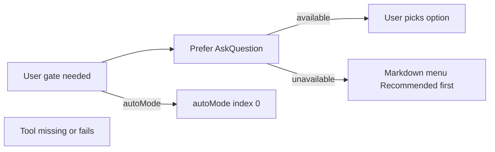

# Simplify AskQuestion + slim dual-mode workflows

## Verdict

Agents invent “Verificando estado e disponibilidade do AskQuestion” from the **session exposure probe** + **FORCE** language in `[gates.md](.agents/skills/shared/gates.md)`, `[tools.md](.agents/skills/shared/tools.md)`, and `[ask-question-gates.mdc](.agents/skills/spec-to-pr/cursor-rules/ask-question-gates.mdc)`. Remove that ceremony. Keep AskQuestion for real gates; if the tool is missing, use a short markdown menu (Recommended first). Do **not** silently auto-pick in normal mode (G2/ship need explicit consent). `autoMode` still uses index 0.

**Scope decision:** Delete AskQuestion Cursor rule only. Keep External Dependencies resolution that may mention `.cursor/rules/senior-developer.mdc` (unrelated guardrails path).

**Size target:** Only `[spec-to-pr/SKILL.md](.agents/skills/spec-to-pr/SKILL.md)` (819) is over 500 among workflow skills. Lite (144), `gates.md` (141), `setup.md` (120) already fine. Pipeline `00`–`11` stay untouched for size.

---

## 1. Canonical AskQuestion contract (`[gates.md](.agents/skills/shared/gates.md)`)

Replace dual-mode AskQuestion row + § AskQuestion (compact) with:

- Prefer native `AskQuestion` for every normal-mode gate (≥2 options, Recommended first).
- **No** session probe, **no** `askquestion-exposed` log, **no** mandatory invoke-before-fallback ceremony.
- If AskQuestion is not available or returns tool-not-found → present the **same options** as a short markdown list; wait for user reply. Optional one-line log `askquestion-fallback | {gate} | ISO` (no failure theater).
- Cancelled AskQuestion → HS-1 (unchanged).
- `autoMode` → auto-gate index 0 (unchanged).

Keep: slim transition menu, mode selection, complexity, conditional interview, one delivery, one ship, safety gates, auto-gate table.

---

## 2. Remove Cursor AskQuestion rule

| Action                                                          | Path                                                                                                                                                                |
| --------------------------------------------------------------- | ------------------------------------------------------------------------------------------------------------------------------------------------------------------- |
| Delete                                                          | `[.agents/skills/spec-to-pr/cursor-rules/ask-question-gates.mdc](.agents/skills/spec-to-pr/cursor-rules/ask-question-gates.mdc)` (+ empty `cursor-rules/` if empty) |
| Delete                                                          | `[.cursor/rules/ask-question-gates.mdc](.cursor/rules/ask-question-gates.mdc)` (already deleted in WT; ensure gone from git)                                        |
| Remove setup **1a**                                             | `[setup.md](.agents/skills/shared/setup.md)` L34                                                                                                                    |
| Remove Active rules section (or whole section if only that row) | `[.agents/AGENTS.md](.agents/AGENTS.md)` L209–219                                                                                                                   |
| Drop verification item                                          | root `[AGENTS.md](AGENTS.md)` L230 (`Rules: ask-question-gates.mdc`)                                                                                                |
| Update FAQ troubleshooting                                      | `[docs/faq.md](.agents/skills/spec-to-pr/docs/faq.md)` § AskQuestion missing — prefer tool; else markdown; no probe / no copy-rule                                  |

Do **not** strip `rules.seniorDeveloper` → `.cursor/rules/senior-developer.mdc` from External Dependencies / setup guardrails table.

---

## 3. Align orch + tools language

| File                                                                  | Change                                                                                                        |
| --------------------------------------------------------------------- | ------------------------------------------------------------------------------------------------------------- |
| `[spec-to-pr/SKILL.md](.agents/skills/spec-to-pr/SKILL.md)`           | Tool table: FORCE → prefer AskQuestion; replace § AskQuestion requirement with 5–8 line pointer to `gates.md` |
| `[spec-to-pr-lite/SKILL.md](.agents/skills/spec-to-pr-lite/SKILL.md)` | Keep gate UX; one line: AskQuestion preferred, markdown fallback per `gates.md`                               |
| `[tools.md](.agents/skills/shared/tools.md)`                          | `user-gate`: prefer AskQuestion; markdown fallback when unavailable; drop “check tool exposed” / FORCE        |
| `[STEP-DISPATCH.md](.agents/skills/spec-to-pr/STEP-DISPATCH.md)`      | Wording only if it still implies FORCE/probe                                                                  |

---

## 4. Shrink `spec-to-pr/SKILL.md` to ≤500 lines

Extract embedded templates / long bash into progressive-disclosure companions; leave one-line pointers in SKILL:

| New companion                   | Move from SKILL                                       |
| ------------------------------- | ----------------------------------------------------- |
| `protocols/delivery-result.md`  | Delivery Result template + LOC/benchmark append steps |
| `protocols/artifact-cleanup.md` | Optional cleanup bash / preserve lists                |
| `protocols/progress-board.md`   | Progress Board + telemetry suffix templates           |
| `protocols/state-hygiene.md`    | `update_state.py` invoke + manual YAML fallback       |

Also **dedupe** (link `gates.md` / `setup.md` only):

- Transition Gates AskQuestion option list duplicate (~L745+)
- Complexity / conditional interview prose already in `gates.md`
- Auto-gate table rows that duplicate shared table (keep orch-only extras: Step 0/2/7/11 if any)

Keep always-on in SKILL: invariants, HS ladder, tool contract, phase/step index, isolation/`Task` rules, thin protocol pointers, state schema stub, triggers.

**Out of this pass:** do not rewrite `check-harness` (720) or `taste-skill` (1206). Light FAQ/DIAGRAM fixes only where they still document probe / cursor-rule / FORCE.

---

## 5. Docs / changelog / harness follow-up

- `[CHANGELOG.md](CHANGELOG.md)` entry via changelog skill at end.
- After edits: ask whether to run **check-harness** and whether **site** / root **README** need updates (per harness change protocol). Likely: check-harness yes; `build-site.js` only if catalog/routing text changes; README only if install still mentions copying `ask-question-gates`.

---

## Success criteria

- Grep clean for: `ask-question-gates`, `askquestion-exposed`, `FORCE` AskQuestion, setup `1a`, “probe” AskQuestion availability.
- `wc -l .agents/skills/spec-to-pr/SKILL.md` ≤ 500.
- Lite + gates + setup still load AskQuestion for real gates; unsupported runtime → markdown Recommended-first, no expose check narration.
- External Dependencies / senior-developer `.cursor/rules` resolution unchanged.

