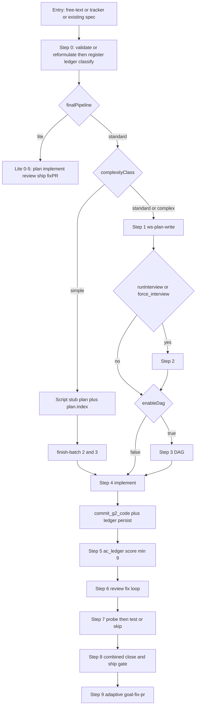

# Spec-to-PR speed and determinism (reconciled)

Supersedes [orch_speed_determinism_f3f6c066.plan.md](.cursor/plans/orch_speed_determinism_f3f6c066.plan.md), [stp_speed_determinism_consolidated_7e4a9c21.plan.md](.cursor/plans/stp_speed_determinism_consolidated_7e4a9c21.plan.md), and [s_agy_speed_det_gemini-flash-38.md](.cursor/plans/s_agy_speed_det_gemini-flash-38.md).

## Quality floor (non-negotiable)

Consumer deliveries still run the full quality path unless a **scripted** skip reason applies:

- Spec analysis and reformulation (free-text / tracker)
- Plan (or script stub only when `complexityClass: simple`)
- Interview when open questions, `complex`, or `force_interview`
- DAG when `defaults.enableDag: true`
- Implementation
- Verify / judge / `ac_ledger.cjs score` with `minVerifyScore` 9
- Code review + fix loop (max 3)
- Testing unless `testing-disabled` or `no-test-surface`
- Close, ship PR, fix-PR / CI threads

Do **not**: lower the score bar, auto-approve below bar, skip Step 5/6 on standard/complex work, or fail-open `validate_state`.

## Judge notes on the three plans

**Kept (verified in tree)**

- Simple path is documented in [gates.md](.agents/skills/ws-shared/runtime/gates.md) but blocked in autoMode by “Never skip Steps 1–3” in [SKILL.md](.agents/skills/ws-spec-to-pr/SKILL.md) / [STEP-DISPATCH.md](.agents/skills/ws-spec-to-pr/STEP-DISPATCH.md). Live us-328: ~13 min through Step 6, interview ran, ~105 KB plan artifacts vs ~20 LOC.
- [classify.cjs](.agents/skills/ws-classify-complexity/scripts/classify.cjs) uses `Math.max(specLayers, configLayers)` so this repo’s 3 configured layers inflate `runInterview`. Complexity class is LLM-only today.
- `ac_ledger.cjs link` sets `ledger.scoreState = null` (line 350). Pre-advance 6 requires matching `scoreState` at `pre-step6` ([workflow_state.cjs](.agents/skills/ws-shared/runtime/scripts/workflow_state.cjs) ~1721). STEP-DISPATCH G2-link recipe does not call `verify --persist-score`.
- `ALIAS_SKIP_REASONS` already includes `not-applicable`; [ws-plan-verify](.agents/skills/ws-plan-verify/SKILL.md) only documents `baseline-dirty`. Missing alias results cap/fail the score.
- [build_dispatch_context.cjs](.agents/skills/ws-spec-to-pr/scripts/build_dispatch_context.cjs) exists; PROTOCOLS Base Prompt Prefix still tells subagents to **Read** four enhancing skills. Compiler is not an orch recipe in STEP-DISPATCH. Regex uses invalid JS `\z` (identity escape).
- `files_touched` is agent-reported with no git intersect. Lite telemetry labels `Consolidation` / `Ship and PR` disagree with lite SKILL `Ship` / `Fix-PR`.
- Step 3 stub contradiction: STEP-DISPATCH “no files” vs PROTOCOLS `write_sequential_dag.cjs`. `writeJson` uses `${file}.tmp-${pid}` only; DAG writer is non-atomic.
- Step 9 STEP-DISPATCH still says 300s heartbeats; [ws-goal-fix-pr](.agents/skills/ws-goal-fix-pr/SKILL.md) already exits immediately when checks are green and `activeThreads == 0`.

**Rejected or narrowed**

- Do **not** self-heal `validateSnapshot` by writing `scoreState` during fail-closed validate (would hide skipped verify). Persist score on `link` instead; validate stays fail-closed.
- Do **not** loosen `### Negative & Failing Test Scenarios` regex (uncovered NS already caps score at 8).
- Do **not** treat Step 7 probe as new behavior; it is already in STEP-DISPATCH. Enforce orch-runs-script + persist `hasTestSurface`.
- Do **not** add a second CI poller. Align orch prose with existing adaptive goal-fix-pr.
- Do **not** split `gates.md` into many files (harness/hash blast). Keep one file; Read named sections; compiler extracts them.
- Unmeasured claims (80% of tasks, 15 min, 85% tokens) are not acceptance criteria. Rank by skipped dispatches, token reads, and fail-closed green pre-advance.

**Resolved UX (Gemini open questions)**

- Consecutive skips: **one** `finish-batch` CLI, **two** skip records (`interview-not-required`, `dag-disabled`), **one** user-gate “Advance to Step 4 (2 and 3 skipped)”. `autoMode` continues with no halt.
- Step 8: **one** combined menu; state still records close then `shipStatus` (two phases, one prompt). Options: close+PR, close+push, close+skip ship, skip delivery commit+PR, more/pause.

## P0 — Skip paths fire; G2/score stay green (first PR)

Highest ROI for both speed and high-score advance.

1. **Untangle autoMode vs simple path** in SKILL.md, STEP-DISPATCH, gates.md (canonical copy in gates.md; others one-line + link).
   - autoMode never waives planning for `standard`/`complex`.
   - `simple`: stub Step 1, skip 2/3, **does** apply in autoMode.
   - Align “Skip 1–2–3” vs “stub 1, skip 2–3”.

2. **Script complexity in classify.cjs**
   - Emit `complexityClass` and `runInterview` into classify.md **and** state.
   - Count spec-touched layers (path-refs mapped to `stack.backend.layers[].path`), never raw configured layer count.
   - `simple`: docs/test-only refs, AC ≤ 6, no Open Questions, no schema/API/tenancy; uncertain → `standard`.
   - Orch must run the script; do not hand-write classify.md. Add `## Subagent contract`.

3. **`write_simple_plan_stub.cjs`** then `plan_index.cjs build`, skip 2/3 with canonical reasons. Pre-advance 4 accepts stub when `complexityClass: simple` (no refined plan).

4. **Existing-spec Step 0 short circuit** only when `{specsDir}` spec already validates (`authoring` or pre-closure `compat`). Skip reformulation and full-body history scan. Still register, ledger init, classify, finish. Free-text and tracker fetch still run `ws-spec-write`.

5. **Step 3 contradiction**: `enableDag: false` → `finish dag-disabled`, no stub files. Keep `write_sequential_dag.cjs` for tests and enableDag sequential-under-threshold. Fix state-hygiene cheat sheet.

6. **`files_touched ∩ git`** in `normalizeFilesTouched`: drop paths not in porcelain/diff (keep new untracked that exist). Log phantoms.

7. **Close the scoreState trap without fail-open validate**
   - After `link`, recompute and persist `scoreState` at `pre-step6` if any AC has a commit, else `step5`.
   - Document in STEP-DISPATCH after G2: link is enough; do not require a separate agent-authored `verify --persist-score`.
   - `validateSnapshot` stays fail-closed (no auto-write during validate).

Tests: classify fixtures (docs-micro / layers / open-questions); simple-path pre-advance 4; autoMode wording; phantom drop; existing-spec does not body-scan history; `link` then `--pre-advance 6` without extra verify.

## P1 — Less stutter, fewer tokens, mechanical G2 (second PR)

Quality gates stay; bookkeeping moves to scripts.

- **`finish-batch`** on [workflow_state.cjs](.agents/skills/ws-shared/runtime/scripts/workflow_state.cjs): `finish-batch --steps 2:skipped:interview-not-required,3:skipped:dag-disabled`. One process, two skip records, one gate to Step 4. Honor existing `gateGranularity: phase` as well.
- **Combined Step 8 menu** (one prompt, two state phases). Pause/more remain.
- **Hook `build_dispatch_context.cjs` into STEP-DISPATCH** before each `dispatch-agent`. Add `--step` / `--slug` so orch does not hand-build argv. Prefix: “Enhancing-skill contracts and MEMORY slice are inlined; do not re-Read those SKILL.md files. Still Read product files and the target `## Subagent contract` if not inlined.” Fix `\z` → end-of-input. Write prompt to `{us-dir}/.runtime/step-{N}-dispatch-prompt.md`.
- **`commit_g2_code.cjs`**: path-scoped add from state `files_touched` minus `{plansDir}` / preExistingDirty / gitignored; canonical message; SHA; ledger link; persist `scoreState` `pre-step6`; append `state.commits`. Replaces error-prone multi-shell G2. Empty stage → skip log, no empty commit.
- **Alias `not-applicable`**: document in ws-plan-verify and STEP-DISPATCH. Require change-class justification (docs-only, no backend). Non-zero real alias exits still `knownDefect`. Do not let agents skip `backendTest` on code-touching work.
- **Script hygiene**: cap `search_plan_history.cjs` (index first, top-3 bodies); `probe_test_surface.cjs` via `git ls-files`; persist `hasTestSurface` and `force_interview`; re-run memory conflict only if plan mtime changed; unique temp names in `writeJson`; atomic DAG writes.
- **`check_memory_conflict.py --soft-exit`**: JSON `{ force_interview: true }` with exit 0; default exit 2 unchanged for existing tests.
- **Dedup prose**: one algorithm in gates.md; STEP-DISPATCH action column + “Contract: gates.md § X”. Fix lite labels to `Ship` / `Fix-PR`.
- **Wiki sync**: `plans.wiki.enabled` (default true only if wiki dir exists). STEP-DISPATCH currently mandatory vs skill “offered”.
- **Step 9 prose**: point at existing adaptive poll / immediate exit in ws-goal-fix-pr. Remove “always sleep 300s”.

Missing `## Subagent contract` on classify, plan-to-tasks, fix-pr as needed so the compiler does not fail. Move ws-plan-verify anti-deliberation **into** the injected contract.

## P2 — Reuse mechanical verify; lock with a judge (third PR)

- After Step 4 (and after G2), write `.runtime/verification-manifest.json` (alias exits, stack scan, sabotage). Steps 5/6/7 **re-run those commands only if `files_touched` changed**; AC scoring, review, and tests still run. Step 8 `workflowMode` PREPARE credits pinned SHA.
- Fixture `test/fixtures/fx-docs-micro/` + `test/test-workflow-process-waste.js`: `complexityClass: simple`, `runInterview: false`, steps 2–3 skipped with canonical reasons, `files_touched ⊆ git`, artifact-byte ceiling vs product LOC. No live LLM orch in CI.

## Out of scope

- Third orchestrator or folding standard into lite
- Lowering `minVerifyScore`, skipping review/verify on non-simple work
- validateSnapshot auto-write, looser NS heading match
- New CI poller, host product names, version-stamp decoupling
- Live LLM sandbox as a ship gate

## Verification per PR

- New tests listed in each phase, plus `node test/test-workflow-state-contract.js`, `test/test-artifact-economy.js`, `test/test-classifier-history.js`, `test/test-ac-ledger.js`
- `ws-check-harness` 0–5c; `ws-check-workflows`
- Integrity regen when hashed bodies change
- FEATURES / README / hubs only for user-visible skip and G2 helper behavior
- One patch bump per release PR
