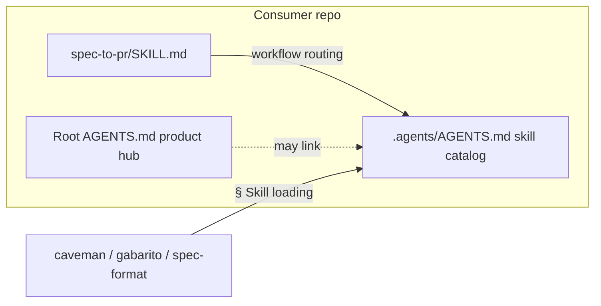

## 0. Summary & Business Rules

**Feature:** Combined GitHub issues [#65](https://github.com/jpolvora/workflow-skills/issues/65) + [#66](https://github.com/jpolvora/workflow-skills/issues/66) — upstream harness documentation and routing fixes so consumer `update` does not reintroduce `check-harness` criticals.

**Core objectives**
1. Packaged skill index + Task router match **on-disk inventory** for typical Workflows-package installs (no phantom routes).
2. Canonical **§ Skill loading**, **§ Precedence**, and **opt-out** table on the packaged hub; utility skills link there (not consumer root hub).
3. Prefixed skill folder ids in `STEP-DISPATCH.md` (`07-integration-validation`, `09-goal-fix-pr`).
4. Consumer-safe dependency-map wording in `shared/AGENTS.md` (no broken `bin/` link).
5. Dual-hub guidance: workflow routing → packaged `.agents/AGENTS.md`; consumer root may stay product-specific.
6. Post-12 PR link labels in `spec-to-pr/SKILL.md` use prefixed ids (`06-code-review`, `08-fix-pr`).
7. `check-harness` dry-run clean for these items.

**Business rules**
- Stack: **node-skills-hub** — Markdown skills + Node CLI only. No app runtime, DB, or frontend code.
- Skills stay **portable**; no consumer org/repo/solution hardcoding.
- **Progressive disclosure:** hubs link; do not paste full skill bodies.
- **Drift check:** after packaged hub edits, verify root `AGENTS.md` layer catalog still matches upstream disk (full repo has all 35 skills; packaged index must not imply Extra-package skills exist when only Workflows package is installed).
- **Surgical scope:** markdown hubs + `STEP-DISPATCH.md` + link labels only. No `check-harness` body refactor, no installer graph changes, no site regen unless routing tables change materially.

**Security mitigations**
- No secrets in doc edits.
- Do not copy upstream `config.json` / `MEMORY.md` into consumers (existing trap).
- Consumer-safe links: prefer upstream GitHub URL or plain prose over relative paths to non-shipped `bin/`.

---

## 1. Definition of Ready & Scope

### Verified upstream gaps (2026-07-17 @ `6a4443ec`)

| Item | Status | Evidence |
|------|--------|----------|
| Packaged phantom routes | **Gap** | `.agents/AGENTS.md` Skill index + Task router list Extra-package skills (`write-a-skill`, `security-review`, `domain-review`, `mobile-first-design`, `taste-skill`, etc.) that are **absent** on Workflows-only consumer disk (26 `SKILL.md` trees). `bin/skill-dependencies.json` `packages.workflows` = 26 skills; `packages.extra` = 9 optional. |
| Missing § Skill loading on packaged hub | **Gap** | Root `AGENTS.md` L83–108 has § Skill loading + Precedence + opt-outs. Packaged `.agents/AGENTS.md` lacks them. `caveman`, `gabarito`, `spec-format` cite `../../../AGENTS.md` § Skill loading — dead in consumers whose root hub is product-specific. |
| STEP-DISPATCH unprefixed ids | **Present** | L24: bare `integration-validation`; L51: bare `goal-fix-pr`. |
| Broken `shared/AGENTS.md` link | **Present** | L53: `../../../bin/skill-dependencies.json` — `bin/` not vendored in consumer clones. |
| Dual-hub pointer | **Gap** | `spec-to-pr/SKILL.md` L18: `Hub → ../../../AGENTS.md` resolves to **consumer product** hub, not skill catalog. |
| Misleading Post-12 labels | **Present** | `spec-to-pr/SKILL.md` L104: link text `code-review` / `fix-pr` vs targets `06-code-review` / `08-fix-pr`. |
| Root hub Skill loading | **OK** | Root already canonical for upstream repo; sync content into packaged hub, do not remove from root. |

### Resolved assumptions
- Adapt plan template §2–§7 to **skills / hub markdown** (not Domain/DB/Frontend app layers).
- Artifact filenames (`step-10-*.report.md`) and harness forbidden-examples stay untouched (MEMORY trap).
- `STEP-DISPATCH.md` remains **standard orch only**; lite keeps its own step table.
- Root `AGENTS.md` Layer 3 `(global)` entries (`using-superpowers`, `find-skills`, `grill-with-docs`) are intentional upstream-only discovery routes — **do not** add to packaged index as on-disk skills.
- Ship PR should close **both** #65 and #66.

### Acceptance Criteria (measurable)

| AC | Done when |
|----|-----------|
| **AC1** | Packaged `.agents/AGENTS.md` Skill index + Task router list only skills present after Workflows-package install **or** clearly segregate Extra-package skills in a labeled subsection not mixed into the primary router; root hub Drift check note updated if layer tables diverge by design. No phantom criticals for Workflows-only disk. |
| **AC2** | Packaged `.agents/AGENTS.md` contains § Skill loading (mandatory), § Precedence, opt-out table (mirror root L83–108, paths adjusted to `skills/...`). `caveman`, `gabarito`, `spec-format` link to packaged hub § Skill loading. |
| **AC3** | `STEP-DISPATCH.md` Step 11 uses `` `Task` `07-integration-validation` ``; Step 13 pipeline note uses `09-goal-fix-pr` (prefixed folder id). |
| **AC4** | `shared/AGENTS.md` dependency-map line is consumer-safe prose + upstream repo link; no resolvable relative link to missing `bin/skill-dependencies.json`. |
| **AC5** | `spec-to-pr/SKILL.md` Hub line points at packaged `.agents/AGENTS.md` with dual-hub note (consumer root may stay product-specific; route workflows via packaged index). |
| **AC6** | `spec-to-pr/SKILL.md` Post-12 line labels: `` `06-code-review` `` / `` `08-fix-pr` `` (targets unchanged). |
| **AC7** | `check-harness` (or `--dry-run`) reports no critical phantoms / dead Skill-loading refs / unprefixed dispatch for these paths. |

### Out of scope
- Consumer-only product hubs (`file:///`, PT-BR contracts, retired runner-local skill tables).
- `check-harness` skill body sprawl / example inventory cleanup (suggestion only).
- `bin/skill-dependencies.json` schema or installer behavior changes.
- `node bin/build-site.js` unless catalog routing tables change (unlikely — packaged index restructure only).
- Committing `.cursor/plans/` artifacts (Step 12 delivery only).

---

## 2. Technical Design & Architecture

**Stack:** `config.json` → `stack.id: node-skills-hub`. Layers: `skills` (`.agents/skills`), `cli` (`bin`), `tests` (`test`). Frontend/DB: none.

### Package membership (source of truth)

From `bin/skill-dependencies.json`:

| Package | Count | Role |
|---------|-------|------|
| `workflows` | 26 skills | Default orch + pipeline + providers + harness + promoted utilities — **always on disk** for Workflows install |
| `extra` | 9 skills | `security-review`, `dotnet-security-performance-review`, `tdd-sdd-ddd-reviewer`, `domain-review`, `multi-domain-review`, `secrets-leak-review`, `mobile-first-design`, `taste-skill`, `write-a-skill` — **optional** |

### Layer edits (harness)

| Layer | Path | Change |
|-------|------|--------|
| Packaged hub | `.agents/AGENTS.md` | AC1: restructure Skill index + Task router (Workflows core vs Extra optional). AC2: add § Skill loading + Precedence + opt-outs. Consumer notes: dual-hub pointer. |
| Root hub | `AGENTS.md` | AC1 Drift check: confirm Layer catalog matches upstream disk; add footnote if packaged index is Workflows-scoped by design. |
| Shared hub | `.agents/skills/shared/AGENTS.md` | AC4: consumer-safe dependency-map line. |
| Orch | `.agents/skills/spec-to-pr/SKILL.md` | AC5 Hub pointer; AC6 Post-12 labels. |
| Dispatch | `.agents/skills/spec-to-pr/STEP-DISPATCH.md` | AC3 prefixed skill ids Steps 11 + 13. |
| Utility skills | `.agents/skills/caveman/SKILL.md`, `gabarito/SKILL.md`, `spec-format/SKILL.md` | AC2: retarget § Skill loading links to `../../AGENTS.md` (packaged hub). |

### Invariants (`config.json.invariants`)
- `commitPlanFilesOnlyAtStep12: true`.
- Portability: repo-root-relative paths only in skill bodies.
- en-us skill content.
- Consistent prefixed skill folder references in orchestrator dispatch (check-harness Phase 5).

### Dual-hub model



---

## 3. Step-by-Step Plan

*Dependency order. Each step: Action · Affected files · Engineering checks.*

### Step 1 — Packaged hub inventory + phantoms (AC1)

**Action**
1. Inventory Workflows-package skills from `bin/skill-dependencies.json` `packages.workflows.skills` (26 ids).
2. Edit `.agents/AGENTS.md`:
   - **Skill index:** primary tables list only Workflows-package skills (grouped: Harness, Pipeline 00–11, Providers, Promoted utilities).
   - **Extra package:** new subsection `### Extra package (optional — install shortcut e)` listing the 9 Extra skills with one-line note that they are not on disk until Extra/Full install.
   - **Task router:** remove or relocate rows for Extra-only skills to the Extra subsection; primary router covers Workflows install only.
   - Update **Drift check** callout: root `AGENTS.md` retains full upstream layer catalog; packaged index is Workflows-scoped for consumer phantom safety.
3. Root `AGENTS.md`: add brief Drift check note under Skill catalog if packaged scope differs (no removal of upstream Layer 4 rows — all exist on upstream disk).

**Affected files:** `.agents/AGENTS.md`, `AGENTS.md` (Drift note only if needed).

**Checks:** Simulate Workflows-only disk (26 skills); grep packaged index/router for Extra ids in primary tables → none. Upstream full tree still lists all skills in root hub.

### Step 2 — § Skill loading on packaged hub + utility retarget (AC2)

**Action**
1. Copy canonical § Skill loading table, § Precedence, opt-out table from root `AGENTS.md` (L83–108) into `.agents/AGENTS.md` after Workflows section (paths: `skills/...` not `.agents/skills/...` per packaged convention).
2. Omit `(global)` `using-superpowers` from packaged autoload table **or** mark as `(global — not shipped)` to avoid phantom path.
3. Update utility skills to cite packaged hub:
   - `caveman/SKILL.md` L14: `../../AGENTS.md` § Skill loading
   - `gabarito/SKILL.md` L13, L46: same
   - `spec-format/SKILL.md` L16, L131: same
4. Keep progressive disclosure — do not duplicate karpathy/gabarito/caveman bodies in hub.

**Affected files:** `.agents/AGENTS.md`, `.agents/skills/caveman/SKILL.md`, `.agents/skills/gabarito/SKILL.md`, `.agents/skills/spec-format/SKILL.md`.

**Checks:** Resolve `../../AGENTS.md#skill-loading` from each utility skill path; anchor exists; no link to consumer root `AGENTS.md` for autoload contract.

### Step 3 — STEP-DISPATCH prefixed ids (AC3)

**Action**
1. Step 11 action column — replace:
   - `else integration-validation` → `` else `Task` `07-integration-validation` ``
   - Align wording with Step 9 pattern (`` `Task` `06-code-review` ``).
2. Step 13 pipeline bullet 4 — replace `goal-fix-pr loop` → `` `09-goal-fix-pr` loop `` (prefixed folder id).

**Affected files:** `.agents/skills/spec-to-pr/STEP-DISPATCH.md`.

**Checks:** `rg 'integration-validation|goal-fix-pr' STEP-DISPATCH.md` — no unprefixed bare ids in dispatch table or Step 13 pipeline list.

### Step 4 — Consumer-safe shared hub link (AC4)

**Action**
Replace L53 in `.agents/skills/shared/AGENTS.md`:

```markdown
Install packages and dependency map: upstream `bin/skill-dependencies.json` in [workflow-skills](https://github.com/jpolvora/workflow-skills) (not vendored in consumer clones).
```

(No markdown link to `../../../bin/skill-dependencies.json`.)

**Affected files:** `.agents/skills/shared/AGENTS.md`.

**Checks:** Phase 2 link resolution from `shared/AGENTS.md` — no target under missing `bin/` in consumer tree.

### Step 5 — Dual-hub + Post-12 labels in spec-to-pr (AC5, AC6)

**Action**
1. **Hub line** (`SKILL.md` L18) — change:
   - From: `Hub → ../../../AGENTS.md`
   - To: `Hub → ../../AGENTS.md` (packaged skill index) + short parenthetical: consumer root `AGENTS.md` may be product-specific; workflow skill routing uses packaged index.
2. **Post-12 PR line** (L104) — change link labels only:
   - From: `` [`code-review`](../06-code-review/SKILL.md) / [`fix-pr`](../08-fix-pr/SKILL.md) ``
   - To: `` [`06-code-review`](../06-code-review/SKILL.md) / [`08-fix-pr`](../08-fix-pr/SKILL.md) ``

**Affected files:** `.agents/skills/spec-to-pr/SKILL.md`.

**Checks:** Hub link resolves to `.agents/AGENTS.md` from orch skill path; Post-12 labels match folder names.

### Step 6 — Harness verification (AC7)

**Action**
1. Load `check-harness/SKILL.md`; run Phases 0–5c (dry-run acceptable) focused on touched paths.
2. Run `npm run tests -- --local` if any unexpected file touched (expect **no** CLI changes — skip if docs-only).
3. Optional: simulate Workflows install tree under `test/` and re-run harness link phase.

**Affected files:** none (verification only).

**Checks:** No critical `phantom_routes`, dead § Skill loading refs, or unprefixed dispatch in touched files.

---

## 4. Permissions, Tenancy & i18n

- **RBAC / tenancy:** N/A — documentation-only change.
- **i18n:** All edited skill/hub content remains **en-us** per packaged rules.

---

## 5. Test Coverage

| AC | Verification method | Evidence |
|----|---------------------|----------|
| AC1 | `check-harness` Phase 2/3 phantom scan on packaged index; manual count Workflows router rows vs `packages.workflows.skills` | Zero Extra skills in primary Task router; Extra subsection labeled |
| AC2 | Link resolve `../../AGENTS.md` from `caveman/SKILL.md`; grep packaged hub for `## Skill loading` | Section + Precedence + opt-out present; utility links updated |
| AC3 | `rg` STEP-DISPATCH for `07-integration-validation` and `09-goal-fix-pr`; negative `rg` for bare `integration-validation` / `goal-fix-pr` in dispatch contexts | Prefixed ids only |
| AC4 | Resolve links from `shared/AGENTS.md`; no `bin/skill-dependencies.json` href | Prose + GitHub URL only |
| AC5 | Read `spec-to-pr/SKILL.md` Hub line; path resolves to `.agents/AGENTS.md` | Dual-hub note present |
| AC6 | Read Post-12 line; label text equals folder id | `06-code-review`, `08-fix-pr` |
| AC7 | `/check-harness` or `--dry-run` report | No criticals for scoped items |

---

## 6. Invariants (Do Not Violate)

- `commitPlanFilesOnlyAtStep12: true` — do not git-add `.cursor/plans/`.
- Do not rename pipeline artifact filenames (`step-10-*.report.md`).
- Do not treat `STEP-DISPATCH.md` as lite step index.
- Prefixed skill **folder** names in orchestrator dispatch; skill `name:` frontmatter stays unprefixed.
- Consumer-owned paths (`config.json`, `stack.md`, `MEMORY.md`) — no upstream copy changes.
- Surgical diff — no drive-by `check-harness` refactor or `skill-dependencies.json` edits.

---

## 7. Pre-PR Checklist

- [x] Layer boundaries respected (hubs vs skill bodies; progressive disclosure).
- [x] Packaged index matches Workflows-package disk inventory (AC1).
- [x] § Skill loading contract on packaged hub; utility skills retargeted (AC2).
- [x] STEP-DISPATCH prefixed ids (AC3).
- [x] Consumer-safe `shared/AGENTS.md` dependency line (AC4).
- [x] Dual-hub + Post-12 labels in `spec-to-pr/SKILL.md` (AC5–AC6).
- [x] `check-harness` dry-run clean for scoped items (AC7).
- [x] Root vs packaged Drift check documented.
- [x] No `.cursor/plans/` in commits.

---

## 8. Open Questions

| # | Question | Default if unanswered |
|---|----------|----------------------|
| 1 | Should Extra-package skills remain in Task router with `(Extra package)` suffix instead of a separate subsection? | **Separate subsection** — avoids check-harness phantom critical on Workflows-only installs. |
| 2 | Include `(global) using-superpowers` in packaged § Skill loading? | **Omit or mark global** — not shipped on disk. |
| 3 | Regenerate `docs/index.html` after hub edits? | **Only if** site catalog references phantom skills; expect no regen for this scope. |

---

## Exact file manifest (implementation)

| File | AC | Edit summary |
|------|-----|--------------|
| `.agents/AGENTS.md` | AC1, AC2, AC5 (consumer notes) | Workflows-scoped index/router; § Skill loading; dual-hub note |
| `AGENTS.md` | AC1 | Drift check footnote only (if needed) |
| `.agents/skills/shared/AGENTS.md` | AC4 | Consumer-safe dependency-map line |
| `.agents/skills/spec-to-pr/STEP-DISPATCH.md` | AC3 | Steps 11 + 13 prefixed ids |
| `.agents/skills/spec-to-pr/SKILL.md` | AC5, AC6 | Hub pointer + Post-12 labels |
| `.agents/skills/caveman/SKILL.md` | AC2 | Link → packaged `../../AGENTS.md` |
| `.agents/skills/gabarito/SKILL.md` | AC2 | Link → packaged `../../AGENTS.md` |
| `.agents/skills/spec-format/SKILL.md` | AC2 | Link → packaged `../../AGENTS.md` |

**Files explicitly not touched:** `bin/cli.js`, `bin/skill-dependencies.json`, `check-harness/SKILL.md`, `docs/index.html`, consumer `config.json` / `MEMORY.md`.
