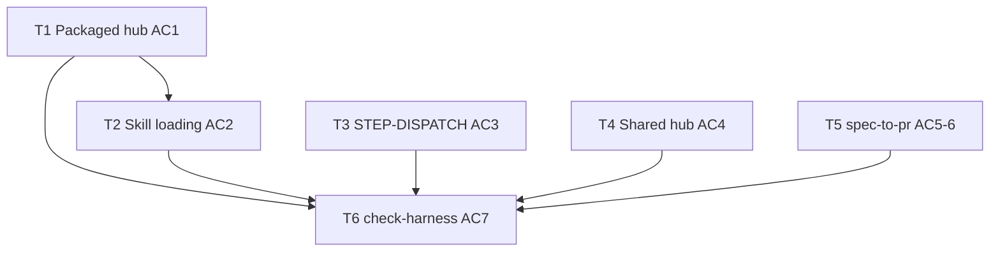

# us-65-66 — Execution Plan (Parallel)

**Mode:** parallel — plan exceeds `dagThresholds` in `config.json`.

**Reason:** 6 implementation steps, 8 files, 4 harness edit layers (packaged hub, root hub, orch/dispatch, utility skills) — exceeds limits (`maxImplementationSteps=3`, `maxExpectedFiles=6`, `maxLayers=2`).

**Plan source:** `.cursor/plans/us-65-66/step-01-us-65-66.plan.md` (Step 2 skipped; assumed defaults applied).

**Target model:** coder (markdown/docs-only; no runtime code).

---

## Size detection

| Metric | Value | Threshold | Within? |
|--------|-------|-----------|---------|
| Implementation steps | 6 | ≤ 3 | No |
| Files (manifest) | 8 | ≤ 6 | No |
| Harness edit layers | 4 | ≤ 2 | No |

→ `execMode: parallel`

---

## Step 5 parallel groups (≤3 concurrent, file-disjoint)

| Level | Tasks | Files | Rationale |
|-------|-------|-------|-----------|
| **L1** | T1, T3, T4 | 4 files, zero overlap | Hub AC1 + root drift; dispatch; shared link — independent paths |
| **L2** | T2, T5 | 5 files, zero overlap | T2 needs packaged hub AC1 done (same file); orch SKILL.md isolated |
| **L3** | T6 | none | Verification after all edits |

**Max concurrency:** 3 (L1). L2 runs 2 tasks in parallel.

---

## Task schedule

### Level 1 — up to 3 parallel

#### T1 — Packaged hub inventory + phantoms (AC1)

| Field | Value |
|-------|-------|
| **dependsOn** | — |
| **parallelGroup** | L1 |
| **files** | `.agents/AGENTS.md`, `AGENTS.md` |
| **acceptance** | Packaged Skill index + Task router list only Workflows-package skills (26) in primary tables; Extra package (9 skills) in labeled `### Extra package (optional)` subsection, not mixed into primary router. Root `AGENTS.md` Drift check footnote if packaged scope differs. No Extra-only ids in primary router rows. |
| **coderPrompt** | Load `bin/skill-dependencies.json` `packages.workflows.skills` (26 ids). Edit `.agents/AGENTS.md`: restructure Skill index (Harness, Pipeline 00–11, Providers, Promoted utilities); add Extra subsection for 9 optional skills; relocate Extra-only Task router rows out of primary router. Add Drift check callout: root hub retains full upstream catalog; packaged index is Workflows-scoped. Edit `AGENTS.md` only if needed — brief Drift check footnote under Skill catalog. Do not remove root Layer 4 rows. MEMORY: workflows-only install = 26 SKILL.md; no phantom routes. |

#### T3 — STEP-DISPATCH prefixed ids (AC3)

| Field | Value |
|-------|-------|
| **dependsOn** | — |
| **parallelGroup** | L1 |
| **files** | `.agents/skills/spec-to-pr/STEP-DISPATCH.md` |
| **acceptance** | Step 11 action uses `` `Task` `07-integration-validation` ``; Step 13 pipeline bullet uses `09-goal-fix-pr`. No bare `integration-validation` or `goal-fix-pr` in dispatch table or Step 13 pipeline list. |
| **coderPrompt** | In `STEP-DISPATCH.md`: Step 11 — replace bare `integration-validation` with `` else `Task` `07-integration-validation` `` (match Step 9 `` `Task` `06-code-review` `` pattern). Step 13 pipeline bullet 4 — replace `goal-fix-pr loop` with `` `09-goal-fix-pr` loop ``. Verify with `rg` — no unprefixed bare ids in dispatch contexts. MEMORY: STEP-DISPATCH is standard orch only. |

#### T4 — Consumer-safe shared hub link (AC4)

| Field | Value |
|-------|-------|
| **dependsOn** | — |
| **parallelGroup** | L1 |
| **files** | `.agents/skills/shared/AGENTS.md` |
| **acceptance** | L53 dependency-map line is consumer-safe prose + upstream GitHub URL; no resolvable relative link to `../../../bin/skill-dependencies.json`. |
| **coderPrompt** | Replace L53 in `shared/AGENTS.md` with: `Install packages and dependency map: upstream bin/skill-dependencies.json in [workflow-skills](https://github.com/jpolvora/workflow-skills) (not vendored in consumer clones).` No markdown href to missing `bin/` in consumer tree. MEMORY: never link shared/AGENTS.md to non-vendored bin/ paths. |

---

### Level 2 — up to 2 parallel

#### T2 — § Skill loading + utility retarget (AC2)

| Field | Value |
|-------|-------|
| **dependsOn** | T1 |
| **parallelGroup** | L2 |
| **files** | `.agents/AGENTS.md`, `.agents/skills/caveman/SKILL.md`, `.agents/skills/gabarito/SKILL.md`, `.agents/skills/spec-format/SKILL.md` |
| **acceptance** | Packaged hub has `## Skill loading` (mandatory), `## Precedence`, opt-out table (mirror root L83–108; paths use `skills/...`). `(global) using-superpowers` omitted or marked `(global — not shipped)`. Utility skills cite `../../AGENTS.md` § Skill loading — not consumer root hub. |
| **coderPrompt** | After T1 hub restructure: copy § Skill loading, § Precedence, opt-out table from root `AGENTS.md` (L83–108) into `.agents/AGENTS.md` (paths: `skills/...`). Omit or mark `(global — not shipped)` for `using-superpowers`. Update utility skills: `caveman/SKILL.md` L14, `gabarito/SKILL.md` L13+L46, `spec-format/SKILL.md` L16+L131 → `../../AGENTS.md` § Skill loading. Progressive disclosure — do not duplicate skill bodies in hub. |

#### T5 — Dual-hub pointer + Post-12 labels (AC5, AC6)

| Field | Value |
|-------|-------|
| **dependsOn** | — |
| **parallelGroup** | L2 |
| **files** | `.agents/skills/spec-to-pr/SKILL.md` |
| **acceptance** | Hub line points to `../../AGENTS.md` (packaged index) with dual-hub parenthetical. Post-12 PR line labels are `06-code-review` / `08-fix-pr` (targets unchanged). |
| **coderPrompt** | In `spec-to-pr/SKILL.md`: L18 Hub — change `../../../AGENTS.md` → `../../AGENTS.md` + note that consumer root `AGENTS.md` may be product-specific; workflow routing uses packaged index. L104 Post-12 — change link labels from `code-review`/`fix-pr` to `06-code-review`/`08-fix-pr` only (href paths unchanged). |

---

### Level 3 — sequential verification

#### T6 — Harness verification (AC7)

| Field | Value |
|-------|-------|
| **dependsOn** | T1, T2, T3, T4, T5 |
| **parallelGroup** | L3 |
| **files** | _(none — verification only)_ |
| **acceptance** | `check-harness` (or `--dry-run`) reports no critical phantoms, dead § Skill loading refs, or unprefixed dispatch for touched paths. Docs-only — skip `npm run tests` unless unexpected files touched. |
| **coderPrompt** | Load `check-harness/SKILL.md`; run Phases 0–5c (dry-run OK) on touched paths. Grep packaged index for Extra ids in primary router. Resolve `../../AGENTS.md#skill-loading` from each utility skill. No site regen unless catalog routing tables changed materially (not expected). |

---

## Dependency graph

---

## File manifest (implementation)

| File | Task | AC |
|------|------|-----|
| `.agents/AGENTS.md` | T1, T2 | AC1, AC2 |
| `AGENTS.md` | T1 | AC1 |
| `.agents/skills/shared/AGENTS.md` | T4 | AC4 |
| `.agents/skills/spec-to-pr/STEP-DISPATCH.md` | T3 | AC3 |
| `.agents/skills/spec-to-pr/SKILL.md` | T5 | AC5, AC6 |
| `.agents/skills/caveman/SKILL.md` | T2 | AC2 |
| `.agents/skills/gabarito/SKILL.md` | T2 | AC2 |
| `.agents/skills/spec-format/SKILL.md` | T2 | AC2 |

**Not touched:** `bin/cli.js`, `bin/skill-dependencies.json`, `check-harness/SKILL.md`, `docs/index.html`, consumer `config.json` / `MEMORY.md`.

---

## Invariants

- `commitPlanFilesOnlyAtStep12: true` — no git-add of `.cursor/plans/`.
- Prefixed skill **folder** names in dispatch; `name:` frontmatter stays unprefixed.
- Do not rename `step-10-*.report.md` artifacts.
- Surgical scope — no drive-by harness refactor or installer changes.
