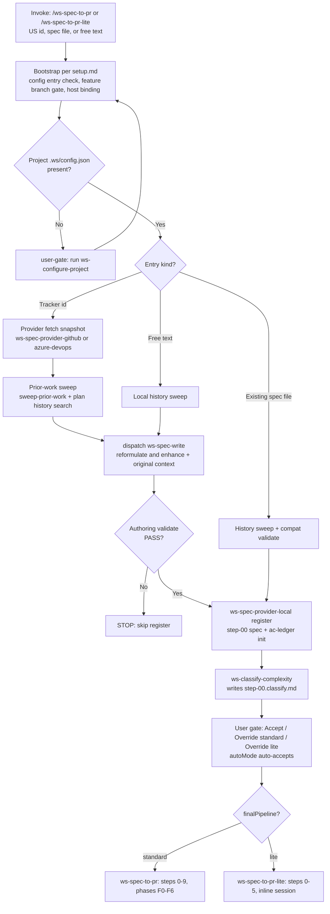
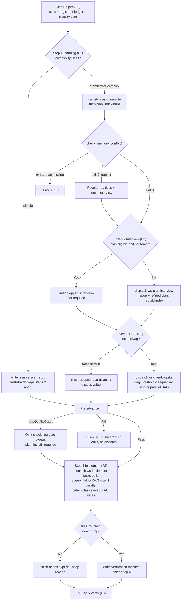
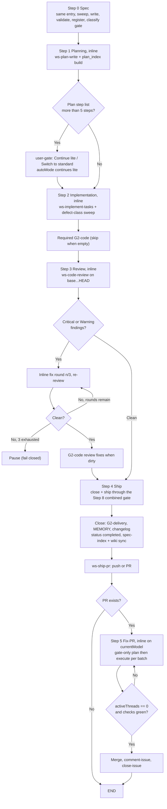
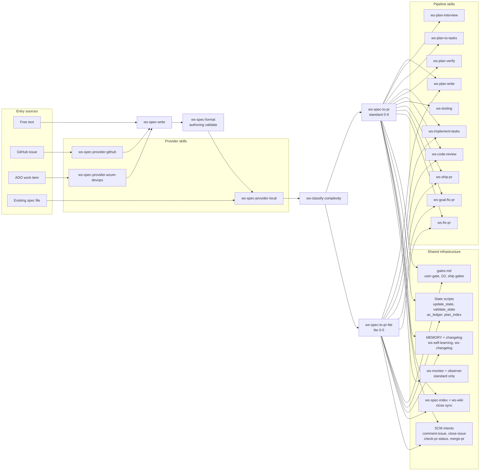
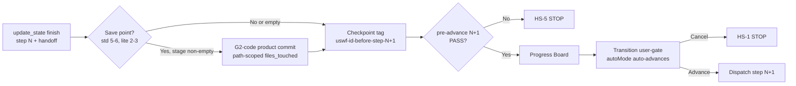

# Spec-to-PR workflow diagrams

Init-to-end flow for the two orchestrators, [`ws-spec-to-pr`](../.agents/skills/ws-spec-to-pr/SKILL.md)
(standard, steps 0-9) and [`ws-spec-to-pr-lite`](../.agents/skills/ws-spec-to-pr-lite/SKILL.md)
(lite, steps 0-5): every decision path, the gate at each boundary, and how the
pipeline skills connect. Diagrams are Mermaid so they render on GitHub.

Normative step contracts live in the skills themselves
(`STEP-DISPATCH.md` for standard steps 0-9, the lite `SKILL.md` Steps 0-5
table, [gates.md](../.agents/skills/ws-shared/runtime/gates.md) for gate wording). This page is the map,
not the territory: when it disagrees with a skill body, the skill wins.

## 1. Entry and pipeline selection (both orchestrators)

Notes:

- An existing `{specsDir}` spec that already validates takes the short
  circuit: register, ledger init, classify, finish. No reformulation.
- A newly written spec that fails authoring validation never registers.
- The classifier gate can override in either direction. Mid-flight runs stay
  on their pipeline (`workflowType` never cross-resumes).

## 2a. Standard planning and implementation (steps 0-4, F0-F2)

Notes:

- `autoMode` never waives planning for `standard`/`complex`. Only the
  scripted `simple` path (stub + skip 2/3) applies in `autoMode`.
- Step 4 reads the refined plan when one exists (never the superseded
  draft) and must show `memory_consult` proof.

## 2b. Standard verify, review, test, ship, fix (steps 5-9, F3-F6)

```mermaid
flowchart TD
    S5["Step 5 Check-implementation (F3)<br/>dispatch ws-plan-verify + sabotage check"] --> Score{"Score >= minVerifyScore (9)?"}
    Score -->|No| Refine["scoreAndRefine round<br/>dispatch ws-implement-tasks, re-verify"]
    Refine --> Rounds{"Rounds below 3?"}
    Rounds -->|Yes| S5
    Rounds -->|No, still below bar| Pause5["Pause (fail closed)"]
    Score -->|Yes| Reach["Reach-10 offer when eligible"]
    Reach --> G2a["G2-code product commit<br/>link scoreState pre-step6"]
    G2a --> S6["Step 6 Code review (F4)<br/>dispatch ws-code-review on base...HEAD<br/>jury size 1-3 merged, union keeps warnings"]
    S6 --> Findings{"Critical or Warning<br/>findings?"}
    Findings -->|Yes| Fix["Fix round n/3 via ws-implement-tasks<br/>then re-review"]
    Fix --> CleanR{"Re-review clean?"}
    CleanR -->|No, rounds remain| Fix
    CleanR -->|No, 3 exhausted| Pause6["Pause (fail closed)"]
    CleanR -->|Yes| G2b["G2-code review fixes when dirty"]
    Findings -->|Clean| S7["Step 7 Testing (F5)<br/>probe test surface"]
    G2b --> S7
    S7 --> SkipT{"skipTesting or<br/>no-test-surface?"}
    SkipT -->|Yes| Skip7["finish skipped"]
    SkipT -->|No| Test["dispatch ws-testing<br/>mutation when configured, else sabotage"]
    Test --> PassT{"Tests pass and<br/>mutation >= threshold?"}
    PassT -->|No| Fix7["ws-implement-tasks fix mode"]
    Fix7 --> Test
    PassT -->|Yes| Gate8["Step 8 gate: Create PR / Push only / More...<br/>overflow: Skip shipping, Skip commit + PR, Separate gates-Pause"]
    Skip7 --> Gate8
    Gate8 --> Close["Close: G2-delivery, MEMORY, changelog<br/>status completed, shipStatus pending<br/>spec-index sync + wiki sync"]
    Close --> Ship{"Ship intent?"}
    Ship -->|Skip or Pause| PhaseA1["Phase A git cleanup<br/>shipStatus skipped or stopped"]
    Ship -->|Push or Create PR| ShipPR["ws-ship-pr: push, PR, Closes id<br/>check-pr-status CI triage"]
    ShipPR --> HasPR{"PR exists?"}
    HasPR -->|No| PhaseA1
    HasPR -->|Yes| S9["Step 9 Fix-PR (F6)<br/>ws-goal-fix-pr loop or ws-fix-pr one-shot<br/>fixPrPlan then fixPrExec batches"]
    S9 --> Exit9{"Exit branch?"}
    Exit9 -->|Converged: 0 threads, green checks| Merge["merge-pr, comment-issue, close-issue<br/>finish ship-status merged"]
    Exit9 -->|Clean-immediate| Merge
    Exit9 -->|Stopped| Stop9["Final report, ship-status stopped"]
    Merge --> PhaseA2["Phase A git cleanup + optional proof-of-work"]
    Stop9 --> PhaseA2
    PhaseA1 --> End9["END"]
    PhaseA2 --> End9
```

Notes:

- `status: completed` marks end of implementation (close), not PR merge.
  `shipStatus` tracks shipping (`pending`, `pushed`, `pr-open`, `merged`,
  `stopped`, `skipped`).
- No push before the Step 8 ship phase. Phase A cleanup runs once, only
  when shipping is terminal.
- Optional parallel verify+review (`defaults.parallelVerifyReview`) pins
  one commit after Step 4 and runs Steps 5 and 6 concurrently read-only;
  default is sequential.

## 3. Lite fast path (steps 0-5, inline session)

Notes:

- Lite runs inline in the main session: no `dispatch-agent`, no model
  switching, no DAG, no review jury (records `juryIgnored: lite-inline`).
- Lite never dispatches `ws-plan-verify` or `ws-testing`. Regression
  sabotage and mutation testing are standard-only.
- Optional extras: `fable` hooks, `scoreAndRefine`, and the human companion
  (`ws-spec-translate-to-human`, non-blocking).

## 4. Skill connection map

Step-to-skill ownership:

| Step (std / lite) | Skill | Notes |
|---|---|---|
| 0 / 0 | providers, `ws-spec-write`, `ws-spec-format`, `ws-spec-provider-local`, `ws-classify-complexity` | Same entry rules both pipelines |
| 1 / 1 | `ws-plan-write` | Lite may add the `ws-spec-translate-to-human` companion |
| 2 / - | `ws-plan-interview` | Standard only; conditional skip |
| 3 / - | `ws-plan-to-tasks` | Standard only; skipped unless `enableDag` |
| 4 / 2 | `ws-implement-tasks` | Build mode; standard may run DAG, lite inline |
| 5 / - | `ws-plan-verify` | Standard only; score gate at `minVerifyScore` (9) |
| 6 / 3 | `ws-code-review` | Jury is standard only; fix loop max 3 both |
| 7 / - | `ws-testing` | Standard only; mutation or sabotage |
| 8 / 4 | orch close + `ws-ship-pr`, `ws-spec-index`, `ws-wiki` | Same combined gate both pipelines |
| 9 / 5 | `ws-goal-fix-pr` (loop) or `ws-fix-pr` (one-shot) | Batches: `fixPrPlan` then `fixPrExec` |
| Post | `ws-plan-update`, `ws-fable-judge`, `ws-fable-domain`, proof-of-work | Optional extras, never gates |

## 5. Universal step boundary

After every step N, before step N+1, both orchestrators run the same
sequence:

Boundary rules:

- Every boundary has a `user-gate` (2-3 options, recommended first).
  Cancel or dismiss is HS-1: STOP and re-present, never infer yes.
- `autoMode` selects the recommended option (index 0) at every boundary
  and proceeds without halting. It never waives planning.
- `skipQualityGates` omits the pre-advance check (logged as `gate-bypass`)
  but never skips `update_state`, G2-code, checkpoints, or HS-1-HS-4.
- `dryRun` simulates commits, pushes, and browser writes; checkpoint tags
  are logged, not written.
- Pause keeps `status: active` plus a turn-pause marker; resume continues
  at the recorded next action. Resume on a merged branch marks completed
  only when product commits exist.

## Sources

- `.agents/skills/ws-spec-to-pr/SKILL.md`, `STEP-DISPATCH.md`,
  `PROTOCOLS.md`, `ARTIFACTS.md`
- `.agents/skills/ws-spec-to-pr-lite/SKILL.md`
- `.agents/skills/ws-shared/runtime/gates.md`,
  `config-resolution.md`, `host-dispatch.md`
- `CATALOG.md` (task router, layer inventory)
